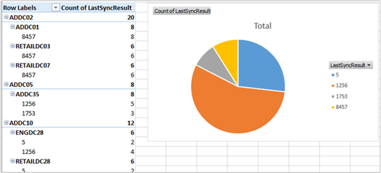

<properties
    pageTitle="Soluzione lo stato della replica di Directory attiva nel Log Analitica | Microsoft Azure"
    description="Il language pack soluzione lo stato della replica di Active Directory regolarmente esegue il monitoraggio dell'ambiente Active Directory per eventuali errori di replica rapporti e i risultati nel dashboard OMS."
    services="log-analytics"
    documentationCenter=""
    authors="bandersmsft"
    manager="jwhit"
    editor=""/>

<tags
    ms.service="log-analytics"
    ms.workload="na"
    ms.tgt_pltfrm="na"
    ms.devlang="na"
    ms.topic="article"
    ms.date="10/10/2016"
    ms.author="banders"/>

# Soluzione lo stato della replica di Directory attiva in Analitica Log

Active Directory è un componente chiave dell'organizzazione ambiente IT. Per garantire disponibilità e prestazioni elevate, ogni controller di dominio di una copia del database di Active Directory. Controller di dominio replicano tra loro per propagare le modifiche apportate all'interno dell'azienda. Errori di questo processo di replica possono causare diversi problemi all'interno dell'azienda.

Il language pack soluzione lo stato della replica di Active Directory regolarmente esegue il monitoraggio dell'ambiente Active Directory per eventuali errori di replica rapporti e i risultati nel dashboard OMS.

## Installare e configurare la soluzione
Utilizzare le informazioni seguenti per installare e configurare la soluzione.

- Agenti devono essere installati sul controller di dominio che fanno parte del dominio deve essere valutata o nei server membri configurato per l'invio di dati di replica di Active Directory per OMS. Per informazioni su come connettersi OMS computer Windows, vedere [computer Windows connettersi a Log Analitica](log-analytics-windows-agents.md). Se il controller di dominio è già parte di un ambiente System Center Operations Manager esistente che si desidera connettersi OMS, vedere [Connettere Operations Manager per Log Analitica](log-analytics-om-agents.md).
- Aggiungere la soluzione lo stato della replica di Active Directory nell'area di lavoro OMS usando la procedura descritta nella sezione [aggiungere Analitica Log soluzioni dalla raccolta soluzioni](log-analytics-add-solutions.md).  Non esiste alcun ulteriori operazioni di configurazione necessari.

## Dettagli raccolta dati lo stato della replica di Active Directory

Nella tabella seguente mostra i metodi di raccolta dati e altri dettagli sulle modalità di raccolta dati relativi allo stato di replica di Active Directory.

| piattaforma | Agente diretta | Agente SCOM | Spazio di archiviazione Azure | SCOM necessari? | Dati di agente SCOM inviati tramite il gruppo di gestione | frequenza di raccolta |
|---|---|---|---|---|---|---|
|Windows|||||| ogni 5 giorni|

## Facoltativamente, è possibile abilitare un controller di dominio non inviare i dati di Active Directory a OMS
Se non si desidera collegare qualsiasi controller di dominio direttamente al OMS, è possibile utilizzare qualsiasi altro computer connessi OMS nel dominio di raccogliere dati per il pacchetto di soluzione lo stato della replica di Active Directory e inviare i dati.

### Per abilitare un controller di dominio non inviare i dati di Active Directory a OMS
1.  Verificare che il computer sia un membro del dominio che si desidera monitorare l'utilizzo della soluzione lo stato della replica di Active Directory.
2.  [Connettere il computer Windows OMS](log-analytics-windows-agents.md) o [connetterlo ambiente Operations Manager esistente per OMS](log-analytics-om-agents.md), se non è già connessi.
3.  Nel computer, impostare la chiave del Registro di sistema seguente:
    - Chiave: **HKEY_LOCAL_MACHINE\SYSTEM\CurrentControlSet\Services\HealthService\Parameters\Management gruppi\<ManagementGroupName > \Solutions\ADReplication**
    - Valore: **IsTarge**
    - I dati dei valori: **true**

    >[AZURE.NOTE]Queste modifiche saranno effettive finché il riavvio del servizio Microsoft Agent monitoraggio (HealthService.exe).

## Informazioni sugli errori di replica
Dopo avere inserito dati di stato della replica di Active Directory inviati al OMS, verrà visualizzato un riquadro simile al seguente nel dashboard di OMS che indica quante gli errori di replica attualmente installata.  

**Errori critici replica** sono quelli uguale o superiore al 75% della [durata di rimozione](https://technet.microsoft.com/library/cc784932%28v=ws.10%29.aspx) per l'insieme di strutture di Active Directory.

Quando si fa clic sul riquadro, è necessario vedere ulteriori informazioni sugli errori.

### Stato del Server di destinazione e lo stato del Server di origine
Questi pale mostrano lo stato del server di destinazione e i server di origine in cui si verificano errori di replica. Il numero dopo ogni nome di controller di dominio indica il numero di errori di replica sul controller di dominio.

Gli errori per i server di destinazione e i server di origine vengono visualizzati in quanto più semplice per la risoluzione dalla prospettiva di server di origine e di altri utenti dal punto di vista server destinazione alcuni problemi.

In questo esempio, è possibile vedere che molti server di destinazione più o meno avere lo stesso numero di errori, ma esiste un server di origine (ADDC35) che contiene molti altri errori di tutti gli altri. È probabile che sia un problema che causa il blocco inviare dati a partner di replica ADDC35. Correggere i problemi in ADDC35 probabilmente risolverà molti degli errori che vengono visualizzati in e il server di destinazione.

### Tipi di errore di replica
Questo blade offre informazioni sui tipi di errori rilevati all'interno dell'organizzazione. Ogni errore con un codice numerico univoco e un messaggio che consentono di determinare la causa dell'errore.

Anello nella parte superiore dà un'idea degli errori visualizzati più e meno frequentemente nel proprio ambiente.

È possibile indicare si quando più controller di dominio esperienza lo stesso errore di replica. In questo caso, potrebbe essere possibile individuare una soluzione in un controller di dominio, quindi ripetere altri controller di dominio incidono lo stesso errore.

### Durata di rimozione
La durata di rimozione determina il periodo di tempo un oggetto eliminato, a cui la rimozione definitiva, viene mantenuto nel database di Active Directory. Quando un oggetto eliminato supera la durata di rimozione, un processo di raccolta garbage rimosse automaticamente dal database di Active Directory.

La durata di rimozione predefinito è 180 giorni per le versioni più recenti di Windows, ma è stato 60 giorni nelle versioni precedenti e possono essere modificata in modo esplicito da un amministratore di Active Directory.

È importante sapere se si verificano errori di replica che stanno per raggiungere o hanno superato la durata di rimozione. Se due controller di dominio verifica un errore di replica persiste oltre la durata di rimozione, replica verrà disabilitata tra i due controller di dominio, anche se l'errore di replica sottostante è corretto.

E il periodo di durata rimozione consente di identificare posizioni in cui si tratta il rischio di verificarsi. Ogni errore di **il 100% TSL** categoria rappresenta una partizione che non ha replicato tra il server di origine e destinazione per almeno la durata di rimozione per l'insieme di strutture.

In questo caso, è sufficiente correggere l'errore di replica non sarà sufficiente. Minimo, è necessario analizzare manualmente per identificare e gli oggetti in sospeso pulizie prima è possono riavviare la replica. È anche necessario rimuovere le autorizzazioni di un controller di dominio.

Oltre a identificare gli errori di replica che sono mantenute oltre la durata di rimozione, si anche desidera prestare attenzione alle eventuali errori che rientrano in categorie **TSL 50-75%** o **TSL 75 100%** .

Questi sono gli errori che sono chiaramente rimanenti, non temporanee, in modo che sia necessario probabilmente l'intervento dell'utente per risolvere. Fortuna è che hanno non ancora raggiunto la durata di rimozione. Se si correggerli immediatamente e *prima* di raggiungere la durata di rimozione, è possibile riavviare replica con il minimo intervento manuale.

Come indicato in precedenza, il riquadro di dashboard per la soluzione lo stato della replica di Active Directory Mostra il numero di *critiche* errori di replica nel proprio ambiente, è definito come errori sono oltre il 75% della durata di rimozione (inclusi gli errori che si supera 100% di TSL). Cercare di mantenere il numero 0.

>[AZURE.NOTE] Tutti i calcoli percentuale della durata di rimozione dipendono la durata di rimozione effettivi per le strutture di Active Directory, in modo che è possibile considerare attendibile che tali percentuali siano corrette, anche se è presente un valore di durata personalizzati rimozione insieme.

### Dettagli stato replica di Active Directory
Quando si fa clic su qualsiasi elemento in uno degli elenchi, si noterà ulteriori dettagli funzionalità di ricerca di Log. I risultati vengono filtrati per visualizzare solo gli errori relativi a tale elemento. Ad esempio, se si fa clic sul primo controller di dominio elencato con **Lo stato del Server di destinazione (ADDC02)**, si noterà filtrati in base ai risultati di ricerca Mostra errori con tale controller di dominio elencato come server di destinazione:

Da qui è possibile filtrare ulteriormente, modificare la query di ricerca e così via. Per ulteriori informazioni sull'utilizzo il Log di ricerca, vedere [ricerche dei registri](log-analytics-log-searches.md).

Nel campo **HelpLink** viene visualizzato l'URL di una pagina di TechNet con informazioni dettagliate sull'errore specifico. È possibile copiare e incollare il collegamento nella finestra del browser per visualizzare informazioni sulla risoluzione dei problemi e correggere l'errore.

È anche possibile fare clic su **Esporta** per esportare i risultati in Excel. In questo modo è possibile visualizzare i dati sugli errori di replica in alcun modo che si preferisce.

## Domande frequenti sullo stato di replica di Active Directory
**D: come spesso sono aggiornati dei dati di stato di Active Directory replica?**
R: le informazioni vengono aggiornate ogni 5 giorni.

**D: è presente un modo per configurare la frequenza di aggiornamento di dati?**
R: non al momento.

**D: è necessario aggiungere tutti i controller di dominio di lavoro personale OMS per visualizzare lo stato di replica?**
R: no, è necessario aggiungere un controller di dominio. Se si dispone di più controller di dominio nell'area di lavoro OMS, i dati da tutti gli elementi vengono inviati al OMS.

**D: si desidera aggiungere qualsiasi controller di dominio di lavoro personale OMS. È possibile utilizzare la soluzione lo stato della replica di Active Directory?**
R: Sì. È possibile impostare il valore di una chiave del Registro di sistema per abilitare questa funzionalità. Vedere [per abilitare un controller di dominio non inviare i dati di Active Directory per OMS](#to-enable-a-non-domain-controller-to-send-ad-data-to-oms).

**D: qual è il nome del processo che indica la raccolta di dati?**
R: AdvisorAssessment.exe

**D: come tempo per i dati da raccogliere?**
R: i dati insieme volta dipende dalle dimensioni dell'ambiente di Active Directory, ma solitamente meno di 15 minuti.

**D: il tipo di dati raccolti**
R: replica di informazioni raccolte tramite LDAP.

**D: è presente un modo per configurare una raccolta di dati?**
R: non al momento.

**D: quali autorizzazioni necessari per la raccolta di dati**
R: normali autorizzazioni utente in Active Directory vengono in genere sufficiente.

## Risolvere i problemi di raccolta dati
Per raccogliere dati, il language pack soluzione lo stato della replica di Active Directory richiede almeno un controller di dominio da collegare all'area di lavoro OMS. Fino a tale scopo, verrà visualizzato un messaggio che indica che **sono ancora stati raccolti dati**.

Se occorre assistenza per la connessione di un controller di dominio, è possibile visualizzare la documentazione computer [Windows connettersi al Log Analitica](log-analytics-windows-agents.md). In alternativa, se il controller di dominio è già connesso a un ambiente System Center Operations Manager esistente, è possibile visualizzare documentazione alla [Connessione System Center Operations Manager a Log Analitica](log-analytics-om-agents.md).

Se non si desidera connettersi qualsiasi controller di dominio direttamente a OMS o SCOM, vedere [abilitare un controller di dominio non inviare i dati di Active Directory per OMS](#to-enable-a-non-domain-controller-to-send-ad-data-to-oms).

## Passaggi successivi

- Utilizzare [le ricerche Log in Analitica Log](log-analytics-log-searches.md) per visualizzare i dati di stato dettagliati replica di Active Directory.
