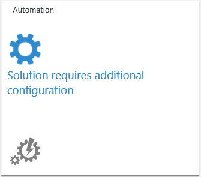

<properties
    pageTitle="Aggiungere le soluzioni Analitica Log dalla raccolta soluzioni | Microsoft Azure"
    description="Registro Analitica soluzioni sono che un insieme di logica, visualizzazione e acquisizione dei dati di regole che vengono fornite metriche ruotate intorno a un'area particolare problema."
    services="log-analytics"
    documentationCenter=""
    authors="bandersmsft"
    manager="jwhit"
    editor=""/>

<tags
    ms.service="log-analytics"
    ms.workload="na"
    ms.tgt_pltfrm="na"
    ms.devlang="na"
    ms.topic="article"
    ms.date="10/10/2016"
    ms.author="banders"/>

# Aggiungere le soluzioni Analitica Log dalla raccolta soluzioni

Registro Analitica soluzioni sono un insieme di **logica**, **visualizzazione** e **le regole di acquisizione di dati** che forniscono metriche ruotate intorno a un'area particolare problema. Soluzioni di elenchi in questo articolo supportati Analitica Log e viene spiegato come aggiungere e rimuovere usando la raccolta soluzioni.

Soluzioni consentono più approfondite approfondimenti per:

- Individuare e risolvere problemi operativi più velocemente
- raccogliere e correlare diversi tipi di dati di computer
- Consente di essere preventiva, attività, ad esempio la pianificazione della capacità, creare report di stato patch e il controllo della protezione.

>[AZURE.NOTE] Registro Analitica include funzionalità di ricerca dei registri, in modo che non è necessario installare una soluzione per attivarlo. Tuttavia, è possibile ottenere visualizzazioni dei dati, ricerche suggerite e approfondimenti aggiungendo soluzioni dalla raccolta soluzioni.

Dopo aver aggiunto una soluzione, dati raccolti dal server dell'infrastruttura e inviati al servizio Outlook Mobile. Elaborazione da OMS servizio genere bastano pochi minuti in un'ora. Dopo il servizio elabora i dati, è possibile visualizzare in OMS.

È possibile rimuovere una soluzione facilmente quando non è più necessario. Quando si rimuove una soluzione, i dati non vengono inviati a OMS, che può ridurre la quantità di dati utilizzati per la quota di giornaliera, se si dispone di uno.

## Soluzioni supportate da Microsoft Monitoring Agent

In questo momento server connessi a OMS tramite l'agente di monitoraggio di Microsoft possono utilizzare la maggior parte delle soluzioni disponibili, tra cui:

- Valutazione di Active Directory
- Gestione degli avvisi (senza avvisi SCOM)
- Antimalware
- Rilevamento delle modifiche
- Sicurezza
- Valutazione SQL
- Aggiornamenti del sistema

Tuttavia, le soluzioni seguenti sono *non* supportati con l'agente di monitoraggio di Microsoft e richiedere agente System Center Operations Manager (SCOM).

- Gestione degli avvisi (inclusi gli avvisi SCOM)
- Gestione delle capacità
- Configurazione dei rischi

Per informazioni sulla connessione agente SCOM a Log Analitica, fare riferimento alla [Connessione Operations Manager per Log Analitica](log-analytics-om-agents.md) .

### Per aggiungere una soluzione usando la raccolta soluzioni

1. Nella pagina Panoramica OMS, fare clic sul riquadro **Raccolta soluzioni** .    
    
2. Nella pagina Raccolta soluzioni OMS Scopri ogni soluzione disponibili. Fare clic sul nome della soluzione che si desidera aggiungere alla OMS.
3. Nella pagina per la soluzione che si è scelto, verranno visualizzate informazioni dettagliate sulla soluzione. Fare clic su **Aggiungi**.
4. Nuovo riquadro per la soluzione che è stato aggiunto viene visualizzato nella panoramica sulla pagina in OMS ed è possibile iniziare a usarlo dopo il servizio Outlook Mobile elabora i dati.

## Per configurare soluzioni
1. È necessario configurare alcune soluzioni. Ad esempio, è necessario configurare automazione, il ripristino del sito di Azure e copia di Backup prima di poter usare.
2. Per una di queste soluzioni, fare clic su tessera nella pagina Panoramica.  
    
3. Quindi configurare la soluzione con le informazioni necessarie e quindi fare clic su **Salva**.  
    

### Per rimuovere una soluzione usando la raccolta soluzioni

1. Nella pagina Panoramica OMS, fare clic sul riquadro **Impostazioni** .
2. Nella pagina Impostazioni nella scheda soluzioni fare clic su **Rimuovi** per la soluzione che si desidera rimuovere.
3. Nella finestra di dialogo di conferma, fare clic su **Sì** per rimuovere la soluzione.

## Dettagli di raccolta dati per le caratteristiche OMS e soluzioni

Nella tabella seguente mostra i metodi di raccolta dati e altri dettagli sulle modalità di raccolta dati per le soluzioni e le funzionalità OMS. Agenti diretti e agenti SCOM sono sostanzialmente lo stesso, ma l'accesso diretto agente include funzionalità aggiuntive per consentire la connessione all'area di lavoro OMS e instradata tramite un proxy. Se si usa un agente di SCOM, devono essere mirato come un agente OMS per comunicare con OMS. Gli agenti SCOM in questa tabella sono agenti OMS che si è connessi alla SCOM. Per informazioni sulla connessione ambiente SCOM esistente a OMS, vedere [Connettere Operations Manager per Log Analitica](log-analytics-om-agents.md) .

>[AZURE.NOTE] Il tipo di agente che si usa determina la modalità di invio dati a OMS, con le condizioni seguenti:

- Utilizzare l'agente diretto o un allegato SCOM OMS.
- Quando è necessario SCOM, SCOM agente i dati per la soluzione sono sempre inviati OMS utilizzando il gruppo di gestione SCOM. Inoltre, quando è necessario SCOM, solo l'agente SCOM viene utilizzato dalla soluzione.
- Quando nella tabella vengono mostrati a OMS vengono inviati SCOM agente dati utilizzando il gruppo di gestione SCOM non sono necessarie e quindi SCOM agente i dati sono sempre inviati OMS utilizzo di gestione dei gruppi. Agenti diretti ignorano il gruppo di gestione e inviare i dati direttamente al OMS.
- Quando dati agente SCOM non vengono inviati con un gruppo di gestione, i dati vengono inviati direttamente alla OMS, ignorare il gruppo di gestione.

|tipo di dati| piattaforma | Agente diretta | Agente SCOM | Spazio di archiviazione Azure | SCOM necessari? | Dati di agente SCOM inviati tramite il gruppo di gestione | frequenza di raccolta |
|---|---|---|---|---|---|---|---|
|Valutazione di Active Directory|Windows||||||  7 giorni|
|Stato della replica di Active Directory|Windows||||||5 giorni|
|Avvisi (Nagios)|Linux||||||in arrivo|
|Avvisi (Zabbix)|Linux||||||minuto|
|Avvisi (Operations Manager)|Windows||||||3 minuti|
|Antimalware|Windows|||||| ogni ora|
|Gestione delle capacità|Windows|||||| ogni ora|
|Rilevamento delle modifiche|Windows|||||| ogni ora|
|Rilevamento delle modifiche|Linux||||||ogni ora|
|Configurazione dei rischi (Advisor legacy)|Windows|||||| due volte al giorno|
|ETW|Windows||||||5 minuti|
|Registri di IIS|Windows||||||5 minuti|
|Archivi chiavi|Windows||||||10 minuti|
|Gateway per applicazioni di rete|Windows||||||10 minuti|
|Gruppi di sicurezza di rete|Windows||||||10 minuti|
|Office 365|Windows||||||notifica|
|Contatori delle prestazioni|Windows||||||come pianificato, minimo di 10 secondi|
|Contatori delle prestazioni|Linux||||||come pianificato, minimo di 10 secondi|
|Infrastruttura di servizio|Windows||||||5 minuti|
|Valutazione SQL|Windows|||||| 7 giorni|
|SurfaceHub|Windows||||||in arrivo|
|Registro di sistema|Linux||||||dallo spazio di archiviazione Azure: 10 minuti; da agente: in arrivo|
|Aggiornamenti del sistema|Windows|||||| almeno 2 per ogni giorno e 15 minuti dopo l'installazione di un aggiornamento|
|Registri eventi di sicurezza di Windows|Windows|||||| per lo spazio di archiviazione Azure: 10 minuti; per l'agente: in arrivo|
|Registri di Windows firewall|Windows|||||| in arrivo|
|Registri eventi di Windows|Windows|||||| per lo spazio di archiviazione Azure: 1 min; per l'agente: in arrivo|
|Dati di rete|Windows (2012 R2 / 8.1 o versione successiva)|||||| ogni minuto|

## Caratteristiche e le soluzioni di anteprima Analitica log

Esecuzione di un servizio e seguendo attrezzi consigliate siamo in grado di collaborazione con i clienti a sviluppare funzionalità e le soluzioni.

Durante l'anteprima privato in modo un piccolo gruppo di accesso clienti a un'implementazione iniziale di una caratteristica o soluzione per ottenere commenti e suggerimenti e apportare miglioramenti. Questa applicazione anticipata è minime caratteristiche e le funzionalità operative.

Il nostro obiettivo è tentare rapidamente elementi in modo che è possibile trovare ciò che funziona e cosa non funziona. Abbiamo scorrere questo processo finché il feedback dei clienti anteprima privato ci informa che si è pronti per visualizzare un'anteprima pubblica.

Durante l'anteprima pubblica è a disposizione la funzionalità o una soluzione per tutti gli utenti per ottenere ulteriori commenti e suggerimenti e convalidare il nostro proporzioni dei caratteri e l'efficienza. In questa fase:

- Funzionalità di anteprima verrà visualizzata nella scheda Impostazioni e può essere attivata da qualsiasi utente
- Anteprima soluzioni possono essere aggiunti tramite la raccolta o utilizzando uno script pubblicato

### Cosa è necessario sapere sulle funzionalità di anteprima e le soluzioni?

Siamo entusiasti nuove caratteristiche e le soluzioni ed è già abituati collaborando con i clienti sviluppate.

Funzionalità di anteprima e le soluzioni non sono appropriate per tutti gli utenti, quindi prima di richiedere partecipare a un'anteprima privata o abilitare un'anteprima pubblica assicurarsi OK si lavora con un elemento in fase di sviluppo.

Quando si abilita una funzionalità di anteprima tramite il portale che sarà visualizzato un avviso indicante che la caratteristica si trovi in anteprima.

#### Per l'anteprima *pubblici* e *privati*

Di seguito si applica a anteprime pubbliche e private:

- Operazioni potrebbero non funzionare correttamente.
  - Intervallo problemi da parte di un fastidio secondaria tramite su un valore non funziona tutto
- È possibile inserire l'anteprima per avere un impatto negativo sui sistemi / ambiente
  - Abbiamo tentare di evitare che aspetti negativi accade ai sistemi si usa con OMS ma si verifica quanto segue a volte imprevisti
- Perdita di dati / potrebbero essere danneggiati
- Potremmo per raccogliere i registri diagnostici o altri dati per la risoluzione dei problemi
- La caratteristica o soluzione potrebbe venire rimosse (temporaneamente o definitivamente)
  - In base a nostro esperienze durante l'anteprima che si può decidere di non rilasciare la caratteristica o soluzione
- Le anteprime potrebbero non funzionare o non sono state testate con tutte le configurazioni e Microsoft può limitare:
  - I sistemi operativi che possono essere usati (ad esempio, una caratteristica potrebbe vengono applicate solo alle Linux in anteprima)
  - Il tipo di agente (MMA, SCOM) che può essere utilizzato (ad esempio, una caratteristica potrebbe non funzionare con SCOM in anteprima)  
- Caratteristiche e le soluzioni di anteprima non rientrano il contratto di servizio
- Utilizzo delle funzionalità di anteprima comporta costi di utilizzo
- Caratteristiche o funzionalità che è necessario per la caratteristica / soluzione per essere utile siano mancanti o non completata
- Caratteristiche / soluzioni potrebbero non essere disponibili in tutte le aree
- Caratteristiche / soluzioni potrebbero non essere localizzate
- Caratteristiche / soluzioni abbia un limite al numero di clienti o dispositivi che è possono usarlo
- Potrebbe essere necessario usare script per eseguire la configurazione e per attivare la soluzione/funzionalità
- L'interfaccia utente (UI) non sarà possibile completa e risultino diverse di un giorno per giorno
- Anteprime pubbliche potrebbero non essere appropriato per il produzione / critiche sistemi

#### Per l'anteprima *privato*

Oltre a elementi indicati di seguito è specifica per le anteprime private:

- Si prevede che è possibile fornire commenti e suggerimenti sull'esperienza dell'utente in modo da poter apportare la caratteristica/soluzione migliore
- Di contatto per i commenti con sondaggi, telefonate o messaggio di posta elettronica
- Operazioni non funzioneranno correttamente
- Si può richiedere un contratto di riservatezza (NDA) per la partecipazione o può includere contenuto riservato
  - Prima di blog, utilizzo di tweet o altri tipi di comunicazione con terze parti verificare con Program Manager responsabile per l'anteprima per comprendere le restrizioni sui divulgazione
- Non eseguire produzione / critiche sistemi

### Come è possibile ottenere accesso alle funzionalità di anteprima privata e le soluzioni?

Invita tutti i clienti a anteprime private tramite modi diversi a seconda dell'anteprima.

- Rispondendo mensile sondaggio di clienti e fornire autorizzazione per il completamento con l'utente migliora le possibilità di invitato a un'anteprima privata.
- Il team di account di Microsoft può nominano è.
- È possibile iscriversi in base ai dettagli inseriti in twitter [msopsmgmt](https://twitter.com/msopsmgmt)
- È possibile iscriversi in base agli eventi Comunità condiviso dettagli: esaminare la riunione gruppo di continuità, videoconferenze e nella community online.

## Passaggi successivi

- [Registri ricerca](log-analytics-log-searches.md) per visualizzare informazioni dettagliate raccolte da soluzioni.
