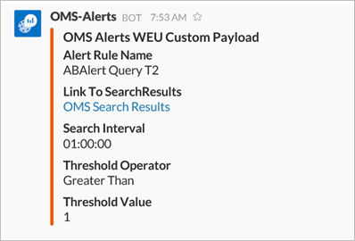

<properties
   pageTitle="Esempio di avviso webhook Analitica log"
   description="Una delle operazioni che è possibile eseguire in risposta a un avviso Analitica Log è un *webhook*, che consente di richiamare un processo esterno tramite un'unica richiesta HTTP. In questo articolo illustra un esempio di creazione di un'azione webhook un avviso di Log Analitica utilizzando il margine di flessibilità."
   services="log-analytics"
   documentationCenter=""
   authors="bwren"
   manager="jwhit"
   editor="tysonn" />
<tags
   ms.service="log-analytics"
   ms.devlang="na"
   ms.topic="article"
   ms.tgt_pltfrm="na"
   ms.workload="infrastructure-services"
   ms.date="10/27/2016"
   ms.author="bwren" />

# <a name="webhooks-in-log-analytics-alerts"></a>Webhooks in avvisi Analitica Log

Una delle operazioni che è possibile eseguire in risposta a un [avviso Analitica Log](log-analytics-alerts.md) è un *webhook*, che consente di richiamare un processo esterno tramite un'unica richiesta HTTP.  È possibile leggere dettagli di avvisi e webhooks in [avvisi nel registro Analitica](log-analytics-alerts.md)

In questo articolo sono illustrate procedure un esempio di creazione di un'azione webhook un avviso di Log Analitica utilizzando il margine di flessibilità costituito da un servizio di messaggistica.

>[AZURE.NOTE] È necessario disporre di un account di margine di flessibilità da completare in questo esempio.  È possibile iscriversi a un account gratuito in [slack.com](http://slack.com).

## <a name="step-1---enable-webhooks-in-slack"></a>Passaggio 1 - webhooks Abilita nel margine di flessibilità
2.  Accedere al margine di flessibilità in [slack.com](http://slack.com).
3.  Nella sezione **canali** nel riquadro a sinistra, selezionare un canale.  Questo è il canale che il messaggio verrà inviato a.  È possibile selezionare uno dei canali predefinito, ad esempio **Generale** o **casuali**.  In uno scenario di produzione, è probabile che si crea un canale speciale, ad esempio **criticalservicealerts**. <br>

    

3. Fare clic su **Aggiungi un'app o integrazioni personalizzate** per aprire la App Directory.
3.  Digitare *webhooks* nella casella di ricerca e quindi selezionare **WebHooks in arrivo**. <br>

    

4.  Fare clic su **Installa** accanto al nome del team.
5.  Fare clic su **Aggiungi configurazione**.
6.  Selezionare il canale che si desidera utilizzare per questo esempio e quindi fare clic su **Aggiungi posta in arrivo WebHooks integrazione**.  
6. Copiare l' **URL Webhook**.  Si verrà incollare questo nella configurazione dell'avviso. <br>

    

## <a name="step-2---create-alert-rule-in-log-analytics"></a>Passaggio 2 - Crea regola di avviso in Analitica Log
1.  [Creare una regola di avviso](log-analytics-alerts.md) con le impostazioni seguenti.
    - Query:```    Type=Event EventLevelName=error ```
    - Verificare la presenza di questo avviso ogni: 5 minuti
    - È il numero di risultati: maggiore di 10
    - In questa finestra di tempo: 60 minuti
    - Selezionare **Sì** per **Webhook** e **non** per le altre azioni.
7. Incollare l'URL di un margine di flessibilità nel campo **URL Webhook** .
8. Selezionare l'opzione per **includere un payload JSON personalizzato**.
9. Slack prevede un payload formattato in JSON con un parametro denominato *testo*.  Questo è il testo che verrà visualizzato il messaggio che viene creato.  È possibile usare uno o più i parametri di avviso utilizzando il *#* simbolo ad esempio come illustrato nell'esempio seguente.

    ```
    {
    "text":"#alertrulename fired with #searchresultcount records which exceeds the over threshold of #thresholdvalue ."
    }
    ```

    

9.  Fare clic su **Salva** per salvare la regola di avviso.

10. Tempo di attesa sufficiente per un avviso per creare e quindi selezionare il margine di flessibilità per un messaggio che sarà simile al seguente.

    


### <a name="advanced-webhook-payload-for-slack"></a>Avanzate webhook payload per il margine di flessibilità

È possibile personalizzare ampiamente messaggi in arrivo con il margine di flessibilità. Per ulteriori informazioni, vedere [Webhooks in arrivo](https://api.slack.com/incoming-webhooks) sul sito Web di margine di flessibilità. Di seguito è un payload più complesso per creare un messaggio RTF con la formattazione:

    {
        "attachments": [
            {
                "title":"OMS Alerts Custom Payload",
                "fields": [
                    {
                        "title": "Alert Rule Name",
                        "value": "#alertrulename"},
                    {
                        "title": "Link To SearchResults",
                        "value": "<#linktosearchresults|OMS Search Results>"},
                    {
                        "title": "Search Interval",
                        "value": "#searchinterval"},
                    {
                        "title": "Threshold Operator",
                        "value": "#thresholdoperator"},
                    {
                        "title": "Threshold Value",
                        "value": "#thresholdvalue"}
                ],
                "color": "#F35A00"
            }
        ]
    }


Questo genera un messaggio nel margine di flessibilità simile al seguente.



## <a name="summary"></a>Riepilogo

Con questa regola di avviso, è necessario un messaggio inviato a un margine di flessibilità ogni volta che i criteri vengono soddisfatti.  

Questo è solo un esempio di un'azione che è possibile creare in risposta a un avviso.  È possibile creare un'azione webhook che chiama un altro servizio esterno, un'azione runbook per avviare un runbook in Azure automazione o un'azione di posta elettronica per inviare un messaggio a se stessi o ad altri destinatari.   

## <a name="next-steps"></a>Passaggi successivi

- Altre informazioni sugli [avvisi nel registro Analitica](log-analytics-alerts.md) incluse altre azioni.
- [Creare runbook in Azure automazione](../automation/automation-webhooks.md) che possono essere chiamati da un webhook.
