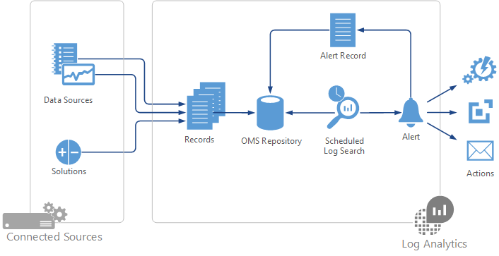
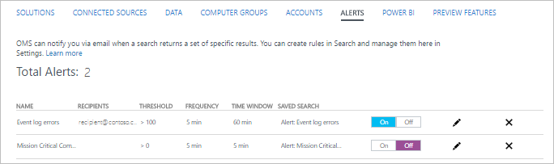

<properties 
   pageTitle="Avvisi nel Log Analitica | Microsoft Azure"
   description="Avvisi nel registro Analitica identificare informazioni importanti nel repository OMS tempestiva invio di una notifica dei problemi o richiamare azioni per tentare di correggerli.  In questo articolo viene descritto come creare una regola di avviso e dettagli le diverse operazioni che può eseguire."
   services="log-analytics"
   documentationCenter=""
   authors="bwren"
   manager="jwhit"
   editor="tysonn" />
<tags 
   ms.service="log-analytics"
   ms.devlang="na"
   ms.topic="article"
   ms.tgt_pltfrm="na"
   ms.workload="infrastructure-services"
   ms.date="08/22/2016"
   ms.author="bwren" />

# Avvisi nell'Analitica Log

Avvisi nel Log Analitica identificano informazioni importanti nel repository OMS.  Regole di avviso automaticamente eseguire ricerche di log in base a una pianificazione e creazione di un avviso record se i risultati della soddisfano specifici criteri.  La regola quindi possibile eseguire automaticamente una o più azioni per tempestiva invio di una notifica dell'avviso o richiamare un altro processo.   

## Creazione di una regola di avviso
Per creare una regola di avviso, è innanzitutto necessario creare una ricerca dei registri per i record che deve richiamare l'avviso.  Pulsante **avviso** quindi saranno disponibile in modo che è possibile creare e configurare la regola di avviso.

1.  Nella pagina Panoramica OMS, fare clic su **Ricerca dei registri**.
2.  Creare una nuova query di ricerca Registro o selezionare una ricerca registro salvato. 
3.  Fare clic su **avviso** nella parte superiore della pagina per aprire la schermata **Aggiungi regola di avviso** .
4. Fare riferimento alle tabelle sotto per informazioni dettagliate sulle opzioni per configurare l'avviso.
5. Quando si fornisce l'intervallo di tempo per la regola di avviso, verrà visualizzato il numero di record esistente che soddisfano i criteri di ricerca per tale intervallo di tempo.  Questo consente di determinare la frequenza con cui per ottenere il numero di risultati che si sta aspettando.
4.  Fare clic su **Salva** per completare la regola di avviso.  Verrà avviato immediatamente l'esecuzione.

| Proprietà | Descrizione |
|:--|:--|
| **Informazioni sugli avvisi** | |
| Nome |  Nome univoco per identificare la regola di avviso. |
| Gravità | Gravità dell'avviso che viene creata la regola. |
| Query di ricerca | Selezionare **usare la query di ricerca** da utilizzare la query corrente oppure selezionare una ricerca salvata dall'elenco.  La sintassi della query viene specificato nella casella di testo in cui è possibile modificarlo se necessario.  |
| Intervallo di tempo | Specifica dell'intervallo di tempo per la query.  La query restituisca solo i record che sono stati creati l'intervallo di tempo corrente.  Può trattarsi di un valore compreso tra 5 minuti e 24 ore.  Deve essere maggiore o uguale a frequenza avvisi.     Ad esempio, se l'intervallo di tempo è impostato su 60 minuti e si esegue la query 1:15 PM, verranno restituiti solo i record creati tra 12:15 PM e 1:15 PM. |
| **Programmazione** |     
| Soglia | Criteri per questa opzione per creare un avviso.  Se il numero di record restituiti dalla query corrisponde a questo criterio, verrà creato un avviso. |
| Frequenza avvisi | Specifica con quale frequenza è necessario eseguire la query.  Può essere un valore compreso tra 5 minuti e 24 ore.  Deve essere uguale o minore di intervallo di tempo. |
| Elimina avvisi | Quando si attiva l'eliminazione per la regola di avviso, azioni della regola sono disabilitate per un periodo di tempo dopo la creazione di un nuovo avviso definito.  La regola è ancora in esecuzione e verrà creati i record degli avvisi se i criteri vengono soddisfatti.  In modo da consentire che il tempo necessario per risolvere il problema senza eseguire azioni duplicate. |
| **Azioni** | |
| Notifica tramite posta elettronica | Specificare **Sì** se si desidera un messaggio di posta elettronica da inviare quando viene generato l'avviso. |
| Oggetto    | Oggetto nel messaggio di posta elettronica.  Non è possibile modificare il corpo del messaggio. |
| Destinatari | Indirizzi di tutti i destinatari di posta elettronica.  Se si specificano più indirizzi, separare gli indirizzi con un punto e virgola (;). |
| Webhook | Specificare **Sì** se si desidera chiamare una webhook quando viene generato l'avviso. |
| URL Webhook | L'URL della webhook. |
| Includere payload JSON personalizzato | Selezionare questa opzione se si desidera sostituire il payload predefinito con un payload personalizzato. |
| Immettere il payload JSON personalizzato | Il contenuto personalizzato per il webhook.  Vedere la sezione precedente per informazioni dettagliate. |
| Runbook | Specificare **Sì** se si desidera avviare un runbook Azure automazione quando viene generato l'avviso. |
| Selezionare un runbook | Selezionare dal runbook per avviare dal runbook nell'account automazione configurato della soluzione di automazione. |
| Eseguito | Selezionare **Azure** eseguire dal runbook nel cloud Azure.  Selezionare **Lavoro ibrido** per eseguire dal runbook su un [Lavoro Runbook ibrida](..\automation\automation-hybrid-runbook-worker.md) nell'ambiente locale. |

## Gestire le regole di avviso
È possibile ottenere un elenco di tutte le regole di avviso nel menu **avvisi** nel registro Analitica **Impostazioni**.  

1. Nella console di OMS selezionare il riquadro **Impostazioni** .
2. Selezionare **avvisi**.

È possibile eseguire più azioni da questa visualizzazione.

- Disattivare una regola, selezionare **Disattiva** accanto.
- Modificare una regola di avviso facendo clic sull'icona matita accanto.
- Rimuovere una regola di avviso facendo clic sull'icona **X** corrispondente. 

## Impostare gli intervalli di tempo 

### Avvisi di evento

Eventi includono origini dati quali i registri eventi di Windows, Registro di sistema, log personalizzati.  È consigliabile creare un avviso quando viene creato un evento di errore specifico o quando vengono creati più eventi di errori all'interno di un intervallo di tempo specifico.

Per avvisare in un singolo evento, impostare il numero di risultati maggiore di 0 e la frequenza e lo intervallo di tempo per 5 minuti.  Che verrà eseguito ogni 5 minuti la query e cercare l'occorrenza di un singolo evento creati dopo l'ultima esecuzione della query.  Una frequenza più può posticipare tra l'evento raccolti e l'avviso da creare.

Alcune applicazioni possono registrare un errore occasionale che non deve necessariamente generano un avviso.  Ad esempio, l'applicazione può ripetere il processo che ha creato l'evento di errore e quindi completare la volta successiva che.  In questo caso, non è consigliabile creare l'avviso, a meno che non vengono creati più eventi all'interno di un intervallo di tempo specifico.  

In alcuni casi può essere necessario creare un avviso in mancanza di un evento.  Ad esempio un processo eventi di regolare per indicare che funziona correttamente.  Se non registra uno di questi eventi in un determinato intervallo di tempo, è necessario creare un avviso.  In questo caso impostare la soglia a *inferiore a 1*.

### Avvisi di prestazioni

[Dati sulle prestazioni](log-analytics-data-sources-performance-counters.md) vengono archiviati come record nell'archivio OMS simile agli eventi.  Il valore in ogni record è la media misurata per gli ultimi 30 minuti.  Se si desidera un avviso quando un contatore delle prestazioni supera una determinata soglia, tale soglia dovrebbe essere incluso nella query.

Ad esempio, se si desidera un avviso quando viene eseguito il processore 90% per 30 minuti, utilizzare una query come *tipo = Perf ObjectName = processore CounterName = "% tempo processore" CounterValue > 90* e la soglia per la regola di avviso per *maggiore di 0*.  

 Dal momento che [i record delle prestazioni](log-analytics-data-sources-performance-counters.md) vengono aggregati ogni 30 minuti indipendentemente dalla frequenza raccogliere ogni contatore, un intervallo di tempo inferiore a 30 minuti non può restituire alcun record.  Impostare l'intervallo di tempo a 30 minuti assicura di ottenere un singolo record per ciascuna origine connessi che rappresenta la media in quel momento.

## Azioni degli avvisi

Oltre a creare un record degli avvisi, è possibile configurare la regola di avviso per eseguire automaticamente una o più azioni.  Azioni tempestiva invio di una notifica dell'avviso o richiamare un processo che tenta di risolvere il problema rilevato.  Le sezioni seguenti descrivono le azioni che sono attualmente disponibili.

### Azioni di posta elettronica
Azioni sui messaggi inviare un messaggio di posta elettronica con i dettagli dell'avviso a uno o più destinatari.  È possibile specificare l'oggetto del messaggio, ma il contenuto è un formato standard creato dalla Log Analitica.  Include le informazioni di riepilogo, ad esempio il nome dell'avviso oltre ai dettagli dei record fino a dieci restituiti dalla ricerca log.  Include anche un collegamento a una ricerca di log in Analitica Log che restituirà l'intero set di record da tale query.   Il mittente del messaggio è *Team di famiglia di prodotti Microsoft operazioni di gestione &lt; noreply@oms.microsoft.com *. 

### Azioni Webhook

Le azioni Webhook consentono di richiamare un processo esterno tramite una singola richiesta HTTP POST.  Servizio chiamato deve supportare webhooks e determinare come verrà utilizzato qualsiasi payload riceve.  È anche possibile chiamare un API REST che non supporta in particolar modo webhooks, purché la richiesta sia in un formato che consente di usare l'API.  Esempi di utilizzo di un webhook in risposta a un avviso usano un servizio come [margine di flessibilità](http://slack.com) per inviare un messaggio con i dettagli dell'avviso o la creazione di un incidente in un servizio come [PagerDuty](http://pagerduty.com/).  

Uno scenario di creazione di una regola di avviso con un webhook per chiamare un servizio di esempio completo è disponibile in [Webhooks nel registro Analitica avvisi](log-analytics-alerts-webhooks.md).

Webhooks includono un URL e un payload formattato in JSON i dati inviati al servizio esterno.  Per impostazione predefinita, il payload includerà i valori nella tabella seguente.  È possibile sostituire il payload con uno personalizzato nel forum relativo.  In questo caso è possibile utilizzare le variabili della tabella per ognuno dei parametri per includere il relativo valore nel payload personalizzato.

| Parametro | Variabile | Descrizione |
|:--|:--|:--|
| AlertRuleName | #alertrulename | Nome della regola di avviso. |
| AlertThresholdOperator | #thresholdoperator | Operatore di soglia per la regola di avviso.  *Maggiore* o *minore di*. |
| AlertThresholdValue | #thresholdvalue | Valore di soglia per la regola di avviso. |
| LinkToSearchResults | #linktosearchresults | Collegamento alla ricerca dei registri Log Analitica che restituisca i record dalla query che ha creato l'avviso. |
| ResultCount  | #searchresultcount | Numero di record nei risultati della ricerca. |
| SearchIntervalEndtimeUtc  | #searchintervalendtimeutc | Ora di fine per la query in formato UTC. |
| SearchIntervalInSeconds | #searchinterval | Intervallo di tempo per la regola di avviso. |
| SearchIntervalStartTimeUtc  | #searchintervalstarttimeutc | Ora di inizio per la query in formato UTC. |
| SearchQuery | #SearchQuery | Query di ricerca log utilizzata dalla regola di avviso. |
| SearchResults | Vedere di seguito | Record restituiti dalla query in formato JSON.  Disponibilità limitata ai primi 5.000 record. |
| WorkspaceID | #workspaceid | ID dell'area di lavoro OMS. |

Ad esempio, è possibile specificare le seguenti payload personalizzato che include un singolo parametro chiamato *testo*.  Il servizio che questo webhook chiama si prevedeva questo parametro.

    {
        "text":"#alertrulename fired with #searchresultcount over threshold of #thresholdvalue."
    }

Payload in questo esempio viene risolto in simile a quanto segue quando inviato per la webhook.

    {
        "text":"My Alert Rule fired with 18 records over threshold of 10 ."
    }

Per includere i risultati della ricerca in un payload personalizzato, aggiungere la riga seguente come una proprietà di livello superiore nel payload json.  

    "IncludeSearchResults":true

Ad esempio, per creare un payload personalizzato che include solo il nome degli avvisi e i risultati della ricerca, è possibile utilizzare le operazioni seguenti. 

    {
       "alertname":"#alertrulename",
       "IncludeSearchResults":true
    }

È possibile scorrere un esempio di completamento della creazione di una regola di avviso con un webhook per avviare un servizio esterno al [Log Analitica avviso esempio webhook](log-analytics-alerts-webhooks.md).

### Azioni runbook

Azioni runbook avviano un runbook in Azure automazione.  Per utilizzare questo tipo di azione, è necessario disporre della [soluzione di automazione](log-analytics-add-solutions.md) installato e configurato nell'area di lavoro OMS.  Se non è installato quando si crea una nuova regola di avviso, viene visualizzato un collegamento per l'installazione.  È possibile selezionare dal runbook nella finestra account automazione configurati della soluzione di automazione.

Azioni runbook iniziare dal runbook utilizzando un [webhook](../automation/automation-webhooks.md).  Quando si crea la regola di avviso, viene creato automaticamente un nuovo webhook dal runbook con il nome **Dello avviso OMS** seguito da un GUID.  

È possibile inserire direttamente dati tutti i parametri dal runbook, ma il [parametro $WebhookData](../automation/automation-webhooks.md) includerà i dettagli dell'avviso, inclusi i risultati di ricerca del Registro di cui è stato creato.  Dal runbook sarà necessario definire **$WebhookData** come parametro per poter accedere alle proprietà dell'avviso.  I dati degli avvisi sono disponibili in formato json in una sola proprietà denominata **SearchResults** nella proprietà **RequestBody** di **$WebhookData**.  Questo sarà disponibile con le proprietà nella tabella seguente.

| Nodo | Descrizione |
|:--|:--|
| ID         | Percorso e GUID della ricerca. |
| __metadata | Informazioni sull'avviso quali il numero di record e lo stato dei risultati di ricerca. |
|  valore     |  Voce distinta per ogni record nei risultati della ricerca.  I dettagli della voce corrisponderanno le proprietà e i valori del record.   |

Ad esempio runbook seguenti da estrarre i record restituiti dalla ricerca log e assegnare proprietà diverse in base al tipo di ogni record.  Si noti che viene avviata dal runbook per la conversione **RequestBody** json, in modo che possano essere utilizzato con come oggetto in PowerShell.

    param ( 
        [object]$WebhookData
    )

    $RequestBody = ConvertFrom-JSON -InputObject $WebhookData.RequestBody
    $Records     = $RequestBody.SearchResults.value
    
    foreach ($Record in $Records)
    {
        $Computer = $Record.Computer
        
        if ($Record.Type -eq 'Event')
        {
            $EventNo    = $Record.EventID
            $EventLevel = $Record.EventLevelName
            $EventData  = $Record.EventData
        }
        
        if ($Record.Type -eq 'Perf')
        {
            $Object    = $Record.ObjectName
            $Counter   = $Record.CounterName
            $Instance  = $Record.InstanceName
            $Value     = $Record.CounterValue
        }
    }

## Record degli avvisi

Avviso record creati da regole di avviso nel Log Analitica disporre di un **tipo** di **avviso** e un **SourceSystem** di **OMS**.  Devono avere le proprietà nella tabella seguente.

| Proprietà | Descrizione |
|:--|:--|
| Tipo          | *Invia avviso* |
| SourceSystem  | *OMS* |
| AlertSeverity | Livello di gravità dell'avviso. |
| Nome avviso     | Nome dell'avviso. |
| Query         | Testo della query che è stato eseguito.  |
| QueryExecutionEndTime   | Fine dell'intervallo di tempo per la query. |
| QueryExecutionStartTime | Inizio dell'intervallo di tempo per la query.  |
| TimeGenerated | Data e ora di creazione dell'avviso. |

Sono disponibili altri tipi di record avviso creato mediante la [soluzione di gestione di avviso](log-analytics-solution-alert-management.md) e il [Esporta Power BI](log-analytics-powerbi.md).  Questi tutti dispongono di un **tipo** di **avviso** ma distinti in base al loro **SourceSystem**.

## Passaggi successivi

- Installare la [soluzione di gestione degli avvisi](log-analytics-solution-alert-management.md) per analizzare gli avvisi creati in Log Analitica insieme avvisi raccolti dal sistema Center Operations Manager (SCOM).
- Altre informazioni sulle [ricerche dei registri](log-analytics-log-searches.md) generati avvisi.
- Completare una procedura dettagliata per la [configurazione di un webook](log-analytics-alerts-webhooks.md) con una regola di avviso.  
- Informazioni su come scrivere [runbook in Azure automazione](https://azure.microsoft.com/documentation/services/automation) per la risoluzione dei problemi identificati dagli avvisi.