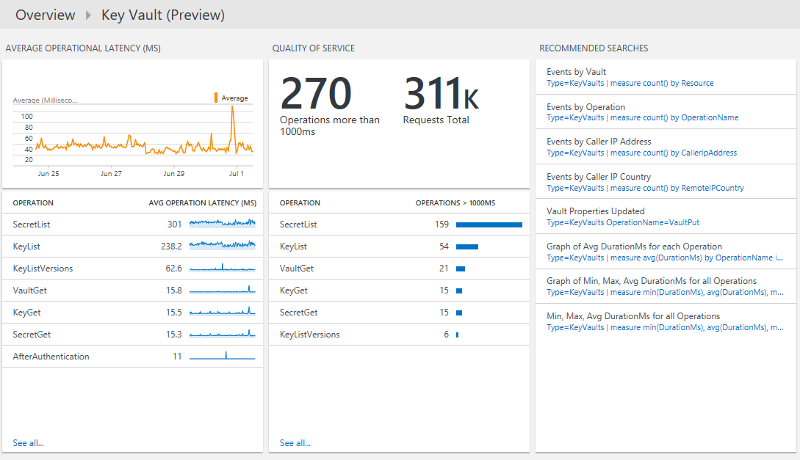

<properties
    pageTitle="Soluzione chiave archivio Azure nel Log Analitica | Microsoft Azure"
    description="È possibile utilizzare la soluzione di Azure chiave archivio in Analitica Log per esaminare i registri di Azure chiave archivio."
    services="log-analytics"
    documentationCenter=""
    authors="richrundmsft"
    manager="jochan"
    editor=""/>

<tags
    ms.service="log-analytics"
    ms.workload="na"
    ms.tgt_pltfrm="na"
    ms.devlang="na"
    ms.topic="article"
    ms.date="07/12/2016"
    ms.author="richrund"/>

# Azure soluzione chiave archivio (Preview) in Analitica Log

>[AZURE.NOTE] Questa è una [soluzione di anteprima](log-analytics-add-solutions.md#log-analytics-preview-solutions-and-features).

È possibile utilizzare la soluzione di Azure chiave archivio in Analitica Log per esaminare i registri di Azure chiave archivio AuditEvent.

È possibile abilitare la registrazione eventi di controllo per Azure chiave archivio. Registri allo spazio di archiviazione Blob Azure nel punto in cui si possono quindi essere indicizzate tramite Analitica Log per la ricerca e l'analisi.

## Installare e configurare la soluzione

Attenersi alle istruzioni seguenti per installare e configurare la soluzione di archivio di Azure chiave:

1.  Abilitare [registrazione diagnostica per archivio chiave](../key-vault/key-vault-logging.md) risorse che si desidera eseguire il monitoraggio
2.  Configurare Analitica Log per leggere i log dallo spazio di archiviazione blob utilizzando la procedura descritta nella sezione [file JSON in archiviazione blob](../log-analytics/log-analytics-azure-storage-json.md).
3.  Attivare la soluzione di Azure chiave archivio utilizzando la procedura descritta nella sezione [aggiungere Analitica Log soluzioni dalla raccolta soluzioni](log-analytics-add-solutions.md).  

## Esaminare i dettagli di raccolta dati di Azure chiave archivio

Soluzione chiave archivio Azure raccoglie registri di diagnostica dallo spazio di archiviazione blob Azure per Azure chiave archivio.
Non è necessario per la raccolta di dati agente.

Nella tabella seguente mostra i metodi di raccolta dati e altri dettagli sulle modalità di raccolta dati di Azure chiave archivio.

| Piattaforma | Agente diretta | Agente di sistemi Center Operations Manager (SCOM) | Spazio di archiviazione Azure | SCOM necessari? | Dati di agente SCOM inviati tramite il gruppo di gestione | Frequenza di raccolta |
|---|---|---|---|---|---|---|
|Azure||||            || 10 minuti|

## Utilizzare archivio chiave Azure

Dopo avere installato la soluzione, è possibile visualizzare il riepilogo della richiesta stati nel tempo per l'archivi chiave monitorate utilizzando **Azure chiave archivio** affiancare nella pagina **Panoramica** del Log Analitica.

Dopo aver fatto clic sul riquadro **Panoramica** , è possibile visualizzare riepiloghi dei registri e quindi eseguire il drill-per informazioni dettagliate relative alle categorie seguenti:

- Volume di tutte le operazioni di archivio chiave nel tempo
- Non è riuscita volumi operazione nel tempo
- Inattività Media dall'operazione
- Qualità del servizio per le operazioni con il numero delle operazioni che richiedono più di 1000 ms e un elenco delle operazioni che richiedono più di 1000 ms

### Per visualizzare i dettagli per qualsiasi operazione

1. Nella pagina **Panoramica** fare clic sul riquadro **Azure chiave archivio** .
2. Nel dashboard di **Azure chiave archivio** , rivedere le informazioni di riepilogo in una delle pale e quindi fare clic su uno per visualizzare informazioni dettagliate nella pagina di ricerca log.

    In tutte le pagine di ricerca di log, è possibile visualizzare i risultati, ora, risultati dettagliati e la cronologia di ricerca di log. È inoltre possibile filtrare facet per limitare i risultati.

## Registro Analitica record

Soluzione Azure chiave archivio analizza i record che dispongono di un tipo di **KeyVaults** che sono stati raccolti dai [registri AuditEvent](../key-vault/key-vault-logging.md) Azure diagnostica.  Proprietà per i record sono descritti nella tabella seguente.  

| Proprietà | Descrizione |
|:--|:--|
| Tipo | *KeyVaults* |
| SourceSystem | *AzureStorage* |
| CallerIpAddress | Indirizzo IP del client che ha effettuato la richiesta |
| Categoria      | Per i registri di archivio di chiave, AuditEvent è il valore singolo, disponibile.|
| CorrelationId | Un GUID facoltativo che il cliente può passare per correlare i log lato client con i log lato servizio (chiave archivio). |
| DurationMs | Tempo che necessario per rispondere alla richiesta di API REST, in millisecondi. Questa operazione non include latenza di rete, in modo che l'ora che misurano sul lato client potrebbe non corrispondere a questo momento. |
| HttpStatusCode_d | Codice di stato HTTP restituito dalla richiesta |
| Id_s       | ID univoco della richiesta |
| Identity_o | Identità del token presentato quando si effettua la richiesta di API REST. Si tratta in genere "utente", "principale di servizio" o una combinazione "utente + appId" come nel caso di una richiesta da un cmdlet di PowerShell Azure. |
| Invece      | Nome dell'operazione, come descritto in [Azure chiave archivio di registrazione](../key-vault/key-vault-logging.md)|
| OperationVersion      | Versione API REST richiesto dal client|
| RemoteIPLatitude | Latitudine del client che ha effettuato la richiesta |
| RemoteIPLongitude | Longitudine del client che ha effettuato la richiesta |
| RemoteIPCountry | Paese del client che ha effettuato la richiesta  |
| RequestUri_s | URI della richiesta |
| Risorsa   | Nome dell'archivio di chiave |
| ResourceGroup | Gruppo di risorse dell'archivio di chiave |
| ResourceId | ID risorsa Manager delle risorse Azure. Per i registri di archivio di chiave, è sempre l'ID di risorsa chiave archivio. |
| ResourceProvider | *MICROSOFT. KEYVAULT* |
| ResultSignature  | Stato HTTP|
| Dell'enumeratore      | Risultato della richiesta API REST|
| SubscriptionId | ID abbonamento Azure della sottoscrizione contenente l'archivio di chiave |

## Passaggi successivi

- Consente di visualizzare i dati di Azure chiave archivio dettagliati [ricerche dei registri nel registro Analitica](log-analytics-log-searches.md) .
