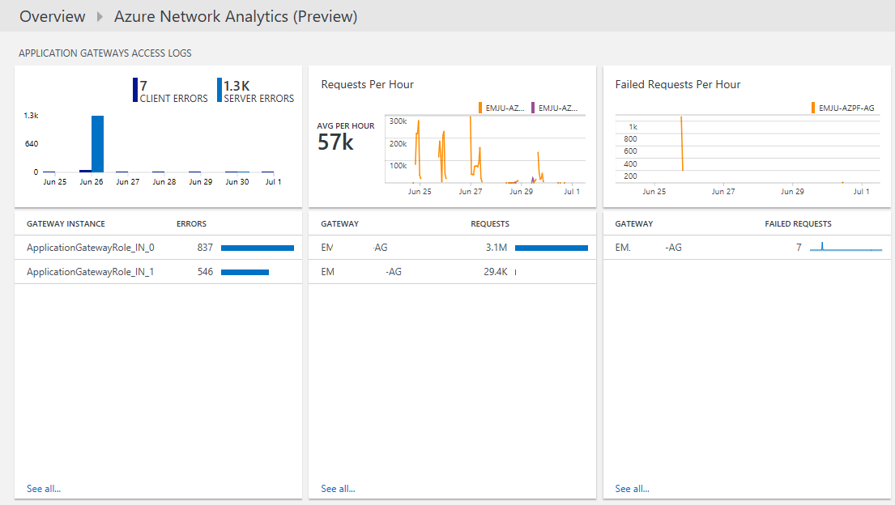

<properties
    pageTitle="Soluzione di rete Analitica Azure in Log Analitica | Microsoft Azure"
    description="È possibile utilizzare la soluzione di Azure Networking Analitica nel Log Analitica esaminare registri gruppo di sicurezza rete Azure e Azure applicazione Gateway."
    services="log-analytics"
    documentationCenter=""
    authors="richrundmsft"
    manager="jochan"
    editor=""/>

<tags
    ms.service="log-analytics"
    ms.workload="na"
    ms.tgt_pltfrm="na"
    ms.devlang="na"
    ms.topic="article"
    ms.date="07/05/2016"
    ms.author="richrund"/>

# Soluzione di rete Analitica (Preview) Azure in Analitica Log

>[AZURE.NOTE] Questa è una [soluzione di anteprima](log-analytics-add-solutions.md#log-analytics-preview-solutions-and-features).

È possibile utilizzare la soluzione di Azure Networking Analitica nel Log Analitica per rivedere i registri di Gateway di applicazioni Azure e registri di gruppo di sicurezza rete Azure.

È possibile abilitare la registrazione per i gruppi di sicurezza rete Azure e registri di Gateway di applicazioni Azure. Registri per Blob lo spazio di archiviazione nel punto in cui si possono quindi essere indicizzate tramite Analitica Log per la ricerca e l'analisi.

Per gateway di applicazione sono supportati i registri seguenti:

+ ApplicationGatewayAccessLog
+ ApplicationGatewayPerformanceLog

I registri seguenti sono supportati per i gruppi di sicurezza di rete:

+ NetworkSecurityGroupEvent
+ NetworkSecurityGroupRuleCounter

## Installare e configurare la soluzione

Installare e configurare la soluzione di Azure Networking Analitica, attenersi alle istruzioni seguenti:

1.  Attivare la registrazione diagnostica per le risorse che si desidera eseguire il monitoraggio:
  + [Gateway di applicazioni](../application-gateway/application-gateway-diagnostics.md)
  + [Gruppo di sicurezza di rete](../virtual-network/virtual-network-nsg-manage-log.md)
2.  Configurare Analitica Log per leggere i log dallo spazio di archiviazione Blob utilizzando la procedura descritta nella sezione [file JSON in archiviazione blob](../log-analytics/log-analytics-azure-storage-json.md).
3.  Attivare la soluzione di Azure Networking Analitica utilizzando la procedura descritta nella sezione [aggiungere Analitica Log soluzioni dalla raccolta soluzioni](log-analytics-add-solutions.md).  

Se non si attiva la registrazione diagnostica per un determinato tipo, le pale dashboard per tale risorsa sarà vuote.

## Esaminare i dettagli di raccolta dati di Azure Networking Analitica

Soluzione Azure Networking Analitica raccoglie registri di diagnostica dallo spazio di archiviazione Blob Azure per Azure applicazione gateway e i gruppi di sicurezza di rete.
Non è necessario per la raccolta di dati agente.

Nella tabella seguente mostra i metodi di raccolta dati e altre informazioni dettagliate su come dati raccolti per Azure Networking Analitica.

| Piattaforma | Agente diretta | Agente di sistemi Center Operations Manager (SCOM) | Spazio di archiviazione Azure | SCOM necessari? | Dati di agente SCOM inviati tramite il gruppo di gestione | Frequenza di raccolta |
|---|---|---|---|---|---|---|
|Azure||||            || 10 minuti|

## Utilizzare Analitica Networking Azure

Dopo avere installato la soluzione, è possibile visualizzare il riepilogo del client e gli errori di server per il gateway per applicazioni monitorate utilizzando **Azure Networking Analitica** affiancare nella pagina **Panoramica** del Log Analitica.

Dopo aver fatto clic sul riquadro **Panoramica** , è possibile visualizzare riepiloghi dei registri e quindi eseguire il drill-per informazioni dettagliate relative alle categorie seguenti:

+ Esegue l'accesso Gateway applicazione
  - Errori di client e server per i registri di accesso di Gateway di applicazioni
  - Richieste orarie per ogni applicazione di Gateway
  - Non è riuscita richieste orarie per ogni applicazione di Gateway
  - Errori per agente utente per gateway per applicazioni
+ Prestazioni di Gateway dell'applicazione
  - Stato di salute host di Gateway di applicazioni
  - Massimo e 95th percentile per le richieste di Gateway di applicazione non è riuscito
+ Gruppo di sicurezza di rete bloccati flussi
  - Regole gruppo di sicurezza di rete con flussi bloccati
  - Indirizzi MAC ai flussi bloccati
+ Gruppo di sicurezza di rete consentito flussi
  - Regole gruppo di sicurezza di rete con flussi consentiti
  - Indirizzi MAC ai flussi consentiti

### Per visualizzare i dettagli per un riepilogo di log

1. Nella pagina **Panoramica** fare clic sul riquadro **Azure Networking Analitica** .
2. Nel dashboard di **Azure Networking Analitica** , rivedere le informazioni di riepilogo in una delle pale e quindi fare clic su uno per visualizzare informazioni dettagliate nella pagina di ricerca log.

    In tutte le pagine di ricerca di log, è possibile visualizzare i risultati, ora, risultati dettagliati e la cronologia di ricerca di log. È inoltre possibile filtrare facet per limitare i risultati.

## Passaggi successivi

- Consente di visualizzare i dati di Azure Networking Analitica dettagliati [ricerche dei registri nel registro Analitica](log-analytics-log-searches.md) .
