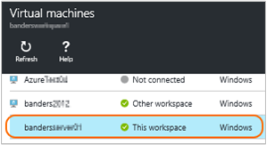
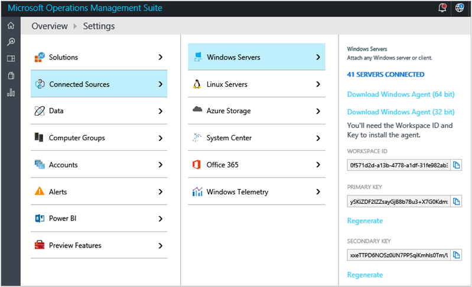

<properties
    pageTitle="Connettersi macchine virtuali di Azure Log Analitica | Microsoft Azure"
    description="Per Windows e Linux macchine virtuali in esecuzione in Azure, è consigliabile dei registri raccolti e metriche installando l'estensione macchine Virtuali di Azure Analitica Log. È possibile usare il portale di Azure e PowerShell per installare l'estensione di macchina virtuale Analitica Log in macchine virtuali di Azure."
    services="log-analytics"
    documentationCenter=""
    authors="richrundmsft"
    manager="jochan"
    editor=""/>

<tags
    ms.service="log-analytics"
    ms.workload="na"
    ms.tgt_pltfrm="na"
    ms.devlang="na"
    ms.topic="article"
    ms.date="10/10/2016"
    ms.author="richrund"/>

# <a name="connect-azure-virtual-machines-to-log-analytics"></a>Connettersi macchine virtuali di Azure Analitica Log

Per i computer Windows e Linux, il metodo consigliato per raccogliere i registri e metriche è installando agente Log Analitica.

Il modo più semplice per installare l'agente Analitica Log in macchine virtuali di Azure è tramite l'estensione di macchine Virtuali Analitica Log.  Utilizzando l'estensione consente di semplificare il processo di installazione e configura automaticamente l'agente per inviare i dati nell'area di lavoro Analitica Log specificato. L'agente anche verrà aggiornato automaticamente, verificare di disporre le caratteristiche e le correzioni più recenti.

Per macchine virtuali di Windows, attivare l'estensione di macchina virtuale *Agente di monitoraggio di Microsoft* .
Per macchine virtuali Linux, attivare l'estensione di macchina virtuale *OMS agente per Linux* .

Altre informazioni sulle [estensioni di Azure macchina virtuale](../virtual-machines/virtual-machines-windows-extensions-features.md) e [Linux agente] (... / virtual-machines/virtual-machines-linux-agent-user-guide.md).

Quando si utilizza insieme basato su agente per i dati di log, è necessario configurare [origini dati nel Log Analitica](log-analytics-data-sources.md) per specificare i log e le metriche che si desidera raccogliere.

>[AZURE.IMPORTANT] Se si configura Log Analitica indicizzare i dati di registro tramite [diagnostica Windows Azure](log-analytics-azure-storage.md)e si configura l'agente per raccogliere i registri stesso, quindi sono stati raccolti i log due volte. Addebitate per entrambe le origini dati. Se è disponibile l'agente installato, è necessario raccogliere dati log utilizzando l'agente solo - non si configura Analitica Log per raccogliere dati log da diagnostica Windows Azure.

Esistono tre modi semplici per attivare l'estensione di macchina virtuale Analitica Log:

+ Tramite il portale di Azure
+ Tramite PowerShell Azure
+ Utilizzando un modello di gestione risorse di Azure

## <a name="enable-the-vm-extension-in-the-azure-portal"></a>Attivare l'estensione macchine Virtuali nel portale di Azure

È possibile installare l'agente per Analitica Log e connettere la macchina virtuale Azure utilizzabile con tramite il [portale di Azure](https://portal.azure.com).

### <a name="to-install-the-log-analytics-agent-and-connect-the-virtual-machine-to-a-log-analytics-workspace"></a>Per installare l'agente Analitica Log e connettere la macchina virtuale a un'area di lavoro Analitica Log

1.  Accedere al [portale di Azure](http://portal.azure.com).
2.  Selezionare **Sfoglia** sul lato sinistro del portale, quindi passare a **Log Analitica (OMS)** e selezionarlo.
3.  Nell'elenco delle aree di lavoro Log Analitica, selezionare quello che si desidera utilizzare con la macchina virtuale Azure.  
    
4.  In **Gestione analitica registro**, selezionare **macchine virtuali**.  
    
5.  Nell'elenco di **macchine virtuali**, selezionare la macchina virtuale in cui si desidera installare l'agente. Lo **stato di connessione OMS** per la macchina virtuale indica che **non connesso**.  
    
6.  Informazioni dettagliate per la macchina virtuale, selezionare **Connetti**. L'agente viene installato e configurato per l'area di lavoro Log Analitica automaticamente. Questo processo sono necessari alcuni minuti, durante il quale lo stato di connessione OMS è *la connessione...*  
    
7.  Dopo aver installato e connettere l'agente, lo stato della **connessione OMS** verrà aggiornato per visualizzare **un'area di lavoro**.  
    


## <a name="enable-the-vm-extension-using-powershell"></a>Attivare l'estensione di macchine Virtuali tramite PowerShell

Sono disponibili comandi diversi per Azure macchine virtuali classiche e macchine virtuali di Manager delle risorse. Ecco alcuni esempi per classica e macchine virtuali di Manager delle risorse.

Per classiche macchine virtuali, utilizzare l'esempio seguente di PowerShell:

```
Add-AzureAccount

$workspaceId = "enter workspace ID here"
$workspaceKey = "enter workspace key here"
$hostedService = "enter hosted service here"

$vm = Get-AzureVM –ServiceName $hostedService

# For Windows VM uncomment the following line
# Set-AzureVMExtension -VM $vm -Publisher 'Microsoft.EnterpriseCloud.Monitoring' -ExtensionName 'MicrosoftMonitoringAgent' -Version '1.*' -PublicConfiguration "{'workspaceId': '$workspaceId'}" -PrivateConfiguration "{'workspaceKey': '$workspaceKey' }" | Update-AzureVM -Verbose

# For Linux VM uncomment the following line
# Set-AzureVMExtension -VM $vm -Publisher 'Microsoft.EnterpriseCloud.Monitoring' -ExtensionName 'OmsAgentForLinux' -Version '1.*' -PublicConfiguration "{'workspaceId': '$workspaceId'}" -PrivateConfiguration "{'workspaceKey': '$workspaceKey' }" | Update-AzureVM -Verbose
```

Per le macchine virtuali di Manager delle risorse, utilizzare l'esempio seguente di PowerShell:

```
Login-AzureRMAccount
Select-AzureSubscription -SubscriptionId "**"

$workspaceName = "your workspace name"
$VMresourcegroup = "**"
$VMresourcename = "**"

$workspace = (Get-AzureRmOperationalInsightsWorkspace).Where({$_.Name -eq $workspaceName})

if ($workspace.Name -ne $workspaceName)
{
    Write-Error "Unable to find OMS Workspace $workspaceName. Do you need to run Select-AzureRMSubscription?"
}

$workspaceId = $workspace.CustomerId
$workspaceKey = (Get-AzureRmOperationalInsightsWorkspaceSharedKeys -ResourceGroupName $workspace.ResourceGroupName -Name $workspace.Name).PrimarySharedKey

$vm = Get-AzureRmVM -ResourceGroupName $VMresourcegroup -Name $VMresourcename
$location = $vm.Location

# For Windows VM uncomment the following line
# Set-AzureRmVMExtension -ResourceGroupName $VMresourcegroup -VMName $VMresourcename -Name 'MicrosoftMonitoringAgent' -Publisher 'Microsoft.EnterpriseCloud.Monitoring' -ExtensionType 'MicrosoftMonitoringAgent' -TypeHandlerVersion '1.0' -Location $location -SettingString "{'workspaceId': '$workspaceId'}" -ProtectedSettingString "{'workspaceKey': '$workspaceKey'}"

# For Linux VM uncomment the following line
# Set-AzureRmVMExtension -ResourceGroupName $VMresourcegroup -VMName $VMresourcename -Name 'OmsAgentForLinux' -Publisher 'Microsoft.EnterpriseCloud.Monitoring' -ExtensionType 'OmsAgentForLinux' -TypeHandlerVersion '1.0' -Location $location -SettingString "{'workspaceId': '$workspaceId'}" -ProtectedSettingString "{'workspaceKey': '$workspaceKey'}"


```
Quando si configura la macchina virtuale tramite PowerShell, è necessario specificare **l'ID dell'area di lavoro** e una **Chiave primaria**. È possibile trovare l'Id e la chiave nella pagina **Impostazioni** del portale di OMS o tramite PowerShell, come illustrato nell'esempio precedente.



## <a name="deploy-the-vm-extension-using-a-template"></a>Distribuire l'estensione di macchine Virtuali utilizzando un modello

Tramite Gestione risorse di Azure, è possibile creare un modello semplice (in formato JSON) che definisce la distribuzione e la configurazione dell'applicazione. Questo modello è nota come modello Manager delle risorse e offre un modo dichiarativo per definire la distribuzione. Utilizzando un modello, è possibile distribuire l'applicazione nel ciclo di vita app ripetutamente e fiducia che le risorse sono viene distribuite in uno stato coerente.

Includendo agente Analitica Log come parte del modello Manager delle risorse, è possibile assicurarsi che ogni macchina virtuale sia preconfigurato per segnalare nell'area di lavoro Log Analitica.

Per ulteriori informazioni sui modelli di Manager delle risorse, vedere [modelli di creazione condivisa Manager delle risorse di Azure](../resource-group-authoring-templates.md).

Di seguito è illustrato un esempio di un modello di Manager delle risorse che viene utilizzato per la distribuzione di una macchina virtuale che esegue Windows con l'estensione Microsoft Agent monitoraggio installato. Questo modello è un modello di computer virtuale comune, con le differenze seguenti:

+ parametri workspaceId e workspaceName
+ Sezione di estensione risorsa Microsoft.EnterpriseCloud.Monitoring
+ Output per cercare la workspaceId e workspaceSharedKey


```
{
  "$schema": "https://schema.management.azure.com/schemas/2015-01-01/deploymentTemplate.json#",
  "contentVersion": "1.0.0.0",
  "parameters": {
    "adminUsername": {
      "type": "string",
      "metadata": {
        "description": "Username for the Virtual Machine."
      }
    },
    "adminPassword": {
      "type": "securestring",
      "metadata": {
        "description": "Password for the Virtual Machine."
      }
    },
    "dnsLabelPrefix": {
       "type": "string",
       "metadata": {
          "description": "DNS Label for the Public IP. Must be lowercase. It should match with the following regular expression: ^[a-z][a-z0-9-]{1,61}[a-z0-9]$ or it will raise an error."
       }
    },
    "workspaceId": {
      "type": "string",
      "metadata": {
        "description": "OMS workspace ID"
      }
    },
    "workspaceName": {
      "type": "string",
      "metadata": {
         "description": "OMD workspace name"
      }
    },
    "windowsOSVersion": {
      "type": "string",
      "defaultValue": "2012-R2-Datacenter",
      "allowedValues": [
        "2008-R2-SP1",
        "2012-Datacenter",
        "2012-R2-Datacenter",
        "Windows-Server-Technical-Preview"
      ],
      "metadata": {
        "description": "The Windows version for the VM. This will pick a fully patched image of this given Windows version. Allowed values: 2008-R2-SP1, 2012-Datacenter, 2012-R2-Datacenter, Windows-Server-Technical-Preview."
      }
    }
  },
  "variables": {
    "storageAccountName": "[concat(uniquestring(resourceGroup().id), 'standardsa')]",
    "apiVersion": "2015-06-15",
    "imagePublisher": "MicrosoftWindowsServer",
    "imageOffer": "WindowsServer",
    "OSDiskName": "osdiskforwindowssimple",
    "nicName": "myVMNic",
    "addressPrefix": "10.0.0.0/16",
    "subnetName": "Subnet",
    "subnetPrefix": "10.0.0.0/24",
    "storageAccountType": "Standard_LRS",
    "publicIPAddressName": "myPublicIP",
    "publicIPAddressType": "Dynamic",
    "vmStorageAccountContainerName": "vhds",
    "vmName": "MyWindowsVM",
    "vmSize": "Standard_DS1",
    "virtualNetworkName": "MyVNET",
    "resourceId": "[resourceGroup().id]",
    "vnetID": "[resourceId('Microsoft.Network/virtualNetworks',variables('virtualNetworkName'))]",
    "subnetRef": "[concat(variables('vnetID'),'/subnets/',variables('subnetName'))]"
  },
  "resources": [
    {
      "type": "Microsoft.Storage/storageAccounts",
      "name": "[variables('storageAccountName')]",
      "apiVersion": "[variables('apiVersion')]",
      "location": "[resourceGroup().location]",
      "properties": {
        "accountType": "[variables('storageAccountType')]"
      }
    },
    {
      "apiVersion": "[variables('apiVersion')]",
      "type": "Microsoft.Network/publicIPAddresses",
      "name": "[variables('publicIPAddressName')]",
      "location": "[resourceGroup().location]",
      "properties": {
        "publicIPAllocationMethod": "[variables('publicIPAddressType')]",
        "dnsSettings": {
          "domainNameLabel": "[parameters('dnsLabelPrefix')]"
        }
      }
    },
    {
      "apiVersion": "[variables('apiVersion')]",
      "type": "Microsoft.Network/virtualNetworks",
      "name": "[variables('virtualNetworkName')]",
      "location": "[resourceGroup().location]",
      "properties": {
        "addressSpace": {
          "addressPrefixes": [
            "[variables('addressPrefix')]"
          ]
        },
        "subnets": [
          {
            "name": "[variables('subnetName')]",
            "properties": {
              "addressPrefix": "[variables('subnetPrefix')]"
            }
          }
        ]
      }
    },
    {
      "apiVersion": "[variables('apiVersion')]",
      "type": "Microsoft.Network/networkInterfaces",
      "name": "[variables('nicName')]",
      "location": "[resourceGroup().location]",
      "dependsOn": [
        "[concat('Microsoft.Network/publicIPAddresses/', variables('publicIPAddressName'))]",
        "[concat('Microsoft.Network/virtualNetworks/', variables('virtualNetworkName'))]"
      ],
      "properties": {
        "ipConfigurations": [
          {
            "name": "ipconfig1",
            "properties": {
              "privateIPAllocationMethod": "Dynamic",
              "publicIPAddress": {
                "id": "[resourceId('Microsoft.Network/publicIPAddresses',variables('publicIPAddressName'))]"
              },
              "subnet": {
                "id": "[variables('subnetRef')]"
              }
            }
          }
        ]
      }
    },
    {
      "apiVersion": "2015-06-15",
      "type": "Microsoft.Compute/virtualMachines",
      "name": "[variables('vmName')]",
      "location": "[resourceGroup().location]",
      "dependsOn": [
        "[concat('Microsoft.Storage/storageAccounts/', variables('storageAccountName'))]",
        "[concat('Microsoft.Network/networkInterfaces/', variables('nicName'))]"
      ],
      "properties": {
        "hardwareProfile": {
          "vmSize": "[variables('vmSize')]"
        },
        "osProfile": {
          "computername": "[variables('vmName')]",
          "adminUsername": "[parameters('adminUsername')]",
          "adminPassword": "[parameters('adminPassword')]"
        },
        "storageProfile": {
          "imageReference": {
            "publisher": "[variables('imagePublisher')]",
            "offer": "[variables('imageOffer')]",
            "sku": "[parameters('windowsOSVersion')]",
            "version": "latest"
          },
          "osDisk": {
            "name": "osdisk",
            "vhd": {
              "uri": "[concat('http://',variables('storageAccountName'),'.blob.core.windows.net/',variables('vmStorageAccountContainerName'),'/',variables('OSDiskName'),'.vhd')]"
            },
            "caching": "ReadWrite",
            "createOption": "FromImage"
          }
        },
        "networkProfile": {
          "networkInterfaces": [
            {
              "id": "[resourceId('Microsoft.Network/networkInterfaces',variables('nicName'))]"
            }
          ]
        },
        "diagnosticsProfile": {
          "bootDiagnostics": {
             "enabled": "true",
             "storageUri": "[concat('http://',variables('storageAccountName'),'.blob.core.windows.net')]"
          }
        }
      },
      "resources": [
        {
          "type": "extensions",
          "name": "Microsoft.EnterpriseCloud.Monitoring",
          "apiVersion": "[variables('apiVersion')]",
          "location": "[resourceGroup().location]",
          "dependsOn": [
            "[concat('Microsoft.Compute/virtualMachines/', variables('vmName'))]"
          ],
          "properties": {
            "publisher": "Microsoft.EnterpriseCloud.Monitoring",
            "type": "MicrosoftMonitoringAgent",
            "typeHandlerVersion": "1.0",
            "autoUpgradeMinorVersion": true,
            "settings": {
              "workspaceId": "[parameters('workspaceId')]"
            },
            "protectedSettings": {
              "workspaceKey": "[listKeys(resourceId('Microsoft.OperationalInsights/workspaces', parameters('workspaceName')), '2015-03-20').primarySharedKey]"
            }
          }
        }
      ]
    }
  ],
  "outputs": {
      "sharedKeyOutput": {
         "value": "[listKeys(resourceId('Microsoft.OperationalInsights/workspaces/', parameters('workspaceName')), '2015-03-20').primarySharedKey]",
         "type": "string"
      },
      "workspaceIdOutput": {
         "value": "[reference(concat('Microsoft.OperationalInsights/workspaces/', parameters('workspaceName')), '2015-03-20').customerId]",
        "type" : "string"
      }
  }
}
```

È possibile distribuire un modello utilizzando il comando PowerShell seguente:

```
New-AzureRmResourceGroupDeployment -ResourceGroupName $resourceGroupName -TemplateFile $templateFilePath
```

## <a name="troubleshooting-windows-virtual-machines"></a>Risoluzione dei problemi macchine virtuali di Windows

Se l'estensione agente macchine Virtuali di *Microsoft Monitoring Agent* non è l'installazione o creazione di report è possibile eseguire la procedura seguente per risolvere il problema.

1. Verificare se è installato l'agente di macchine Virtuali di Azure e funzionare correttamente utilizzando la procedura descritta [nell'articolo della Knowledge 2965986](https://support.microsoft.com/kb/2965986#mt1).
  + È inoltre possibile esaminare il file di log agente macchine Virtuali`C:\WindowsAzure\logs\WaAppAgent.log`
  + Se il log non esiste, l'agente di macchine Virtuali non è installato.
    - [Installare l'agente di macchine Virtuali di Azure in macchine virtuali classiche](../virtual-machines/virtual-machines-windows-classic-agents-and-extensions.md)
2. Verificare che l'attività di heartbeat estensione Microsoft Monitoring Agent sia in esecuzione con la procedura seguente:
  + Accedere al computer virtuale
  + Aprire l'utilità di pianificazione e trovare il `update_azureoperationalinsight_agent_heartbeat` attività
  + Confermare l'attività è abilitata ed è in esecuzione ogni minuto
  + Archiviare il file di log heartbeat`C:\WindowsAzure\Logs\Plugins\Microsoft.EnterpriseCloud.Monitoring.MicrosoftMonitoringAgent\heartbeat.log`
3. Rivedere i file di log di estensione Microsoft Virtual Machine agente di monitoraggio in`C:\Packages\Plugins\Microsoft.EnterpriseCloud.Monitoring.MicrosoftMonitoringAgent`
3. Assicurarsi che la macchina virtuale supporti l'esecuzione di script di PowerShell
4. Assicurarsi che le autorizzazioni per C:\Windows\temp non hanno subito modifiche
5. Visualizzare lo stato dell'agente di monitoraggio di Microsoft, digitare quanto segue in una finestra di PowerShell elevata sul computer virtuale`  (New-Object -ComObject 'AgentConfigManager.MgmtSvcCfg').GetCloudWorkspaces() | Format-List`
6. Rivedere i file di log di installazione Microsoft Agent monitoraggio in`C:\Windows\System32\config\systemprofile\AppData\Local\SCOM\Logs`

Per ulteriori informazioni, vedere [risoluzione dei problemi le estensioni di Windows](../virtual-machines/virtual-machines-windows-extensions-troubleshoot.md).

## <a name="troubleshooting-linux-virtual-machines"></a>Risoluzione dei problemi macchine virtuali Linux

Se l'estensione agente macchine Virtuali *Agente OMS per Linux* non è l'installazione o creazione di report è possibile eseguire la procedura seguente per risolvere il problema.

1. Se lo stato di estensione è *sconosciuto* verifica se è installato l'agente di macchine Virtuali di Azure e funzionare correttamente esaminando il file di log agente macchine Virtuali`/var/log/waagent.log`
  + Se il log non esiste, l'agente di macchine Virtuali non è installato.
  - [Installare l'agente di Azure macchine Virtuali in macchine virtuali Linux](../virtual-machines/virtual-machines-linux-agent-user-guide.md)
2. Per gli altri Stati non corretti, esaminare l'agente OMS per estensione Linux VM registri file `/var/log/azure/Microsoft.EnterpriseCloud.Monitoring.OmsAgentForLinux/*/extension.log` e`/var/log/azure/Microsoft.EnterpriseCloud.Monitoring.OmsAgentForLinux/*/CommandExecution.log`
3. Se lo stato di estensione è integro, ma non viene caricati dati esaminare l'agente OMS per i file di log Linux in`/var/opt/microsoft/omsagent/log/omsagent.log`

Per ulteriori informazioni, vedere [risoluzione dei problemi Linux estensioni](../virtual-machines/virtual-machines-linux-extensions-troubleshoot.md).


## <a name="next-steps"></a>Passaggi successivi

+ Configurare le [origini dati nel Log Analitica](log-analytics-data-sources.md) per specificare il formato per raccogliere e registri di.
+ Per raccogliere dati da virtuale computer [aggiungere Analitica Log soluzioni dalla raccolta soluzioni](log-analytics-add-solutions.md).
+ [Raccogliere dati tramite Azure diagnostica](log-analytics-azure-storage.md) per le altre risorse che sono in esecuzione in Azure.

Per i computer che non fanno parte di Azure, è possibile installare l'agente Log Analitica utilizzando i metodi descritti negli articoli seguenti:

+ [Connettere computer Windows Analitica Log](log-analytics-windows-agents.md)
+ [Connettere il computer Linux a Analitica Log](log-analytics-linux-agents.md)
