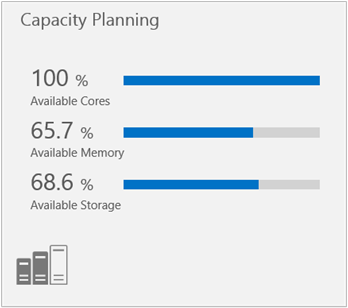
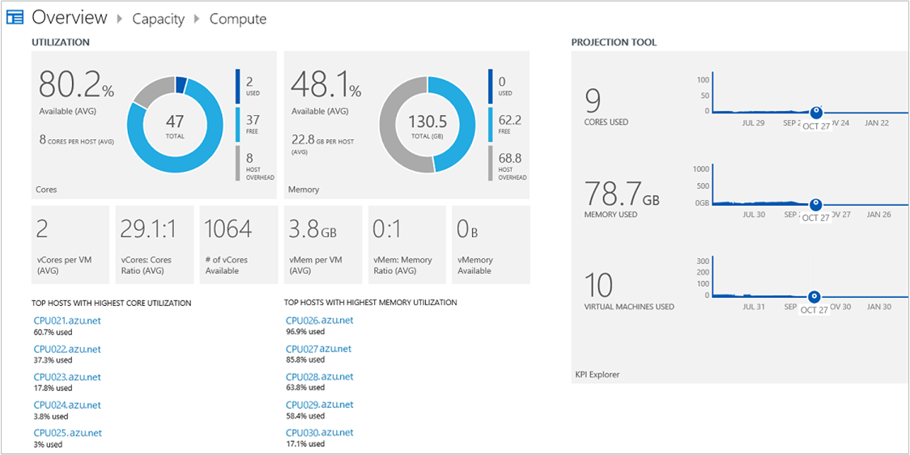

<properties
    pageTitle="Soluzione di gestione delle capacità nel Log Analitica | Microsoft Azure"
    description="È possibile usare la soluzione di pianificazione della capacità in Analitica Log per comprendere la capacità dei server Hyper-V gestite da System Center Virtual Machine Manager"
    services="log-analytics"
    documentationCenter=""
    authors="bandersmsft"
    manager="jwhit"
    editor=""/>

<tags
    ms.service="log-analytics"
    ms.workload="na"
    ms.tgt_pltfrm="na"
    ms.devlang="na"
    ms.topic="article"
    ms.date="10/10/2016"
    ms.author="banders"/>

# Soluzione di gestione delle capacità in Analitica Log

È possibile utilizzare la soluzione di pianificazione della capacità di Analitica Log per comprendere la capacità dei server Hyper-V gestite da System Center Virtual Machine Manager. Questa soluzione richiede System Center Operations Manager e System Center Virtual Machine Manager. Pianificazione della capacità non è disponibile se si utilizzano solo gli agenti connessi direttamente. Installare la soluzione per aggiornare l'agente Operations Manager. La soluzione legge contatori nel server di monitoraggio e invia dati utilizzo per il servizio Outlook Mobile nel cloud per l'elaborazione. Logica viene applicata ai dati di utilizzo e il servizio cloud registra i dati. Nel tempo, vengono identificati i modelli di utilizzo e la capacità è previsto, in base a consumo corrente.

Ad esempio una proiezione potrebbe identificare quando core aggiuntive o memoria aggiuntiva sarà necessarie per un singolo server. In questo esempio, la proiezione è possibile che in 30 giorni il server necessita memoria aggiuntiva. Questo consente di pianificare un aggiornamento di memoria nel periodo della manutenzione successiva del server che può verificarsi una volta ogni due settimane.

>[AZURE.NOTE] La soluzione di gestione delle capacità non è disponibile da aggiungere alle aree di lavoro. I clienti che hanno la soluzione di gestione delle capacità installata è possono continuare a usare la soluzione.  

La soluzione di pianificazione è in fase di aggiornamento per risolvere il cliente seguente segnalati problemi:

- Necessità di utilizzare Virtual Machine Manager e Operations Manager
- Impossibilità di personalizzare/filtro in base ai gruppi
- Non frequenti sufficiente oraria aggregazione dei dati
- Nessun approfondimenti livelli macchine Virtuali
- Affidabilità dei dati

Vantaggi della nuova soluzione capacità:

- Supportano la raccolta dati granulare con maggiore precisione e maggiore affidabilità
- Supporto per Hyper-V senza VMM
- Visualizzazione delle metriche di ottenere informazioni
- Informazioni sull'utilizzo di livello macchine Virtuali

## Installare e configurare la soluzione
Utilizzare le informazioni seguenti per installare e configurare la soluzione.

- Operations Manager è necessaria per la soluzione di gestione delle capacità.
- Virtual Machine Manager è necessaria per la soluzione di gestione delle capacità.
- È necessaria la connettività di gestione di operazioni con Virtual Machine Manager (VMM). Per ulteriori informazioni sulla connessione sistemi, vedere [come connettere VMM con Operations Manager](http://technet.microsoft.com/library/hh882396.aspx).
- Operations Manager deve essere connesso a Log Analitica.
- Aggiungere la soluzione di gestione delle capacità nell'area di lavoro OMS usando la procedura descritta nella sezione [aggiungere Analitica Log soluzioni dalla raccolta soluzioni](log-analytics-add-solutions.md).  Non esiste alcun ulteriori operazioni di configurazione necessari.

## Dettagli insieme di capacità gestione dati

Gestione delle capacità consente di raccogliere dati sulle prestazioni, metadati e dati di stato tramite gli agenti che è stata attivata.

Nella tabella seguente mostra i metodi di raccolta dati e altri dettagli sulle modalità di raccolta dati per la gestione della capacità.

| piattaforma | Agente diretta | Agente SCOM | Spazio di archiviazione Azure | SCOM necessari? | Dati di agente SCOM inviati tramite il gruppo di gestione | frequenza di raccolta |
|---|---|---|---|---|---|---|
|Windows||||            || ogni ora|

Nella tabella seguente è illustrati esempi di tipi di dati raccolti dal dimensionamento:

|**Tipo di dati**|**Campi**|
|---|---|
|Metadati|BaseManagedEntityId, ObjectStatus, unità organizzativa, ActiveDirectoryObjectSid, PhysicalProcessors, risorse NetworkName, indirizzo IP, ForestDNSName, NetbiosComputerName, VirtualMachineName, LastInventoryDate, HostServerNameIsVirtualMachine, indirizzo IP, NetbiosDomainName, LogicalProcessors, DNSName, DisplayName, DomainDnsName, ActiveDirectorySite, PrincipalName, OffsetInMinuteFromGreenwichTime|
|Prestazioni|Nome oggetto, CounterName, PerfmonInstanceName, PerformanceDataId, PerformanceSourceInternalID, SampleValue, TimeSampled, TimeAdded|
|Stato|StateChangeEventId, StateId, NewHealthState, OldHealthState, contesto, TimeGenerated, TimeAdded, StateId2, BaseManagedEntityId, MonitorId, HealthState, LastModified, LastGreenAlertGenerated, DatabaseTimeModified|

## Pagina di gestione della capacità

 Dopo l'installazione della soluzione di pianificazione della capacità, è possibile visualizzare la capacità dei server di monitoraggio utilizzando il riquadro di **Pianificazione della capacità** nella pagina **Panoramica** OMS.

Il riquadro viene aperto il dashboard di **Gestione delle capacità** in cui è possibile visualizzare un riepilogo della capacità di server. Nella pagina vengono visualizzati i riquadri seguenti è possibile fare clic su:

- *Conteggio di macchina virtuale*: Mostra il numero di giorni rimanenti per la capacità di macchine virtuali
- *Calcolare*: Mostra core e memoria disponibile
- *Spazio di archiviazione*: Mostra lo spazio su disco utilizzato e calcolare la media di latenza del disco
- *Ricerca*: Esplora aree di dati che è possibile utilizzare per la ricerca di tutti i dati nel sistema OMS

### Per visualizzare una pagina di capacità

- Nella pagina **Panoramica** fare clic su **Gestione delle capacità**e quindi fare clic su **calcolare** o **lo spazio di archiviazione**.

## Calcolare pagina

È possibile utilizzare il dashboard **calcolare** in Microsoft Azure OMS per visualizzare informazioni capacità utilizzo previsto giorni della capacità e l'efficienza correlati all'infrastruttura. Utilizzare l'area di **utilizzo** per visualizzare core e della memoria della CPU propri host macchina virtuale. È possibile utilizzare lo strumento di proiezione per stimare la quantità di capacità dovrebbe essere disponibile per un determinato intervallo di date. È possibile utilizzare l'area **l'efficienza** per vedere come efficiente l'host macchine virtuali sono. È possibile visualizzare i dettagli di elementi collegati facendo clic su essi.

È possibile generare una cartella di lavoro di Excel per le categorie seguenti:

- Host superiore con più alto utilizzo di base
- Host superiore con utilizzo della memoria massima
- Host superiore con inefficace macchine virtuali
- Principali host dall'utilizzo
- Host inferiore dall'utilizzo

Aree seguenti vengono visualizzate nel dashboard di **calcolare** :

**Utilizzo**: utilizzo di base e della memoria di visualizzazione CPU l'host macchina virtuale.

- *Utilizzato core*: somma per tutti gli host (% della CPU utilizzata moltiplicato per il numero di core fisici nell'host).
- *Core gratuito*: totale core fisici meno comuni Core.
- *Percentuale core disponibili*: liberare core fisici divisi per numero totale di core fisici.
- *Core virtuale per macchine Virtuali*: totale core virtuale nel sistema diviso per il numero totale di macchine virtuali di sistema.
- *Virtuale core fisica core rapporto*: rapporto tra vendite di totale core fisici a core fisici utilizzati da macchine virtuali nel sistema.
- *Numero di virtuale core disponibili*: virtuali di base a proporzioni core fisici moltiplicato per i core fisici disponibili.
- *Memoria utilizzato*: somma della memoria che viene utilizzata da tutti gli host.
- *Memoria*: memoria fisica meno utilizzato memoria totale.
- *Percentuale della memoria disponibile*: liberare memoria fisica divisa memoria fisica totale.
- *Memoria virtuale per macchine Virtuali*: memoria virtuale totale nel sistema di diviso per il numero totale di macchine virtuali di sistema.
- *Memoria virtuale per rapporto memoria fisica*: memoria virtuale totale nel sistema di diviso per la memoria fisica del sistema.
- *Memoria virtuale disponibile*: memoria virtuale per rapporto memoria fisica moltiplicata per la memoria fisica disponibile.

**Strumento di proiezione**

Utilizzando lo strumento di proiezione, è possibile visualizzare le tendenze cronologiche per l'utilizzo delle risorse. Sono incluse le tendenze di utilizzo per macchine virtuali, memoria, core e lo spazio di archiviazione. La funzionalità di proiezione utilizza un algoritmo di proiezione consentono di sapere quando sono quasi esaurito ognuna delle risorse. Consente di calcolare la capacità corretta pianificazione in modo da sapere quando è necessario acquistare ulteriori capacità (ad esempio memoria, Core o lo spazio di archiviazione).

**Efficienza**

- *Macchine Virtuali Idle*: utilizzando meno del 10% della memoria CPU e 10% per il periodo di tempo specificato.
- *Macchine Virtuali sovrautilizzata*: utilizzo di più di 90% della memoria CPU e 90% per il periodo di tempo specificato.
- *Inattivo Host*: usare inferiore a 10% della memoria CPU e 10% per il periodo di tempo specificato.
- *Sovrautilizzata Host*: usare più di 90% della memoria CPU e 90% per il periodo di tempo specificato.

### Per utilizzare gli elementi della pagina di calcolo

1. Per **calcolare** il dashboard nell'area **utilizzo** consente di visualizzare informazioni capacità core CPU e memoria in uso.
2. Fare clic su un elemento per aprirlo nella pagina di **ricerca** e visualizzare informazioni dettagliate.
3. Nello strumento di **proiezione** , spostare il dispositivo di scorrimento data per visualizzare una proiezione della capacità che verrà utilizzata il giorno che scelto.
4. Nell'area **efficienza** visualizzare capacità efficienza informazioni macchine virtuali e host macchina virtuale.

## Pagina di archiviazione collegata diretta

È possibile utilizzare il dashboard **Diretto archiviazione collegata** in OMS per visualizzare informazioni capacità spazio di archiviazione, le prestazioni del disco e giorni previsti del disco. Utilizzare l'area di **utilizzo** per visualizzare spazio su disco propri host macchina virtuale. Per visualizzare l'host macchine virtuali velocità effettiva del disco e latenza, è possibile utilizzare l'area **Prestazioni del disco** . È anche possibile usare lo strumento di proiezione per stimare la quantità di capacità dovrebbe essere disponibile per un determinato intervallo di date. È possibile visualizzare i dettagli di elementi collegati facendo clic su essi.

È possibile generare una cartella di lavoro di Excel da queste informazioni capacità relative alle categorie seguenti:

- Utilizzo dello spazio su disco superiore dall'host
- Latenza media superiore dall'host

Aree seguenti vengono visualizzate nella pagina **dello spazio di archiviazione** :

- *Utilizzo*: visualizzare spazio su disco propri host macchina virtuale.
- *Spazio su disco totale*: somma (spazio su disco logico) per tutti gli host
- *Spazio su disco utilizzato*: somma (spazio su disco logico utilizzato) per tutti gli host
- *Spazio disponibile su disco*: spazio su disco meno spazio su disco utilizzato totale
- *Percentuale disco utilizzato*: utilizzato spazio su disco diviso spazio su disco totale
- *Percentuale disco disponibile*: spazio disponibile su disco diviso per spazio su disco totale

**Prestazioni del disco**

Se si utilizza OMS, è possibile visualizzare la tendenza cronologiche di utilizzo del disco rigido. La funzionalità di proiezione utilizza un algoritmo all'utilizzo di progetti futuri. Per l'utilizzo di spazio in particolare, la funzionalità di proiezione consente a project quando si verifichino spazio su disco. Questo consente di pianificare spazio di archiviazione appropriato e sapere quando è necessario acquistare ulteriore spazio di archiviazione.

**Strumento di proiezione**

Utilizzando lo strumento di proiezione, è possibile visualizzare le tendenze cronologiche per l'utilizzo dello spazio su disco. La funzionalità di proiezione è anche possibile usare project durante l'esecuzione di spazio su disco. Questo consente di pianificare la capacità corretta e sapere quando è necessario acquistare ulteriori capacità di archiviazione.

### Per utilizzare gli elementi nella pagina di accesso diretto archiviazione collegata

1. Nel dashboard di **Archiviazione diretta collegata** nell'area di **utilizzo** , è possibile visualizzare le informazioni di utilizzo del disco.
2. Fare clic su un elemento collegato per aprire la pagina di **ricerca** e visualizzare informazioni dettagliate.
3. Nell'area **Prestazioni del disco** , è possibile visualizzare informazioni sulla velocità e la latenza del disco.
4. Nello **strumento di proiezione**, spostare il dispositivo di scorrimento data per visualizzare una proiezione della capacità che verrà utilizzata il giorno che scelto.

## Passaggi successivi

- Utilizzare [le ricerche Log in Analitica Log](log-analytics-log-searches.md) per visualizzare i dati di gestione delle capacità dettagliate.
