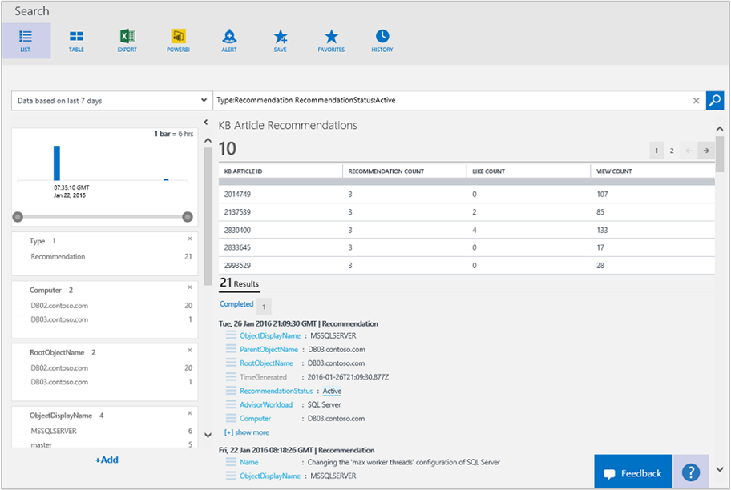

<properties
    pageTitle="Soluzione di valutazione di configurazione in Log Analitica | Microsoft Azure"
    description="La soluzione di valutazione di configurazione in Analitica Log fornisce informazioni dettagliate sullo stato corrente dell'infrastruttura server System Center Operations Manager quando si utilizza Operations Manager agenti o un gruppo di gestione Operations Manager."
    services="log-analytics"
    documentationCenter=""
    authors="bandersmsft"
    manager="jwhit"
    editor=""/>

<tags
    ms.service="log-analytics"
    ms.workload="na"
    ms.tgt_pltfrm="na"
    ms.devlang="na"
    ms.topic="article"
    ms.date="10/10/2016"
    ms.author="banders"/>

# Soluzione di valutazione di configurazione in Analitica Log

La soluzione di valutazione di configurazione in Log Analitica consente di trovare potenziali problemi di configurazione server mediante avvisi e suggerimenti knowledge.

Questa soluzione richiede System Center Operations Manager. Valutazione configurazione non è disponibile se si utilizzano solo gli agenti connessi direttamente.

Visualizzazione di alcune informazioni in soluzione di valutazione di configurazione richiede il plug-in Silverlight per il browser.

>[AZURE.NOTE] 5 luglio 2016, a partire la soluzione di valutazione di configurazione non può essere aggiunti alle aree di lavoro Analitica Log e questa soluzione non saranno disponibile per gli attuali utenti dopo il 1 agosto 2016. Se si utilizza questa soluzione per SQL Server o Active Directory, è consigliabile che utilizzare invece la [Valutazione di SQL Server](log-analytics-sql-assessment.md), le soluzioni di [Valutazione di Active Directory](log-analytics-ad-assessment.md) e [Lo stato della replica di Active Directory](log-analytics-ad-replication-status.md) . Per i clienti che utilizzano dei rischi di configurazione per Windows, Hyper-V e System Center Virtual Machine Manager, è consigliabile utilizzare l'insieme di eventi e funzionalità per ottenere una visualizzazione unica dei problemi in ambienti di rilevamento modifiche.

Configurazione dati raccolti dal server di monitoraggio e quindi inviati al servizio Outlook Mobile nel cloud per elaborazione. Logica viene applicata ai dati ricevuti e il servizio cloud registra i dati. Dati elaborati per il server sono illustrati per le aree seguenti:

- **Avvisi:** Mostra gli avvisi relativi alla configurazione, preventivo generati per il server di monitoraggio. Questi prodotti dalle regole create da Microsoft Customer e supporto tecnico dell'organizzazione (CSS) con le procedure consigliate dal campo.
- **Consigli knowledge:** Mostra gli articoli della Microsoft Knowledge Base consigliato per carichi di lavoro che si trovano all'interno dell'infrastruttura; questi vengono automaticamente suggeriti in base alla configurazione e l'utilizzo di apprendimento.
- **Server e carichi di lavoro analizzati:** Mostra i server carichi di lavoro che sono gestiti dall'OMS.

### Tecnologie è possibile analizzare con valutazione di configurazione

Valutazione configurazione OMS analizza i carichi di lavoro seguenti:

- Windows Server 2012 e Microsoft Hyper-V Server 2012
- Windows Server 2008 e Windows Server 2008 R2, tra cui:
    - Active Directory
    - Host Hyper-V
    - Sistema operativo generale
- SQL Server 2008 e versioni successive
    - Motore di Database SQL Server
- Microsoft SharePoint 2010
- Microsoft Exchange Server 2010 e Microsoft Exchange Server 2013
- Microsoft Lync Server 2013 e Lync Server 2010
- System Center 2012 SP1-Virtual Machine Manager

Per SQL Server, le seguenti edizioni di versione a 32 bit e 64 bit sono supportate per l'analisi:

- Tutte le edizioni di SQL Server 2016-
- Tutte le edizioni di SQL Server 2014-
- SQL Server 2008 e 2008 R2 - tutte le edizioni

Motore di Database di SQL Server viene analizzato in tutte le edizioni supportate. Inoltre, la versione a 32 bit di SQL Server è supportata durante l'esecuzione di implementazione WOW64.

## Installare e configurare la soluzione
Utilizzare le informazioni seguenti per installare e configurare la soluzione.

- Operations Manager è necessaria per la soluzione di valutazione di configurazione.
- È un agente di Operations Manager in ogni computer in cui si vuole valutare la configurazione.
- Aggiungere la soluzione di valutazione di configurazione nell'area di lavoro OMS usando la procedura descritta nella sezione [aggiungere Analitica Log soluzioni dalla raccolta soluzioni](log-analytics-add-solutions.md).  Non esiste alcun ulteriori operazioni di configurazione necessari.

## Dettagli di raccolta dati di configurazione dei rischi

Configurazione valutazione consente di raccogliere dati di configurazione, metadati e dati di stato tramite gli agenti che è stata attivata.

Nella tabella seguente mostra i metodi di raccolta dati e altri dettagli sulle modalità di raccolta dati per la valutazione di configurazione.

| piattaforma | Agente diretta | Agente SCOM | Spazio di archiviazione Azure | SCOM necessari? | Dati di agente SCOM inviati tramite il gruppo di gestione | frequenza di raccolta |
|---|---|---|---|---|---|---|
|Windows||||            || due volte al giorno|

Nella tabella seguente è illustrati esempi di tipi di dati raccolti dal valutazione configurazione:

|**Tipo di dati**|**Campi**|
|---|---|
|Configurazione|IDCliente AgentID, EntityID, ManagedTypeID, ManagedTypePropertyID, Valorecorrente, ChangeDate|
|Metadati|BaseManagedEntityId, ObjectStatus, unità organizzativa, ActiveDirectoryObjectSid, PhysicalProcessors, risorse NetworkName, indirizzo IP, ForestDNSName, NetbiosComputerName, VirtualMachineName, LastInventoryDate, HostServerNameIsVirtualMachine, indirizzo IP, NetbiosDomainName, LogicalProcessors, DNSName, DisplayName, DomainDnsName, ActiveDirectorySite, PrincipalName, OffsetInMinuteFromGreenwichTime|
|Stato|StateChangeEventId, StateId, NewHealthState, OldHealthState, contesto, TimeGenerated, TimeAdded, StateId2, BaseManagedEntityId, MonitorId, HealthState, LastModified, LastGreenAlertGenerated, DatabaseTimeModified|

## Avvisi di valutazione di configurazione
È possibile visualizzare e gestire avvisi dalla valutazione di configurazione con la pagina avvisi. Avvisi indicano il problema rilevato, la causa e la procedura per risolvere il problema. Sono inoltre fornite informazioni sulle impostazioni di configurazione dell'ambiente che potrebbero causare problemi di prestazioni.

>[AZURE.NOTE] Gli avvisi di valutazione di configurazione sono diversi da altri avvisi nel registro Analitica. Visualizzazione degli avvisi richiede un plug-in Silverlight per il browser.

Quando si seleziona un elemento o una categoria di elementi nella pagina avvisi, verrà visualizzato un elenco di server o carichi di lavoro con gli avvisi che si applicano a ogni elemento.

Ogni avviso include un collegamento a un articolo della Microsoft Knowledge Base. Gli articoli seguenti forniscono informazioni aggiuntive sull'avviso.

>[AZURE.TIP] Per impostazione predefinita, il numero massimo di avvisi visualizzati è 2.000. Per visualizzare ulteriori avvisi, fare clic sulla barra di notifica sopra l'elenco degli avvisi.

È possibile fare clic su qualsiasi elemento nell'elenco per visualizzare l'articolo della Knowledge base che consentono di risolvere la causa del problema che ha generato l'avviso.

È possibile gestire le regole di avviso per ignorare le regole specifiche o classi di regole.

## Consigli Knowledge
Quando si visualizzano consigli knowledge, si sta presentate risultati della ricerca log voce articoli Microsoft KB consigliati per i carichi di lavoro e i computer che forniscono informazioni aggiuntive sull'avviso.

## Server e carichi di lavoro di analisi
Quando si visualizzano consigli knowledge, si sta presentate elenco tutti i server e tutti i carichi di lavoro che sono note OMS da Operations Manager dei risultati di ricerca log.

## Passaggi successivi

- Utilizzare [le ricerche Log in Analitica Log](log-analytics-log-searches.md) per visualizzare dati di valutazione dettagliata di configurazione.
