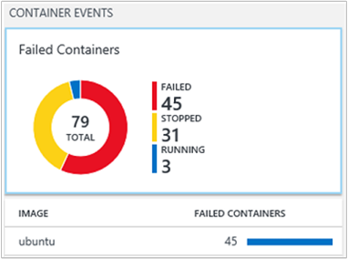
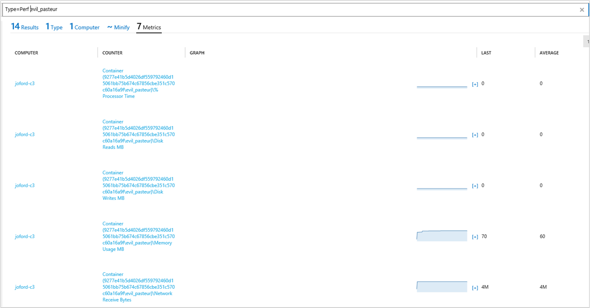

<properties
    pageTitle="Soluzione contenitori in Log Analitica | Microsoft Azure"
    description="La soluzione contenitori in Log Analitica consente di visualizzare e gestire l'host contenitore Docker in un'unica posizione."
    services="log-analytics"
    documentationCenter=""
    authors="bandersmsft"
    manager="jwhit"
    editor=""/>

<tags
    ms.service="log-analytics"
    ms.workload="na"
    ms.tgt_pltfrm="na"
    ms.devlang="na"
    ms.topic="article"
    ms.date="10/10/2016"
    ms.author="banders"/>


# <a name="containers-preview-solution-log-analytics"></a>Soluzione contenitori (Preview) Analitica Log

In questo articolo viene descritto come configurare e usare la soluzione contenitori nel Log Analitica, che consente di visualizzare e gestire l'host contenitore Docker in un'unica posizione. Docker è un sistema di virtualizzazione software utilizzato per creare contenitori che consentono di automatizzare la distribuzione di software in infrastruttura IT.

Con la soluzione, è possibile visualizzare i contenitori sono in esecuzione sull'host contenitore e le immagini in esecuzione nei contenitori. È possibile visualizzare informazioni di controllo che mostra i comandi usati con contenitori. Inoltre, è possibile risolvere i contenitori per visualizzare ed eseguire ricerche log centralizzati senza la necessità di visualizzare in remoto host Docker. È possibile trovare i contenitori che possono essere disturbate e il consumo risorse in eccesso su un host. E, è possibile visualizzare centralizzata CPU, memoria, lo spazio di archiviazione e informazioni sull'uso e le prestazioni di rete per i contenitori.

## <a name="installing-and-configuring-the-solution"></a>Installare e configurare la soluzione

Utilizzare le informazioni seguenti per installare e configurare la soluzione.

Aggiungere la soluzione contenitori nell'area di lavoro OMS usando la procedura descritta nella sezione [aggiungere Analitica Log soluzioni dalla raccolta soluzioni](log-analytics-add-solutions.md).

Esistono due modi per installare e usare Docker con OMS:

- Nei sistemi operativi Linux supportati, installare ed eseguire Docker e quindi installare e configurare agente OMS per Linux
- In CoreOS, installare ed eseguire Docker e quindi configurare OMSAgent per l'esecuzione all'interno di un contenitore

Esaminare le versioni di sistemi operativi Docker e Linux supportate per l'host contenitore in [GitHub](https://github.com/Microsoft/OMS-docker).

>[AZURE.IMPORTANT] Docker deve essere in esecuzione **prima** di installare l' [Agente OMS per Linux](log-analytics-linux-agents.md) su host il contenitore. Se è già stato installato l'agente prima di installare Docker, sarà necessario reinstallare l'agente OMS per Linux. Per ulteriori informazioni su Docker, vedere il [sito Web Docker](https://www.docker.com).

È necessario le seguenti impostazioni configurate nell'host contenitore prima di poter monitorare contenitori.

## <a name="configure-settings-for-the-linux-container-host"></a>Configurare le impostazioni per l'host del contenitore Linux

Dopo aver installato Docker, utilizzare le seguenti impostazioni per l'host contenitore per configurare l'agente per l'utilizzo con Docker. CoreOS non supporta questo metodo di configurazione.

### <a name="to-configure-settings-for-the-container-host---systemd-suse-opensuse-centos-7x-rhel-7x-and-ubuntu-15x-and-higher"></a>Per configurare le impostazioni per l'host contenitore - systemd (SUSE, openSUSE, CentOS 7. x, RHEL 7. x e Ubuntu 15.x e versioni successive)

1. Modificare docker.service per aggiungere le operazioni seguenti:

    ```
    [Service]
    ...
    Environment="DOCKER_OPTS=--log-driver=fluentd --log-opt fluentd-address=localhost:25225"
    ...
    ```

2. Aggiungere $DOCKER\_acconsentire in modo ESPLICITO &quot;daemon = / usr/bin/docker ExecStart&quot; nel file docker.service. Utilizzando l'esempio seguente.

    ```
    [Service]
    Environment="DOCKER_OPTS=--log-driver=fluentd --log-opt fluentd-address=localhost:25225"
    ExecStart=/usr/bin/docker daemon -H fd:// $DOCKER_OPTS
    ```

3. Riavviare il servizio Docker. Per esempio:

    ```
    sudo systemctl restart docker.service
    ```

### <a name="to-configure-settings-for-the-container-host---upstart-ubuntu-14x"></a>Per configurare le impostazioni per l'host contenitore - Upstart (Ubuntu 14.x)

1. Modificare /etc/default/docker e aggiungere quanto segue:

    ```
    DOCKER_OPTS="--log-driver=fluentd --log-opt fluentd-address=localhost:25225"
    ```

2. Salvare il file e quindi riavviare i servizi Docker e OMS.

    ```
    sudo service docker restart
    ```

### <a name="to-configure-settings-for-the-container-host---amazon-linux"></a>Per configurare le impostazioni per l'host contenitore - Linux Amazon

1. Modificare /etc/sysconfig/docker e aggiungere quanto segue:

    ```
    OPTIONS="--log-driver=fluentd --log-opt fluentd-address=localhost:25225"
    ```

2. Salvare il file e quindi riavviare il servizio Docker.

    ```
    sudo service docker restart
    ```

## <a name="configure-settings-for-coreos-containers"></a>Configurare le impostazioni per i contenitori CoreOS

Dopo aver installato Docker, utilizzare le seguenti impostazioni per CoreOS per eseguire Docker e creare un contenitore. È possibile utilizzare qualsiasi versione supportata di Linux, tra cui CoreOS, con questo metodo di configurazione. È necessario l' [ID di area di lavoro OMS e dei tasti](log-analytics-linux-agents.md).

### <a name="to-use-oms-for-all-containers-with-coreos"></a>Usare OMS per tutti i contenitori con CoreOS

- Avviare il contenitore OMS che si desidera eseguire il monitoraggio. Modificare e utilizzare l'esempio seguente.

  ```
sudo docker run --privileged -d -v /var/run/docker.sock:/var/run/docker.sock -e WSID="your workspace id" -e KEY="your key" -h=`hostname` -p 127.0.0.1:25224:25224/udp -p 127.0.0.1:25225:25225 --name="omsagent" --log-driver=none --restart=always microsoft/oms
```

### <a name="switching-from-using-an-installed-agent-to-one-in-a-container"></a>Passaggio da utilizzando un agente installato a uno in un contenitore

Se in precedenza è utilizzato l'agente installato direttamente e si desidera utilizzare un agente in esecuzione in un contenitore, è necessario rimuovere OMSAgent. Vedere i [passaggi per installare l'agente OMS per Linux](https://github.com/Microsoft/OMS-Agent-for-Linux/blob/master/docs/OMS-Agent-for-Linux.md).

## <a name="containers-data-collection-details"></a>Dettagli di raccolta dati contenitori

Soluzione contenitori raccoglie vari dati sulle prestazioni metriche e log dal contenitore host e contenitori utilizzando agenti OMS per Linux che è stata attivata e da OMSAgent in esecuzione in contenitori.

Nella tabella seguente mostra i metodi di raccolta dati e altri dettagli sulle modalità di raccolta dati per i contenitori.

| piattaforma | Agente OMS per Linux | Agente SCOM | Spazio di archiviazione Azure | SCOM necessari? | Dati di agente SCOM inviati tramite il gruppo di gestione | frequenza di raccolta |
|---|---|---|---|---|---|---|
|Linux||||            || ogni 3 minuti|


Nella tabella seguente mostra esempi dei tipi di dati raccolti dal soluzione contenitori:

| Tipo di dati | Campi |
| --- | --- |
| Prestazioni di host e contenitori | Computer, nome oggetto, CounterName & #40; % tempo processore, disco legge MB, disco scrive MB, MB l'utilizzo della memoria, byte ricevuti Network, rete inviare byte, processore sec l'utilizzo, rete & #41; CounterValue, TimeGenerated, CounterPath, SourceSystem |
| Inventario contenitore | TimeGenerated, Computer, il nome del contenitore ContainerHostname, immagini, ImageTag, ContinerState, codice di uscita, EnvironmentVar, comando, CreatedTime, StartedTime, FinishedTime, SourceSystem, ID contenitore e ID immagini |
| Inventario immagine contenitore | TimeGenerated, Computer, immagini, ImageTag, ImageSize, assuma, è in esecuzione, in pausa, arrestato, non è riuscita, SourceSystem, ID immagini, TotalContainer |
| Registro contenitore | TimeGenerated, Computer, ID immagine e il nome del contenitore LogEntrySource, LogEntry, SourceSystem, ID contenitore |
| Registro del servizio contenitore | TimeGenerated, Computer, TimeOfCommand, immagine, comando, SourceSystem, ID contenitore |

## <a name="monitor-containers"></a>Monitor contenitori

Dopo avere ottenuto la soluzione abilitata nel portale di OMS, verrà visualizzato il riquadro di **contenitori** con informazioni di riepilogo l'host contenitore e contenitori in esecuzione in host.


Il riquadro viene visualizzata una panoramica della contenitori quanti avere l'ambiente e se è impossibile, in esecuzione o meno.

### <a name="using-the-containers-dashboard"></a>Tramite il dashboard di contenitori

Fare clic sul riquadro **contenitori** . Da tale posizione verranno visualizzati organizzate per visualizzazioni:

- Eventi contenitore
- Errori
- Stato di contenitori
- Contenitore immagine inventario
- Prestazioni della CPU e memoria

Ogni riquadro nel dashboard è una rappresentazione visiva di una ricerca da eseguita sui dati raccolti.


In e il **Contenitore stato** , fare clic su area superiore, come illustrato di seguito.


Verrà visualizzata la finestra di ricerca dei registri, la visualizzazione di informazioni host e contenitori in esecuzione.


Da qui è possibile modificare la query di ricerca per modificarlo per trovare informazioni specifiche che interessa. Per ulteriori informazioni sulle Log ricerche, vedere [Log ricerche nel registro Analitica](log-analytics-log-searches.md).

Ad esempio, è possibile modificare la query di ricerca in modo che visualizza tutti i contenitori arrestati anziché i contenitori di esecuzione modificando **in esecuzione** su **arrestato** nella query di ricerca.

## <a name="troubleshoot-by-finding-a-failed-container"></a>Risoluzione dei problemi mediante la ricerca di un contenitore non riuscito

OMS contrassegna un contenitore **Failed** se è terminato con un codice di uscita diverso da zero. È possibile visualizzare una panoramica degli errori e gli errori nell'ambiente in e il **Failed contenitori** .

### <a name="to-find-failed-containers"></a>Per trovare i contenitori non riusciti

1. Fare clic su e il **Contenitore eventi** .  
  
2. Verrà visualizzata la finestra di ricerca dei registri, visualizzare lo stato della contenitori, simili al seguente.  
  
3. Scegliere quindi il valore di errore per visualizzare informazioni aggiuntive, ad esempio dimensioni dell'immagine e il numero di immagini arrestate e non riuscite. Espandere **Mostra altre** per visualizzare l'ID dell'immagine.  
  
4. Successivamente, trovare il contenitore in cui è in esecuzione in questa figura. Digitare quanto segue nella query di ricerca.
  `Type=ContainerInventory <ImageID>`Consente di visualizzare i log. È possibile scorrere per visualizzare il contenitore non riuscito.  
  


## <a name="search-logs-for-container-data"></a>Registri ricerca per i dati contenitore

Quando si sta risolvendo un errore specifico, può essere utile in cui si sta verificando nel proprio ambiente. I tipi di registro seguenti consentono di creare query per restituire le informazioni desiderate.

- **ContainerInventory** : utilizzare questo tipo se si desiderano informazioni sul percorso contenitore, quali sono i nomi e quali immagini sono in esecuzione.
- **ContainerImageInventory** : utilizzare questo tipo se si sta tentando di trovare informazioni ordinati per immagine e per visualizzare le informazioni sull'immagine, ad esempio immagine ID o dimensioni.
- **ContainerLog** : utilizzare questo tipo quando si desidera trovare voci e informazioni sul registro errori specifici.
- **ContainerServiceLog** : utilizzare questo tipo quando si tenta di trovare informazioni audit trail per daemon Docker, ad esempio inizio, tabulazioni, Elimina o pull comandi.

### <a name="to-search-logs-for-container-data"></a>La ricerca dei registri per i dati contenitore

- Scegliere un'immagine che si è certi ha avuto esito negativo recente e cercare i log degli errori. È necessario innanzitutto individuare il nome di un contenitore che esegue l'immagine con una ricerca **ContainerInventory** . Ad esempio, cercare`Type=ContainerInventory ubuntu Failed`  
    

  Prendere nota del nome del contenitore accanto al **nome**e cercare i registri. In questo esempio è `Type=ContainerLog adoring_meitner`.

**Visualizzare le informazioni delle prestazioni**

Quando si è iniziato a creare query, può essere utile per vedere ciò che è possibile prima di tutto. Ad esempio, per visualizzare tutti i dati sulle prestazioni, provare a una query ampia digitando la query di ricerca seguente.

```
Type=Perf
```


Quando si fa clic sulla parola **metriche** nei risultati della, si può vedere questo in un modulo di elementi grafico.


È possibile definire l'ambito di dati sulle prestazioni che viene visualizzato per uno specifico contenitore digitando il nome che ne a destra della query.

```
Type=Perf <containerName>
```

Che mostra l'elenco di indicatori di prestazioni che sono stati raccolti per un singolo contenitore.



## <a name="example-log-search-queries"></a>Query di ricerca del Registro di esempio

Può essere utile creare query partendo da un esempio o due e modificarli per adattare l'ambiente. Come punto di partenza, è possibile sperimentare e il **Degni di nota query** consentono di creare query più avanzate.


## <a name="saving-log-search-queries"></a>Query di ricerca di salvataggio dei log

Salvataggio di query è una funzionalità standard in Log Analitica. Salvando i file, è necessario che è stato trovato utile comodo per utilizzi futuri.

Dopo aver creato una query che utili, salvarlo facendo clic su **Preferiti** nella parte superiore della pagina di ricerca di Log. Quindi è possibile accedervi facilmente in un secondo momento dalla pagina **Dashboard personali** .

## <a name="next-steps"></a>Passaggi successivi

- [Registri ricerca](log-analytics-log-searches.md) per visualizzare record di dati di dettaglio contenitore.
