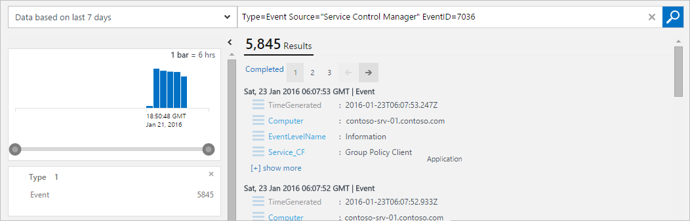
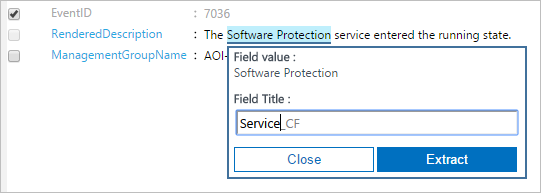
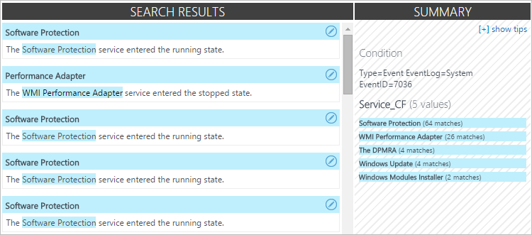
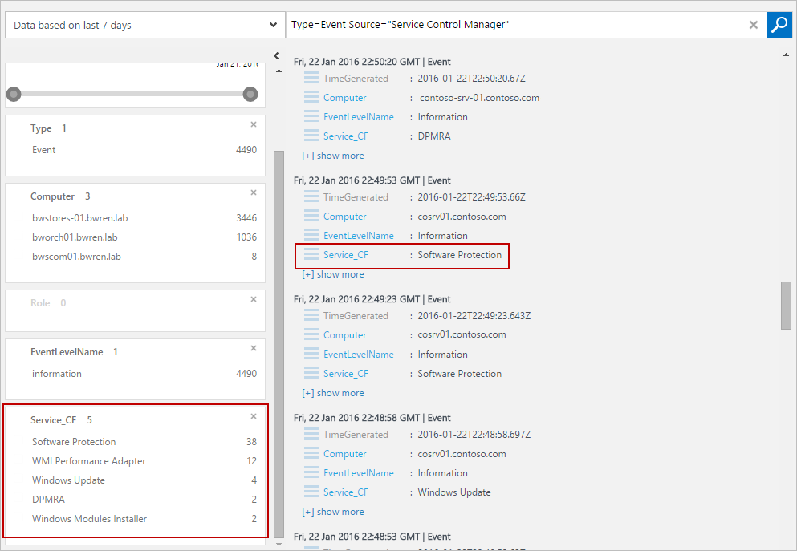

<properties
   pageTitle="Campi personalizzati in Log Analitica | Microsoft Azure"
   description="La funzionalità di campi personalizzati del registro Analitica consente di creare campi che supportano le ricerche dai dati OMS aggiungere le proprietà di un record raccolto.  In questo articolo viene descritto il processo per creare un campo personalizzato e una descrizione dettagliata con un evento di esempio."
   services="log-analytics"
   documentationCenter=""
   authors="bwren"
   manager="jwhit"
   editor="tysonn" />
<tags
   ms.service="log-analytics"
   ms.devlang="na"
   ms.topic="article"
   ms.tgt_pltfrm="na"
   ms.workload="infrastructure-services"
   ms.date="10/18/2016"
   ms.author="bwren" />

# Campi personalizzati in Analitica Log

La funzionalità di **Campi personalizzati** del registro Analitica consente di estendere record esistenti nel repository OMS mediante l'aggiunta di campi personalizzati che supportano le ricerche.  Campi personalizzati vengono inserite automaticamente quelle dati estratti da altre proprietà nello stesso record.

Ad esempio, il record di esempio seguente contiene dati utili passare inosservati nella descrizione dell'evento.  Estrazione di dati in proprietà separate rende disponibile ad esempio ordinamento e filtro.

>[AZURE.NOTE] In anteprima, è limitato a 100 campi personalizzati nell'area di lavoro.  Questo limite si espande quando questa caratteristica raggiunge disponibilità generale.

## Creazione di un campo personalizzato

Quando si crea un campo personalizzato, è necessario Log Analitica comprendere i dati da utilizzare per popolare il relativo valore.  Viene utilizzata una tecnologia da Microsoft Research chiamato FlashExtract per identificare rapidamente i dati.  Invece di dover fornire istruzioni esplicite, Log Analitica Impara sui dati che si desidera estrarre esempi forniti.

Le sezioni seguenti offrono la procedura per la creazione di un campo personalizzato.  Nella parte inferiore di questo articolo è una procedura dettagliata di un'estrazione di esempio.

> [!NOTE] Il campo personalizzato viene popolato quando i record corrispondenti ai criteri specificati vengono aggiunti all'archivio dati OMS, in modo che viene visualizzata solo nei record raccolti dopo aver creato il campo personalizzato.  Il campo personalizzato non verrà aggiunti al record già presenti nell'archivio dati quando viene creato.

### Passaggio 1: identificare i record contenenti il campo personalizzato
Il primo passaggio consiste nel identificare i record che verranno visualizzato il campo personalizzato.  Iniziare con una [ricerca dei registri standard](log-analytics-log-searches.md) e quindi selezionare un record da usare come modello di Log Analitica verranno fornite informazioni da.  Quando si specifica che si desidera estrarre i dati in un campo personalizzato, il **Campo Estrazione guidata** viene aperto in cui convalidare e perfezionare i criteri.

2. Passare alla **Ricerca di Log** e utilizzare una [query per recuperare i record](log-analytics-log-searches.md) contenenti il campo personalizzato.
2. Selezionare un record Analitica registro utilizzerà funga da un modello per l'estrazione dei dati per compilare il campo personalizzato.  Sarà possibile identificare i dati che si desidera estrarre da questo record e Analitica registro utilizzerà queste informazioni per determinare la logica per compilare il campo personalizzato per tutti i record analoghi.
3. Fare clic sul pulsante a sinistra di qualsiasi proprietà di testo del record e selezionare **campi da estrarre**.
4. L' **campo Estrazione guidata viene aperto**e il record è stato selezionato viene visualizzato nella colonna **Esempio principale** .  Il campo personalizzato verrà definito per i record con gli stessi valori di proprietà che siano selezionate.  
5. Se la selezione è possibile individuare quello desiderato, selezionare campi aggiuntivi per limitare i criteri.  Per modificare i valori dei campi per i criteri, è necessario annullare e selezionare un altro record corrispondenti ai criteri desiderato.

### Passaggio 2: eseguire estratto iniziale.
Dopo aver identificato i record contenenti il campo personalizzato, è identificare i dati che si desidera estrarre.  Analitica registro utilizzerà queste informazioni per identificare modelli simili nei record analoghe.  Nel passaggio dopo sarà possibile convalidare i risultati e fornire ulteriori dettagli per Analitica Log da utilizzare nell'analisi.

1. Evidenziare il testo del record di esempio che si desidera inserire il campo personalizzato.  Verrà visualizzata la finestra di dialogo per specificare un nome per il campo ed eseguire l'estratto iniziale.  I caratteri ** \_CF** verrà aggiunto automaticamente.
2. Fare clic su **Estrai** per eseguire un'analisi delle raccolte record.  
3. Le sezioni di **Riepilogo** e **I risultati di ricerca** visualizzano i risultati dell'estratto in modo che è possibile controllare la precisione.  **Riepilogo** consente di visualizzare i criteri utilizzati per identificare i record e un numero per ognuno dei valori di dati identificati.  **Risultati della ricerca** comprende un elenco dettagliato dei record corrispondenti ai criteri.

### Passaggio 3: verificare l'accuratezza dell'estratto e creare campi personalizzati

Dopo aver eseguito l'estratto iniziale, Log Analitica visualizzerà i risultati in base ai dati che sono già stati raccolti.  Se i risultati aspetto accurati è possibile creare il campo personalizzato senza ulteriore lavoro.  In caso contrario, quindi perfezionare i risultati in modo che Analitica Log consente di migliorare la logica.

2.  Se i valori iniziale estratto non sono corretti, fare clic sull'icona **Modifica** accanto a un record accurato e selezionare **Modifica questa evidenziazione** per modificare la selezione.
3.  La voce viene copiata alla sezione **altri esempi** di sotto dell' **Esempio principale**.  È possibile modificare l'evidenziazione di seguito per facilitare la selezione che avrebbe dovuto Log Analitica.
4.  Fare clic su **Estrai** per usare queste nuove informazioni per restituire tutti i record esistenti.  I risultati possono essere modificati per i record diverso da quello che appena modificato in base a questa intelligence nuovo.
5.  Continuare ad aggiungere correzioni fino a quando tutti i record estratto identificano correttamente i dati per popolare il nuovo campo personalizzato.
6. Quando si è soddisfatti del risultato, fare clic su **Salva Estrai** .  Il campo personalizzato ora è definito, ma non è possibile aggiungerlo a qualsiasi record ancora.
7.  Attendere per i nuovi record corrispondenti ai criteri specificati per raccolte e quindi eseguire di nuovo la ricerca di log. Nuovi record deve avere il campo personalizzato.
8.  Utilizzare il campo personalizzato come per qualsiasi altra proprietà record.  È possibile utilizzare per aggregati e raggruppare i dati e usarlo anche per generare nuove informazioni.

## Visualizzare i campi personalizzati
È possibile visualizzare un elenco di tutti i campi personalizzati del gruppo di gestione dal riquadro **Impostazioni** del dashboard OMS.  Selezionare i **dati** e quindi **campi personalizzati** per un elenco di tutti i campi personalizzati nell'area di lavoro.  

## Rimozione di un campo personalizzato
Esistono due modi per rimuovere un campo personalizzato.  Il primo è l'opzione **Rimuovi** per ogni campo quando si visualizza l'elenco completo, come descritto in precedenza.  Altro metodo consiste nel recuperare un record e fare clic sul pulsante a sinistra del campo.  Menu di scelta avrà un'opzione per rimuovere il campo personalizzato.

## Esempio di procedura dettagliata

La sezione seguente illustra un esempio di completamento della creazione di un campo personalizzato.  In questo esempio estrae il nome del servizio in eventi di Windows che indicano un servizio di modifica stato.  Questa operazione si basa sugli eventi creati tramite Gestione controllo servizi nel Registro di sistema in un computer Windows.  Se si vuole seguire questo esempio, è necessario essere [la raccolta degli eventi di informazioni per il Registro di sistema](log-analytics-data-sources-windows-events.md).

Abbiamo immettere la query seguente per restituire tutti gli eventi da Gestione controllo servizi che dispone di un ID evento 7036 che è l'evento che indica un servizio di avvio o arresto.

È quindi selezionare qualsiasi record con evento ID 7036.

Si vuole che il nome del servizio che viene visualizzato nella proprietà **RenderedDescription** e seleziona il pulsante accanto a questa proprietà.

I campi di **registro eventi** ed **EventID** sono selezionati **nell'Esempio principali** la colonna **Campo Estrazione guidata** è aperto.  Indica la definizione di campo personalizzato per gli eventi del Registro di sistema con un ID evento 7036.  Questo è sufficiente in modo che non è necessario selezionare tutti gli altri campi.

Abbiamo evidenziare il nome del servizio nella proprietà **RenderedDescription** e utilizzare **il servizio** per identificare il nome del servizio.  Il campo personalizzato verrà chiamato **Service_CF**.

È possibile vedere che il nome del servizio viene identificato correttamente per alcuni record, ma non per altri utenti.   Che non è stata selezionata l'opzione parte del nome per la **Scheda WMI Performance** Mostra i **Risultati della ricerca** .  **Riepilogo** vengono visualizzati quattro record con il servizio **DPRMA** incluso in modo non corretto una parola aggiuntiva che due record identificato **Moduli Installer** invece di **Moduli di Windows Installer**.  

Iniziamo con il record **Scheda WMI Performance** .  È sceglierne l'icona di modifica e quindi **Modifica questa evidenziazione**.  

Aumentare l'evidenziazione per includere la parola **WMI** e quindi eseguire di nuovo l'estratto.  

È possibile vedere che le voci per **Scheda WMI Performance** sono stati corretti e Log Analitica che le informazioni vengono utilizzate anche per correggere il record di **Windows Installer di modulo**.  È possibile vedere la sezione di **Riepilogo** se tale **DPMRA** è ancora non viene identificata in modo corretto.

Abbiamo scorrere fino a un record con il servizio DPMRA e utilizzare lo stesso processo per correggere il record.

 Quando si esegue l'estrazione, è possibile vedere che tutti i risultati siano ora corrette.

È possibile vedere che **Service_CF** viene creato ma non ancora aggiunta a tutti i record.

Al termine del tempo che new eventi sono stati raccolti, è possibile vedere che che il campo **Service_CF** a questo punto è stata aggiunta al record che soddisfano i criteri.

È ora possibile utilizzare il campo personalizzato come per qualsiasi altra proprietà record.  A questo scopo, viene creata una query che raggruppa per il nuovo campo di **Service_CF** per controllare quali servizi sono più attive.

## Passaggi successivi

- Informazioni sulle [ricerche dei registri](log-analytics-log-searches.md) creare query utilizzando i campi personalizzati per i criteri.
- Monitorare i [file di log personalizzati](log-analytics-data-sources-custom-logs.md) che analizzano utilizzando campi personalizzati.