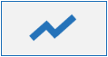
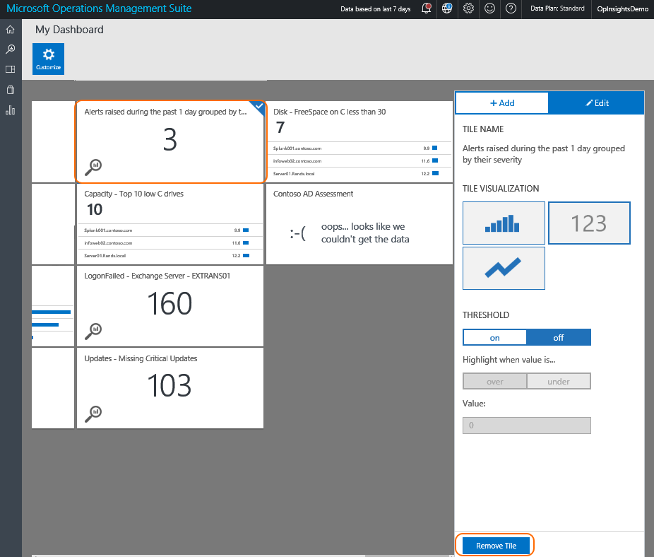

<properties
    pageTitle="Creare un dashboard personalizzato in Log Analitica | Microsoft Azure"
    description="Questa Guida aiuta capire come Log Analitica dashboard di visualizzare tutte le ricerche registro salvato, assegnando un singolo obiettivo per visualizzare l'ambiente."
    services="log-analytics"
    documentationCenter=""
    authors="bandersmsft"
    manager="jwhit"
    editor=""/>

<tags
    ms.service="log-analytics"
    ms.workload="na"
    ms.tgt_pltfrm="na"
    ms.devlang="na"
    ms.topic="article"
    ms.date="10/10/2016"
    ms.author="banders"/>

# Creare un dashboard personalizzato in Analitica Log

Questa Guida aiuta capire come dashboard Analitica Log di visualizzare tutte le ricerche registro salvato, assegnare un singolo obiettivo per visualizzare l'ambiente.

Sono disponibili nell'App Mobile OMS anche tutti i dashboard personalizzati creati nel portale di OMS. Vedere le pagine seguenti per ulteriori informazioni sull'app.

- [App per dispositivi mobili OMS da Microsoft Store](http://www.windowsphone.com/store/app/operational-insights/4823b935-83ce-466c-82bb-bd0a3f58d865)
- [App per dispositivi mobili OMS da iTunes Apple](https://itunes.apple.com/app/microsoft-operations-management/id1042424859?mt=8)

## Creazione di dashboard

Per iniziare, passare alla pagina Panoramica OMS. Verrà visualizzato il riquadro **Risorse del Dashboard** a sinistra. Fare clic su per eseguire il drill-nel dashboard.

## Aggiunta di un riquadro

In dashboard, le sezioni sono gestite per le ricerche registro salvato. OMS viene fornito con molti già pronti ricerche registro salvato, in modo che è possibile iniziare subito. Usare i passaggi seguenti che consentono di iniziare.

Nella visualizzazione Dashboard personale, è sufficiente fare clic su **Personalizza** immettere personalizzare la modalità.

 Riquadro che viene visualizzata sul lato destro della pagina sono elencate le ricerche registro salvato dell'area di lavoro. Per visualizzare una ricerca registro salvato come un riquadro, passare il mouse su una ricerca salvata e quindi fare clic sul simbolo **più** .

Quando si fa clic sul simbolo **più** , viene visualizzata una nuova sezione nella visualizzazione Dashboard personali.

## Modificare un riquadro

Nella visualizzazione Dashboard personale, è sufficiente fare clic su **Personalizza** immettere personalizzare la modalità. Fare clic sul riquadro che si desidera modificare. Le modifiche pannello destro da modificare e offre una gamma di opzioni:

### Visualizzazioni di sezione#
Esistono tre tipi di visualizzazioni di sezione per scegliere da:

|tipo di grafico|risultato|
|---|---|
||Visualizza una cronologia dei risultati della ricerca registro salvato come un grafico a barre o un elenco dei risultati in base a un campo in base se la ricerca di log aggrega i risultati in base a un campo o meno.
||Consente di visualizzare i risultati di risultato log totale espresso in numeri in una sezione. Riquadri metrici consentono di impostare una soglia che evidenzia il riquadro quando viene raggiunta la soglia.|
||Visualizza una sequenza temporale delle occorrenze di risultato ricerca registro salvato con i valori in un grafico a linee.|

### Soglia
È possibile creare una soglia in un riquadro usando la visualizzazione metrica. Selezionare per creare un valore di soglia nel riquadro. Scegliere se si desidera evidenziare il riquadro quando il valore è superiore o inferiore del limite selezionato, quindi imposta il valore di soglia riportata di seguito.

## Organizzare il dashboard
Per organizzare il dashboard, passare alla visualizzazione Dashboard personale e fare clic su **Personalizza** immettere personalizzare la modalità. Fare clic e trascinare il riquadro che si desidera spostare e spostarla nella posizione desiderata nel riquadro a.

## Rimuovere un riquadro
Per rimuovere un riquadro, passare alla visualizzazione Dashboard personale e fare clic su **Personalizza** immettere personalizzare la modalità. Selezionare il riquadro che si desidera rimuovere, quindi scegliere **Rimuovi riquadro**Pannello di destra.

## Passaggi successivi

- Consente di creare [avvisi](log-analytics-alerts.md) nel registro Analitica per generare le notifiche e per la risoluzione dei problemi.
