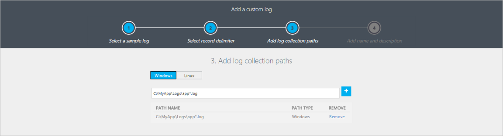

<properties 
   pageTitle="Log personalizzati nel registro Analitica | Microsoft Azure"
   description="Registro Analitica può raccogliere gli eventi da file di testo in un computer Windows e Linux.  In questo articolo viene descritto come definire un nuovo log personalizzato e dettagli dei record che creano repository OMS."
   services="log-analytics"
   documentationCenter=""
   authors="bwren"
   manager="jwhit"
   editor="tysonn" />
<tags 
   ms.service="log-analytics"
   ms.devlang="na"
   ms.topic="article"
   ms.tgt_pltfrm="na"
   ms.workload="infrastructure-services"
   ms.date="10/18/2016"
   ms.author="bwren" />

# Log personalizzati nel registro Analitica

L'origine dati di log personalizzati nel registro Analitica consente di raccogliere eventi da file di testo in un computer Windows e Linux. Molte applicazioni registrare le informazioni in file di testo invece di servizi di registrazione standard, ad esempio registro eventi di Windows o Registro di sistema.  Una volta raccolte, è possibile analizzare ogni record nel log nei singoli campi mediante la funzionalità di [Campi personalizzati](log-analytics-custom-fields.md) di Log Analitica.

I file di log da raccogliere devono soddisfare i criteri seguenti.

- Il registro deve disporre di una sola voce per riga o utilizzare un timestamp che corrisponde a uno dei seguenti formati all'inizio di ogni voce.

    GG / MM-AAAA HH  
  DD/MM/YYYY HH.MM: SS AM/PM  
  LUN gg, aaaa hh
    
- File di log deve non consentire aggiornamenti circolari nel punto in cui il file viene sovrascritta con le nuove voci. 

## Definizione di un file di log personalizzato

Utilizzare la procedura seguente per definire un file di log personalizzato.  Scorrere fino alla fine di questo articolo per una procedura dettagliata di un campione di aggiunta di un file di log personalizzato.

### Passaggio 1. Aprire la procedura guidata Log personalizzato

La creazione guidata Registro personalizzata viene eseguita nel portale di OMS e consente di definire un nuovo log personalizzato per la raccolta.

1.  Nel portale OMS, passare a **Impostazioni**.
2.  Fare clic su **dati** e quindi **log personalizzati**.
3.  Per impostazione predefinita, tutte le modifiche di configurazione vengono automaticamente spostate a tutti gli agenti.  Per gli agenti Linux, viene inviato un file di configurazione per la raccolta di dati Fluentd.  Se si desidera modificare il file manualmente in ogni agente Linux, quindi deselezionare la casella *Applica di sotto configurazione a computer Linux*.
4.  Fare clic su **Aggiungi +** per aprire la creazione guidata Registro personalizzata.

### Passaggio 2. Caricare e analizzare i log di esempio

È necessario innanzitutto il caricamento di un campione del log personalizzato.  La procedura guidata verrà analizzare e visualizzare le voci in questo file da convalidare.  Analitica registro utilizzerà il delimitatore specificato per identificare ogni record.

**Nuova riga** è il delimitatore predefinito e viene utilizzata per i file di log con una sola voce per riga.  Se la riga inizia con una data e ora in uno dei formati disponibili, è possibile specificare un delimitatore **Timestamp** che supporta le voci che si estendono su più di una riga. 

Se si utilizza un delimitatore timestamp, la proprietà TimeGenerated di ogni record memorizzato nella OMS verrà popolata con data/ora specificata per tale voce nel file di log.  Se si utilizza un nuovo delimitatore di riga, TimeGenerated viene popolata con data e ora che Analitica Log raccolti la voce. 

>[AZURE.NOTE]Registro Analitica considera attualmente raccolta da un file di log mediante un delimitatore timestamp come UTC di data/ora.  Non appena verranno modificato per utilizzare il fuso orario dell'agente. 
 
1.  Fare clic su **Sfoglia** e selezionare un file di esempio.  Si noti che questo potrebbe pulsante potrebbero essere denominato **Selezionare il File** in alcuni browser.
2.  Fare clic su **Avanti**. 
3.  Personalizzato Log verrà caricare il file e i record che identifica i dell'elenco.
4.  Modificare il delimitatore utilizzato per identificare un nuovo record e selezionare il delimitatore che meglio identifica i record nel file di log.
5.  Fare clic su **Avanti**.

### Passaggio 3. Aggiungere i percorsi insieme log

È necessario definire uno o più percorsi dell'agente nel punto in cui è possibile individuare il log personalizzato.  Possibile fornire un percorso specifico e un nome per il file di log, oppure è possibile specificare un percorso con un carattere jolly per il nome.  Supporta le applicazioni di creare un nuovo file ogni giorno o quando un file raggiunge una certa dimensione.  È anche possibile fornire più percorsi per un singolo file di log.

Ad esempio, un'applicazione potrebbe creare un file di log ogni giorno con la data inclusa nel nome come log20100316.txt. Un modello per un file di log potrebbe essere *log\*txt* che si applicano a qualsiasi file di log dopo l'applicazione di denominazione.

Nella tabella seguente vengono forniti esempi di criteri per specificare i file di log. 

| Descrizione | Percorso |
|:--|:--|
| Tutti i file in *C:\Logs* con estensione txt agente di Windows | C:\Logs\\\*. txt |
| Tutti i file in *C:\Logs* il cui nome inizia con estensione txt agente di Windows e registro | C:\Logs\log\*. txt |
| Tutti i file in */var/log/audit* con estensione txt agenti Linux | /var/log/audit/*.txt |
| Tutti i file in */var/log/audit* il cui nome inizia con estensione txt agente Linux e registro | /var/log/audit/log\*. txt |
  

1.  Selezionare Windows o Linux per specificare il formato del percorso si sta aggiungendo.
2.  Digitare il percorso e fare clic sul **+** pulsante.
3.  Ripetere la procedura per gli eventuali altri percorsi.

### Passaggio 4. Specificare un nome e una descrizione per il log

Il nome specificato verrà utilizzato per il tipo di log come descritto in precedenza.  Sempre terminerà con _CL per distinguere come un file di log personalizzato.

1.  Digitare un nome per il log.  Il ** \_CL** suffisso viene fornito automaticamente.
2.  Aggiungere una **Descrizione**facoltativa.
3.  Fare clic su **Avanti** per salvare la definizione di log personalizzato.

### Passaggio 5. Convalidare che vengono raccolti i log personalizzati
Richiedono in un'ora per i dati iniziali da un nuovo log personalizzato all'interno del registro Analitica.  Verrà avviata la raccolta di voci dai log nei percorso specificato dal punto d' definito log personalizzato.  Non manterrà i movimenti che è stata caricata durante la creazione di log personalizzato, ma saranno raccolti i movimenti già esistenti nei file di log individua.

Una volta Analitica Log si avvia la raccolta dal log personalizzato, relativi record sarà disponibili con una ricerca di Log.  Usare il nome assegnato log personalizzato come **tipo** nella query.

>[AZURE.NOTE] Se la proprietà RawData manca dalla ricerca, è necessario chiudere e riaprire il browser.

### Passaggio 6. Analizzare le voci di log personalizzato

La voce intero log verrà archiviata in una sola proprietà denominata **RawData**.  È probabile che si desideri separare i diversi elementi di informazioni in ogni voce in singole proprietà memorizzato nel record.  Eseguire questa operazione utilizzando la funzionalità di [Campi personalizzati](log-analytics-custom-fields.md) del registro Analitica.

Non vengono forniti i passaggi dettagliati per analisi la voce di log personalizzato.  Fare riferimento alla documentazione di [Campi personalizzati](log-analytics-custom-fields.md) per queste informazioni.

## La disattivazione di un file di log personalizzato

È possibile rimuovere una definizione di log personalizzato dopo averla creata, ma è possibile disabilitare mediante la rimozione di tutti i percorsi la raccolta.

1.  Nel portale OMS, passare a **Impostazioni**.
2.  Fare clic su **dati** e quindi **log personalizzati**.
3.  Accanto alla definizione log personalizzato per disabilitare, fare clic su **Dettagli** .
4.  Rimuovere tutti i percorsi insieme per la definizione di log personalizzato.

## Raccolta di dati

Registro Analitica raccoglie le nuove voci da ogni log personalizzato circa ogni 5 minuti.  L'agente registra la posizione in ogni file di log raccolti dai.  Se l'agente è in linea per un periodo di tempo, quindi Log Analitica raccoglie le voci dall'ultimo libero, anche se sono stati creati i movimenti mentre l'agente non è offline.

Scritta una sola proprietà denominata **RawData**l'intero contenuto della voce del log.  È possibile analizzare in più proprietà che è possibile analizzare e la ricerca separatamente mediante la definizione di [Campi personalizzati](log-analytics-custom-fields.md) dopo aver creato il log personalizzato.

## Proprietà record log personalizzato

Record di log personalizzato hanno un tipo con il nome del log forniti e le proprietà nella tabella seguente.

| Proprietà | Descrizione |
|:--|:--|
| TimeGenerated | Data e ora che il record è stato raccolte da Log Analitica.  Se il registro utilizza un separatore di ora in base a questo è il tempo acquisito dalla voce. |
| SourceSystem  | Tipo di agente il record è stato raccolto da.   OpsManager: agente di Windows, uno dei due pubblicitario connettersi o SCOM   Linux: tutti gli agenti Linux  |
| RawData             | Full-text della voce di raccolte. |
| ManagementGroupName | Nome del gruppo di gestione per gli agenti SCOM.  Per altri agenti, si tratta AOI -\<ID area di lavoro\> |

## Registro ricerche con i record di log personalizzato

I record di log personalizzati sono archiviati nel repository OMS come record da qualsiasi altra origine dati.  Hanno un tipo che corrisponde a quello che fornisce quando si definisce il log in modo che è possibile utilizzare la proprietà tipo esegue la ricerca per recuperare record raccolti da un file di log specifico.

Nella tabella seguente vengono forniti esempi di ricerche log che recuperano record da log personalizzati.

| Query | Descrizione |
|:--|:--|
| Tipo = MyApp_CL | Tutti gli eventi da un oggetto personalizzato accedere MyApp_CL denominato. |
| Tipo = MyApp_CL Severity_CF = errore | Tutti gli eventi da un file di log personalizzato denominato MyApp_CL con un valore di *errore* in un campo personalizzato denominato *Severity_CF*. |

## Esempio di procedura dettagliata dell'aggiunta di un file di log personalizzato

La sezione seguente illustra un esempio di creazione di un file di log personalizzato.  Il log di esempio raccolto ha una sola voce in ogni riga a partire da una data e ora e quindi punto e virgola delimitati campi per codice, stato e messaggi.  Più voci di esempio è illustrate di seguito.

    2016-03-10 01:34:36 207,Success,Client 05a26a97-272a-4bc9-8f64-269d154b0e39 connected
    2016-03-10 01:33:33 208,Warning,Client ec53d95c-1c88-41ae-8174-92104212de5d disconnected
    2016-03-10 01:35:44 209,Success,Transaction 10d65890-b003-48f8-9cfc-9c74b51189c8 succeeded
    2016-03-10 01:38:22 302,Error,Application could not connect to database
    2016-03-10 01:31:34 303,Error,Application lost connection to database

### Caricare e analizzare i log di esempio

Abbiamo specificare uno dei file di log e si può vedere gli eventi che vogliono raccogliere.  Nuova riga in questo caso è sufficiente delimitatore.  Se una sola voce nel log delle potrebbe occupare più righe, quindi un delimitatore timestamp dovrà essere utilizzato.

### Aggiungere i percorsi insieme log

I file di log saranno nella *C:\MyApp\Logs*.  Verrà creato un nuovo file ogni giorno con un nome che include la data nel motivo *appYYYYMMDD.log*.  Un motivo sufficiente per il registro sarebbe *C:\MyApp\Logs\\\*. log*.

### Specificare un nome e una descrizione per il log

Serve un nome di *MyApp_CL* e digitare una **Descrizione**.

### Convalidare che vengono raccolti i log personalizzati

Viene utilizzata una query di *tipo = MyApp_CL* per restituire tutti i record da registro raccolto.

### Analizzare le voci di log personalizzato

Usiamo campi personalizzati per definire *EventTime* *codice*, *stato*e i campi dei *messaggi* ed è possibile vedere la differenza tra i record restituiti dalla query.

## Passaggi successivi

- Utilizzare [I campi personalizzati](log-analytics-custom-fields.md) per analizzare le voci di log personalizzato in singoli campi.
- Informazioni sulle [ricerche dei registri](log-analytics-log-searches.md) analizzare i dati raccolti mediante le soluzioni e le origini dati. 