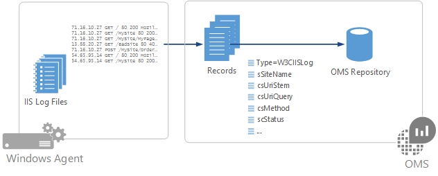

<properties
   pageTitle="LA registrazione in Log Analitica | Microsoft Azure"
   description="Internet Information Services (IIS) archivia le attività dell'utente nel file di log che possono essere raccolti dal Log Analitica.  In questo articolo viene descritto come configurare l'insieme di registri IIS e dettagli dei record che creano repository OMS."
   services="log-analytics"
   documentationCenter=""
   authors="bwren"
   manager="jwhit"
   editor="tysonn" />
<tags
   ms.service="log-analytics"
   ms.devlang="na"
   ms.topic="article"
   ms.tgt_pltfrm="na"
   ms.workload="infrastructure-services"
   ms.date="10/18/2016"
   ms.author="bwren" />

# LA registrazione in Analitica Log
Internet Information Services (IIS) archivia le attività dell'utente nel file di log che possono essere raccolti dal Log Analitica.  

## Configurazione di IIS log
Registro Analitica raccoglie le voci file di log creati da IIS, pertanto è necessario [configurare IIS per l'accesso](https://technet.microsoft.com/library/hh831775.aspx).

Registro Analitica solo supporti i file di log IIS memorizzati in formato W3C e non supporta i campi personalizzati o avanzate registrazione di IIS.  
Registro Analitica non raccoglie log in formato nativo NCSA o IIS.

Configurare i registri di IIS nel registro Analitica dal [menu di dati di impostazioni del Log di Analitica](log-analytics-data-sources.md#configuring-data-sources).  È necessaria alcuna configurazione ad eccezione di selezione di **file di log di raccogliere W3C formato IIS**.

È consigliabile quando si abilita IIS log insieme, è necessario configurare le impostazioni di attivazione di log IIS ogni server.

## Raccolta di dati

Registro Analitica raccoglie le voci di log IIS ogni origine connesso circa 15 minuti.  L'agente registra relativa posizione in ogni registro eventi raccolti da.  Se l'agente è in linea, quindi Analitica Log raccoglie eventi dall'ultimo libero, anche se gli eventi creati mentre l'agente non è offline.

## Proprietà record log IIS

Record del log IIS con un tipo di **W3CIISLog** e hanno le proprietà nella tabella seguente:

| Proprietà | Descrizione |
|:--|:--|
| Computer | Nome del computer in cui l'evento raccolti da. |
| cIP | Indirizzo IP del client. |
| csMethod | Metodo della richiesta, ad esempio GET o POST. |
| csReferer | Sito che l'utente seguito un collegamento al sito corrente. |
| csUserAgent | Tipo di browser del client. |
| csUserName | Nome dell'utente autenticato accessibili nel server. Gli utenti anonimi sono indicati da un segno meno. |
| csUriStem | Destinazione della richiesta, ad esempio una pagina web. |
| csUriQuery | Eseguire una query, se presenti, che il client ha tentato di eseguire. |
| ManagementGroupName | Nome del gruppo di gestione per Operations Manager agenti.  Per altri agenti, si tratta AOI -\<ID area di lavoro\> |
| RemoteIPCountry | Paese dell'indirizzo IP del client. |
| RemoteIPLatitude | Latitudine dell'indirizzo IP del client. |
| RemoteIPLongitude | Longitudine dell'indirizzo IP del client. |
| scStatus | Codice di stato HTTP. |
| scSubStatus | Codice di errore stato secondario. |
| scWin32Status | Codice di stato di Windows. |
| sIP | Indirizzo IP del server web. |
| SourceSystem  | OpsMgr |
| sPort | Porta del client connesso al server. |
| sSiteName | Nome del sito IIS. |
| TimeGenerated | Data e ora che la voce è stato eseguito l'accesso. |
| TimeTaken | Periodo di tempo per elaborare la richiesta in millisecondi. |

## Registro ricerche con i registri di IIS

Nella tabella seguente vengono forniti esempi di query log che recuperano i record del log IIS.

| Query | Descrizione |
|:--|:--|
| Tipo = IISLog | Tutti i record del log IIS. |
| Tipo = IISLog EventLevelName = errore | Tutti gli eventi di Windows con gravità dell'errore. |
| Tipo = W3CIISLog & #124; Misurare Count da cIP | Conteggio di IIS le voci di log all'indirizzo IP client. |
| Tipo = W3CIISLog csHost = "www.contoso.com" & #124; Misurare Count da csUriStem | Conteggio di IIS accedere voci da URL per il host www.contoso.com. |
| Tipo = W3CIISLog & #124; Misurare Sum(csBytes) dal Computer e #124; Torna al 500000| Totale byte ricevuti da ogni computer IIS. |

## Passaggi successivi

- Configurare Analitica Log per raccogliere altre [origini dati](log-analytics-data-sources.md) per l'analisi.
- Informazioni sulle [ricerche dei registri](log-analytics-log-searches.md) analizzare i dati raccolti mediante le soluzioni e le origini dati.
- Configurare avvisi nel registro Analitica per avvisare tempestivamente le condizioni importanti dei registri di IIS.
