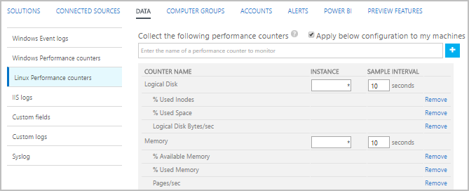

<properties 
   pageTitle="Contatori delle prestazioni di Windows e Linux in Log Analitica | Microsoft Azure"
   description="Contatori sono stati raccolti dal Analitica Log per analizzare le prestazioni in Windows e Linux agenti.  In questo articolo viene descritto come configurare l'insieme di contatori delle prestazioni per entrambe le finestre e agenti Linux, i dettagli degli vengono archiviati in archivio OMS e come analizzarli nel portale di OMS."
   services="log-analytics"
   documentationCenter=""
   authors="bwren"
   manager="jwhit"
   editor="tysonn" />
<tags 
   ms.service="log-analytics"
   ms.devlang="na"
   ms.topic="article"
   ms.tgt_pltfrm="na"
   ms.workload="infrastructure-services"
   ms.date="10/27/2016"
   ms.author="bwren" />

# Windows e Linux origini dati delle prestazioni nel registro Analitica 

In Windows e Linux contatori delle prestazioni consentono di comprendere le prestazioni dei componenti hardware, sistemi operativi e applicazioni.  Registro Analitica può raccogliere contatori a intervalli frequenti per l'analisi vicino in tempo reale (NRT) oltre a aggregare i dati delle prestazioni per l'analisi più termini e dei report.

## Configurazione dei contatori delle prestazioni

Configurare contatori dal [menu di dati di impostazioni del Log di Analitica](log-analytics-data-sources.md#configuring-data-sources).

Quando si configurano prima di Windows o Linux prestazioni contatori per una nuova area OMS, è l'opzione per creare rapidamente diversi contatori comuni.  Sono elencati con una casella di controllo accanto a tutti.  Assicurarsi che qualsiasi contatori che si desidera creare iniziale siano selezionate e quindi fare clic su **Aggiungi contatori selezionati**.

Seguire questa procedura per aggiungere un nuovo contatore di prestazioni di Windows per la raccolta.

1. Digitare il nome del contatore nella casella di testo il formato *oggetto (istanza) \counter*.  Quando si inizia a digitare, viene visualizzata con un elenco corrispondente di contatori comuni.  È possibile selezionare un contatore dall'elenco o digitare uno dei propri.  È anche possibile restituire tutte le istanze di un particolare contatore specificando *oggetto\contatore*. 
2. Fare clic su **+** o premere **INVIO** per aggiungere il contatore all'elenco.
3. Quando si aggiunge un contatore, utilizzerà il valore predefinito di 10 secondi per l' **Intervallo di esempio**.  Se si desidera ridurre i requisiti di spazio di archiviazione dei dati sulle prestazioni raccolti, è possibile modificare questa operazione su un valore maggiore di fino a 1800 secondi (30 minuti).
4. Dopo avere aggiunto contatori, fare clic sul pulsante **Salva** nella parte superiore della schermata per salvare la configurazione.

Seguire questa procedura per aggiungere un nuovo contatore delle prestazioni Linux per la raccolta.

1. Per impostazione predefinita, tutte le modifiche di configurazione vengono automaticamente spostate a tutti gli agenti.  Per gli agenti Linux, viene inviato un file di configurazione per la raccolta di dati Fluentd.  Se si desidera modificare il file manualmente in ogni agente Linux, quindi deselezionare la casella *Applica di sotto configurazione a computer Linux*.
2. Digitare il nome del contatore nella casella di testo il formato *oggetto (istanza) \counter*.  Quando si inizia a digitare, viene visualizzata con un elenco corrispondente di contatori comuni.  È possibile selezionare un contatore dall'elenco o digitare uno dei propri.  
2. Fare clic su **+** o premere **INVIO** per aggiungere il contatore all'elenco di altri contatori per l'oggetto.
3. Tutti i contatori di un oggetto utilizzano lo stesso **Intervallo di esempio**.  Il valore predefinito è 10 secondi.  Modificare questo su un valore maggiore di fino a 1800 secondi (30 minuti) se si desidera ridurre i requisiti di spazio di archiviazione dei dati sulle prestazioni raccolti.
4. Dopo avere aggiunto contatori, fare clic sul pulsante **Salva** nella parte superiore della schermata per salvare la configurazione.

## Raccolta di dati

Registro Analitica raccoglie tutti contatori specificato loro intervallo esempio specificato per tutti gli agenti che hanno contatore installati.  I dati non è aggregati e i dati non elaborati sono disponibili in tutte le visualizzazioni di registro ricerca per la durata specificata per l'abbonamento OMS.

## Proprietà record delle prestazioni

Record di prestazioni dispone di un tipo di **prestazioni** e disporre le proprietà nella tabella seguente.

| Proprietà | Descrizione |
|:--|:--|
| Computer         | Computer in cui l'evento raccolti da. |
| CounterName      | Nome del contatore delle prestazioni |
| CounterPath      | Percorso completo del contatore nel modulo \\ \\ \<Computer >\\oggetto (istanza)\\contatore. |
| CounterValue     | Valore numerico del contatore.  |
| InstanceName     | Nome dell'istanza di evento.  Vuota se nessuna istanza. |
| Nome oggetto       | Nome dell'oggetto delle prestazioni |
| SourceSystem  | Tipo di agente i dati raccolti da.   OpsManager: agente di Windows, uno dei due pubblicitario connettersi o SCOM   Linux: tutti gli agenti Linux    AzureStorage-diagnostica Windows Azure |
| TimeGenerated       | Data e ora che è stati campionati i dati. |

## Stima di ridimensionamento

 Stima approssimativa per la raccolta di un particolare contatore intervalli di 10 secondi è circa 1 MB per giorno / istanza.  È possibile stimare i requisiti di spazio di archiviazione di un particolare contatore con la formula seguente.

    1 MB x (number of counters) x (number of agents) x (number of instances)

## Registro ricerche con i record delle prestazioni

Nella tabella seguente vengono forniti esempi di ricerche log che recuperano i record delle prestazioni.

| Query | Descrizione |
|:--|:--|
| Tipo = delle prestazioni | Tutti i dati delle prestazioni |
| Tipo = Computer delle prestazioni = "Risorse" | Tutti i dati sulle prestazioni da un computer specifico |
| Tipo = delle prestazioni CounterName = "Corrente coda del disco" | Tutti i dati delle prestazioni per un particolare contatore |
| Tipo = delle prestazioni (nome oggetto = processore) CounterName = "% tempo processore" InstanceName = Total & #124; misurare Avg(Average) come AVGCPU dal Computer | Utilizzo della CPU medio in tutti i computer |
| Tipo = delle prestazioni (CounterName = "% tempo processore") & #124;  misurare max(Max) dal Computer | Utilizzo della CPU massimo in tutti i computer |
| Tipo = nome oggetto delle prestazioni = disco logico CounterName = Computer "Corrente media coda del disco" = "MyComputerName" & #124; misurare Avg(Average) da InstanceName | Calcolare la media di lunghezza coda del disco corrente in tutte le istanze di un determinato computer |
| Tipo = delle prestazioni CounterName = "DiskTransfers/sec" & #124; misurare percentile95(Average) dal Computer | 95th percentile dei trasferimenti disco/Sec in tutti i computer |
| Tipo = delle prestazioni CounterName = nomeistanza "% tempo processore" = Total"& #124; misurare avg(CounterValue) in base all'intervallo Computer 1 ora | Media oraria dell'utilizzo della CPU in tutti i computer |
| Tipo = Computer delle prestazioni = "Risorse del computer" CounterName = % * InstanceName = Total & #124; misurare percentile70(CounterValue) in base all'intervallo CounterName 1 ora | Percentile 70 oraria di ogni contatore percentuale % per un determinato computer |
| Tipo = delle prestazioni CounterName = nomeistanza "% tempo processore" = Total"(Computer ="Risorse del computer") & #124; misurare min(CounterValue), avg(CounterValue), percentile75(CounterValue), max(CounterValue) in base all'intervallo Computer 1 ora | Oraria media, minimo, massimo e 75 percentile utilizzo della CPU per un computer specifico |

## Visualizzazione dati sulle prestazioni

Quando si esegue una ricerca di log di dati sulle prestazioni, la visualizzazione **del registro** viene visualizzata per impostazione predefinita.  Per visualizzare i dati sotto forma di grafico, fare clic su **metriche**.  Per una visualizzazione dettagliata di grafica, fare clic sul **+** accanto a un contatore.  

Se l'intervallo di tempo selezionato è 6 ore o meno, il grafico verrà aggiornato ogni pochi secondi.  Dati reali viene visualizzati sul lato destro del grafico nei azzurro.

Aggregare i dati sulle prestazioni di una ricerca di log, vedere [aggregazione metrica su richiesta e visualizzazione in OMS](http://blogs.technet.microsoft.com/msoms/2016/02/26/on-demand-metric-aggregation-and-visualization-in-oms/).

## Passaggi successivi

- Informazioni sulle [ricerche dei registri](log-analytics-log-searches.md) analizzare i dati raccolti mediante le soluzioni e le origini dati.  
- Esportare dati raccolti in [Power BI](log-analytics-powerbi.md) per l'analisi e altre visualizzazioni.