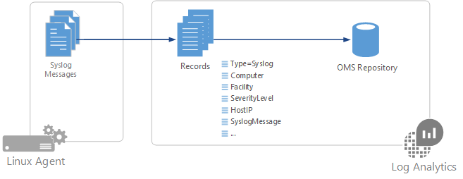

<properties 
   pageTitle="I messaggi di registro di sistema in Log Analitica | Microsoft Azure"
   description="Registro di sistema è un protocollo di registrazione eventi comune a Linux.   In questo articolo viene descritto come configurare l'insieme di messaggi di registro di sistema Analitica Log e dettagli dei record che creano repository OMS."
   services="log-analytics"
   documentationCenter=""
   authors="bwren"
   manager="jwhit"
   editor="tysonn" />
<tags 
   ms.service="log-analytics"
   ms.devlang="na"
   ms.topic="article"
   ms.tgt_pltfrm="na"
   ms.workload="infrastructure-services"
   ms.date="09/06/2016"
   ms.author="bwren" />

# Origini dati di registro di sistema in Analitica Log

Registro di sistema è un protocollo di registrazione eventi comune a Linux.  Applicazioni invierà i messaggi che possono essere archiviati sul computer locale o recapitati a una raccolta di registro di sistema.  Quando si installa l'agente OMS per Linux, configura daemon di registro di sistema locale per l'inoltro di messaggi all'agente.  L'agente invia il messaggio a Analitica Log in cui viene creato un record corrispondente nell'archivio OMS.  

> [AZURE.NOTE]Registro Analitica supporta l'insieme di messaggi inviati dal rsyslog o a gas naturale di registro di sistema. Il daemon di registro di sistema predefinito nella versione 5 di Red Hat Enterprise Linux, CentOS e Linux Oracle (sysklog) non è supportato per la raccolta degli eventi di registro di sistema. Per raccogliere dati di registro di sistema da questa versione di queste distribuzioni, [daemon rsyslog](http://rsyslog.com) deve essere installato e configurato per sostituire sysklog.

## Configurazione di registro di sistema
L'agente OMS per Linux raccoglie solo gli eventi con le strutture e gravità specificata nella configurazione.  È possibile configurare Registro di sistema tramite il portale OMS o mediante la gestione dei file di configurazione degli agenti Linux.

### Configurare Registro di sistema nel portale di OMS

Configurare Registro di sistema dal [menu di dati di impostazioni del Log di Analitica](log-analytics-data-sources.md#configuring-data-sources).  Questa configurazione viene recapitata al file di configurazione in ogni agente Linux.

È possibile aggiungere un nuovo servizio digitando il nome e fare clic su **+**.  Per ogni unità verranno raccolti solo i messaggi con gravità selezionato.  Controllare la gravità la struttura particolare che si desidera raccogliere.  Non è possibile fornire eventuali altri criteri per filtrare i messaggi.

Per impostazione predefinita, tutte le modifiche di configurazione vengono automaticamente spostate a tutti gli agenti.  Se si desidera configurare manualmente Registro di sistema in ogni agente Linux, quindi deselezionare la casella *Applica di sotto configurazione a computer Linux*.

### Configurare Registro di sistema Linux agente

Quando [OMS agente è installato in un client Linux](log-analytics-linux-agents.md), viene installato un file di configurazione di registro di sistema predefinito che definisce la struttura e la gravità dei messaggi che sono stati raccolti.  È possibile modificare il file per modificare la configurazione.  File di configurazione varia a seconda del daemon di registro di sistema in cui è installato il client.

> [AZURE.NOTE] Se si modifica la configurazione del Registro di sistema, è necessario riavviare il daemon di registro di sistema rendere effettive le modifiche.

#### rsyslog

File di configurazione per rsyslog si trova in **/etc/rsyslog.d/95-omsagent.conf**.  I contenuti predefiniti vengono visualizzati sotto.  Consente di raccogliere i messaggi di registro di sistema inviati dall'agente locale per tutti i servizi con un livello di avviso.

    kern.warning       @127.0.0.1:25224
    user.warning       @127.0.0.1:25224
    daemon.warning     @127.0.0.1:25224
    auth.warning       @127.0.0.1:25224
    syslog.warning     @127.0.0.1:25224
    uucp.warning       @127.0.0.1:25224
    authpriv.warning   @127.0.0.1:25224
    ftp.warning        @127.0.0.1:25224
    cron.warning       @127.0.0.1:25224
    local0.warning     @127.0.0.1:25224
    local1.warning     @127.0.0.1:25224
    local2.warning     @127.0.0.1:25224
    local3.warning     @127.0.0.1:25224
    local4.warning     @127.0.0.1:25224
    local5.warning     @127.0.0.1:25224
    local6.warning     @127.0.0.1:25224
    local7.warning     @127.0.0.1:25224

È possibile rimuovere una struttura mediante la rimozione della sezione del file di configurazione.  È possibile limitare la gravità che sono stati raccolti per una particolare funzionalità modificando la voce della struttura.  Per limitare la possibilità di utente di messaggi con gravità di errore o versioni successive, ad esempio, modificare la riga del file di configurazione per le operazioni seguenti:

    user.error  @127.0.0.1:25224

#### Registro di sistema gas

File di configurazione per rsyslog è percorso **/etc/syslog-ng/syslog-ng.conf**.  I contenuti predefiniti vengono visualizzati sotto.  Consente di raccogliere Registro di sistema i messaggi inviati dall'agente locale per tutte le strutture e la gravità tutti.   

    #
    # Warnings (except iptables) in one file:
    #
    destination warn { file("/var/log/warn" fsync(yes)); };
    log { source(src); filter(f_warn); destination(warn); };
    
    #OMS_Destination
    destination d_oms { udp("127.0.0.1" port(25224)); };

    #OMS_facility = auth
    filter f_auth_oms { level(alert,crit,debug,emerg,err,info,notice,warning) and facility(auth); };
    log { source(src); filter(f_auth_oms); destination(d_oms); };

    #OMS_facility = authpriv
    filter f_authpriv_oms { level(alert,crit,debug,emerg,err,info,notice,warning) and facility(authpriv); };
    log { source(src); filter(f_authpriv_oms); destination(d_oms); };

    #OMS_facility = cron
    filter f_cron_oms { level(alert,crit,debug,emerg,err,info,notice,warning) and facility(cron); };
    log { source(src); filter(f_cron_oms); destination(d_oms); };

    #OMS_facility = daemon
    filter f_daemon_oms { level(alert,crit,debug,emerg,err,info,notice,warning) and facility(daemon); };
    log { source(src); filter(f_daemon_oms); destination(d_oms); };

    #OMS_facility = kern
    filter f_kern_oms { level(alert,crit,debug,emerg,err,info,notice,warning) and facility(kern); };
    log { source(src); filter(f_kern_oms); destination(d_oms); };
    
    #OMS_facility = local0
    filter f_local0_oms { level(alert,crit,debug,emerg,err,info,notice,warning) and facility(local0); };
    log { source(src); filter(f_local0_oms); destination(d_oms); };
    
    #OMS_facility = local1
    filter f_local1_oms { level(alert,crit,debug,emerg,err,info,notice,warning) and facility(local1); };
    log { source(src); filter(f_local1_oms); destination(d_oms); };
    
    #OMS_facility = mail
    filter f_mail_oms { level(alert,crit,debug,emerg,err,info,notice,warning) and facility(mail); };
    log { source(src); filter(f_mail_oms); destination(d_oms); };
    
    #OMS_facility = syslog
    filter f_syslog_oms { level(alert,crit,debug,emerg,err,info,notice,warning) and facility(syslog); };
    log { source(src); filter(f_syslog_oms); destination(d_oms); };
    
    #OMS_facility = user
    filter f_user_oms { level(alert,crit,debug,emerg,err,info,notice,warning) and facility(user); };
    log { source(src); filter(f_user_oms); destination(d_oms); };

È possibile rimuovere una struttura mediante la rimozione della sezione del file di configurazione.  È possibile limitare la gravità che sono stati raccolti per una particolare funzionalità rimuovendoli dall'elenco.  Per limitare la possibilità di utente di messaggi solo avviso e critici, ad esempio, modificare la parte del file di configurazione per le operazioni seguenti:

    #OMS_facility = user
    filter f_user_oms { level(alert,crit) and facility(user); };
    log { source(src); filter(f_user_oms); destination(d_oms); };

### Modificare la porta di registro di sistema

L'agente OMS ascolta i messaggi di registro di sistema nel client locale porta 25224.  È possibile modificare questa porta aggiungendo la sezione seguente per il file di configurazione di agente OMS in **/etc/opt/microsoft/omsagent/conf/omsagent.conf**.  Sostituire 25224 della voce di **porta** con il numero di porta che si desidera.  Si noti che sarà anche necessario modificare il file di configurazione per il daemon di registro di sistema inviare messaggi a questa porta.

    <source>
      type syslog
      port 25224
      bind 127.0.0.1
      protocol_type udp
      tag oms.syslog
    </source>

## Raccolta di dati

L'agente OMS ascolta i messaggi di registro di sistema nel client locale porta 25224. File di configurazione per il Registro di sistema daemon inoltra Registro di sistema i messaggi inviati dall'applicazione alla porta nel punto in cui sono raccolti dal Log Analitica.

## Proprietà dei record di registro di sistema

Registro di sistema record con un tipo di **Registro di sistema** e disporre le proprietà nella tabella seguente.

| Proprietà | Descrizione |
|:--|:--|
| Computer | Computer in cui l'evento raccolti da. |
| Strutture | Definisce la parte del sistema che ha generato il messaggio. |
| HostIP | Indirizzo IP del sistema di inviare il messaggio.  |
| Nome host | Nome del sistema di inviare il messaggio. |
| SeverityLevel | Livello di gravità dell'evento. |
| SyslogMessage | Testo del messaggio. |
| ID | ID del processo che ha generato il messaggio. |
| EventTime | Data e ora in cui è stato generato l'evento.

## Registra query con i record di registro di sistema

Nella tabella seguente vengono forniti esempi di query log che recuperano i record di registro di sistema.

| Query | Descrizione |
|:--|:--|
| Tipo = registro di sistema | Syslogs tutti. |
| Tipo = Syslog SeverityLevel = errore | Tutti i record di registro di sistema con gravità dell'errore. |
| Tipo = registro di sistema & #124; misurare Count dal Computer | Conteggio del Registro di sistema record dal computer. |
| Tipo = registro di sistema & #124; misurare Count da fondo | Conteggio del Registro di sistema i record da fondo. |

## Passaggi successivi

- Informazioni sulle [ricerche dei registri](log-analytics-log-searches.md) analizzare i dati raccolti mediante le soluzioni e le origini dati. 
- Consente di analizzare i dati dai record di registro di sistema nei campi di singoli [Campi personalizzati](log-analytics-custom-fields.md) .
- [Configurare Linux agenti](log-analytics-linux-agents.md) per la raccolta di altri tipi di dati. 
