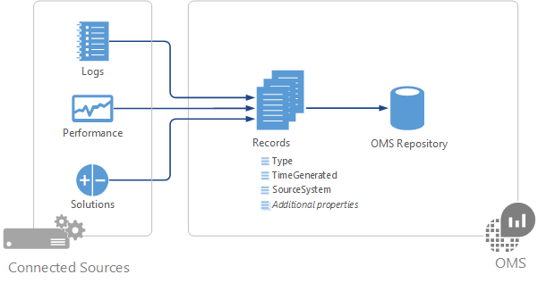
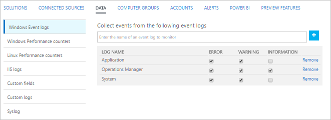

<properties 
   pageTitle="Origini dati nel Log Analitica | Microsoft Azure"
   description="Origini dati definiscono i dati che raccoglie Log Analitica agenti e altro connesso origini.  In questo articolo viene descritto il concetto di come Log Analitica utilizzo dell'origine dati, viene illustrato in dettaglio come configurarli e viene fornito un riepilogo delle origini dati diverse disponibili."
   services="log-analytics"
   documentationCenter=""
   authors="bwren"
   manager="jwhit"
   editor="tysonn" />
<tags 
   ms.service="log-analytics"
   ms.devlang="na"
   ms.topic="article"
   ms.tgt_pltfrm="na"
   ms.workload="infrastructure-services"
   ms.date="10/18/2016"
   ms.author="bwren" />

# Origini dati nel Log Analitica

Registro Analitica raccoglie i dati da origini connessi nell'area di lavoro OMS e archiviati nell'archivio OMS.  I dati raccolti da ogni sono definiti da origini dati che si configura.  Archiviazione dei dati nel repository OMS come un set di record.  Ogni origine dati crea record di un tipo specifico di ogni tipo con il proprio insieme di proprietà.

Origini dati sono diverse rispetto alle soluzioni OMS che anche raccogliere dati da origini connesse e creare i record in archivio OMS.  Soluzioni possono essere aggiunti nell'area di lavoro dalla raccolta soluzioni e in genere fornirà strumenti di analisi aggiuntivi nel portale di OMS.  

## Riepilogo delle origini dati

Le origini dati che sono attualmente disponibili in Analitica Log sono elencate nella tabella seguente.  Ogni ha un collegamento a un articolo distinto fornire informazioni dettagliate per l'origine dati.

| Origine dati | Tipo di evento | Descrizione |
|:--|:--|:--|
| [Log personalizzati](log-analytics-data-sources-custom-logs.md) | \<LogName\>_CL | File di testo in Windows o Linux agenti contenente le informazioni di log. |
| [Registri eventi di Windows](log-analytics-data-sources-windows-events.md) | Evento | Gli eventi raccolti dal registro eventi nel computer Windows. |
| [Contatori delle prestazioni di Windows](log-analytics-data-sources-performance-counters.md) | Delle prestazioni | Contatori acquisite dal computer Windows. |
| [Linux contatori](log-analytics-data-sources-performance-counters.md) | Delle prestazioni | Contatori acquisite dal computer Linux. |
| [Registri di IIS](log-analytics-data-sources-iis-logs.md) | W3CIISLog | Internet Information Services registri in formato W3C. |
| [Registro di sistema](log-analytics-data-sources-syslog.md) | Registro di sistema | Registro di sistema eventi in un computer Windows o Linux. |

## Configurazione delle origini dati

Configurare le origini dati dal menu **dati** Analitica Log le **Impostazioni**.  Qualsiasi configurazione viene recapitata a tutte le origini connesse nell'area di lavoro OMS.  Non è attualmente possibile escludere gli agenti da questa configurazione.

2. Nella console di OMS selezionare il riquadro **Impostazioni** .
3. Selezionare i **dati**.
4. Fare clic su origine dati da configurare.
5. Seguire il collegamento alla documentazione per ogni origine dati nella tabella precedente per informazioni dettagliate per la configurazione.

## Raccolta di dati

Configurazioni di origine dati vengono inviate agli agenti connessi direttamente a OMS nell'arco di qualche minuto.  I dati specificati sono raccolti dall'agente e recapitati direttamente al Log Analitica intervalli specifici per ogni origine dati.  Vedere la documentazione per ogni origine dati per le specifiche.

Per gli agenti System Center Operations Manager (SCOM) in un gruppo di gestione connesso, configurazioni di origine dati sono tradurre management pack e recapitate al gruppo di gestione ogni 5 minuti per impostazione predefinita.  Agente di scarica il management pack come qualsiasi altro e consente di raccogliere dati specificati. A seconda dell'origine dati i dati saranno inviato a un server di gestione che inoltra i dati a Analitica Log o l'agente invia i dati a Log Analitica senza passano attraverso il server di gestione. Fare riferimento ai [dettagli di raccolta dati per le caratteristiche OMS e soluzioni](log-analytics-add-solutions.md#data-collection-details-for-oms-features-and-solutions) per informazioni dettagliate.  È possibile leggere informazioni di connessione SCOM e OMS e modificare la frequenza con la configurazione viene recapitato in [Configurare l'integrazione con System Center Operations Manager](log-analytics-om-agents.md).

## Registro Analitica record

Tutti i dati raccolti dal Log Analitica vengono archiviati in archivio OMS come record.  Record raccolti da origini dati diverse avrà propri set di proprietà e identificato tramite la proprietà di **tipo** .  Vedere la documentazione per ogni origine dati e soluzione per informazioni dettagliate su ogni tipo di record.

## Passaggi successivi

- Informazioni sulle [soluzioni](log-analytics-add-solutions.md) che aggiungere funzionalità a Log Analitica e anche raccogliere dati repository OMS.
- Informazioni sulle [ricerche dei registri](log-analytics-log-searches.md) analizzare i dati raccolti mediante le soluzioni e le origini dati.  
- Configurare [gli avvisi](log-analytics-alerts.md) per comunicare tempestivamente critici raccolta di dati da origini dati e le soluzioni.
