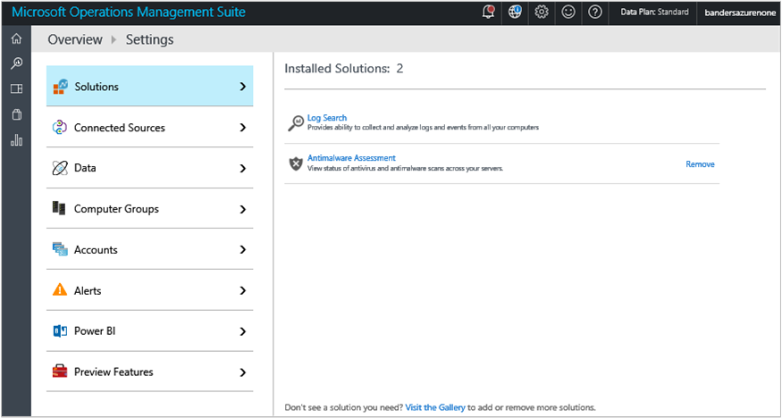
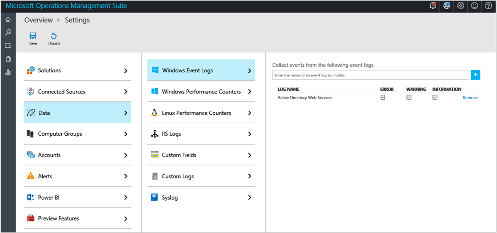

<properties
    pageTitle="Guida introduttiva a Log Analitica | Microsoft Azure"
    description="È possibile ottenere subito con Analitica Log in Microsoft operazioni di gestione famiglia di prodotti (OMS) in minuti."
    services="log-analytics"
    documentationCenter=""
    authors="bandersmsft"
    manager="jwhit"
    editor=""/>

<tags
    ms.service="log-analytics"
    ms.workload="na"
    ms.tgt_pltfrm="na"
    ms.devlang="na"
    ms.topic="get-started-article"
    ms.date="10/10/2016"
    ms.author="banders"/>

# Guida introduttiva a Analitica Log

È possibile ottenere subito con Analitica Log in Microsoft operazioni di gestione famiglia di prodotti (OMS) in minuti. Quando si sceglie di creare un'area di lavoro OMS simile a un account sono disponibili due opzioni:

- Sito Web Microsoft operazioni Management Suite
- Abbonamento a Microsoft Azure

È possibile creare un'area di lavoro OMS gratuito con i siti Web OMS. In alternativa, è possibile utilizzare una sottoscrizione di Microsoft Azure per creare un'area di lavoro OMS. Entrambe le aree di lavoro sono equivalenti, tranne per il fatto che un'area di lavoro OMS gratuito può essere inviate solo 500 MB di dati ogni giorno per il servizio Outlook Mobile. Se si utilizza una sottoscrizione di Azure, è possibile usare anche la sottoscrizione a accesso ad altri servizi Azure. Indipendentemente dal metodo utilizzato per creare l'area di lavoro, sarà necessario creare l'area di lavoro con un account Microsoft o account aziendale.

Ecco un aspetto del processo:

## Registro Analitica prerequisiti e considerazioni sulla distribuzione

- È necessario un abbonamento a Microsoft Azure pagamento utilizzare meglio Log Analitica. Se non si dispone di un abbonamento a Azure, creare un [account gratuito](https://azure.microsoft.com/free/) che consente di accedere a qualsiasi servizio Azure. In alternativa, è possibile creare un account OMS gratuito sul sito Web [Operazioni Management Suite](http://microsoft.com/oms) e fare clic su **prova gratuitamente**.
- Un'area di lavoro OMS
- Ogni computer Windows che si desidera raccogliere dati da eseguire Windows Server 2008 SP1 o versione successiva
- [Firewall](log-analytics-proxy-firewall.md) di accedere alla OMS indirizzi del servizio web
- Un server [OMS Log Analitica inoltro](https://blogs.technet.microsoft.com/msoms/2016/03/17/oms-log-analytics-forwarder) (Gateway) per inoltrare il traffico da server a OMS, se l'accesso a Internet non è disponibile dal computer
- Se si utilizza Operations Manager supporta Log Analitica Operations Manager 2012 SP1 UR6 e versioni successive e Operations Manager 2012 R2 UR2 e versioni successive. Supporto proxy è stato aggiunto in Operations Manager 2012 SP1 UR7 e Operations Manager 2012 R2 UR3. Determinare come verranno integrata con OMS.
- Determinare se il computer hanno accesso diretto a Internet. In caso contrario, richiedono un server di gateway per accedere ai siti di servizio web OMS. Tutti gli accessi consiste nell'utilizzare HTTPS.
- Determinare quali tecnologie e server invierà dati OMS. Ad esempio controller di dominio, SQL Server, e così via.
- Concedere autorizzazioni agli utenti in OMS e Azure.
- Se si è interessati sull'uso dei dati, distribuire singolarmente ogni soluzione e testare l'impatto sulle prestazioni prima di aggiungere altre soluzioni.
- Esaminare l'utilizzo di dati e le prestazioni mentre si aggiungono le soluzioni e le funzionalità al Log Analitica. Sono inclusi la raccolta degli eventi, log insieme, raccolta dati sulle prestazioni e così via. È meglio iniziare minime insieme finché l'utilizzo di dati o è stato individuato l'impatto sulle prestazioni.
- Verificare che gli agenti di Windows non sono anche gestiti mediante Operations Manager, in caso contrario verranno generato dati duplicati. Si applica anche agli Azure-base-agenti contenenti diagnostica Azure abilitato.
- Dopo l'installazione di agenti, verificare il corretto funzionamento dell'agente. Se non, verificare che API di crittografia: isolamento chiave generazione successiva (CNG) non è stato disabilitato tramite criteri di gruppo.
- Alcune soluzioni Analitica Log hanno requisiti aggiuntivi

## Iscriversi a 3 passaggi utilizzando la famiglia di gestione delle operazioni

1. Passare al sito Web [Operazioni Management Suite](http://microsoft.com/oms) e fare clic su **prova gratuitamente**. Accedere con l'account Microsoft, ad esempio Outlook.com o con un account aziendale fornito dall'azienda o dell'istituto di istruzione per l'uso con Office 365 o altri servizi Microsoft.
2. Specificare un nome univoco dell'area di lavoro. Un'area di lavoro è un contenitore logico in cui sono memorizzati i dati di gestione. Ma fornisce è un modo per dati di una partizione tra diversi team all'interno dell'organizzazione, come i dati sono completo per l'area di lavoro. Specificare un indirizzo di posta elettronica e l'area geografica in cui si vuole disporre i dati archiviati.  
    
3. Successivamente, è possibile creare un nuovo abbonamento Azure o un collegamento a un abbonamento di Azure esistente. Se si preferisce continuare con la versione di valutazione gratuita, fare clic su **Non ora**.  
  

Si è pronti per iniziare a utilizzare il portale di operazioni Management Suite.

È possibile ottenere ulteriori informazioni la configurazione dell'area di lavoro e il collegamento account Azure esistente per le aree di lavoro create con la famiglia di gestione di operazioni in [Gestisci accesso al Log Analitica](log-analytics-manage-access.md).

## Iscriversi rapidamente utilizzando Microsoft Azure

1. Accedere al [portale di Azure](https://portal.azure.com) e accedere, esaminare l'elenco dei servizi e quindi selezionare **Registro Analitica (OMS)**.  
    
2. Fare clic su **Aggiungi**, quindi scegliere opzioni disponibili per gli elementi seguenti:
    - Nome **Dell'area di lavoro OMS**
    - **Abbonamento** , se si hanno più abbonamenti, scegliere quello che si desidera associare la nuova area di lavoro.
    - **Gruppo di risorse**
    - **Posizione**
    - **Prezzi livello**  
        
3. Fare clic su **Crea** per visualizzare i dettagli di un'area di lavoro nel portale di Azure.       
             
4. Fare clic sul collegamento **OMS Portal** per aprire il sito Web Suite di gestione di operazioni con la nuova area di lavoro.

Si è pronti per iniziare a usare il portale di operazioni Management Suite.

È possibile ottenere ulteriori informazioni la configurazione dell'area di lavoro e collegare le aree di lavoro esistente che è stato creato con la famiglia di gestione di operazioni per gli abbonamenti Azure [Gestisci](log-analytics-manage-access.md)accesso al Log Analitica.

## Introduzione al portale di operazioni Management Suite
Per scegliere le soluzioni e collegare i server che si desidera gestire, fare clic sul riquadro **Impostazioni** e seguire la procedura descritta in questa sezione.  

  

1. **Aggiungere le soluzioni** - consente di visualizzare le soluzioni installate.  
      
    Fare clic su **visitare la raccolta** per aggiungere altre soluzioni.  
      
    Selezionare una soluzione e quindi fare clic su **Aggiungi**.
2. **Connettere un'origine** - scegliere come connettersi all'ambiente di server per raccogliere dati:
    - Connettere un Server di Windows o client direttamente l'installazione di un agente.
    - Collegare i server Linux con l'agente OMS per Linux.
    - Utilizzare un account di archiviazione Azure configurato con l'estensione macchine Virtuali diagnostica Windows o Linux Azure.
    - Utilizzare System Center Operations Manager per allegare i gruppi di gestione o l'intera distribuzione Operations Manager.
    - Abilitare telemetria di Windows utilizzare l'aggiornamento Analitica.
            

3. **Raccogliere dati** Configurare almeno un'origine dati per compilare i dati nell'area di lavoro. Al termine, fare clic su **Salva**.    

        

## Facoltativamente, è possibile collegare i server direttamente al gruppo di gestione di operazioni installando un agente

Nell'esempio seguente viene illustrato come installare un agente di Windows.

1. Fare clic sul riquadro **Impostazioni** , fare clic sulla scheda **Origini connessi** , fare clic su una scheda per il tipo di origine da aggiungere e possibile scaricare un agente o informazioni su come abilitare un agente. Ad esempio, fare clic su **Scarica agente di Windows (64 bit)**. Per gli agenti di Windows, è possibile installare solo l'agente di Windows Server 2008 SP 1 o in un secondo momento o in Windows 7 SP1 o versione successiva.
2. Installare l'agente in uno o più server. È possibile installare agenti uno alla volta o un metodo più automatico da uno [script personalizzato](log-analytics-windows-agents.md), ma è possibile utilizzare una soluzione di distribuzione software esistente che può essere necessario.
3. Dopo l'utente acconsente al contratto di licenza e si sceglie la cartella di installazione, selezionare **Connetti l'agente di Azure Log Analitica (OMS)**.   
    

4. Nella pagina successiva, verrà richiesto per l'ID dell'area di lavoro e la chiave dell'area di lavoro. L'ID dell'area di lavoro e la chiave vengono visualizzate sullo schermo in cui è stato scaricato il file dell'agente.  
      

    
5. Durante l'installazione, fare clic su **Impostazioni avanzate** per se lo si desidera impostare il server proxy e fornire le informazioni di autenticazione. Fare clic sul pulsante **Avanti** per tornare alla schermata di informazioni dell'area di lavoro.
6. Fare clic su **Avanti** per convalidare l'ID dell'area di lavoro e la chiave. Se vengono rilevati errori, è possibile fare clic su **Indietro** per apportare modifiche. Quando vengono convalidati l'ID dell'area di lavoro e la chiave, fare clic su **Installa** per completare l'installazione dell'agente.
7. Nel Pannello di controllo, fare clic su Microsoft Agent monitoraggio > scheda Azure Log Analitica (OMS). Quando gli agenti di comunicano con il servizio di operazioni Management Suite, verrà visualizzata un'icona di segno di spunta verde. Inizialmente, verrà circa 5 a 10 minuti.

>[AZURE.NOTE] Le soluzioni capacità configurazione e la gestione dei rischi non sono attualmente supportate dal server connessi direttamente al gruppo di gestione di operazioni.

È anche possibile connettere l'agente a System Center Operations Manager 2012 SP1 e versioni successive. A tale scopo, selezionare **Connetti all'agente di System Center Operations Manager**. Quando si sceglie di opzione, si invia dati al servizio senza hardware aggiuntivo o si carica sui gruppi di gestione.

È possibile leggere informazioni sulla connessione di agenti al gruppo di gestione di operazioni computer [Windows connettersi al Log Analitica](log-analytics-windows-agents.md).

## Facoltativamente, è possibile connettere server utilizzando System Center Operations Manager

1. Nella console di Operations Manager, selezionare **amministrazione**.
2. Espandere il nodo **Approfondimenti operative** e selezionare **Connessione approfondimenti operativa**.

  >[AZURE.NOTE] A seconda di quali aggiornamento cumulativo di SCOM in uso, è possibile trovare un nodo per *System Center Advisor*, *Approfondimenti operative*o *Operazioni di gestione applicazioni*.

3. Fare clic sul collegamento **registrare a informazioni dettagliate sui operative** verso l'alto a destra e seguire le istruzioni.
4. Dopo aver completato la registrazione in linea, fare clic sul collegamento **Aggiungi un Computer o un gruppo** .
5. Nella finestra di dialogo **Ricerca dei Computer** è possibile cercare computer o gruppi monitorati da Operations Manager. Selezionare loro computer o gruppi da incorporata a Log Analitica, fare clic su **Aggiungi**e quindi fare clic su **OK**. È possibile verificare che il servizio Outlook Mobile riceva dati facendo clic su riquadro **l'uso** nel portale di operazioni Management Suite. Dati dovrebbero essere visualizzate in circa 5 a 10 minuti.

È possibile leggere informazioni sulla connessione Operations Manager per la famiglia di gestione di operazioni in [Connettere Operations Manager per Log Analitica](log-analytics-om-agents.md).

## Facoltativamente, è possibile analizzare i dati da servizi cloud di Microsoft Azure

Con la famiglia di gestione di operazioni, è possibile cercare rapidamente eventi e log di IIS per servizi cloud e macchine virtuali, consentendo di diagnostica per servizi Cloud Windows Azure. È inoltre possibile ricevere le informazioni supplementari per macchine virtuali Azure installando agente di monitoraggio di Microsoft. È possibile leggere informazioni su come configurare l'ambiente di Azure per utilizzare la famiglia di gestione di operazioni [all'archiviazione di Azure connettersi al Log Analitica](log-analytics-azure-storage.md).

## Passaggi successivi

- [Aggiungere Analitica Log soluzioni dalla raccolta soluzioni](log-analytics-add-solutions.md) per aggiungere la funzionalità e raccogliere dati.
- Acquisire familiarità con [le ricerche log](log-analytics-log-searches.md) visualizzare informazioni dettagliate raccolte da soluzioni.
- Utilizzare [i dashboard](log-analytics-dashboards.md) per salvare e visualizzare ricerche personalizzate.
