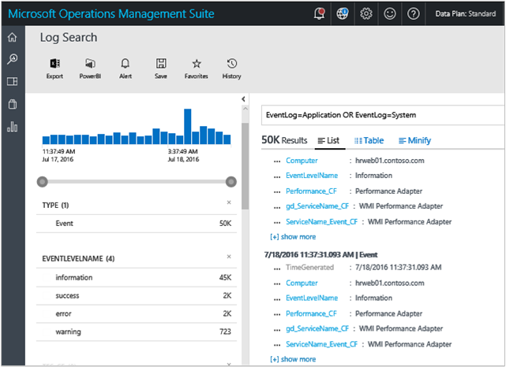
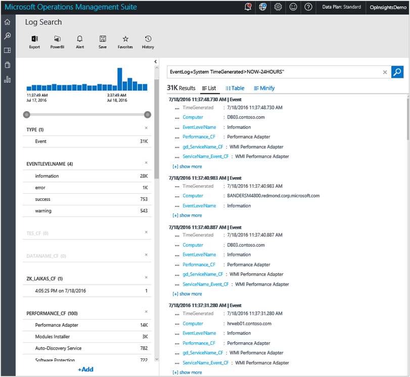
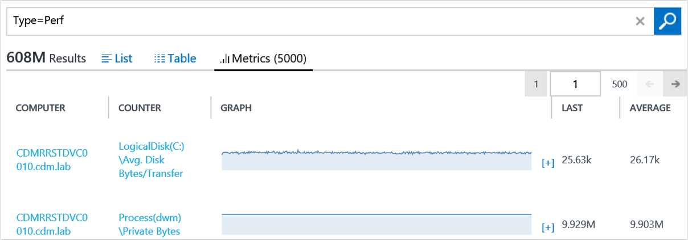
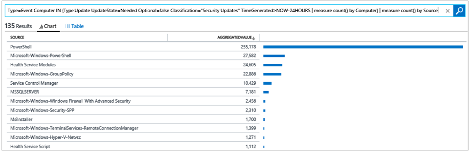

<properties
    pageTitle="Effettuare l'accesso ricerche Log Analitica | Microsoft Azure"
    description="Ricerche dei registri consentono di combinare e correlare tutti i dati da più origini all'interno dell'ambiente computer."
    services="log-analytics"
    documentationCenter=""
    authors="bandersmsft"
    manager="jwhit"
    editor=""/>

<tags
    ms.service="log-analytics"
    ms.workload="na"
    ms.tgt_pltfrm="na"
    ms.devlang="na"
    ms.topic="article"
    ms.date="10/10/2016"
    ms.author="banders"/>

# <a name="log-searches-in-log-analytics"></a>Ricerche log in Analitica Log

La base di Log Analitica è la funzione di ricerca log che consente di combinare e correlare tutti i dati da più origini all'interno dell'ambiente computer. Soluzioni sono anche con tecnologia Registro ricerca per visualizzare metriche ruotate intorno a un'area particolare problema.

Nella pagina di ricerca, è possibile creare una query e quindi quando si eseguono ricerche, è possibile filtrare i risultati utilizzando i controlli facet. È anche possibile creare query avanzate di trasformazione, filtrare e report sui risultati.

Query di ricerca comuni log vengono visualizzati nella maggior parte delle pagine soluzione. Nell'intera console OMS, è possibile fare clic su sezioni o eseguire il drill-ad altri elementi per visualizzare i dettagli sull'elemento con ricerca dei registri.

In questa esercitazione verrà esaminato esempi per coprire tutte le nozioni di base quando si utilizza Registro ricerca.

È necessario iniziare con esempi semplici, pratici e poi su di essi in modo che è possibile ottenere una conoscenza dei casi di utilizzo pratico su come utilizzare la sintassi seguente per estrarre informazioni dettagliate sui desiderato dai dati di.

Dopo aver familiarità con le tecniche di ricerca, è possibile esaminare il [Log Analitica accedere riferimento ricerca](log-analytics-search-reference.md).

## <a name="use-basic-filters"></a>Utilizzare i filtri di base

La prima cosa utili è che la prima parte di una ricerca della query, prima di qualsiasi "|" carattere barra verticale, è sempre un *filtro*. È possibile pensare che ne come una clausola WHERE in TSQL - determina *quale* sottoinsieme di dati in modo da estrarre dall'archivio dati OMS. La ricerca nell'archivio dati è ampiamente informazioni su come specificare le caratteristiche dei dati che si desidera estrarre, pertanto è naturale di una query a partire della clausola WHERE.

I filtri di base che è possibile utilizzare sono *parole chiave*, ad esempio "errore" o "timeout" o il nome del computer. Questi tipi di query semplice restituiscono in genere diverse forme di dati all'interno di stesso set di risultati. In questo modo Analitica Log ha diversi *tipi* di dati nel sistema.


### <a name="to-conduct-a-simple-search"></a>Per eseguire una ricerca semplice
1. Nel portale OMS, fare clic su **Ricerca dei registri**.  
    
2. Nel campo query digitare `error` e quindi fare clic su **Cerca**.  
      
    Ad esempio, la query per `error` nell'immagine seguente restituito 100.000 record **degli eventi** (raccolte per la gestione dei registri), 18 **ConfigurationAlert** record (generato dalla configurazione valutazione) e 12 **ConfigurationChange** record (acquisiti per il rilevamento delle modifiche).   
      

Questi filtri non sono realmente tipi/classi di oggetti. *Tipo* è un tag, o una proprietà o una stringa/nome/categoria, che è collegata a un elemento di dati. Alcuni documenti nel sistema sono contrassegnati come **Tipo: ConfigurationAlert** e alcuni vengono contrassegnate come **Tipo: delle prestazioni**o **Tipo: eventi**e così via. È possibile utilizzare i nomi dei campi per specificare il filtro quando si desidera recuperare solo i record in cui il campo contiene che dato valore ogni risultato della ricerca, documenti, record o voce sono visualizzate tutte le proprietà non elaborate e i rispettivi valori per ogni di tali elementi di dati.

*Tipo* è semplicemente un campo per cui tutti i record, non è diversa da qualsiasi altro campo. Questa operazione è stata stabilita in base al valore del campo tipo. Tale record avrà una forma o diversa. Si noti che **tipo = delle prestazioni**, o **tipo = evento** è anche la sintassi è necessario per imparare a eseguire una query per dati sulle prestazioni o eventi.

È possibile utilizzare i due punti (:) o un segno di uguale (=) dopo il nome del campo e prima del valore. **Tipo: eventi** e **tipo = evento** sono equivalenti significato, è possibile scegliere lo stile desiderato.

Pertanto, se il tipo = delle prestazioni record hanno un campo denominato 'CounterName', quindi è possibile scrivere una query che assomiglia `Type=Perf CounterName="% Processor Time"`.

Verrà visualizzato solo i dati delle prestazioni nel punto in cui il nome del contatore prestazioni è "% tempo processore".

### <a name="to-search-for-processor-time-performance-data"></a>Per cercare dati sulle prestazioni di tempo processore
- Nel campo di query di ricerca, digitare`Type=Perf CounterName="% Processor Time"`

È anche possibile utilizzare più specifici e usare **InstanceName = _ 'Totale'** nella query, ovvero un indicatore di prestazioni di Windows. È anche possibile selezionare un aspetto e un altro **valore: campo**. Il filtro verrà automaticamente aggiunti al filtro nella barra della query. È possibile vedere nell'immagine seguente. Mostra la posizione in cui fare clic per aggiungere **InstanceName: Total"** alla query senza digitare nulla.


La query diventa ora`Type=Perf CounterName="% Processor Time" InstanceName="_Total"`

In questo esempio, non è necessario specificare **tipo = delle prestazioni** per ottenere il risultato. Perché i campi CounterName e InstanceName esistono solo per i record di tipo = delle prestazioni, la query è abbastanza specifica per restituire gli stessi risultati quello più lungo, precedente:
```
CounterName="% Processor Time" InstanceName="_Total"
```

In questo modo tutti i filtri nella query vengono valutati come *e* tra loro. In modo efficace, altri campi aggiungere i criteri vengono minore, risultati più raffinati e specifici.

Ad esempio, la query `Type=Event EventLog="Windows PowerShell"` è identica a `Type=Event AND EventLog="Windows PowerShell"`. Restituisce tutti gli eventi che sono state eseguito l'accesso e acquisiti dal registro eventi di Windows PowerShell. Se si aggiunge un filtro più volte selezionando più volte facet stesso, quindi il problema non puramente cosmetico - potrebbe messaggi secondari sulla barra di ricerca, ma comunque restituisce gli stessi risultati ottenuti perché l'operatore AND implicito è sempre disponibile.

È possibile invertire facilmente l'operatore AND implicito utilizzando un operatore NOT in modo esplicito. Per esempio:

`Type:Event NOT(EventLog:"Windows PowerShell")`o equivalente `Type=Event EventLog!="Windows PowerShell"` restituire tutti gli eventi da tutti gli altri log che non sono il Registro di Windows PowerShell.

O, è possibile usare altri operatori booleani, ad esempio 'O'. La query seguente restituisce i record per il quale il registro eventi è uno dei sistemi o dell'applicazione.

```
EventLog=Application OR EventLog=System
```

Usa la query precedente, vengono fornite le voci per entrambi i registri stesso set di risultati.

Tuttavia, se si rimuove oppure lasciando l'impliciti e in posizione, quindi la query seguente non produrrà alcun risultato perché non è presente una voce di registro eventi che appartiene a entrambi i registri. Ogni voce del registro eventi è stato scritto a solo uno dei due registri.

```
EventLog=Application EventLog=System
```


## <a name="use-additional-filters"></a>Utilizzare filtri aggiuntivi

La query seguente restituisce le voci per 2 i registri eventi per tutti i computer che hanno inviato dati.

```
EventLog=Application OR EventLog=System
```



Selezionare uno dei campi o filtri verrà eseguita la query in un computer specifico, escludendo tutti gli altri uno. La query risultante sarà simile al seguente.

```
EventLog=Application OR EventLog=System Computer=SERVER1.contoso.com
```

Che corrisponde al contenuto seguenti, a causa di and implicito.

```
EventLog=Application OR EventLog=System AND Computer=SERVER1.contoso.com
```

Ogni query valutate nell'ordine seguente esplicito. Prendere nota delle parentesi.

```
(EventLog=Application OR EventLog=System) AND Computer=SERVER1.contoso.com
```

Come il campo registro eventi, è possibile recuperare solo i dati per un set di computer specifici aggiungendo o. Per esempio:

```
(EventLog=Application OR EventLog=System) AND (Computer=SERVER1.contoso.com OR Computer=SERVER2.contoso.com OR Computer=SERVER3.contoso.com)
```

Analogamente, in questo la query seguente restituito **% tempo CPU** per solo i computer di due selezionati.

```
CounterName="% Processor Time"  AND InstanceName="_Total" AND (Computer=SERVER1.contoso.com OR Computer=SERVER2.contoso.com)
```


### <a name="boolean-operators"></a>Operatori booleani
Con datetime e i campi numerici, è possibile cercare valori con *maggiore*, *minore rispetto a*, e *minore o uguale*. È possibile utilizzare gli operatori semplici come >, <>, =, < =,! = nella barra di ricerca della query.


È possibile richiedere un log eventi specifico per un periodo di tempo specifico. Ultime 24 ore, ad esempio, viene espresso con la seguente espressione scelta.

```
EventLog=System TimeGenerated>NOW-24HOURS
```


#### <a name="to-search-using-a-boolean-operator"></a>Eseguire la ricerca utilizzando un operatore booleano
- Nel campo di query di ricerca, digitare`EventLog=System TimeGenerated>NOW-24HOURS"`  
    

Anche se è possibile controllare l'intervallo di tempo graficamente e maggior parte dei casi è consigliabile eseguire tale operazione, i vantaggi sono incluse un filtro per periodo direttamente in una query. Ad esempio, ciò funziona bene con dashboard in cui è possibile ignorare l'orario per ogni sezione, indipendentemente dal selettore di ora *globale* sulla pagina dashboard. Per ulteriori informazioni, vedere [Quanto segue ora nel Dashboard](http://cloudadministrator.wordpress.com/2014/10/19/system-center-advisor-restarted-time-matters-in-dashboard-part-6/).

Quando si filtrano per volta, tenere presente che si ottengano risultati per l' *intersezione* dei due periodi di tempo: quello specificato nel portale di OMS (S1) e quello specificato nella query (S2).


Ciò significa che se i periodi di tempo non si intersecano, ad esempio nel portale di OMS nel punto in cui si sceglie **questa settimana** e della query in cui si definiscono **la settimana scorsa**, non vi è alcuna intersezione e non si riceverà alcun risultato.

Operatori di confronto utilizzati per il campo TimeGenerated sono inoltre utili in altri casi. Ad esempio, con i campi numerici.

Ad esempio, dato che gli avvisi di valutazione di configurazione sono i valori di gravità seguenti:

- 0 = informazioni
- 1 = avviso
- 2 = critica

È possibile eseguire una query per gli avvisi di avviso e critici e inoltre escludere quelli informativi con la query seguente:

```
Type=ConfigurationAlert  Severity>=1
```


È anche possibile usare le query di intervallo. Questo significa che è possibile fornire l'intervallo di inizio e alla fine di valori in una sequenza. Ad esempio, se si desidera che gli eventi dal registro eventi Operations Manager in cui il valore di EventID è maggiore o uguale a 2100 ma non superiore a 2199, la query seguente restituirebbe loro.

```
Type=Event EventLog="Operations Manager" EventID:[2100..2199]
```


>[AZURE.NOTE] La sintassi di intervallo è necessario utilizzare è il separatore di campo: valore due punti (:) e *non* il segno di uguale (=). Racchiudere estremità superiore e inferiore dell'intervallo tra parentesi quadre e separarli con due punti (.).

## <a name="manipulate-search-results"></a>Modificare i risultati della ricerca

Quando devono cercare dati, è consigliabile perfezionare la query di ricerca e ottenere un livello di controllare i risultati. Quando vengono recuperati i risultati, è possibile applicare i comandi per trasformarle.

Comandi nella scheda Log Analitica ricerche *devono* seguono dopo il carattere barra verticale (|). Un filtro deve essere sempre la prima parte di una stringa di query. Definisce il set di dati che si sta lavorando e quindi "tubi" i risultati in un comando. È quindi possibile utilizzare la barra verticale per aggiungere comandi aggiuntivi. Questo è strettamente simile a pipeline di Windows PowerShell.

In generale, la lingua di ricerca Analitica Log tenta di seguire lo stile di PowerShell e linee guida per rendere più simile per i professionisti IT e per semplificare la curva di apprendimento.

Comandi hanno nomi di verbi in modo che è possibile stabilire facilmente lo scopo.  

### <a name="sort"></a>Ordinamento

Comando di ordinamento consente di definire l'ordinamento in base a uno o più campi. Anche se si non utilizza, per impostazione predefinita, viene applicata un'ora ordine decrescente. I risultati più recenti sono sempre nella parte superiore dei risultati della ricerca. Questo significa che quando si esegue una ricerca con `Type=Event EventID=1234` cosa realmente viene eseguito automaticamente è:

```
Type=Event EventID=1234 **| Sort TimeGenerated desc**
```

Infatti, poiché si tratta del tipo di esperienza che si ha familiarità con i registri. Ad esempio, nel Visualizzatore eventi di Windows.

È possibile utilizzare ordinamento per modificare il modo in cui vengono restituiti risultati. In questi esempi viene illustrato il funzionamento.

```
Type=Event EventID=1234 | Sort TimeGenerated asc
```

```
Type=Event EventID=1234 | Sort Computer asc
```

```
Type=Event EventID=1234 | Sort Computer asc,TimeGenerated desc
```


Semplice indicati esempi viene funzionano dei comandi, ossia cambiano la forma dei risultati restituito il filtro.

### <a name="limit-and-top"></a>Limite e margine superiore
Un altro meno comando noto è limite. Limite è un verbo mi piace PowerShell. Limite è funzionale al comando superiore. Le query seguenti restituiscono lo stesso risultato.

```
Type=Event EventID=600 | Limit 1
```

```
Type=Event EventID=600 | Top 1
```


#### <a name="to-search-using-top"></a>Eseguire la ricerca utilizzando superiore
- Nel campo di query di ricerca, digitare`Type=Event EventID=600 | Top 1`   
    

Nell'immagine precedente sono presenti record 358 migliaia con EventID = 600. Campi, facet e i filtri sul lato sinistro mostrano sempre informazioni sui risultati restituiti *da parte di filtro* della query, la parte prima di qualsiasi carattere barra verticale. Riquadro **risultati** restituisce solo il risultato di 1 più recente, perché il comando di esempio forma e trasformata i risultati.

### <a name="select"></a>Selezionare

Il comando SELECT si comporta come selezionare oggetto PowerShell. Restituisce i risultati filtrati che non dispongono di tutte le relative proprietà originale. Seleziona invece solo le proprietà specificate.

#### <a name="to-run-a-search-using-the-select-command"></a>Per eseguire una ricerca con il comando di seleziona

1. Risultati di ricerca, digitare `Type=Event` e quindi fare clic su **Cerca**.
2. Fare clic su **+ visualizzare più** in uno dei risultati per visualizzare tutte le proprietà con i risultati.
3. Selezionare alcune delle persone in modo esplicito e la query verrà impostato su `Type=Event | Select Computer,EventID,RenderedDescription`.  
    

Si tratta di comando particolarmente utile quando si desidera controllare l'output di ricerca e scegliere solo le parti di dati che è importante per l'esplorazione, spesso non è il record completo. Questo è utile quando i record dei diversi tipi hanno *alcune* caratteristiche comuni, ma non *tutte* le proprietà comuni. È possibile generare l'output l'aspetto più naturale una tabella o di lavorare anche quando esportati in un file CSV e quindi modificati in Excel.


## <a name="use-the-measure-command"></a>Usare il comando di misura

MISURA corrisponde a uno dei comandi più versatili nelle ricerche Log Analitica. Consente di applicare statistiche *funzioni* dei dati e dei risultati aggregati raggruppati per un determinato campo. Sono disponibili più funzioni statistiche che supporta la misura.

### <a name="measure-count"></a>Misurare Count)

La funzione statistica prima per rilevare e una delle più semplice da comprendere è la funzione *Count ()* .

Ad esempio il risultato di qualsiasi query di ricerca `Type=Event`, Mostra filtri detti anche facet sul lato sinistro dei risultati della ricerca. I filtri mostrano una distribuzione di valori da un determinato campo dei risultati di ricerca eseguita.


Ad esempio, nell'immagine precedente verrà visualizzato il campo **Computer** e mostra che all'interno di eventi quasi 739 migliaia nei risultati della esistono 68 valori univoci e valori univoci per campo **Computer** ai record trovati. I riquadro sono visualizzati solo i 5, che sono i 5 valori più comuni che vengono scritte nei campi **Computer** ), ordinati per il numero di documenti che contengono quel valore in questo campo. Nell'immagine è possibile visualizzare che – tra gli eventi di quasi 369 migliaia-migliaia di 90 provenire da computer OpsInsights04.contoso.com migliaia 83 dal computer DB03.contoso.com e così via.


Cosa fare se si desidera visualizzare tutti i valori, poiché il riquadro solo Visualizza solo i primi 5?

Ecco cosa è possibile eseguire il comando misura con la funzione Count (). Questa funzione non utilizza parametri. È sufficiente specificare il campo in base al quale si desidera raggruppare: il campo **Computer** in questo caso:

`Type=Event | Measure count() by Computer`


**Tuttavia, è solo un campo utilizzato *in* ** ogni parte dei dati, sono non necessari database relazionali e non esiste alcun oggetto **Computer** separato ovunque. Solo i valori *in* dati possibile descrivere quale entità generate loro e un numero di altre caratteristiche e i dati, pertanto gli aspetti il termine *facet*. Tuttavia, è possibile raggruppare solo anche da altri campi. Poiché i risultati originali della maggior parte delle migliaia 739 eventi che reindirizzati nel comando misura dovranno anche di un campo denominato **EventID**, è possibile applicare la stessa tecnica per raggruppare per quel campo e ottenere un conteggio di eventi per EventID:

```
Type=Event | Measure count() by EventID
```

Se non si è interessati nel conteggio effettivo record che contengono un valore specifico, ma se si vuole solo un elenco di valori se stessi, se, tuttavia è possibile aggiungere un comando *Select* alla fine di esso e solo selezionare la prima colonna:

```
Type=Event | Measure count() by EventID | Select EventID
```

È possibile aggiungere più complesse e pre-ordinare i risultati della query, oppure è possibile fare clic su colonne nella griglia di troppo.

```
Type=Event | Measure count() by EventID | Select EventID | Sort EventID asc
```

#### <a name="to-search-using-measure-count"></a>Eseguire la ricerca utilizzando misura Conteggio

- Nel campo di query di ricerca, digitare`Type=Event | Measure count() by EventID`
- Accodare `| Select EventID` fino alla fine della query.
- Infine, aggiungere `| Sort EventID asc` fino alla fine della query.


Esistono due punti importanti da notare e dare risalto a:

Prima di tutto, i risultati visualizzati non sono i risultati non elaborati originali più. Sono invece risultati aggregati – essenzialmente a gruppi di risultati. Si tratta di un problema, ma è necessario capire che si interagisce con una forma molto diversa di dati diversa dalla forma non elaborata originale che viene creata nel momento in cui la funzione di aggregazione/statistiche.

In secondo luogo, **misura Conteggio** attualmente restituisce solo i risultati primi 100 valori univoci. Questo limite non si applica alle funzioni statistiche. Quindi, in genere è necessario utilizzare un filtro più preciso prima di cercare elementi specifici prima di applicare Count (misura).

## <a name="use-the-max-and-min-functions-with-the-measure-command"></a>Utilizzare le funzioni min e max con il comando di misura

Esistono diversi scenari in cui sono utili **Max (misura)** e **Min (misura)** . Tuttavia, in quanto ogni funzione è opposto tra loro, è necessario illustrare max () e Min () è possibile sperimentare autonomamente.

Se esegue una query per gli eventi di protezione, che hanno una proprietà a **livello** che può variare. Per esempio:

```
Type=SecurityEvent
```


Se si desidera visualizzare il valore massimo per le impostazioni di protezione eventi assegnati un Computer comune Raggruppa per campo, è possibile usare

```
Type=ConfigurationAlert | Measure Max(Level) by Computer
```


Verrà visualizzato nei computer che aveva **livello di** record, la maggior parte delle loro disporre di livello almeno 8, molti aveva un livello di 16.

```
Type=ConfigurationAlert | Measure Max(Severity) by Computer
```


Questa funzione funziona perfettamente con numeri, ma funziona anche con campi DateTime. È utile cercare il timbro dell'ora ultima o più recente di qualsiasi parte del dati indicizzati per ogni computer. Ad esempio: quando è stato più recente evento di protezione segnalato per ogni computer?

```
Type=ConfigurationChange | Measure Max(TimeGenerated) by Computer
```

## <a name="use-the-avg-function-with-the-measure-command"></a>Utilizzare la funzione Media con il comando di misura

La funzione statistica Avg() utilizzata con misura consente di calcolare il valore medio di un campo e Raggruppa risultati per il campo stesso o un altro. Questo è utile in svariate casi, ad esempio dati sulle prestazioni.

Iniziamo con dati sulle prestazioni. Si noti che OMS raccoglie attualmente contatori per i computer Windows e Linux.

Per cercare *tutti* i dati sulle prestazioni, la query più semplice è:

```
Type=Perf
```


La prima cosa si noterà che è che Analitica Log mostra tre prospettive: elenco, che mostra che mostra i record effettivi dietro i tipi di grafici; Tabella che mostra una rappresentazione tabulare dei dati contatore prestazioni. e la metrica che mostra i grafici per i contatori delle prestazioni.

Nell'immagine precedente, sono disponibili due set di campi contrassegnati che indicano le operazioni seguenti:

- Il primo set identifica nome contatore delle prestazioni di Windows, nome dell'oggetto e nome dell'istanza del filtro di query. Si tratta dei campi che è probabile che sia più comunemente utilizzerà come facet/filtri
- **CounterValue** è il valore effettivo del contatore. In questo esempio, il valore è *75*.
- **TimeGenerated** è 12:51 nel formato 24 ore.

Ecco una visualizzazione di metriche in un grafico.



Dopo la lettura relative alla forma record delle prestazioni e aver letto sulle altre tecniche di ricerca, è possibile utilizzare misura Avg() per aggregare questo tipo di dati numerici.

Ecco un esempio semplice:

```
Type=Perf  ObjectName:Processor  InstanceName:_Total  CounterName:"% Processor Time" | Measure Avg(CounterValue) by Computer
```


In questo esempio, si seleziona il tempo totale CPU e prestazioni di contatore Media dal Computer. Se si desidera limitare i risultati a solo l'ultime 6 ore, è possibile utilizzare il controllo di filtro time o specificare nella query come indicato di seguito:

```
Type=Perf  ObjectName:Processor  InstanceName:_Total  CounterName:"% Processor Time" TimeGenerated>NOW-6HOURS | Measure Avg(CounterValue) by Computer
```

### <a name="to-search-using-the-avg-function-with-the-measure-command"></a>Eseguire la ricerca utilizzando la funzione Media con il comando di misura
- Nella casella query di ricerca, digitare `Type=Perf  ObjectName:Processor  InstanceName:_Total  CounterName:"% Processor Time" TimeGenerated>NOW-6HOURS | Measure Avg(CounterValue) by Computer`.


È possibile aggregare e correlare computer *tra* dati. Si supponga ad esempio, si dispone di un insieme di host in una sorta di farm in cui ogni nodo è uguale a qualsiasi altra solo le stesse digitano del lavoro e dovrebbe essere approssimativamente bilanciato. È possibile ottenere i contatori che solo passare con il seguente richiedere e ottenere medie per tutta la farm. È possibile iniziare scegliendo il computer con l'esempio seguente:

```
Type=Perf AND (Computer="AzureMktg01" OR Computer="AzureMktg02" OR Computer="AzureMktg03")
```

Dopo aver creato il computer, anche solo da selezionare due indicatori di prestazioni chiave (KPI): utilizzo della CPU % e % spazio libero sul disco. Pertanto, diventa parte della query:

```
Type=Perf InstanceName:_Total  ((ObjectName:Processor AND CounterName:"% Processor Time") OR (ObjectName="LogicalDisk" AND CounterName="% Free Space")) AND TimeGenerated>NOW-4HOURS
```

A questo punto è possibile aggiungere computer e contatori con l'esempio seguente:

```
Type=Perf InstanceName:_Total  ((ObjectName:Processor AND CounterName:"% Processor Time") OR (ObjectName="LogicalDisk" AND CounterName="% Free Space")) AND TimeGenerated>NOW-4HOURS AND (Computer="AzureMktg01" OR Computer="AzureMktg02" OR Computer="AzureMktg03")
```

Poiché si dispone di una selezione molto specifica, il comando **misura Avg()** può restituire la media non dal computer, ma nella farm, è sufficiente per il raggruppamento per CounterName. Per esempio:

```
Type=Perf  InstanceName:_Total  ((ObjectName:Processor AND CounterName:"% Processor Time") OR (ObjectName="LogicalDisk" AND CounterName="% Free Space")) AND TimeGenerated>NOW-4HOURS AND (Computer="AzureMktg01" OR Computer="AzureMktg02" OR Computer="AzureMktg03") | Measure Avg(CounterValue) by CounterName
```

In questo modo una visualizzazione compatta utile di un paio di indicatori KPI dell'ambiente.


È possibile utilizzare facilmente la query di ricerca in un dashboard. Ad esempio, si può salvare la query di ricerca e il nome di un dashboard denominato *Web Farm KPI*. Per ulteriori informazioni sull'uso di dashboard, vedere [creare un dashboard personalizzato nel registro Analitica](log-analytics-dashboards.md).


### <a name="use-the-sum-function-with-the-measure-command"></a>Utilizzare la funzione somma con il comando di misura

La funzione somma è simile alle altre funzioni del comando misura. È possibile visualizzare un esempio su come utilizzare la funzione somma in [W3C IIS registri ricerca in Microsoft Azure operativi approfondimenti](http://blogs.msdn.com/b/dmuscett/archive/2014/09/20/w3c-iis-logs-search-in-system-center-advisor-limited-preview.aspx).

È possibile utilizzare max () e Min () con numeri, orari di data e stringhe di testo. Con stringhe di testo, vengono ordinati in ordine alfabetico e prima di tutto e cognome.

Tuttavia, è possibile utilizzare SUM () con un valore diverso da campi numerici. Si applica anche a Avg().

### <a name="use-the-percentile-function-with-the-measure-command"></a>Utilizzare la funzione percentile con il comando di misura

Funzione percentile è simile a Avg() e SUM () in è possibile utilizzare solo per i campi numerici. È possibile utilizzare qualsiasi percentile tra 1 e 99 in un campo numerico. È inoltre possibile utilizzare i comandi **percentile** e **tabella di controllo propagazione** . Ecco alcuni esempi:  

```
Type:Perf CounterName:"DiskTransers/sec" |measure percentile95(CurrentValue) by Computer
```
```
Type:Perf ObjectName=LogicalDisk CounterName="Current Disk Queue Length" Computer="MyComputerName" | measure pct65(CurrentValue) by InstanceName
```

## <a name="use-the-where-command"></a>Utilizzare where comando

La posizione in cui funziona come un filtro, ma possono essere applicata nella pipeline per filtrare ulteriormente i risultati aggregati restituiti da un comando di misura: anziché i risultati non elaborati che vengono filtrati all'inizio di una query.

Per esempio:

```
Type=Perf  CounterName="% Processor Time"  InstanceName="_Total" | Measure Avg(CounterValue) as AVGCPU by Computer
```

È possibile aggiungere un'altra barra verticale "|" carattere e il comando per visualizzare solo i computer cui medio CPU è di sopra 80%, con l'esempio seguente:

```
Type=Perf  CounterName="% Processor Time"  InstanceName="_Total" | Measure Avg(CounterValue) as AVGCPU by Computer | Where AVGCPU>80
```

Se si ha familiarità con Microsoft System Center - Operations Manager, è possibile pensare il comando where in termini di management pack. Nel caso dell'esempio fosse una regola, la prima parte della query sarà l'origine dati e il comando sarebbe il rilevamento di condizione.

È possibile utilizzare la query come un riquadro nel **Dashboard personale**, come un monitor di ordinamenti, per verificare quando CPU computer sono utilizzata eccessivo. Per ulteriori informazioni sui dashboard, vedere [creare un dashboard personalizzato nel registro Analitica](log-analytics-dashboards.md). È anche possibile creare e utilizzare i dashboard App per dispositivi mobili. Per ulteriori informazioni, vedere [App Mobile OMS ](http://www.windowsphone.com/en-us/store/app/operational-insights/4823b935-83ce-466c-82bb-bd0a3f58d865). Nelle sezioni inferiore due nella figura seguente, è possibile visualizzare il monitor viene visualizzato un elenco e come numero. In pratica, è sempre il numero da zero e possono essere vuote. In caso contrario, indica una condizione di avviso. Se necessario, è possibile utilizzare un'occhiata al quali macchine siano sotto pressione.


## <a name="use-the-in-operator"></a>Utilizzare l'operatore in

L'operatore *IN* insieme *NOT IN* consente di utilizzare subsearches, sono le ricerche che includono un'altra ricerca come argomento. Sono contenute in parentesi graffe {} all'interno di un'altra ricerca *primario* o *esterno* . Il risultato di un subsearch spesso un elenco dei risultati distinti, quindi viene utilizzato come argomento di ricerca primaria.

È possibile utilizzare subsearches in modo che corrispondano sottoinsiemi di dati che non è possibile descrivere direttamente in un'espressione di ricerca, ma che possono essere generati da una ricerca. Ad esempio, se si è interessati all'utilizzo di una ricerca per trovare tutti gli eventi da *computer aggiornamenti di protezione mancanti*, quindi è necessario progettare una subsearch che identifica prima di tutto che i *computer aggiornamenti di protezione mancanti* prima di averne individuato eventi che appartengono a tali host.

Pertanto, è Impossibile esprimere *computer mancanti attualmente aggiornamenti richiesti* con la query seguente:

```
Type:Update UpdateState=Needed Optional=false Classification="Security Updates" TimeGenerated>NOW-24HOURS | measure count() by Computer
```    


Dopo avere inserito nell'elenco, è possibile utilizzare la ricerca come una ricerca interna per inserire l'elenco di computer in una ricerca (principale) esterna che verrà rappresentati per gli eventi per i computer. A questo scopo racchiudendo la ricerca interna tra parentesi graffe e alimentazione relativi risultati come valori possibili per un campo o un filtro nella ricerca esterno uso dell'operatore IN. Sarebbe la query seguente:

```
Type=Event Computer IN {Type:Update UpdateState=Needed Optional=false Classification="Security Updates" TimeGenerated>NOW-24HOURS | measure count() by Computer}
```


Notare inoltre il filtro ora utilizzato in ricerca interna perché la valutazione di aggiornamento di sistema ha uno snapshot di tutti i computer ogni 24 ore. È possibile rendere più semplice e preciso la query interna solo la ricerca di un giorno. La ricerca outer Usa invece la selezione di tempo nell'interfaccia utente di recupero di eventi negli ultimi sette giorni. Per ulteriori informazioni sugli operatori di ora, vedere [gli operatori booleani](#boolean-operators) .

Perché è davvero usare solo i risultati della ricerca interna come un filtro valore quello esterno, è comunque possibile applicare i comandi nella ricerca outer. Ad esempio, è possibile raggruppare ancora gli eventi precedenti con un altro comando misura:

```
Type=Event Computer IN {Type:Update UpdateState=Needed Optional=false Classification="Security Updates" TimeGenerated>NOW-24HOURS | measure count() by Computer} | measure count() by Source
```




In genere, si desidera la query interna per eseguire rapidamente perché Analitica Log ha lato servizio timeout per renderla e restituire una piccola quantità di risultati. Se la query interna restituisce più risultati, viene troncato l'elenco dei risultati, che potrebbe causare la ricerca esterna restituire i risultati non corretti.

Un'altra regola è che la ricerca interna attualmente deve fornire risultati *aggregati* . In altre parole, deve contenere un comando di *misura* ; risultati non elaborati non è attualmente inserito a una ricerca esterna.

Inoltre, possono essere presenti solo un operatore IN e deve essere l'ultimo filtro nella query. Non possono essere più operatori IN o da – questo essenzialmente impedisce l'esecuzione di più subsearches: il punto importante è solo una ricerca sub/interna possibile per ogni ricerca esterno.

Anche con questi limiti IN consente a molti tipi di ricerca correlata e consente di definire un nome simile ai gruppi, ad esempio computer, gli utenti o file – qualsiasi i campi nei dati contengono. Ecco altri esempi:

**Tutti gli aggiornamenti mancanti nel computer in cui viene disabilitato aggiornamenti automatici**

```
Type=Update UpdateState=Needed Optional=false Computer IN {Type=UpdateSummary WindowsUpdateSetting=Manual | measure count() by Computer} | measure count() by KBID
```

**Tutti gli eventi di errore da computer che esegue SQL Server (= nel punto in cui è eseguito valutazione SQL)**

```
Type=Event EventLevelName=error Computer IN {Type=SQLAssessmentRecommendation | measure count() by Computer}
```

**Tutti gli eventi di protezione dal computer in cui sono controller di dominio (= nel punto in cui è eseguito valutazione Active Directory)**

```
Type=SecurityEvent Computer IN { Type=ADAssessmentRecommendation | measure count() by Computer }
```

**Quali altri account di eseguire l'accesso per gli stessi computer in cui account BACONLAND\jochan ha effettuato l'accesso?**

```
Type=SecurityEvent EventID=4624   Account!="BACONLAND\\jochan" Computer IN { Type=SecurityEvent EventID=4624   Account="BACONLAND\\jochan" | measure count() by Computer } | measure count() by Account
```

## <a name="use-the-distinct-command"></a>Usare il comando distinto

Come il nome suggerito, questo comando comprende un elenco di valori distinti per un campo. È estremamente semplice ma molto utile. Lo stesso consentirebbe con il comando Count misura anche, come illustrato di seguito.

```
Type=Event | Measure count() by Computer
```


Tuttavia, se tutti si è interessati a è semplicemente un elenco di valori distinti e non il numero di documenti che hanno che può fornire i valori e quindi DISTINCT pulita e più facilmente leggibile output e sintassi più breve, come illustrato di seguito.

```
Type=Event | Distinct Computer
```


## <a name="use-the-countdistinct-function-with-the-measure-command"></a>Utilizzare la funzione countdistinct con il comando di misura
Funzione countdistinct conta il numero di valori distinti all'interno di ogni gruppo. Ad esempio, può essere utilizzato per contare il numero di computer univoco per ogni tipo:

```
* | measure countdistinct(Computer) by Type
```


## <a name="use-the-measure-interval-command"></a>Usare il comando intervallo misura
Con accanto alla raccolta di dati sulle prestazioni in tempo reale, è possibile raccogliere e visualizzare eventuali contatore delle prestazioni nel registro Analitica. È sufficiente immettere la query **: Delle prestazioni di tipo** restituirà migliaia di grafici metriche in base al numero di contatori e server nel proprio ambiente Log Analitica. Con l'aggregazione metrica su richiesta, è possibile esaminare le metriche complessive l'ambiente di alto livello, e approfondimenti più granulari dati che è necessario.

Supponiamo che si vuole conoscere qual è la CPU disponibile in tutti i computer. Esamina la media della CPU per ogni computer potrebbe non essere utile in quanto potrebbero essere arrotondati risultati visualizzato. Per esaminare ulteriori dettagli, è possibile aggregare i risultati in un tempo più piccole finestra blocchi e aspetto in una serie temporale tra dimensioni diversi. Ad esempio, è possibile eseguire la media oraria dell'utilizzo della CPU in tutti i computer come indicato di seguito:

```
Type:Perf CounterName="% Processor Time" InstanceName="_Total" | measure avg(CounterValue) by Computer Interval 1HOUR
```


Per impostazione predefinita questi risultati verranno visualizzati in un grafico a linee interattivi più serie.  Questo grafico supporta serie attivazione e disattivazione (con ridimensionamento dell'asse y), eseguire lo zoom avanti e passaggio del mouse.  L'opzione di visualizzazione tabella è ancora disponibile per la visualizzazione dei dati non elaborati se necessario.

È inoltre possibile raggruppare da altri campi. In questo esempio, ricerca di tutti i contatori % per uno specifico computer e desidera riconosce i percentili oraria 70 di ogni contatore:

```
Type:Perf Computer=beefpatty4 CounterName=%* InstanceName=_Total | measure percentile70(CounterValue) by CounterName Interval 1HOUR
```
È necessario tenere presente è che tali query non sono limitate ai contatori delle prestazioni. È possibile applicare a qualsiasi unità di misura metriche. In questo esempio, si sta esamina registri W3C IIS. Vedere che cos'è il tempo massimo che necessario in un intervallo di 5 minuti per l'elaborazione di ogni richiesta:

```
Type:W3CIISLog | measure max(TimeTaken) by csMethod Interval 5MINUTES
```

### <a name="use-multiple-aggregates-in-one-query"></a>Utilizzare più aggregazioni in una query
È possibile specificare più clausole di aggregazione in un comando di misura.  Ognuna di esse può essere alias in modo indipendente.  Se non è disponibile un alias il nome del campo risultante sarà la funzione di aggregazione che è stato utilizzato (ad esempio "avg(CounterValue)" per avg(CounterValue)).

 ```
Type=WireData | measure avg(ReceivedBytes), avg(SentBytes) by Direction interval 1hour
```


Ecco un altro esempio:
 ```
* | measure countdistinct(Computer) as Computers, count() as TotalRecords by Type
```


## <a name="next-steps"></a>Passaggi successivi

Per ulteriori informazioni sulle log ricerche, vedere:

- Utilizzare i [campi personalizzati in Log Analitica](log-analytics-custom-fields.md) per estendere ricerche dei registri.
- Esaminare il [Log Analitica accedere riferimento ricerca](log-analytics-search-reference.md) per visualizzare tutti i campi di ricerca e aspetti disponibili nel Log Analitica.
