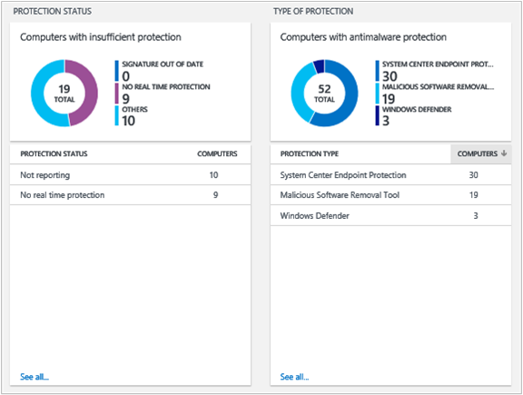

<properties
    pageTitle="Soluzione di valutazione di software dannoso in Log Analitica | Microsoft Azure"
    description="È possibile utilizzare la soluzione Antimalware nel Log Analitica per segnalare lo stato di antimalware protezione dell'infrastruttura."
    services="log-analytics"
    documentationCenter=""
    authors="bandersmsft"
    manager="jwhit"
    editor=""/>

<tags
    ms.service="log-analytics"
    ms.workload="na"
    ms.tgt_pltfrm="na"
    ms.devlang="na"
    ms.topic="article"
    ms.date="10/10/2016"
    ms.author="banders"/>

# Soluzione di valutazione di software dannoso in Analitica Log

È possibile utilizzare la soluzione Antimalware nel Log Analitica per segnalare lo stato di antimalware protezione dell'infrastruttura. Installazione della soluzione consente di aggiornare l'agente di OMS e configurazione di base per OMS. Lo stato di protezione antimalware e minacce rilevate nei server che monitorate vengono letti e quindi i dati vengono inviati al servizio Log Analitica nel cloud per l'elaborazione. Logica viene applicata ai dati ricevuti e il servizio cloud registra i dati. Server con minacce rilevate e con protezione insufficiente vengono visualizzate nel dashboard **Antimalware** . In base alle informazioni nel dashboard di **Antimalware** , è possibile identificare un piano per applicare la protezione ai server che voglio.

## Installare e configurare la soluzione
Utilizzare le informazioni seguenti per installare e configurare la soluzione.

- Aggiungere la soluzione di valutazione di software dannoso nell'area di lavoro OMS usando la procedura descritta nella sezione [aggiungere Analitica Log soluzioni dalla raccolta soluzioni](log-analytics-add-solutions.md).  Non esiste alcun ulteriori operazioni di configurazione necessari.

## Utilizzare Antimalware

Registro Analitica segnala lo stato di antimalware per:

- Computer che eseguono Windows Defender in Windows 8, Windows 8.1, Windows 10 e Windows Server 2016 TP4 o versioni successive
- Windows Security Center PC Windows 8, Windows 8.1, Windows 10, Windows Server 2016 TP4 o versioni successive
- I server eseguono System Center Endpoint Protection (v4.5.216 o versioni successive), Azure macchine virtuali con [estensione antimalware](http://go.microsoft.com/fwlink/?linkid=398023)e Windows dannoso Software rimozione dello strumento (MALWARE)  
- Server con Windows Management Framework 3 & #40; o versioni successive & #41; [WMF 3.0](https://support.microsoft.com/kb/2506143), [WMF 4.0](http://www.microsoft.com/download/details.aspx?id=40855).

Soluzione antimalware non attualmente segnalazione:

- Server che eseguono Windows Server 2008 e versioni precedenti
- Ruoli Web e di lavoro in Microsoft Azure
- 3 ° prodotti antimalware di terze parti

È possibile evitare definirne la priorità l'aggiunta di nuove caratteristiche di voto o aggiungendo un suggerimento di nuovo la [pagina di commenti e suggerimenti](http://feedback.azure.com/forums/267889-azure-operational-insights/category/88093-malware-assessment-solution).

## Dettagli di raccolta dati di valutazione di software dannoso

Valutazione malware raccoglie dati di configurazione, metadati e dati di stato tramite gli agenti che è stata attivata.

Nella tabella seguente mostra i metodi di raccolta dati e altri dettagli sulle modalità di raccolta dati per la valutazione di Malware.

| piattaforma | Agente diretta | Agente SCOM | Spazio di archiviazione Azure | SCOM necessari? | Dati di agente SCOM inviati tramite il gruppo di gestione | frequenza di raccolta |
|---|---|---|---|---|---|---|
|Windows||||            || ogni ora|

Nella tabella seguente è illustrati esempi di tipi di dati raccolti dal Malware valutazione:

|**Tipo di dati**|**Campi**|
|---|---|
|Configurazione|IDCliente AgentID, EntityID, ManagedTypeID, ManagedTypePropertyID, Valorecorrente, ChangeDate|
|Metadati|BaseManagedEntityId, ObjectStatus, unità organizzativa, ActiveDirectoryObjectSid, PhysicalProcessors, risorse NetworkName, indirizzo IP, ForestDNSName, NetbiosComputerName, VirtualMachineName, LastInventoryDate, HostServerNameIsVirtualMachine, indirizzo IP, NetbiosDomainName, LogicalProcessors, DNSName, DisplayName, DomainDnsName, ActiveDirectorySite, PrincipalName, OffsetInMinuteFromGreenwichTime|
|Stato|StateChangeEventId, StateId, NewHealthState, OldHealthState, contesto, TimeGenerated, TimeAdded, StateId2, BaseManagedEntityId, MonitorId, HealthState, LastModified, LastGreenAlertGenerated, DatabaseTimeModified|

## Esame delle minacce per i server

Quando i computer siano adeguatamente protetti, minacce active rapidamente messo in quarantena tramite il software antimalware e raramente dovrebbero essere visualizzate come minacce attive. Per questo motivo, esaminare le minacce risolte che mostrano l'efficacia della soluzione Antimalware valutazione in questa procedura di esempio.

1. Nella pagina **Panoramica** fare clic sul riquadro **Antimalware valutazione** .  
    
2. Nel dashboard **Antimalware** esaminare e il **Rilevato rischi** e fare clic su un nome di server con minacce risolte.  
    
3. Nella pagina di **ricerca** è possibile visualizzare informazioni dettagliate sui rischi in quarantena. Accanto a **rischio**, fare clic su **Visualizza**.  
    
4. Nella pagina **ricerca Enciclopedia malware** , fare clic sull'elemento malware per visualizzare altri dettagli.  
    
5. Nella pagina di Microsoft **Malware Protection Center** per l'elemento di software dannoso, esaminare le informazioni nella sezione di **Riepilogo** . In questa sezione descrive come il software antimalware in grado di rilevare e rimuovere il rischio e fornisce informazioni su cosa minacce malware potrebbero essere necessario il computer.  
    

## Rivedi lo stato di protezione

1. Nel dashboard **Antimalware** esaminare e il **Stato di protezione** e fare clic su **Nessuna protezione in tempo reale**.  
    
2. Ricerca viene visualizzato un elenco dei server senza la protezione.  
    
3. Vengono visualizzati i server senza protezione in tempo reale.

Computer che non sono supportate software antimalware vengono segnalati come **non protezione in tempo reale**.

## Passaggi successivi

- Utilizzare [le ricerche Log in Analitica Log](log-analytics-log-searches.md) per visualizzare dati di valutazione dettagliata malware.
