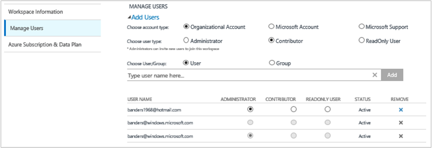

<properties
    pageTitle="Gestire l'accesso ai Log Analitica | Microsoft Azure"
    description="Gestire l'accesso ai Log Analitica con una vasta gamma di attività amministrative su utenti, account, le aree di lavoro OMS e account Azure."
    services="log-analytics"
    documentationCenter=""
    authors="bandersmsft"
    manager="jwhit"
    editor=""/>

<tags
    ms.service="log-analytics"
    ms.workload="na"
    ms.tgt_pltfrm="na"
    ms.devlang="na"
    ms.topic="get-started-article"
    ms.date="08/16/2016"
    ms.author="banders"/>

# Gestire l'accesso ai Log Analitica

Per gestire l'accesso ai Log Analitica, utilizzare una serie di attività amministrative su utenti, account, le aree di lavoro OMS e account Azure. Per creare una nuova area di lavoro in operazioni di gestione famiglia di prodotti (OMS), si sceglie un nome di un'area di lavoro, associarlo con l'account e si sceglie una località geografica. Un'area di lavoro è un contenitore che include informazioni sull'account e informazioni di configurazione semplice per l'account. Si o gli altri membri dell'organizzazione possono utilizzare più aree di lavoro OMS per gestire diversi set di dati raccolti da tutte o alcune parti dell'infrastruttura IT.

L'articolo [Introduzione a Log Analitica](log-analytics-get-started.md) viene illustrato come ottenere rapidamente e in esecuzione e il resto di questo articolo vengono illustrati in modo più dettagliato alcune delle azioni necessari per gestire l'accesso a OMS.

Sebbene potrebbe non essere necessario eseguire tutte le attività di gestione prima, verranno illustrate tutte le attività comuni che è possibile utilizzare nelle sezioni seguenti:

- Determinare il numero di aree di lavoro che è necessario
- Gestire utenti e account
- Aggiungere un gruppo a un'area di lavoro esistente
- Collegare un'area di lavoro esistente a un abbonamento a Azure
- Eseguire l'aggiornamento di un'area di lavoro a un piano dati a pagamento
- Modificare un tipo di piano di dati
- Aggiungere un'organizzazione di Azure Active Directory a un'area di lavoro esistente
- Chiudere l'area di lavoro OMS

## Determinare il numero di aree di lavoro che è necessario

Un'area di lavoro è una risorsa Azure ed è un contenitore in cui di raccolte, aggregati, analizzare e presentati nel portale di OMS dati.

È possibile creare più aree di lavoro OMS Log Analitica e per gli utenti possano accedere a uno o più aree di lavoro. In genere si desidera ridurre il numero di aree di lavoro perché in questo modo è possibile eseguire una query e la correlazione attraverso la maggior parte dei dati. In questa sezione descrive quando può essere utile creare più di un'area di lavoro.

Oggi, fornisce un'area di lavoro Analitica Log:

- Un'area geografica per l'archiviazione dei dati
- Granularità per la fatturazione
- Isolamento dei dati

In base alle caratteristiche sopra, è consigliabile creare più aree di lavoro se:

- Sono un'azienda globale sono necessari i dati archiviati in aree specifiche per motivi di sovranità o conformità di dati.
- Si usano Azure e si desidera evitare i costi di trasferimento dati in uscita dalla presenza di un'area di lavoro Analitica Log nella stessa area risorse di Azure che gestisce.
- Si desidera assegnare spese a diversi reparti o gruppi di business in base all'utilizzo. Quando si crea un'area di lavoro per ogni reparto o un gruppo di business, l'istruzione di fattura e l'uso Azure Mostra le spese per ogni area di lavoro separatamente.
- Ci si trova un provider di servizi gestiti e necessario per mantenere i dati di analitica log per ogni cliente vengono gestiti isolato dai dati del cliente, gli altri.
- Gestire più clienti e si vuole ogni cliente o reparto o gruppo ufficio per visualizzare i propri dati, ma non i dati per altri clienti o reparti o gruppi aziendali.

Quando si usano agenti per raccogliere dati, è possibile configurare ogni agente per segnalare nell'area di lavoro necessari.

Se si utilizza System Center Operations manager, con solo un'area di lavoro è possibile connettere ogni gruppo di gestione Operations Manager. È possibile installare l'agente di monitoraggio di Microsoft nei computer gestiti da Operations Manager e report agente Operations Manager e un altro workspace Log Analitica.

### Informazioni dell'area di lavoro

Nel portale OMS, è possibile visualizzare le informazioni dell'area di lavoro e scegliere se si desidera ricevere informazioni da Microsoft.

#### Visualizzare le informazioni dell'area di lavoro

1. In OMS, fare clic sul riquadro **Impostazioni** .
2. Fare clic sulla scheda **account** .
3. Fare clic sulla scheda **Area di lavoro informazioni** .  
  

## Gestire utenti e account

Ogni area di lavoro può avere più account utente associato e ogni account utente (account Microsoft o account aziendale) possono avere accesso a più aree di lavoro OMS.

Per impostazione predefinita, l'account Microsoft o dell'organizzazione utilizzato per creare l'area di lavoro diventa l'amministratore dell'area di lavoro. L'amministratore può quindi invitare altri account di Microsoft o selezionare gli utenti da Azure Active Directory.

Offrire alle persone l'accesso all'area di lavoro OMS vengono controllate 2 cifre:

- In Azure, è possibile utilizzare il controllo dell'accesso basato sui ruoli per consentire l'accesso all'abbonamento Azure e le risorse di Azure associate. Viene utilizzata anche per l'accesso PowerShell o API REST.
- Nel portale OMS accedere solo il portale OMS - non la sottoscrizione di Azure associato.

Se si fornire persone l'accesso al portale di OMS ma non per la sottoscrizione Azure viene collegata a, quindi i riquadri di soluzione di automazione, Backup e il ripristino del sito non vengono visualizzate qualsiasi tipo di dati agli utenti quando vengono accesso aggiuntivo portale OMS.

Per consentire a tutti gli utenti di visualizzare i dati in queste soluzioni, assicurarsi che dispongono almeno **lettore** accedere per l'archivio di Account di automazione, archivio di Backup e il ripristino del sito è collegato all'area di lavoro OMS.   

### Gestione dell'accesso al Log Analitica tramite il portale di Azure

Se si assegna a utenti l'accesso all'area di lavoro Log Analitica utilizzando le autorizzazioni di Azure, nel portale di Azure, ad esempio, quindi gli stessi utenti possono accedere al Log Analitica portale. Se gli utenti nel portale di Azure, può passare al portale di OMS facendo clic su attività **OMS portale** quando si visualizza la risorsa dell'area di lavoro Log Analitica.

Ecco alcuni punti da tenere in considerazione sul portale Azure:

- Non si tratta *controllo dell'accesso basato sui ruoli*. Se si dispone delle autorizzazioni di accesso *utilità per la lettura* nel portale di Azure per l'area di lavoro Log Analitica, è possibile apportare modifiche tramite il portale OMS. Il portale OMS si tratta di amministratore, collaboratori e utente di sola lettura. Se l'account che è stato effettuato l'accesso in con Azure Active Directory collegato all'area di lavoro sarà un amministratore nel portale di OMS, in caso contrario sarà un collaboratore.

- Quando accesso aggiuntivo al portale OMS usando http://mms.microsoft.com, quindi per impostazione predefinita, viene visualizzato l'elenco **Selezionare un'area di lavoro** . Contiene solo le aree di lavoro che sono stati aggiunti tramite il portale OMS. Per visualizzare le aree di lavoro è possibile accedere con le sottoscrizioni di Azure, quindi è necessario specificare un tenant come parte dell'URL. Per esempio:

  `mms.microsoft.com/?tenant=contoso.com`L'identificatore tenant è spesso quest'ultima parte dell'indirizzo di posta elettronica che effettuare l'accesso con.

- Se l'account effettuare l'accesso con un account nel tenant di Azure Active Directory, che è in genere le maiuscole/minuscole a meno che non si è l'accesso in come un CSP, sarà un *amministratore* nel portale di OMS. Se l'account non è presente nel tenant di Azure Active Directory, sarà un *utente* nel portale di OMS.

- Se si desidera passare direttamente a un portale è possibile accedere con le autorizzazioni di Azure, è necessario specificare la risorsa come parte dell'URL. È possibile ottenere questo URL tramite PowerShell.

  Ad esempio `(Get-AzureRmOperationalInsightsWorkspace).PortalUrl`.

  L'URL sarà simile al seguente:`https://eus.mms.microsoft.com/?tenant=contoso.com&resource=%2fsubscriptions%2faaa5159e-dcf6-890a-a702-2d2fee51c102%2fresourcegroups%2fdb-resgroup%2fproviders%2fmicrosoft.operationalinsights%2fworkspaces%2fmydemo12`

### Gestione degli utenti nel portale di OMS

Gestire gli utenti e il gruppo nella scheda **Gestisci utenti** nella scheda **account** nella pagina Impostazioni. Non esiste, è possibile eseguire le attività nelle sezioni seguenti.  

#### Aggiungere un utente a un'area di lavoro esistente

Utilizzare la procedura seguente per aggiungere un utente o gruppo a un'area di lavoro OMS. L'utente o gruppo saranno in grado di visualizzare e gestire in tutti gli avvisi associati a un'area di lavoro.

>[AZURE.NOTE] Se si desidera aggiungere un utente o gruppo dal proprio account Azure Active Directory dell'organizzazione, è necessario assicurarsi che è associato l'account OMS il dominio di Active Directory. Vedere [aggiungere Azure Active Directory a un'organizzazione di un'area di lavoro esistente](#add-an-azure-active-directory-organization-to-an-existing-workspace).

1. In OMS, fare clic sul riquadro **Impostazioni** .
2. Fare clic sulla scheda **account** e quindi fare clic sulla scheda **Gestione utenti** .
3. Nella sezione **Gestisci utenti** , scegliere il tipo di account da aggiungere: **Account dell'organizzazione**, **Account Microsoft**, **Supporto tecnico Microsoft**.
    - Se si sceglie Account Microsoft, digitare l'indirizzo di posta elettronica dell'utente associato all'Account Microsoft.
    - Se si sceglie Account dell'organizzazione, è possibile immettere parte dell'utente o alias di posta elettronica o nome del gruppo e verrà visualizzato un elenco di utenti e gruppi. Selezionare un utente o gruppo.
    - Utilizzare supporto Microsoft per fornire un supporto Microsoft decodificare accesso temporaneo nell'area di lavoro per agevolare la risoluzione dei problemi.

    >[AZURE.NOTE] Per prestazioni ottimali, limitare il numero di gruppi di Active Directory associati a un singolo account OMS a tre, uno per gli amministratori, uno per i collaboratori e uno per gli utenti di sola lettura. Utilizzo di più gruppi potrebbe rallentare le prestazioni dei Log Analitica.

5. Scegliere il tipo di utente o gruppo da aggiungere: **amministratore**, **collaboratori**o **Utente di sola lettura** .  
6. Fare clic su **Aggiungi**.

  Se si aggiunge un account Microsoft, viene inviato un invito a partecipare l'area di lavoro per la posta elettronica fornito. Dopo che l'utente segue le istruzioni nell'invito a partecipare OMS, l'utente può visualizzare gli avvisi e informazioni relative all'account OMS e sarà possibile visualizzare le informazioni utente nella scheda della pagina **Impostazioni** **account** .
  Se si aggiunge un account dell'organizzazione, l'utente sarà possibile accedere immediatamente Log Analitica.  
  

#### Modificare un tipo di utente esistente

È possibile modificare il ruolo di account per un utente associato all'account OMS. Sono disponibili le seguenti opzioni di ruolo:

 - *Amministratore*: gestire gli utenti, visualizzare e agire su tutti gli avvisi e aggiunta o rimozione di server

 - *Collaboratori*: possono visualizzare e agire su tutti gli avvisi e aggiungere e rimuovere server

 - *Utente di sola lettura*: gli utenti contrassegnati come di sola lettura non sarà possibile:
   1. Aggiungi/Rimuovi soluzioni. Raccolta soluzioni è nascosta.
   2. Aggiungere, modificare, rimuovere sezioni nel **Dashboard personali**.
   3. Visualizzare le pagine di **Impostazioni** . Le pagine sono nascoste.
   4. In ricerca visualizzazione, ottenere informazioni configurazione, ricerche salvate e gli avvisi di attività sono nascoste.

#### Per modificare un account

1. In OMS, fare clic sul riquadro **Impostazioni** .
2. Fare clic sulla scheda **account** e quindi fare clic sulla scheda **Gestione utenti** .
3. Selezionare il ruolo per l'utente che si desidera modificare.
2. Nella finestra di dialogo Conferma, fare clic su **Sì**.

### Rimuovere un utente da un'area di lavoro OMS

Utilizzare la procedura seguente per rimuovere un utente da un'area di lavoro OMS. Si noti che non venga chiuso dell'area di lavoro dell'utente. Se, tuttavia, rimuove l'associazione tra l'utente e l'area di lavoro. Se un utente è associato a più aree di lavoro, tale utente ancora saranno in grado di accedere a OMS ed esaminare le altre aree di lavoro.

1. In OMS, fare clic sul riquadro **Impostazioni** .
2. Fare clic sulla scheda **account** e quindi fare clic sulla scheda **Gestione utenti** .
3. Fare clic su **Rimuovi** accanto al nome utente che si desidera rimuovere.
4. Nella finestra di dialogo Conferma, fare clic su **Sì**.

### Aggiungere un gruppo a un'area di lavoro esistente

1.  Seguire i passaggi 1 -4 in "To aggiungere un utente a un'area di lavoro esistente", sopra.
2.  In **Scegliere utente/gruppo**, selezionare **gruppo**.
    
3.  Immettere il nome visualizzato o l'indirizzo E-mail per il gruppo a cui che si desidera aggiungere.
4.  Selezionare il gruppo nei risultati e quindi fare clic su **Aggiungi**.

## Collegare un'area di lavoro esistente a un abbonamento a Azure

È possibile creare un'area di lavoro dal sito Web [microsoft.com/oms](https://microsoft.com/oms) .  Tuttavia, alcuni limiti disponibili per le aree di lavoro, tra cui un limite di 500MB/giorno del caricamento dei dati se si usa un account gratuito. Per apportare modifiche a un'area di lavoro sarà necessario collegare *l'area di lavoro esistente a un abbonamento a Azure*.

>[AZURE.IMPORTANT] Per creare un collegamento un'area di lavoro, l'account Azure deve avere già accesso nell'area di lavoro che si desidera creare un collegamento.  In altre parole, l'account usato per accedere al portale Azure deve essere **uguale** all'account usato per accedere all'area di lavoro OMS. Se il caso non, vedere [aggiungere un utente a un'area di lavoro esistente](#add-a-user-to-an-existing-workspace).

### Collegare un'area di lavoro a un abbonamento nel portale di OMS Azure

Per creare un collegamento a un abbonamento Azure nel portale di OMS un'area di lavoro, l'utente firmato deve già un account Azure a pagamento. L'area di lavoro che si sta utilizzando attivamente Ottiene collegato all'account Azure.

1. In OMS, fare clic sul riquadro **Impostazioni** .
2. Fare clic sulla scheda **account** e quindi fare clic sulla scheda **abbonamento Azure e piano dati** .
3. Fare clic sul piano di dati che si desidera utilizzare.
4. Fare clic su **Salva**.  
  

Il nuovo piano dati viene visualizzato nella barra multifunzione portale OMS nella parte superiore della pagina web.

### Collegare un'area di lavoro a un abbonamento Azure nel portale di Azure

1.  Accedere al [portale di Azure](http://portal.azure.com).
2.  Cercare **Log Analitica (OMS)** e quindi selezionarlo.
3.  Verrà visualizzato l'elenco delle aree di lavoro esistenti. Fare clic su **Aggiungi**.  
    
4.  In **OMS dell'area di lavoro**, fare clic su **o creare un collegamento esistente**.  
    
5.  Selezionare **Configura impostazioni**.  
    
6.  Per visualizzare l'elenco delle aree di lavoro che non è ancora connessi al proprio account Azure. Selezionare un'area di lavoro.  
    
7.  Se necessario, è possibile modificare i valori per gli elementi seguenti:
    - Abbonamento
    - Gruppo di risorse
    - Posizione
    - Prezzi livello  
        
8.  Fare clic su **Crea**. L'area di lavoro è ora collegato al proprio account Azure.

>[AZURE.NOTE] Se non viene visualizzata l'area di lavoro che si desidera creare un collegamento, l'abbonamento Azure non ha accesso all'area di lavoro OMS creati con i siti Web OMS.  È necessario concedere l'accesso a questo account all'interno di area di lavoro OMS con i siti Web OMS. A tale scopo, vedere [aggiungere un utente a un'area di lavoro esistente](#add-a-user-to-an-existing-workspace).

## Eseguire l'aggiornamento di un'area di lavoro a un piano dati a pagamento

Esistono tre dati dell'area di lavoro piano tipi OMS: **gratuito**, **Standard**e **Premium**.  Se utilizza un piano *gratuito* , che sia stato raggiunto il cap di dati di 500 MB.  È necessario aggiornare l'area di lavoro a un ***piano in*** per raccogliere dati supera questo limite. In qualsiasi momento è possibile convertire il tipo di piano.  Per ulteriori informazioni sui prezzi OMS, visualizzare [I dettagli prezzi](https://www.microsoft.com/en-us/server-cloud/operations-management-suite/pricing.aspx).

>[AZURE.IMPORTANT] Piani di un'area di lavoro possono essere modificati solo se sono *collegati* a un abbonamento a Azure.  Se è stato creato l'area di lavoro in Azure o se è stata *già* collegato l'area di lavoro, è possibile ignorare questo messaggio.  Se è stato creato l'area di lavoro con il [sito Web OMS](http://www.microsoft.com/oms), sarà necessario seguire la procedura descritta in [un'area di lavoro esistente a un abbonamento a Azure collegamento](#link-an-existing-workspace-to-an-azure-subscription).

### Utilizzo di diritti dal componente aggiuntivo OMS per System Center

Il componente aggiuntivo OMS per System Center fornisce un diritto per il piano completo di OMS Log Analitica, descritto nel [OMS prezzi](https://www.microsoft.com/en-us/server-cloud/operations-management-suite/pricing.aspx).

Quando si acquista il componente aggiuntivo OMS per System Center, il componente aggiuntivo OMS viene aggiunto come un diritto nel contratto System Center. Tutti gli abbonamenti Azure creata in questo contratto inserirvi usare del diritto. In questo modo, ad esempio, si abbiano più aree di lavoro OMS che utilizzano il diritto del componente aggiuntivo OMS.

Per assicurarsi che sia applicata l'uso di un'area di lavoro OMS i diritti dal componente aggiuntivo OMS, è necessario:

1. Collegare l'area di lavoro OMS a un abbonamento Azure che fa parte di Enterprise Agreement che include sia l'acquisto di componente aggiuntivo OMS e l'uso di abbonamento Azure
2. Selezionare il piano Premium per l'area di lavoro

Quando si verifica l'utilizzo nel portale di Azure o OMS, si non è possibile vedere i diritti di componente aggiuntivo OMS. Tuttavia, è possibile vedere diritti nel portale aziendale.  

Se è necessario modificare la sottoscrizione Azure l'area di lavoro OMS a quel particolare dipendente, è possibile utilizzare il cmdlet di PowerShell Azure [AzureRmResource Sposta](https://msdn.microsoft.com/library/mt652516.aspx) .

### Utilizzo di Azure impegno da un contratto Enterprise

Se si sceglie di usare autonoma prezzi per i componenti OMS, verrà pagato separatamente per ogni componente del sistema OMS e l'utilizzo verrà riportato nella fattura Azure.

Se si dispone di un commit monetari Azure nella registrazione dell'organizzazione a cui sono collegati i propri abbonamenti Azure, l'utilizzo di Log Analitica verrà automaticamente dare rispetto a eventuali commit monetari rimanente.

Se è necessario modificare la sottoscrizione di Azure che l'area di lavoro OMS è collegato all'utente Puoi utilizzare il cmdlet di PowerShell Azure [AzureRmResource Sposta](https://msdn.microsoft.com/library/mt652516.aspx) .  

### Per modificare un'area di lavoro a un piano dati a pagamento

1.  Accedere al [portale di Azure](http://portal.azure.com).
2.  Cercare **Log Analitica (OMS)** e quindi selezionarlo.
3.  Verrà visualizzato l'elenco delle aree di lavoro esistenti. Selezionare un'area di lavoro.  
    
4.  In **Impostazioni**, fare clic su **livello prezzi**.  
    
5.  In **livello prezzi**, selezionare un piano dati e quindi fare clic su **Seleziona**.  
    
6.  Quando si aggiorna la visualizzazione nel portale di Azure, si noterà **livello prezzi** aggiornati per il piano che è stata selezionata.  
    

A questo punto è possibile raccogliere dati oltre l'estremità "gratuita" dati.

## Aggiungere un'organizzazione di Azure Active Directory a un'area di lavoro esistente

È possibile associare l'area di lavoro Log Analitica (OMS) con un dominio di Azure Active Directory. In questo modo è possibile aggiungere gli utenti da Active Directory direttamente all'area di lavoro OMS senza un account Microsoft.

Quando si crea l'area di lavoro dal portale di Azure, o creare un collegamento a un abbonamento a Azure l'area di lavoro di Azure Active Directory verranno collegate come l'account aziendale.

Quando si crea l'area di lavoro dal portale di OMS verrà richiesto di creare un collegamento a un abbonamento a Azure e un account dell'organizzazione.

### Per aggiungere un'organizzazione di Azure Active Directory a un'area di lavoro esistente

1. Nella pagina Impostazioni OMS, fare clic su **account** e quindi fare clic sulla scheda **Area di lavoro** .  
2. Esaminare le informazioni sugli account dell'organizzazione e quindi fare clic su **Aggiungi organizzazione**.  
    
3. Immettere le informazioni sull'identità per l'amministratore del dominio di Azure Active Directory. In seguito, verrà visualizzato un messaggio di conferma con l'indicazione che l'area di lavoro è collegato al proprio dominio di Azure Active Directory.
    

>[AZURE.NOTE] Dopo l'account è collegato a un Account dell'organizzazione, il collegamento non può essere rimosso o modificato.

## Chiudere l'area di lavoro OMS

Quando si chiude un'area di lavoro OMS, tutti i dati relativi all'area di lavoro viene eliminata dal servizio Outlook Mobile entro 30 giorni di chiusura l'area di lavoro.

Se si è un amministratore e sono presenti più utenti associati all'area di lavoro, l'associazione tra gli utenti e l'area di lavoro viene interrotta. Se gli utenti sono associati ad altre aree di lavoro, è possibile continuare con OMS tali altre aree di lavoro. Tuttavia, se non associate ad altre aree di lavoro vengano sarà necessario creare una nuova area di lavoro per usare OMS.

### Per chiudere un'area di lavoro OMS

1. In OMS, fare clic sul riquadro **Impostazioni** .
2. Fare clic sulla scheda **account** e quindi fare clic sulla scheda **Area di lavoro** .
3. Fare clic su **chiudere dell'area di lavoro**.
4. Selezionare uno dei motivi per chiudere l'area di lavoro oppure immettere un motivo diverso nella casella di testo.
5. Fare clic su **chiudere dell'area di lavoro**.

## Passaggi successivi

- Vedere [computer Windows connettersi per Analitica Log](log-analytics-windows-agents.md) per aggiungere gli agenti e raccogliere dati.
- [Aggiungere Analitica Log soluzioni dalla raccolta soluzioni](log-analytics-add-solutions.md) per aggiungere la funzionalità e raccogliere dati.
- [Configurare le impostazioni proxy e firewall nel registro Analitica](log-analytics-proxy-firewall.md) se l'organizzazione Usa un server proxy o firewall, in modo che gli agenti possano comunicare con il servizio di Log Analitica.
