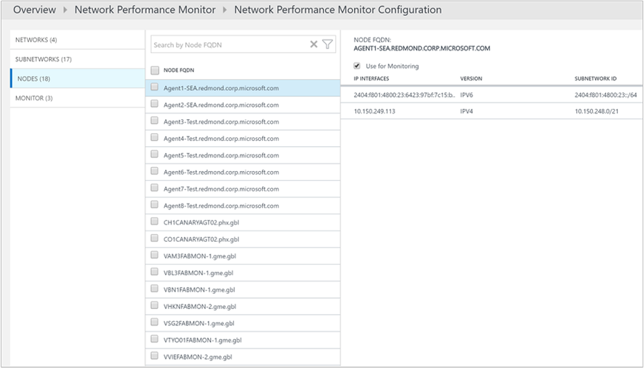
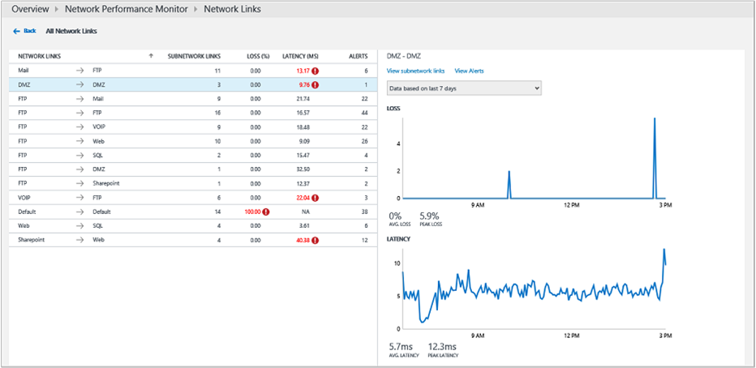
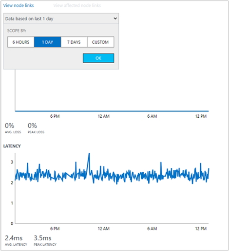

<properties
    pageTitle="Soluzione Performance Monitor in OMS di rete | Microsoft Azure"
    description="Rete delle prestazioni per monitorare le prestazioni del reti aggiuntivo vicino real-tempo a consente di rilevare e individuare i problemi di prestazioni di rete."
    services="log-analytics"
    documentationCenter=""
    authors="bandersmsft"
    manager="jwhit"
    editor=""/>

<tags
    ms.service="log-analytics"
    ms.workload="na"
    ms.tgt_pltfrm="na"
    ms.devlang="na"
    ms.topic="article"
    ms.date="07/28/2016"
    ms.author="banders"/>

# Soluzione Performance Monitor (Preview) in OMS di rete

>[AZURE.NOTE] Questa è una [soluzione di anteprima](log-analytics-add-solutions.md#log-analytics-preview-solutions-and-features).

In questo documento descrive come da usare e la soluzione di prestazioni di rete in OMS, che consente monitoraggio delle prestazioni del reti aggiuntivo vicino real-tempo a rilevare e individuare rete problemi di prestazioni. Con la soluzione di prestazioni di rete, è possibile controllare la perdita e la latenza tra due reti, subnet o server. Monitorare le prestazioni di rete rilevati problemi di rete quali il traffico blackholing routing errori e problemi che metodi di monitoraggio di rete tradizionali non sono in grado di rilevare. Monitorare le prestazioni di rete genera avvisi e notifica come e quando è soddisfatta una determinata soglia per un collegamento di rete. Possibile apprendere le soglie automaticamente dal sistema o è possibile configurare in modo da utilizzare le regole di avviso personalizzate. Monitorare le prestazioni di rete garantisce tempestiva individuazione dei problemi di prestazioni di rete e localizza l'origine del problema a un particolare segmento di rete o un dispositivo.

È possibile rilevare i problemi di rete in cui il dashboard di soluzione che consente di visualizzare informazioni di riepilogo sulla rete inclusi recenti eventi relativi allo stato di rete, collegamenti di rete non corretti e i collegamenti subnet affiancate latenza e perdita di pacchetti elevato. È possibile drill-down in un collegamento di rete per visualizzare lo stato di integrità corrente dei collegamenti subnet, nonché collegamenti a nodi. È inoltre possibile visualizzare la tendenza cronologica di perdita e latenza di rete, subnet e livello di nodo. È possibile rilevare i problemi di rete temporanee visualizzando grafici di tendenza cronologici per la perdita di pacchetti e la latenza e individuare bottiglia di rete su una mappa della topologia. Grafico topologia interattiva consente di visualizzare le route di rete hop-by-hop e determinare l'origine del problema. Ad esempio altre soluzioni, è possibile utilizzare Registro ricerca per requisiti differenti analitica per creare relazioni personalizzate basate sui dati raccolti mediante prestazioni di rete.

La soluzione utilizza le transazioni sintetiche come meccanismo principale per rilevare errori di rete. Pertanto, è possibile utilizzare senza tenere conto dei fornitori o il modello di un dispositivo di rete specifico. Funziona in locale, cloud (IaaS) e gli ambienti ibridi. La soluzione rileva automaticamente la topologia della rete e route diverse della rete.

Prodotti di rete tipica focalizzare l'attenzione su il monitoraggio dell'integrità di dispositivo (router, parametri e così via) di rete, ma non forniscono informazioni di base sulla qualità effettiva della connettività di rete tra due punti, monitorare le prestazioni di rete funziona.

### Mediante la soluzione versione autonoma

Se si desidera controllare la qualità delle connessioni di rete tra i carichi di lavoro critici, reti, Data Center o siti di office, quindi è possibile utilizzare la soluzione di prestazioni di rete autonomamente per monitorare lo stato di connettività tra:

- più siti Data Center o office connesse tramite una rete pubblica o privata
- critiche carichi di lavoro che eseguono applicazioni aziendali
- servizi cloud pubblica come Microsoft Azure o servizi Web di Amazon (AWS) e reti locale, se si dispone di IaaS (macchine Virtuali) disponibili e si dispone di gateway configurato per consentire la comunicazione tra reti locali e cloud
- Reti Azure e locale quando si utilizza strada

### Utilizzo della soluzione con altri strumenti di rete

Se si desidera eseguire il monitoraggio un'applicazione line-of business, è possibile utilizzare la soluzione di prestazioni di rete come soluzione complementare ad altri strumenti di rete. Una rete lenta può causare alle applicazioni lente e monitorare le prestazioni di rete consente di analizzare i problemi di prestazioni applicazione causati da problemi di rete sottostante. Poiché la soluzione non accedono ai dispositivi di rete, l'amministratore dell'applicazione non è necessario si basano su un social network team per fornire informazioni su come la rete è influire sulle applicazioni.

Inoltre, se già investire in altri strumenti di monitoraggio della rete, quindi la soluzione può integrare tali strumenti perché più tradizionali soluzioni di monitoraggio di rete non forniscono informazioni dettagliate sui dati statistici sulle prestazioni di rete-to-end come perdita e latenza.  Soluzione prestazioni di rete può aiutare a tale salto.

## Installare e configurare gli agenti per la soluzione

Utilizzare i processi di base per installare gli agenti in [computer Windows connettersi per Analitica Log](log-analytics-windows-agents.md) e [Connettere Operations Manager a Log Analitica](log-analytics-om-agents.md).

>[AZURE.NOTE]
È necessario installare agenti almeno 2 per ottenere dati sufficienti per individuare e monitorare le risorse di rete. In caso contrario, la soluzione rimarrà in uno stato configurazione fino a installare e configurare gli agenti aggiuntivi.

### Dove installare gli agenti

Prima di installare gli agenti, prendere in considerazione la topologia della rete e le parti della rete che si desidera eseguire il monitoraggio. È consigliabile installare più di un agente per ogni subnet che si desidera controllare. In altre parole, per ogni subnet che si desidera eseguire il monitoraggio, selezionare due o più server o macchine virtuali e installare l'agente su di essi.

Se non si conosce la topologia della rete, installare gli agenti sui server con critiche carichi di lavoro in cui si desidera eseguire il monitoraggio delle prestazioni della rete. È ad esempio tenere traccia di una connessione di rete tra un server Web e un server che esegue SQL Server. In questo esempio, installare un agente su entrambi i server.

Agenti monitorare la connettività di rete (collegamenti) tra gli host, non host se stessi. In modo che per monitorare un collegamento di rete, è necessario installare gli agenti per entrambi gli endpoint di tale collegamento.

### Configurare gli agenti

Dopo aver installato gli agenti, è necessario aprire porte del firewall per i computer per assicurarsi che gli agenti possono comunicare. È necessario scaricare ed eseguire lo [script di PowerShell EnableRules.ps1](https://gallery.technet.microsoft.com/OMS-Network-Performance-04a66634) senza parametri in una finestra di PowerShell con privilegi di amministratore

Lo script crea chiavi del Registro di sistema richieste dal monitoraggio delle prestazioni di rete e crea regole del firewall di Windows per consentire agli agenti di creare connessioni TCP tra loro. Le chiavi del Registro di sistema create dallo script inoltre specificano se agli utenti di accedere ai log di debug e il percorso del file di log. Definisce inoltre la porta TCP agente utilizzata per la comunicazione. I valori per questi tasti vengono impostati automaticamente da script, in modo che non modificare manualmente questi tasti.

Porta aperta per impostazione predefinita è 8084. È possibile utilizzare una porta personalizzata fornendo il parametro `portNumber` dello script. Tuttavia, la stessa porta dovrebbe essere usata in tutti i computer in cui viene eseguito lo script.

>[AZURE.NOTE] Lo script EnableRules.ps1 consente di configurare le regole di Windows firewall solo sul computer in cui viene eseguito lo script. Se si dispone di un firewall di rete, assicurarsi che consenta il traffico destinato alla porta TCP utilizzata da prestazioni di rete.

## La configurazione della soluzione

Utilizzare le informazioni seguenti per installare e configurare la soluzione.

1. Soluzione Network Performance Monitor consente di acquisire dati da computer che eseguono Windows Server 2008 SP 1 o versione successiva o Windows 7 SP1 o versione successiva, quali sono gli stessi requisiti come Microsoft monitoraggio agente (MMA).
2. Aggiungere la soluzione di prestazioni di rete nell'area di lavoro OMS usando la procedura descritta nella sezione [aggiungere Analitica Log soluzioni dalla raccolta soluzioni](log-analytics-add-solutions.md).  
  
3. Nel portale OMS, verrà visualizzato un nuovo riquadro intitolato **Prestazioni di rete** con il messaggio *soluzione richiede ulteriori operazioni di configurazione*. È necessario configurare la soluzione per aggiungere reti in base a sottoreti e i nodi vengono rilevati da agenti. Fare clic su **Prestazioni di rete** per avviare la configurazione della rete predefinito.  
  

### Configurare la soluzione con una rete predefinita

Nella pagina configurazione, si noterà una singola rete denominata **predefinito**. Se non sono definite le reti, tutte le subnet rilevata automaticamente vengono inserite nella rete predefinito.

Quando si crea una rete, aggiungere una subnet e subnet viene rimosso dalla rete predefinito. Se si elimina una rete, tutte le subnet vengono restituite automaticamente alla rete predefinita.

In altre parole, la rete predefinita è il contenitore per tutte le subnet che non sono presenti in tutte le reti definite dall'utente. È possibile modificare o eliminare la rete predefinita. Rimane sempre nel sistema. Tuttavia, è possibile creare tanti reti in base alle esigenze.

Nella maggior parte dei casi, le subnet all'interno dell'organizzazione verranno disposti su più di una rete ed è necessario creare una o più reti per raggruppare le subnet.

### Creare nuove reti

Una rete in prestazioni di rete è un contenitore di subnet. È possibile creare una rete con qualsiasi nome desiderato e aggiungere subnet alla rete. Ad esempio, è possibile creare una rete denominata *Building1* e quindi aggiungere subnet oppure è possibile creare una rete denominata *rete Perimetrale* e quindi aggiungere tutte le subnet che appartengono a DMZ a questa rete.

#### Per creare una nuova rete

1. Fare clic su **Aggiungi rete** e quindi digitare il nome di rete e la descrizione.
2.  Selezionare una o più subnet e quindi fare clic su **Aggiungi**.
3. Fare clic su **Salva** per salvare la configurazione.  
  

### Attendere aggregare i dati

Dopo aver salvato la configurazione per primo, verrà avviata la soluzione raccolta delle informazioni di latenza e perdita di pacchetti rete tra i nodi in cui sono installati gli agenti. Questo processo può richiedere un po' di tempo, a volte 30 minuti. Durante questo stato, il riquadro di prestazioni di rete nella pagina Panoramica visualizzato un messaggio indicante *l'aggregazione di dati nel processo*.

Quando i dati sono stati caricati, verrà visualizzato i monitoraggio delle prestazioni di rete riquadro aggiornato con dati.

Fare clic sul riquadro per visualizzare il dashboard di prestazioni di rete.

### Modificare le impostazioni di monitoraggio per subnet

Tutte le subnet in cui è stato installato almeno un agente sono elencate nella scheda **sottoreti** nella pagina di configurazione.

#### Per attivare o disattivare il monitoraggio di sottoreti specifici

1. Selezionare o deselezionare la casella accanto a **ID subnet** e quindi assicurarsi che **uso per monitoraggio** sia selezionato o selezionata, in base alle esigenze. È possibile selezionare o deselezionare più subnet. Quando è disabilitato, sottoreti non vengono monitorate poiché gli agenti verranno aggiornati per interrompere il ping di altri agenti.
2. Scegliere i nodi che si desidera eseguire il monitoraggio per una particolare subnet selezionando subnet dall'elenco e spostando i nodi necessari tra gli elenchi che contiene nodi automatico e il monitoraggio.
È possibile aggiungere una **Descrizione** personalizzata alla subnet, se si preferisce.
3. Fare clic su **Salva** per salvare la configurazione.  
  

### Scegliere i nodi per monitorare

Nella scheda **nodi** sono elencati tutti i nodi che presentano un agente installato su di essi.

#### Per abilitare o disabilitare il monitoraggio dei nodi

1. Selezionare o deselezionare i nodi che si desidera eseguire il monitoraggio o interrompere il monitoraggio.
2. Fare clic su **utilizza monitoraggio**o deselezionarla, in base alle esigenze.
3. Fare clic su **Salva**.  
  

### Set di regole di monitoraggio

Monitorare le prestazioni di rete genera gli eventi di stato relative alla connettività tra una coppia di nodi o subnet o in rete i collegamenti quando viene soddisfatta una determinata soglia. Possibile apprendere le soglie automaticamente dal sistema o è possibile configurare le regole di avviso personalizzate.

La *regola predefinita* verrà creato dal sistema e viene creato un evento di stato ogni volta che la perdita o latenza tra qualsiasi coppia di reti o subnet collegamenti violazioni soglia appresi sistema. È possibile scegliere di disattivare la regola predefinita e creare regole di monitoraggio personalizzate

#### Per creare regole di monitoraggio personalizzate

1. Fare clic su **Aggiungi regola** nella scheda **Monitor** e immettere il nome e una descrizione.
2. Selezionare la coppia di rete o subnet collegamenti per monitorare negli elenchi.
3. Prima di tutto selezionare la rete in cui è contenuto il primo subnet/s di interesse nell'elenco a discesa di rete e quindi selezionare subnet/s nell'elenco a discesa subnet corrispondente.
Selezionare **tutte le sottoreti** se si desidera eseguire il monitoraggio delle sottoreti che un collegamento di rete. Selezionare in modo analogo altri subnet/s di interesse. E, è possibile fare clic su **Aggiungi eccezione** per escludere il monitoraggio per i collegamenti di subnet specifico alla selezione.
4. Se non si desidera creare eventi di stato per gli elementi selezionati, quindi deselezionare **il monitoraggio sui collegamenti coperti da questa regola dello stato**.
5. Scegliere il monitoraggio delle condizioni.
È possibile impostare le soglie personalizzate per la generazione di eventi di integrità digitando i valori soglia. Ogni volta che il valore della condizione supera la soglia selezionata per la coppia di rete/subnet selezionata, viene generato un evento di stato.
6. Fare clic su **Salva** per salvare la configurazione.  
  

## Dettagli di raccolta dati

Prestazioni di rete pacchetti TCP SYN-SYNACK-ACK handshake viene utilizzata per raccogliere perdita e traceroute e informazioni latenza viene usato anche per ottenere informazioni sulla topologia.

Nella tabella seguente mostra i metodi di raccolta dati e altre informazioni dettagliate su come dati raccolti per monitorare le prestazioni di rete.

| piattaforma | Agente diretta | Agente SCOM | Spazio di archiviazione Azure | SCOM necessari? | Dati di agente SCOM inviati tramite il gruppo di gestione | frequenza di raccolta |
|---|---|---|---|---|---|---|
| Windows ||||            || Handshake TCP ogni 5 secondi, dati inviati ogni 3 minuti |

La soluzione utilizza delle transazioni sintetiche per valutare l'integrità della rete. Agenti OMS installati in varie sezioni di pacchetti TCP exchange di rete tra loro e, nel processo di informazioni le perdite di tempo e di pacchetti andata, se presenti. Periodicamente, ogni agente esegue anche una route di traccia agli altri agenti per trovare tutte le varie route nella rete da testare. Usare questi dati, gli agenti sono in grado di dedurre la latenza di rete e figure di perdita di pacchetti. I test vengono ripetuti ogni cinque secondi e dati raggruppati per un periodo di tre minuti dagli agenti di prima di caricare in OMS.

>[AZURE.NOTE] Sebbene agenti comunicano spesso, non generano numerose il traffico di rete durante le prove. Agenti basano solo sui pacchetti di handshake SYNACK-TCP SYN-ACK per determinare la perdita e latenza - dati non vengono scambiati pacchetti. Durante questo processo agenti comunicano solo quando necessario e la topologia di comunicazione agente ottimizzata per ridurre il traffico di rete.

## Utilizzo della soluzione

In questa sezione viene dashboard di funzioni e sul loro utilizzo.

### Riquadro Panoramica soluzione

Dopo aver attivato la soluzione di prestazioni di rete, il riquadro soluzione nella pagina Panoramica OMS fornisce una breve panoramica dell'integrità della rete. Visualizza un grafico ad anello che mostra il numero di collegamenti subnet corretti e non corretti. Quando si fa clic sul riquadro, viene aperto il dashboard di soluzione.

### Dashboard di soluzione prestazioni di rete

E il **Riepilogo rete** Mostra un riepilogo delle reti insieme alle relative dimensioni. Questo è seguito da sezioni che mostra il numero totale di collegamenti di rete, collegamenti subnet e percorsi nel sistema (un percorso è costituito da indirizzi IP di due host con agenti e tutti i passaggi tra tra di esse).

E **l'Eventi relativi allo stato di rete superiore** comprende un elenco di avvisi e gli eventi di stato più recenti nel sistema e l'ora in quanto l'evento è stato attivo. Un avviso o un evento di stato viene generato ogni volta che la perdita di pacchetti o latenza di un collegamento di rete o subnet supera una determinata soglia.

E il **Collegamenti di rete non corretti superiore** viene visualizzato un elenco di collegamenti di rete non corretti. Questi sono i collegamenti di rete che dispongono di uno o più eventi di integrità negativi per tali al momento.

Pale **I collegamenti a subnet superiore con più perdita** e **subnet con latenza più** visualizzano la subnet superiore i collegamenti da perdita di pacchetti e subnet superiore dalla latenza. Latenza elevata o parte di perdita di pacchetti potrebbe previsto in determinati collegamenti di rete. Tali collegamenti sono visualizzati in elenchi dei primi 10 ma non vengono contrassegnate non corretti.

E il **Query comuni** contiene un insieme di query di ricerca che recupera rete elaborata il monitoraggio dei dati direttamente. È possibile utilizzare queste query come punto di partenza per la creazione di query per i report personalizzati.

### Drill-down per antero-posteriore

È possibile fare clic su diversi collegamenti nel dashboard soluzione per il drill-down più approfondito in qualsiasi area di interesse. Ad esempio, quando viene visualizzato un avviso o un collegamento di rete non corretti del dashboard, è possibile fare clic per analizzare ulteriormente. Verrà accettata a una pagina in cui sono elencati tutti i collegamenti subnet per il collegamento di rete. Sarà possibile visualizzare lo stato di perdita, latenza e l'integrità di ogni collegamento subnet e rapidamente scoprire quali collegamenti subnet causano il problema. È possibile scegliere **i collegamenti di nodo di visualizzazione** per visualizzare tutti i collegamenti di nodo per il collegamento subnet non corretti. Quindi, è possibile visualizzare i collegamenti a nodi singoli e trovare i collegamenti di nodo non corretti.

È possibile fare clic su **topologia di visualizzazione** per visualizzare la topologia hop-by-hop percorsi tra i nodi di origine e destinazione. La route non corretti o hop vengono visualizzati in rosso, in modo che è possibile identificare rapidamente il problema a una determinata parte della rete.

#### Grafici di tendenza

Ogni livello di drill-down, è possibile visualizzare la tendenza del perdita e la latenza di un collegamento di rete. Grafici di tendenza sono inoltre disponibili per i collegamenti subnet e nodo. È possibile modificare l'intervallo di tempo per il grafico tracciare tramite il controllo della fase nella parte superiore del grafico.

I grafici di tendenza mostrano una prospettiva cronologica delle prestazioni di un collegamento di rete. Alcuni problemi di rete sono temporanei natura e sono difficili da rilevare solo esaminando lo stato corrente della rete. In questo modo problemi possono fornire l'interfaccia utente rapidamente e non vengono visualizzati prima che qualcuno, ma solo di nuovo in un secondo tempo. Ad esempio problemi temporanei possono anche essere difficili per gli amministratori di applicazioni perché quelli problemi spesso superficie man mano che sconosciuto aumenta tempi di risposta dell'applicazione, anche quando vengono visualizzati tutti i componenti di applicazioni per l'esecuzione senza problemi.

È possibile rilevare questi tipi di problemi con facilità controllando in un grafico di tendenza in cui il problema verrà visualizzato come un picco inaspettato latenza di rete o una perdita di pacchetti.

#### Mappa della topologia hop-by-hop

Monitoraggio delle prestazioni di rete mostra la topologia hop-by-hop percorsi tra due nodi in una mappa interattiva della topologia. È possibile visualizzare la mappa topologia selezionando un nodo collegamento e quindi facendo clic sulla **topologia di visualizzazione**. Inoltre, è possibile visualizzare mappa della topologia di facendo clic sul riquadro **percorsi** nel dashboard. Quando si fa clic su **percorsi** nel dashboard, è necessario selezionare i nodi di origine e destinazione dalla parte sinistra della finestra e quindi fare clic su **tracciato** per rappresentare i percorsi tra due nodi.

Visualizza mappa della topologia di indirizza quanti è compresi tra due nodi e cosa percorsi eseguire i pacchetti di dati. Problemi di prestazioni di rete sono contrassegnati in rosso nella mappa della topologia. È possibile individuare una connessione di rete difettoso o un dispositivo di rete difettoso esaminando elementi di colori rossi nella mappa della topologia.

Quando si fa clic su un nodo o al passaggio del mouse su di esso nella mappa della topologia, è necessario visualizzare le proprietà del nodo come nome di dominio completo e l'indirizzo IP. Fare clic su un hop per visualizzare il che indirizzo IP. È possibile evidenziare indirizza particolare deselezionando e quindi selezionando solo le route che si desidera evidenziare sulla mappa. È possibile ingrandire avanti o indietro mappa della topologia di utilizzando la rotellina del mouse.

Si noti che la topologia illustrata nella mappa topologia di livello 3 e non contiene connessioni e dispositivi di livello 2.

#### Localizzazione di guasto

Monitorare le prestazioni di rete è in grado di trovare bottiglia rete senza connessione per i dispositivi di rete. In base ai dati raccolti dalla rete e applicando algoritmi avanzati del grafico di rete, il monitoraggio di prestazioni rete è una stima probabilistica delle parti di rete che è probabile l'origine del problema.

Questo approccio è utile per determinare la bottiglia di rete durante l'accesso a hop non è disponibile perché non richiede tutti i dati da raccogliere dei dispositivi di rete, ad esempio router o parametri. Questo è utile quando hop tra due nodi non sono presenti nel controllo amministrativo. I passaggi, ad esempio, potrebbero essere router ISP.

### Ricerca di Analitica dei registri

È disponibile nei Log Analitica ricerca anche tutti i dati che sono pagine graficamente esposte tramite il dashboard di prestazioni di rete e il drill-down. È possibile richiedere i dati mediante il linguaggio di query di ricerca e creare report personalizzati esportando i dati in Excel o ottenere informazioni. E il **Query comuni** nel dashboard è alcune query utile che è possibile usare come punto di partenza per la creazione di query e report.

## Individuare la causa principale di un avviso di integrità

Ora che è stata leggere sulle prestazioni di rete, è possibile esaminare una semplice analisi della causa principale per un evento di stato.

1. Nella pagina Panoramica vengono fornite una panoramica immediata lo stato della rete osservando le **Prestazioni di rete** affiancate. Si noti che fuori 80 sottoreti che si sta controllando i collegamenti 43 sono danneggiato. Questo garantisce indagini. Fare clic sul riquadro per visualizzare il dashboard di soluzione.  
  

2. Nell'immagine di esempio seguente, si noterà che sono attualmente 4 degli eventi di stato e 4 collegamenti di rete che sono danneggiati. È possibile esaminare il problema e fare clic sul collegamento di rete **Web di Sharepoint** per scoprire la radice del problema.  
  

3. La pagina di drill-down mostra tutti i collegamenti di subnet nel collegamento di rete **Web di Sharepoint** . Si noterà che per entrambi i collegamenti di subnet, la latenza è incrociate soglia effettuare il collegamento di rete non corretti. È inoltre possibile visualizzare le tendenze latenza dei collegamenti subnet. È possibile utilizzare la selezione di tempo controllo grafico per concentrarsi su dell'intervallo di tempo richiesta. È possibile visualizzare l'ora del giorno quando latenza ha raggiunto il relativo punta. È possibile cercare in un secondo momento i registri per questo periodo di tempo esaminare il problema. Fare clic su **visualizzazione dei collegamenti di nodo** per il drill-down ulteriormente.  
  

4.  Analogamente alla pagina precedente, nella pagina drill-down per il collegamento subnet particolare sono elencati verso il basso i collegamenti di nodo costitutivi. È possibile eseguire operazioni simili qui, come descritto nel passaggio precedente. Fare clic su **topologia di visualizzazione** per visualizzare la topologia tra i 2 nodi.  
  

5. Tutti i percorsi tra 2 nodi selezionati vengono tracciati nella mappa della topologia. È possibile visualizzare la topologia hop-by-hop percorsi tra due nodi nella mappa della topologia. Fornisce un'immagine Cancella di tra due nodi e quali sono disponibili route quanti percorsi siano impiegando i pacchetti di dati. Problemi di prestazioni di rete sono contrassegnati in rosso. È possibile individuare una connessione di rete difettoso o un dispositivo di rete difettoso esaminando elementi di colori rossi nella mappa della topologia.  
  

6. Nel riquadro dei **Dettagli percorso** , è possibile esaminare le perdite, latenza e il numero di hop in ogni percorso. In questo esempio, è possibile vedere sono presenti 3 non corretti percorsi come indicato nel riquadro. Utilizzare la barra di scorrimento per visualizzare i dettagli di tali percorsi non corretti.  Utilizzare le caselle di controllo per selezionare uno dei percorsi in modo che la topologia per un solo percorso viene tracciata. È possibile utilizzare la rotellina del mouse per eseguire lo zoom avanti o indietro mappa della topologia.

  Nell'immagine seguente è possibile visualizzare in modo chiaro la causa di problemi alla sezione specifica della rete esaminando i percorsi e hop di colore rosso. Facendo clic su un nodo nella mappa della topologia di vengono visualizzate le proprietà del nodo, incluso il FQDN e l'indirizzo IP. Fare clic su un hop Mostra l'indirizzo IP dell'hop.  
  

## Passaggi successivi

- [Registri ricerca](log-analytics-log-searches.md) per visualizzare record di dati delle prestazioni di rete dettagliato.
