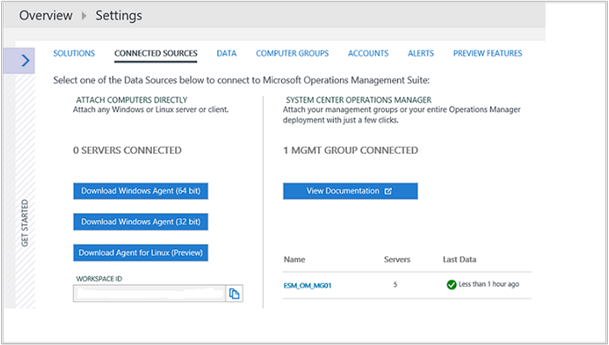
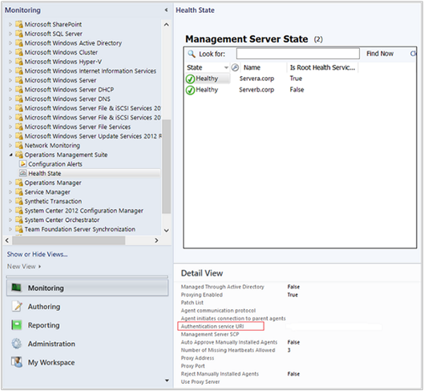

<properties
    pageTitle="Connettersi Operations Manager Log Analitica | Microsoft Azure"
    description="Per gestire gli investimenti in System Center Operations Manager e usare le funzionalità "Extended" con registro Analitica, è possibile integrare Operations Manager con l'area di lavoro OMS."
    services="log-analytics"
    documentationCenter=""
    authors="MGoedtel"
    manager="jwhit"
    editor=""/>

<tags
    ms.service="log-analytics"
    ms.workload="na"
    ms.tgt_pltfrm="na"
    ms.devlang="na"
    ms.topic="article"
    ms.date="09/08/2016"
    ms.author="magoedte"/>

# <a name="connect-operations-manager-to-log-analytics"></a>Connettersi Operations Manager Analitica Log

Per gestire gli investimenti in System Center Operations Manager e usare le funzionalità "Extended" con registro Analitica, è possibile integrare Operations Manager con l'area di lavoro OMS.  In questo modo che è sfruttare le opportunità di OMS pur continuando a utilizzare Operations Manager per:

- Continuare il monitoraggio dell'integrità dei servizi IT con Operations Manager
- Gestire l'integrazione con le soluzioni ITSM gestione incidente e problemi di supporto
- Gestire il ciclo di vita di agenti distribuito in locale e le macchine virtuali di IaaS cloud pubblico monitorare con Operations Manager

Integrazione con System Center Operations Manager aggiunge valore la strategia di operazioni di servizio sfruttando la velocità e l'efficienza delle OMS nella raccolta, l'archiviazione e analisi dei dati da Operations Manager.  OMS consente di correlare e lavorare verso identificare gli errori di problemi e con la visualizzazione reoccurrences per il processo di gestione problema esistente.   Flessibilità del motore di ricerca per esaminare le prestazioni, eventi e dati relativi agli avvisi, con dashboard RTF e le funzionalità di creazione di report per esporre i dati in modo significativo, viene illustrata la forza della funzione che OMS porta in eccellenti Operations Manager.

Gli agenti reporting al gruppo di gestione Operations Manager raccolgono dati dai server in base alle origini dati Analitica Log e le soluzioni che è stata abilitata nell'abbonamento OMS.  A seconda della soluzione è stata attivata, dati di queste soluzioni vengono inviati direttamente da un server di gestione Operations Manager al servizio web o a causa del volume dei dati raccolti nel sistema gestiti agente vengono inviati direttamente da agente di servizio web. Il server di gestione inoltra direttamente dati OMS al servizio web, non viene mai scritta al database OperationsManager o OperationsManagerDW.  Quando un server di gestione perde la connettività con il servizio web, memorizza i dati in locale fino a ottenere la comunicazione ristabilire con OMS.  Se il server di gestione è offline a causa di manutenzione pianificata o interruzione non pianificata, un altro server di gestione nel gruppo gestione verrà ripristinata la connettività con OMS.  

Il diagramma seguente illustra la connessione tra il server di gestione e agenti in un gruppo di gestione System Center Operations Manager e OMS, incluse le porte e la direzione.   


## <a name="system-requirements"></a>Requisiti di sistema
Prima di iniziare, esaminare i dettagli seguenti per verificare che è necessario soddisfare i prerequisiti necessari.

- OMS supporta solo Operations Manager 2012 SP1 UR6 e versioni successive e Operations Manager 2012 R2 UR2 e versioni successive.  Supporto proxy è stato aggiunto in Operations Manager 2012 SP1 UR7 e Operations Manager 2012 R2 UR3.
- Tutti gli agenti Operations Manager devono soddisfare requisiti minimi di supporto. Assicurarsi che gli agenti sono per l'aggiornamento minimo, in caso contrario non viene eseguito il traffico agente di Windows e molti errori potrebbero riempire il registro eventi Operations Manager.
- Un abbonamento OMS.  Per ulteriori informazioni, leggere [Guida introduttiva a Log Analitica](log-analytics-get-started.md).

## <a name="connecting-operations-manager-to-oms"></a>Connettersi OMS Operations Manager
Eseguire i passaggi per configurare il gruppo di gestione Operations Manager per connettersi a una delle aree di lavoro OMS replicarlo seguenti.

1. Nella console di Operations Manager, selezionare l'area di lavoro di **amministrazione** .
2. Espandere il nodo del gruppo di gestione di operazioni e fare clic su **connessione**.
3. Fare clic sul collegamento **registrare alla famiglia di prodotti di operazioni di gestione** .
4. Nella **guidata Onboarding di operazioni di gestione famiglia di prodotti: autenticazione** della pagina, immettere l'indirizzo di posta elettronica o il numero di telefono e la password dell'account administrator associato all'abbonamento OMS e fare clic su **Accedi**.
5. Dopo il correttamente autenticazione, nel **guidata Onboarding di operazioni di gestione famiglia di prodotti: area di lavoro selezionare** della pagina, verrà richiesto di selezionare l'area di lavoro OMS.  Se si dispone di più di un'area di lavoro, selezionare l'area di lavoro che si desidera eseguire la registrazione con il gruppo di gestione Operations Manager dall'elenco a discesa e quindi fare clic su **Avanti**.

    >[AZURE.NOTE] Operations Manager supporta solo un'area di lavoro OMS alla volta. La connessione e i computer registrati per OMS con l'area di lavoro precedente vengono rimossi dalla OMS.

6. Nella **guidata Onboarding di operazioni di gestione famiglia di prodotti: riepilogo** pagina confermare le impostazioni e se sono corretti, fare clic su **Crea**.
7. Nella **guidata Onboarding di operazioni di gestione famiglia di prodotti: fine** pagina fare clic su **Chiudi**.

### <a name="add-agent-managed-computers"></a>Aggiungere computer gestiti tramite agenti
Dopo aver configurato l'integrazione con l'area di lavoro OMS, questo solo stabilisce una connessione con OMS, non sono raccolti dati da agenti reporting al gruppo gestione. Dopo aver configurato gestiti agente dei computer che saranno raccolti i dati per Log Analitica, questo non effettuato dopo. È possibile selezionare gli oggetti computer singolarmente oppure è possibile selezionare un gruppo che contiene gli oggetti computer Windows. Non è possibile selezionare un gruppo che contiene le istanze di un'altra classe, ad esempio dischi logici o database SQL.

1. Aprire la console di Operations Manager e selezionare l'area di lavoro di **amministrazione** .
2. Espandere il nodo del gruppo di gestione di operazioni e fare clic su **connessione**.
3. Fare clic sul collegamento **Aggiungi/gruppo di Computer** nella sezione Actions sul lato destro del riquadro del titolo.
4. Nella finestra di dialogo **Ricerca dei Computer** è possibile cercare computer o gruppi monitorati da Operations Manager. Selezionare computer o gruppi da incorporata OMS, fare clic su **Aggiungi**e quindi fare clic su **OK**.

È possibile visualizzare computer e gruppi configurati per raccogliere dati dal nodo computer gestiti in operazioni Management Suite nell'area di lavoro di **amministrazione** della console.  Da qui è possibile aggiungere o rimuovere computer e gruppi in base alle esigenze.

### <a name="configure-oms-proxy-settings-in-the-operations-console"></a>Configurare le impostazioni proxy OMS nella console
Se un server proxy interno è compresa tra il gruppo di gestione e il servizio web, eseguire la procedura seguente.  Queste impostazioni vengono gestite dal gruppo di gestione di e distribuite ai sistemi gestiti agente inclusi nell'ambito per la raccolta di dati per OMS centralmente.  Questo è utile per quando alcune soluzioni ignorare il server di gestione e inviarli direttamente al servizio web.

1. Aprire la console di Operations Manager e selezionare l'area di lavoro di **amministrazione** .
2. Espandere operazioni Management Suite e quindi fare clic su **connessioni**.
3. Nella visualizzazione OMS connessione, fare clic su **Configura Server Proxy**.
4. In **operazioni di gestione famiglia guidata: Server Proxy** della pagina, selezionare **Usa un server proxy per accedere a operazioni Management Suite**, quindi digitare l'URL che contiene il numero di porta, ad esempio http://corpproxy:80 e quindi fare clic su **Fine**.

Se il server proxy richiede l'autenticazione, eseguire i passaggi seguenti per configurare le credenziali e impostazioni che devono propagarsi ai computer gestiti che segnalerà a OMS nel gruppo gestione.

1. Aprire la console di Operations Manager e selezionare l'area di lavoro di **amministrazione** .
2. Selezionare **i profili** **RunAs configurazione**.
3. Aprire il profilo **System Center Advisor eseguire come profilo Proxy** .
4. Eseguire come profilo guidata fare clic su Aggiungi per l'utilizzo di un account Esegui come. È possibile creare un nuovo [account Esegui come](https://technet.microsoft.com/library/hh321655.aspx) o utilizzare un account esistente. Questo account deve disporre delle autorizzazioni sufficienti per passano attraverso il server proxy.
5. Per impostare l'account per la gestione, scegliere **una classe selezionata, gruppo o un oggetto**, fare clic su **Seleziona...** e quindi fare clic su **gruppo...** Per aprire la casella di **Ricerca di gruppo** .
6. Cercare e quindi selezionare **Microsoft System Center Advisor Monitoring Server gruppo**.  Dopo aver selezionato il gruppo per chiudere la casella di **Ricerca di gruppo** , fare clic su **OK** .
7.  Fare clic su **OK** per chiudere la finestra di dialogo **Aggiungi un account Esegui come** .
8.  Fare clic su **Salva** per completare la procedura guidata e salvare le modifiche.

Dopo la connessione viene creata e configurare gli agenti verranno la raccolta e dati di segnalazione a OMS, nel gruppo gestione non necessariamente in ordine viene applicata le seguenti operazioni:

- Viene creato l' Account come **Microsoft.SystemCenter.Advisor.RunAsAccount.Certificate** .  È associato al profilo Esegui come **Microsoft System Center Advisor eseguire come profilo Blob** e prevede due classi - **Raccolta Server** e **Il gruppo di gestione di Operations Manager**.
- Due connettori vengono creati.  Il primo è denominato **Microsoft.SystemCenter.Advisor.DataConnector** e viene configurato automaticamente con una sottoscrizione che inoltra tutti gli avvisi generati da istanze di tutte le classi nel gruppo gestione a OMS Log Analitica. Il secondo connettore è **Advisor connettore**, che viene utilizzato per comunicare con servizio web e condivisione dei dati.
- Gli agenti e i gruppi che si sono scelto di raccogliere dati nel gruppo Gestione verranno aggiunti a **Microsoft System Center Advisor Monitoring Server gruppo**.

## <a name="management-pack-updates"></a>Aggiornamenti di management pack
Al termine di configurazione, il gruppo di gestione Operations Manager stabilisce una connessione con il servizio Outlook Mobile.  Il server di gestione verrà sincronizzate con il servizio web e ricevere informazioni di configurazione aggiornate sotto forma di management pack per le soluzioni è stata attivata che si integrano con Operations Manager.   Operations Manager controllerà per gli aggiornamenti a questi management pack download automatico e importarli quando sono disponibili.  Esistono due regole in particolare che controllare questo comportamento:

- **Microsoft.SystemCenter.Advisor.MPUpdate** - Aggiorna i base OMS management pack. Viene eseguita ogni ore dodici (12) per impostazione predefinita.
- **Microsoft.SystemCenter.Advisor.Core.GetIntelligencePacksRule** - aggiornamenti soluzione management pack abilitato nell'area di lavoro. Viene eseguita ogni minuti cinque (5) per impostazione predefinita.

È possibile ignorare questi due regole per evitare che il download automatico da disabilitazione o modificare la frequenza di frequenza il server di gestione Sincronizza con OMS per determinare se un nuovo management pack è disponibile e devono essere scaricati.  Seguire i passaggi [come ignorare una regola o il Monitor](https://technet.microsoft.com/library/hh212869.aspx) per modificare il parametro **frequenza** con un valore in secondi per modificare la pianificazione di sincronizzazione o modificare il parametro **Enabled** per disattivare le regole.  Assegnare gli override di tutti gli oggetti di classe gruppo gestione Operations Manager.

Se si desidera continuare a seguire il processo di controllo cambia esistente per il controllo delle versioni di management pack nel proprio gruppo di gestione di produzione, è possibile disattivare le regole e abilitarle orari specifici quando gli aggiornamenti sono consentiti. Se si dispone di un sviluppo o un gruppo di gestione di domande e risposte, nell'ambiente e che contiene la connettività a Internet, è possibile configurare il gruppo di gestione con un'area di lavoro OMS per supportare questo scenario.  In questo modo sarà possibile esaminare e valutare le versioni iterative di OMS management pack prima di rilasciarli nel gruppo Gestione produzione.

## <a name="switch-an-operations-manager-group-to-a-new-oms-workspace"></a>Passare a una nuova area di lavoro OMS un gruppo di Operations Manager
1. Accedere al proprio abbonamento OMS e creare nuova area di lavoro nella [Famiglia di prodotti Microsoft operazioni di gestione](http://oms.microsoft.com/).
2. Aprire la console di Operations Manager con un account è un membro del ruolo amministratori di Operations Manager e selezionare l'area di lavoro di **amministrazione** .
3. Espandere operazioni Management Suite e selezionare **le connessioni**.
4. Selezionare il collegamento **Riconfigurare operazione Management Suite** sul lato centrale del riquadro.
5. Seguire la **Procedura guidata Onboarding di operazioni di gestione famiglia di prodotti** e immettere l'indirizzo di posta elettronica o il numero di telefono e la password dell'account administrator associata all'area di lavoro OMS nuovo.

    > [AZURE.NOTE] La **guidata Onboarding di operazioni di gestione famiglia di prodotti: area di lavoro selezionare** pagina presenterà l'area di lavoro esistente in uso.


## <a name="validate-operations-manager-integration-with-oms"></a>Convalidare Operations Manager integrazione con OMS
Esistono diversi modi per verificare che il sistema OMS all'integrazione di Operations Manager ha esito positivo.

### <a name="to-confirm-integration-from-the-oms-portal"></a>Per confermare l'integrazione dal portale di OMS

1.  Nel portale di OMS fare clic sul riquadro **Impostazioni**
2.  Selezionare **connessi origini**.
3.  Nella tabella nella sezione System Center Operations Manager, verrà visualizzato il nome del gruppo Gestione elencato con il numero di agenti e stato quando ultima ricezione dei dati.

    

4.  Nota Il valore di **ID dell'area di lavoro** nella parte sinistra della pagina Impostazioni.  Si verrà convalidato per il gruppo di gestione Operations Manager riportata di seguito.  

### <a name="to-confirm-integration-from-the-operations-console"></a>Per confermare l'integrazione dalla console di operazioni

1.  Aprire la console di Operations Manager e selezionare l'area di lavoro di **amministrazione** .
2.  Selezionare **Management Pack** e il **cercare:** **Advisor** di tipo casella di testo o di **Business Intelligence**.
3.  A seconda delle soluzioni che è stata attivata, si vedrà un corrispondente management pack presente nei risultati della ricerca.  Ad esempio, se è stata attivata la soluzione di gestione degli avvisi, il management pack Microsoft System Center Advisor avviso Management sarà nell'elenco.
4.  Dalla visualizzazione **monitoraggio** , passare alla visualizzazione **Stato Suite\Health Gestione operazioni** .  Selezionare un server di gestione sotto il riquadro di **Stato del Server di gestione** e nel riquadro della **Visualizzazione di dettaglio** confermare che il valore di proprietà **autenticazione service URI** corrisponde all'ID di OMS dell'area di lavoro.

    


## <a name="remove-integration-with-oms"></a>Rimuovere l'integrazione con OMS
Quando non è più necessario integrazione tra il gruppo di gestione Operations Manager e area di lavoro OMS, sono disponibili diversi passaggi necessari per rimuovere correttamente la connessione e la configurazione del gruppo di gestione. La procedura seguente sarà necessario aggiornare l'area di lavoro OMS rimuovendo il riferimento del gruppo gestione, eliminare i connettori OMS e quindi management pack OMS di supporto.   

1.  Aprire la shell operazioni di gestione dei comandi con un account è un membro del ruolo amministratori di Operations Manager.

    >[AZURE.WARNING] Verificare che non si dispone di qualsiasi personalizzato management pack con la parola Advisor o IntelligencePack nel nome della prima di procedere e in caso contrario la procedura seguente verrà eliminarle dal gruppo gestione.

2.  Al prompt shell, digitare`Get-SCOMManagementPack -name "*advisor*" | Remove-SCOMManagementPack`

3.  Tipo successivo,`Get-SCOMManagementPack -name “*IntelligencePack*” | Remove-SCOMManagementPack`

4.  Aprire la console di Operations Manager operazioni con un account è un membro del ruolo amministratori di Operations Manager.
5.  In **amministrazione**, selezionare il nodo **Management Pack** e il **cercare:** digitare **Advisor** , verificare i seguenti management pack vengono comunque importati nel gruppo gestione:

    - Microsoft System Center Advisor
    - Microsoft System Center Advisor interno

6. Nel portale di OMS fare clic sul riquadro **Impostazioni** .
7.  Selezionare **connessi origini**.
8.  Nella tabella nella sezione System Center Operations Manager, verrà visualizzato il nome del gruppo gestione che si desidera rimuovere dall'area di lavoro.  Nella colonna **Ultimo dati**, fare clic su **Rimuovi**.  

    >[AZURE.NOTE] **Rimuovi** collegamento non sarà disponibile fino a entro 14 giorni se non esiste alcun rilevata dal gruppo connesso Gestione attività.  
   
9.  Verrà visualizzata una finestra che richiede di confermare che si desidera procedere con la rimozione.  Fare clic su **Sì** per continuare. 

Per eliminare i due connettori - Microsoft.SystemCenter.Advisor.DataConnector e connettore Advisor, salvare lo script di PowerShell seguente nel computer ed eseguire utilizzando negli esempi seguenti.

```
    .\OM2012_DeleteConnector.ps1 “Advisor Connector” <ManagementServerName>
    .\OM2012_DeleteConnectors.ps1 “Microsoft.SytemCenter.Advisor.DataConnector” <ManagementServerName>
```

>[AZURE.NOTE] Il computer si esegue questo script da, se non è un server di gestione, deve essere Operations Manager 2012 SP1 o R2 shell dei comandi installato in base alla versione del gruppo gestione.

```
    `param(
    [String] $connectorName,
    [String] $msName="localhost"
    )
    $mg = new-object Microsoft.EnterpriseManagement.ManagementGroup $msName
    $admin = $mg.GetConnectorFrameworkAdministration()
    ##########################################################################################
    # Configures a connector with the specified name.
    ##########################################################################################
    function New-Connector([String] $name)
    {
         $connectorForTest = $null;
         foreach($connector in $admin.GetMonitoringConnectors())
    {
    if($connectorName.Name -eq ${name})
    {
         $connectorForTest = Get-SCOMConnector -id $connector.id
    }
    }
    if ($connectorForTest -eq $null)
    {
         $testConnector = New-Object Microsoft.EnterpriseManagement.ConnectorFramework.ConnectorInfo
         $testConnector.Name = $name
         $testConnector.Description = "${name} Description"
         $testConnector.DiscoveryDataIsManaged = $false
         $connectorForTest = $admin.Setup($testConnector)
         $connectorForTest.Initialize();
    }
    return $connectorForTest
    }
    ##########################################################################################
    # Removes a connector with the specified name.
    ##########################################################################################
    function Remove-Connector([String] $name)
    {
        $testConnector = $null
        foreach($connector in $admin.GetMonitoringConnectors())
       {
        if($connector.Name -eq ${name})
       {
         $testConnector = Get-SCOMConnector -id $connector.id
       }
      }
     if ($testConnector -ne $null)
     {
        if($testConnector.Initialized)
     {
     foreach($alert in $testConnector.GetMonitoringAlerts())
     {
       $alert.ConnectorId = $null;
       $alert.Update("Delete Connector");
     }
     $testConnector.Uninitialize()
     }
     $connectorIdForTest = $admin.Cleanup($testConnector)
     }
    }
    ##########################################################################################
    # Delete a connector's Subscription
    ##########################################################################################
    function Delete-Subscription([String] $name)
    {
      foreach($testconnector in $admin.GetMonitoringConnectors())
      {
      if($testconnector.Name -eq $name)
      {
        $connector = Get-SCOMConnector -id $testconnector.id
      }
    }
    $subs = $admin.GetConnectorSubscriptions()
    foreach($sub in $subs)
    {
      if($sub.MonitoringConnectorId -eq $connector.id)
      {
        $admin.DeleteConnectorSubscription($admin.GetConnectorSubscription($sub.Id))
      }
     }
    }
    #New-Connector $connectorName
    write-host "Delete-Subscription"
    Delete-Subscription $connectorName
    write-host "Remove-Connector"
    Remove-Connector $connectorName
```

In futuro se si prevede di riconnessione al gruppo di gestione di un'area di lavoro OMS, sarà necessario reimportare la `Microsoft.SystemCenter.Advisor.Resources.\<Language>\.mpb` file di pacchetto gestione dal più recente aggiornamento cumulativo applicato al gruppo gestione.  È possibile trovare il file nel `%ProgramFiles%\Microsoft System Center 2012` o `System Center 2012 R2\Operations Manager\Server\Management Packs for Update Rollups` cartella.

## <a name="next-steps"></a>Passaggi successivi

- [Aggiungere Analitica Log soluzioni dalla raccolta soluzioni](log-analytics-add-solutions.md) per aggiungere la funzionalità e raccogliere dati.
- [Configurare le impostazioni proxy e firewall nel registro Analitica](log-analytics-proxy-firewall.md) se l'organizzazione Usa un server proxy o firewall, in modo che gli agenti possano comunicare con il servizio di Log Analitica.
