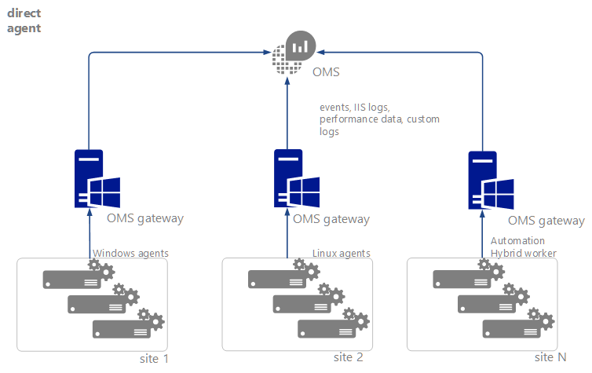
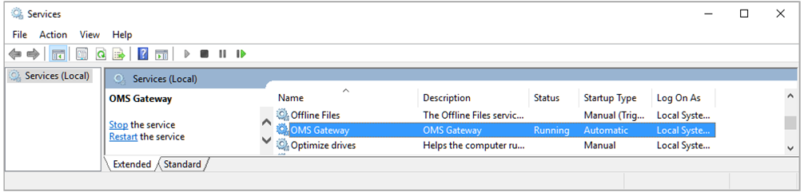
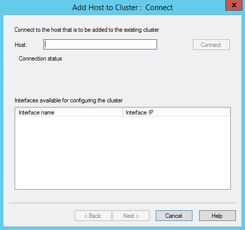
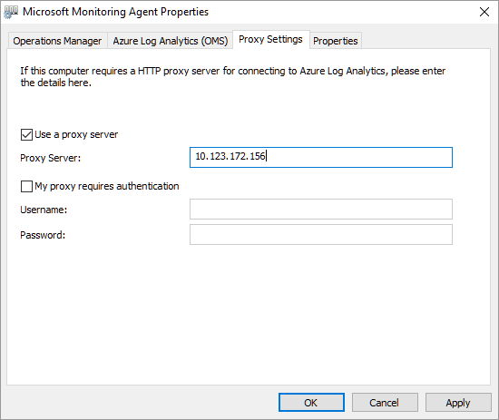
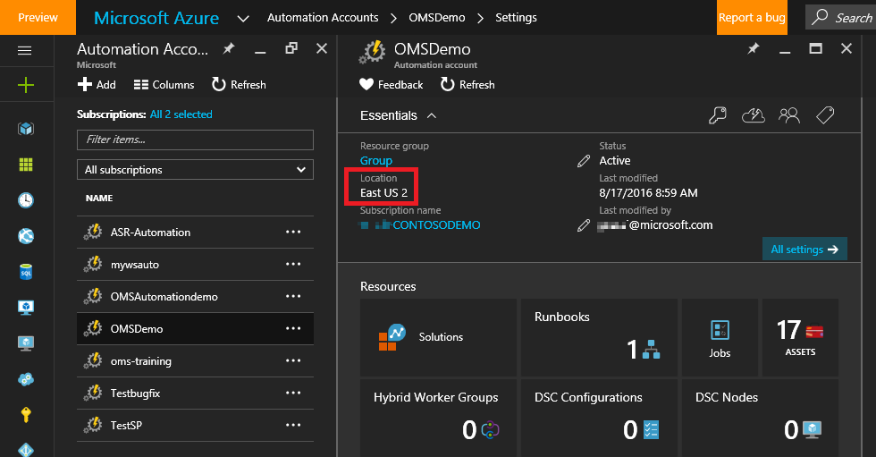

<properties
    pageTitle="Connettere dispositivi e computer OMS utilizzo del Gateway OMS | Microsoft Azure"
    description="Collegare dispositivi con gestione OMS e monitorare Operations Manager computer con il Gateway OMS per inviare dati a servizio Outlook Mobile non hanno accesso a Internet."
    services="log-analytics"
    documentationCenter=""
    authors="bandersmsft"
    manager="jwhit"
    editor=""/>
<tags
    ms.service="log-analytics"
    ms.workload="na"
    ms.tgt_pltfrm="na"
    ms.devlang="na"
    ms.topic="article"
    ms.date="10/26/2016"
    ms.author="banders"/>

# Connettersi OMS utilizzo del Gateway OMS computer e dispositivi

Questo documento descrive come i dispositivi con gestione OMS e monitorate System Center Operations Manager SCOM computer possibile inviare dati al servizio Outlook Mobile non hanno accesso a Internet. Il Gateway OMS può raccogliere i dati e inviarlo al servizio Outlook Mobile per suo conto.

Il gateway è un proxy di inoltro HTTP che supporta il tunneling HTTP utilizzando il comando HTTP connettersi. Il gateway è in grado di gestire fino a 2.000 dispositivi OMS contemporaneamente connessi quando viene eseguiti su una CPU core 4, 16 GB server che esegue Windows.

Ad esempio, grande organizzazione di potrebbe essere server con la connettività di rete ma che non si disponga di connettività Internet. In un altro esempio, potrebbe essere punto molti dei dispositivi di vendita (POS) senza alcuna possibilità di monitoraggio loro direttamente. In un altro esempio Operations Manager possono utilizzare il Gateway OMS come server proxy. In questi esempi Gateway OMS possibile trasferire i dati da agenti installati su questi server o dispositivi POS per OMS.

Invece di ogni singolo agente invio i dati direttamente OMS e che richiede una connessione Internet diretta, tutti i dati dell'agente verrà inviato tramite un singolo computer dotato di connessione Internet. Computer è possibile installare e usare il gateway. In questo scenario, è possibile installare gli agenti in qualsiasi computer in cui si desidera raccogliere dati. Il gateway quindi trasferisce dati dagli agenti OMS direttamente, ovvero il gateway non analizzare i dati vengono trasferiti.

Per controllare il Gateway OMS e analizzare le prestazioni o dati dell'evento per il server in cui è installato, è necessario installare l'agente OMS nel computer in cui è installato anche il gateway.

Il gateway deve avere accesso a Internet per caricare dati OMS. Ogni agente deve inoltre includere la connettività di rete al gateway corrispondente in modo che gli agenti è possono trasferire automaticamente i dati da e verso il gateway. Per ottenere risultati ottimali, non installare il gateway su un computer che è anche un controller di dominio.

Ecco un diagramma che mostra il flusso di dati da parte di agenti diretti a OMS.

Ecco un diagramma che mostra il flusso di dati da Operations Manager a OMS.

## Installare il Gateway OMS

Installare il Gateway sostituisce le versioni precedenti del Gateway che sia installato (registro Analitica inoltro).

Prerequisiti: .net Framework 4.5, Windows Server 2012 R2 SP1 e versioni successive

1. Scaricare la versione più recente del Gateway OMS dall' [Area Download Microsoft](http://download.microsoft.com/download/2/5/C/25CF992A-0347-4765-BD7D-D45D5B27F92C/OMS%20Gateway.msi).
2. Per avviare l'installazione, fare doppio clic su **Gateway.msi OMS**.
3. Nella pagina di benvenuto, **successivo**.  
    
4. Nella pagina Contratto di licenza selezionare **accetto i termini del contratto di licenza** per accettare il contratto di licenza, quindi scegliere **Avanti**.
5. Nella pagina indirizzo le porte e i proxy:
    1. Digitare il numero di porta TCP da utilizzare per il gateway. Il programma di installazione verrà visualizzata questo numero di porta da Windows firewall. Il valore predefinito è 8080.
    Intervallo valido del numero di porta è 1-65535. Se l'input non è compreso nell'intervallo, viene visualizzato un messaggio di errore.
    2. Facoltativamente, se il server in cui è installato il gateway deve utilizzare un proxy, digitare l'indirizzo proxy nel punto in cui il gateway deve connettersi. Ad esempio `http://myorgname.corp.contoso.com:80` se vuoto, il gateway tenterà di connettersi a Internet direttamente. In caso contrario, il gateway si connette al proxy. Se il server proxy richiede l'autenticazione, digitare il nome utente e la password.
          
    3. Fare clic su **Avanti**
6. Se non si dispone di Microsoft Updates abilitato, verrà visualizzata la pagina Microsoft Update in cui è possibile scegliere di abilitare Microsoft Updates. Effettuare una selezione e quindi fare clic su **Avanti**. In caso contrario, continuare con il passaggio successivo.
7. Nella pagina cartella di destinazione, lasciare la cartella predefinita **%ProgramFiles%\OMS Gateway** o digitare il percorso in cui si vuole installare gateway e quindi fare clic su **Avanti**.
8. Nella schermata pagina di installazione fare clic su **Installa**. Controllo Account utente potrebbero essere visualizzati richiesta l'autorizzazione per l'installazione. In caso affermativo, fare clic su **Sì**.
9. Al termine dell'installazione, fare clic su **Fine**. È possibile verificare che il servizio è in esecuzione aprendo snap-in Services. msc e verificare che **Il Gateway OMS** visualizzati nell'elenco dei servizi.  
    

## Installare un agente nei dispositivi

Se necessario, vedere [computer Windows connettersi per Analitica Log](log-analytics-windows-agents.md) per informazioni su come installare direttamente connessi agenti. L'articolo viene descritto come è possibile installare l'agente utilizzando una procedura guidata configurazione o la riga di comando.

## Configurare gli agenti OMS

Vedere [configurare le impostazioni proxy e firewall con l'agente di monitoraggio di Microsoft](log-analytics-proxy-firewall.md) per informazioni sulla configurazione di un agente per l'utilizzo di un server proxy, in questo caso il gateway.

Agenti Operations Manager inviano alcuni dati, ad esempio gli avvisi, valutazione di configurazione, spazio istanza e dati capacità, tramite il Server di gestione di Operations Manager. Altri dati di volumi elevati, ad esempio i registri IIS, prestazioni e sicurezza vengono inviati direttamente al Gateway OMS. Per un elenco completo dei dati inviati tramite ogni canale, vedere [aggiungere Analitica Log soluzioni dalla raccolta soluzioni](log-analytics-add-solutions.md) .

>[AZURE.NOTE]
Se si prevede di utilizzare il Gateway con il bilanciamento del carico di rete, vedere [Se si desidera configurare Bilanciamento del carico di rete](#optionally-configure-network-load-balancing).

## Configurare un server proxy SCOM

Configurare Operations Manager per aggiungere il gateway dovrà fungere da un server proxy. Quando si aggiorna la configurazione del proxy, la configurazione del proxy viene automaticamente applicata a tutti gli agenti dei report per Operations Manager.

Per utilizzare il Gateway per supportare Operations Manager, è necessario che:

- Agente di monitoraggio di Microsoft (versione agente – **8.0.10900.0** e versioni successive) installato sul server Gateway e configurato per le aree di lavoro OMS con cui si desidera comunicare.
- Il gateway deve essere la connessione a Internet o essere connesso a un server proxy che li.

### Per configurare SCOM per il gateway

1. Aprire la console di Operations Manager in **Operazioni Management Suite**, fare clic su **connessione** e quindi fare clic su **Configura Server Proxy**:  
    
2. Selezionare **Usa un server proxy per accedere a operazioni Management Suite** e quindi digitare l'indirizzo IP del server OMS Gateway. Assicurarsi che sia attiva la `http://` prefisso:  
    
3. Fare clic su **Fine**. Il server Operations Manager è connesso nell'area di lavoro OMS.

## Configurare il bilanciamento del carico di rete

È possibile configurare il gateway per disponibilità usando mediante la creazione di un cluster di bilanciamento del carico di rete. Il cluster gestisce il traffico dagli agenti reindirizzare le connessioni richieste da agenti di monitoraggio di Microsoft tra i nodi. Se un server di Gateway viene interrotto, il traffico venga reindirizzato ad altri nodi.

1. Aprire Gestione bilanciamento del carico di rete e creare un cluster.
2. Il pulsante destro del cluster prima di aggiungere gateway e selezionare **proprietà Cluster.** Configurare il cluster per indirizzo IP:  
    
3. Per connettere un server Gateway OMS con l'agente di monitoraggio di Microsoft installate, destro indirizzo IP del cluster e quindi fare clic su **Aggiungi Host al Cluster**.  
    
4. Immettere l'indirizzo IP del server del Gateway che si desidera connettersi:  
    
5. Nei computer che non dispone di connettività Internet, assicurarsi di usare l'indirizzo IP del cluster quando si configura le **Proprietà dell'agente di monitoraggio di Microsoft**:  
    

## Configurare per worker ibrido di automazione

Se si dispone dei collaboratori ibrido automazione nel proprio ambiente, la procedura seguente fornisce soluzioni alternative manuale, temporanei per configurare il Gateway per supportare tali.

Nei passaggi seguenti, è necessario conoscere l'area geografica di Azure in cui si trova l'account di automazione. Per individuare la posizione:

1. Accedere al [portale di Azure](https://portal.azure.com/).
2. Selezionare il servizio di automazione di Azure.
3. Selezionare l'account Azure automazione appropriato.
4. Visualizzazione dell'area in **posizione**.  
    

Utilizzare le tabelle seguenti per identificare l'URL per ogni posizione:

**URL di servizi di processo runtime dati**

| **posizione** | **URL** |
| --- | --- |
| America del Nord centrale USA | ncus-jobruntimedata-produzione-su1.azure-automation.net |
| Europa occidentale | Abbiamo-jobruntimedata-produzione-su1.azure-automation.net |
| Sud centrale USA | scus-jobruntimedata-produzione-su1.azure-automation.net |
| Stati Uniti orientali | EUS-jobruntimedata-produzione-su1.azure-automation.net |
| Canada centrale | cc-jobruntimedata-produzione-su1.azure-automation.net |
| Europa Nord America | ne-jobruntimedata-produzione-su1.azure-automation.net |
| Asia sudorientale | mare-jobruntimedata-produzione-su1.azure-automation.net |
| India centrale | CID-jobruntimedata-produzione-su1.azure-automation.net |
| Giappone | jpe-jobruntimedata-produzione-su1.azure-automation.net |
| Australia | ASE-jobruntimedata-produzione-su1.azure-automation.net |

**URL di servizi dell'agente**

| **posizione** | **URL** |
| --- | --- |
| America del Nord centrale USA | ncus-agentservice-produzione-1.azure-automation.net |
| Europa occidentale | Abbiamo-agentservice-produzione-1.azure-automation.net |
| Sud centrale USA | scus-agentservice-produzione-1.azure-automation.net |
| Stati Uniti orientali | eus2-agentservice-produzione-1.azure-automation.net |
| Canada centrale | cc-agentservice-produzione-1.azure-automation.net |
| Europa Nord America | ne-agentservice-produzione-1.azure-automation.net |
| Asia sudorientale | mare-agentservice-produzione-1.azure-automation.net |
| India centrale | CID-agentservice-produzione-1.azure-automation.net |
| Giappone | jpe-agentservice-produzione-1.azure-automation.net |
| Australia | ASE-agentservice-produzione-1.azure-automation.net |

Se il computer è registrato come un lavoro ibrido automaticamente per l'applicazione patch utilizzando la soluzione di gestione degli aggiornamenti, utilizzare la procedura seguente:

1. Aggiungere gli URL di servizio dati di Runtime del processo all'elenco di Host consentiti nel Gateway OMS. Per esempio: `Add-OMSGatewayAllowedHost we-jobruntimedata-prod-su1.azure-automation.net`
2. Riavviare il servizio Outlook Mobile Gateway utilizzando il seguente cmdlet di PowerShell:`Restart-Service OMSGatewayService`

Se nel computer è in-aggiunta all'automazione di Azure utilizzando il cmdlet di registrazione lavoro ibrido, usare la procedura seguente:

1. Aggiungere l'URL di registrazione del servizio agente all'elenco di Host consentiti nel Gateway OMS. Per esempio:`Add-OMSGatewayAllowedHost ncus-agentservice-prod-1.azure-automation.net`
2. Aggiungere gli URL di servizio dati di Runtime del processo all'elenco di Host consentiti nel Gateway OMS. Per esempio: `Add-OMSGatewayAllowedHost we-jobruntimedata-prod-su1.azure-automation.net`
3. Riavviare il servizio Outlook Mobile Gateway.
    `Restart-Service OMSGatewayService`

## Cmdlet di PowerShell utili

Cmdlet consente di completare le attività che è necessario aggiornare le impostazioni di configurazione del Gateway OMS. Prima di utilizzarli, assicurarsi di:

1. Installare il Gateway OMS (MSI).
2. Aprire la finestra di PowerShell.
3. Per importare il modulo, digitare il seguente comando:`Import-Module OMSGateway`
4. Se nessun errore nel passaggio precedente, il modulo è stato importato correttamente e i cmdlet possono essere utilizzati. Tipo`Get-Module OMSGateway`
5. Dopo aver apportato le modifiche utilizzando i cmdlet, assicurarsi di riavviare il servizio Gateway.

Se viene visualizzato un errore nel passaggio 3, non è stato importato il modulo. L'errore può verificarsi quando PowerShell non riesce a trovare il modulo. È possibile trovarlo nel percorso di installazione del Gateway: c:\Programmi\Microsoft alla OMS Gateway\PowerShell.

| **Cmdlet** | **Parametri** | **Descrizione** | **Esempi** |
| --- | --- | --- | --- |
| `Set-OMSGatewayConfig` | Chiave (obbligatoria)   Valore | Consente di modificare la configurazione del servizio | `Set-OMSGatewayConfig -Name ListenPort -Value 8080` |
| `Get-OMSGatewayConfig` | Chiave | Ottiene la configurazione del servizio | `Get-OMSGatewayConfig`     `Get-OMSGatewayConfig -Name ListenPort` |
| `Set-OMSGatewayRelayProxy` | Indirizzo   Nome utente   Password | Imposta l'indirizzo (e credenziali) del proxy di inoltro (padre) | 1. impostare un proxy di risposta e le credenziali:`Set-OMSGatewayRelayProxy -Address http://www.myproxy.com:8080 -Username user1 -Password 123`     2. impostare un proxy di risposta che non richiede l'autenticazione:`Set-OMSGatewayRelayProxy -Address http://www.myproxy.com:8080`     3. deselezionare l'impostazione, proxy di risposta, ovvero non è necessario un proxy di risposta:`Set-OMSGatewayRelayProxy -Address ""` |
| `Get-OMSGatewayRelayProxy` |   | Ottiene l'indirizzo del proxy di inoltro (padre) | `Get-OMSGatewayRelayProxy` |
| `Add-OMSGatewayAllowedHost` | Host (obbligatorio) | Aggiunge l'host all'elenco consentito | `Add-OMSGatewayAllowedHost -Host www.test.com` |
| `Remove-OMSGatewayAllowedHos`t | Host (obbligatorio) | Rimuove l'host dall'elenco consentito | `Remove-OMSGatewayAllowedHost -Host www.test.com` |
| `Get-OMSGatewayAllowedHost` |   | Ottiene l'host attualmente consentito (solo configurato localmente consentito host, non includere automaticamente scaricati host consentiti) | `Get-OMSGatewayAllowedHost` |
| `Add-OMSGatewayAllowedClientCertificate` | Oggetto (obbligatorio) | Aggiunge il certificato client soggetto a elenco consentito | `Add-OMSGatewayAllowedClientCertificate -Subject mycert` |
| `Remove-OMSGatewayAllowedClientCertificate` | Oggetto (obbligatorio) | Rimuove soggetto del certificato client dall'elenco consentito | `Remove- OMSGatewayAllowedClientCertificate -Subject mycert` |
| `Get-OMSGatewayAllowedClientCertificat`e |   | Ottiene client attualmente consentite soggetti del certificato (solo i configurato localmente consentiti oggetti non includere automaticamente scaricati argomenti consentiti) | `Get-OMSGatewayAllowedClientCertificate` |

## Risoluzione dei problemi

È consigliabile installare l'agente OMS nei computer in cui il gateway installato. È quindi possibile utilizzare agente di per raccogliere gli eventi che vengono registrati per il gateway.

**ID evento Gateway OMS e le descrizioni**

Nella tabella seguente mostra l'ID e descrizioni per gli eventi del Registro di sistema OMS Gateway.

| **ID** | **Descrizione** |
| --- | --- |
| 400 | Errori dell'applicazione che non dispone di un ID specifico |
| 401 | Configurazione non corretta. Ad esempio: listenPort = "testo" anziché un numero intero |
| 402 | Eccezione nell'analisi dei messaggi di handshake TLS |
| 403 | Errore di accesso. Ad esempio: Impossibile connettersi al server di destinazione |
| 100 | Informazioni generali |
| 101 | Servizio avviato |
| 102 | Ha smesso di servizio |
| 103 | Ha ricevuto un comando HTTP connettersi dal client |
| 104 | Non un comando HTTP CONNECT |
| 105 | Server di destinazione non è presente nell'elenco consentito o porta di destinazione non è protetta porta (443)     Assicurarsi che l'agente MMA sul server Gateway e gli agenti di comunicare con il Gateway sono connessi alla stessa area di lavoro Analitica Log.|
| 105 | Errore TcpConnection-certificato Client non validi: CN = Gateway    Verificare che:     & #149; Si utilizza un Gateway con numero di versione 1.0.395.0 o versione successiva.   & #149; Agente di MMA sul server Gateway e gli agenti di comunicare con il Gateway sono connessi alla stessa area di lavoro di Log Analitica. |
| 106 | Qualsiasi motivo per cui la sessione TLS è sospetto e rifiutati |
| 107 | La sessione TLS è stata verificata |

**Contatori delle prestazioni per raccogliere**

Nella tabella seguente mostra contatori disponibili per il Gateway OMS. È possibile aggiungere contatori le prestazioni.

| **Nome** | **Descrizione** |
| --- | --- |
| Connessione di Client OMS Gateway/attivo | Numero di connessioni di rete (TCP) client attivi |
| Numero di Gateway/errori OMS | Numero di errori |
| OMS Gateway/connesso Client | Numero di client connessi |
| Conteggio di Gateway/rifiuto OMS | Numero di rifiutati a causa di un errore di convalida TLS |

## Ottenere assistenza

Quando è eseguito l'accesso aggiuntivo al portale di Azure, è possibile creare una richiesta di assistenza con il Gateway OMS o eventuali altri servizi Azure o funzionalità di un servizio.
Per richiedere assistenza, fare clic sul simbolo di punto interrogativo nell'angolo in alto a destra del portale e quindi fare clic su **nuova richiesta di assistenza**. Immettere il nuovo modulo di richiesta di supporto.

È anche possibile lasciare commenti e suggerimenti sulle OMS o Analitica Log al [forum di Microsoft Azure commenti e suggerimenti](https://feedback.azure.com/forums/267889).

## Passaggi successivi

- [Aggiungere le origini dati](log-analytics-data-sources.md) per raccogliere dati da origini connesse nell'area di lavoro OMS e archiviarlo nel repository OMS.
