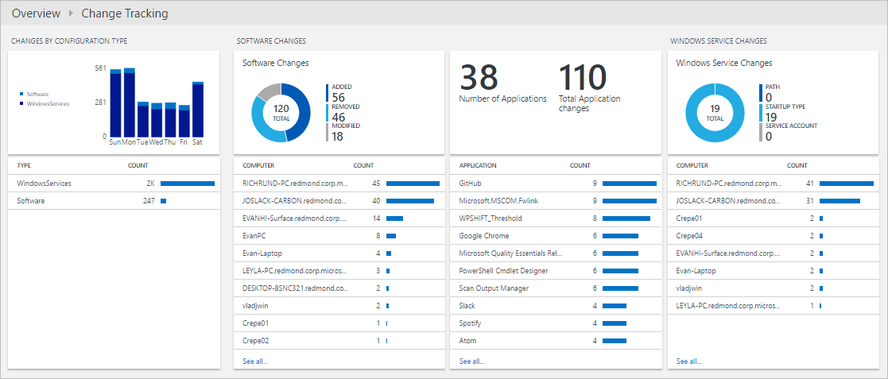

<properties
   pageTitle="Che cos'è Analitica Log? | Microsoft Azure"
   description="Registro Analitica è un servizio operazioni di gestione famiglia di prodotti (OMS) che consente di raccogliere e analizzare i dati operativi generati da risorse del cloud e ambiente locale.  In questo articolo fornisce una breve panoramica dei diversi componenti del registro Analitica e collegamenti a contenuto dettagliato."
   services="log-analytics"
   documentationCenter=""
   authors="bwren"
   manager="jwhit"
   editor="tysonn" />
<tags
   ms.service="log-analytics"
   ms.devlang="na"
   ms.topic="hero-article"
   ms.tgt_pltfrm="na"
   ms.workload="infrastructure-services"
   ms.date="09/06/2016"
   ms.author="bwren" />

# Che cos'è Analitica Log?
Registro Analitica è un servizio in [operazioni Management Suite \(OMS\) ](../operations-management-suite/operations-management-suite-overview.md) che consente di raccogliere e analizzare i dati generati da risorse del cloud e ambienti locale. Fornisce informazioni in tempo reale tramite ricerca integrata e dashboard personalizzati per analizzare rapidamente milioni di record per tutti i carichi di lavoro e i server indipendentemente dalla loro posizione fisica.

## Registro Analitica componenti
Al centro di Log Analitica è l'archivio OMS ospitato nel cloud Azure.  Dati raccolti al repository da origini connesse tramite la configurazione delle origini dati e le soluzioni aggiunta all'abbonamento.  Soluzioni e le origini dati verranno ogni creare diversi tipi di record che hanno impostato delle proprietà, ma possono comunque essere analizzati insieme nelle query per l'archivio.  In questo modo è possibile utilizzare gli stessi strumenti e i metodi per lavorare con diversi tipi di dati raccolti da origini diverse.

Origini connesse sono i computer e altre risorse che generano dati raccolti dal Log Analitica.  Può trattarsi agenti installati nel computer [Windows](log-analytics-windows-agents.md) e [Linux](log-analytics-linux-agents.md) che si connettono direttamente o in un [gruppo di gestione System Center Operations Manager connesso](log-analytics-om-agents.md).  Registro Analitica inoltre possibile raccogliere dati dallo [spazio di archiviazione Azure](log-analytics-azure-storage.md).

[Origini dati](log-analytics-data-sources.md) sono i diversi tipi di dati raccolti da ogni origine connessi.  Sono inclusi gli eventi e [dati sulle prestazioni](log-analytics-data-sources-performance-counters.md) di [Windows](log-analytics-data-sources-windows-events.md) e Linux agenti oltre alle origini, ad esempio [i registri di IIS](log-analytics-data-sources-iis-logs.md)e [registri di testo personalizzato](log-analytics-data-sources-custom-logs.md).  Configurare ogni origine dati che si desidera raccogliere e la configurazione viene inviata automaticamente a ogni origine connessi.

## Analisi dei dati Analitica Log
La maggior parte delle interazioni con registro Analitica sarà tramite il portale OMS che viene eseguito in un browser e offre accesso alle impostazioni di configurazione e più strumenti per analizzare e agire sui dati raccolti.  Dal portale è possibile sfruttare le [ricerche dei registri](log-analytics-log-searches.md) nel punto in cui si creano query per analizzare i dati raccolti, [Dashboard](log-analytics-dashboards.md) che è possibile personalizzare le visualizzazioni grafiche le ricerche più interessanti e [le soluzioni](log-analytics-add-solutions.md) che forniscono funzionalità aggiuntive e strumenti di analisi.

Registro Analitica fornisce una sintassi di query per recuperare e consolidare i dati nel repository rapidamente.  È possibile creare e salvare le [Ricerche dei registri](log-analytics-log-searches.md) per direttamente analizzare i dati nel portale di OMS o ricerche dei registri eseguiti automaticamente per creare un avviso se i risultati della query indicano una condizione importante.

Per assegnare una breve descrizione grafica dello stato dell'ambiente complessivo, è possibile aggiungere visualizzazioni per le ricerche registro salvato al [dashboard](log-analytics-dashboards.md).   

Per analizzare i dati all'esterno di Log Analitica, è possibile esportare i dati dal repository OMS in strumenti, ad esempio [Power BI](log-analytics-powerbi.md) o Excel.  È anche possibile sfruttare l' [API di registro ricerca](log-analytics-log-search-api.md) per creare soluzioni personalizzate che si avvalgono dati Log Analitica o per l'integrazione con altri sistemi.

## Soluzioni
Soluzioni aggiungono funzionalità a Log Analitica.  Sono principalmente eseguire nel cloud e fornire analisi dei dati raccolti nel repository OMS. Potrebbe inoltre definiscono nuovi tipi di record deve essere raccolto che possono essere analizzati con registro ricerche o tramite l'interfaccia utente aggiuntive fornite dalla soluzione in dashboard OMS.  

Sono disponibili soluzioni per diverse funzioni e sarà possibile accedere facilmente soluzioni disponibili e [aggiungerle all'area di lavoro OMS](log-analytics-add-solutions.md) dalla raccolta soluzioni.  Molti verrà distribuiti automaticamente e iniziare a lavorare subito mentre gli altri utenti possono richiedere alcune attività di configurazione.

## Architettura Analitica log
Requisiti di distribuzione di Log Analitica sono minimi poiché i componenti centrali sono ospitati nel cloud Azure.  Sono inclusi repository oltre ai servizi che consentono di correlare e analizzare i dati raccolti.  Il portale è possibile accedervi da qualsiasi browser in modo che non è necessario per il software client.

È necessario installare agenti in un computer [Windows](log-analytics-windows-agents.md) e [Linux](log-analytics-linux-agents.md) , ma nessun agente aggiuntivi necessari per i computer che fanno già parte di un [gruppo di gestione SCOM connesso](log-analytics-om-agents.md).  Gli agenti SCOM continuerà a comunicare con i server di gestione che i dati, la inoltra al Log Analitica.  Alcune soluzioni attraverso richiederà agenti di comunicare direttamente con registro Analitica.  La documentazione per ogni soluzione specificare i requisiti di comunicazione.

Quando si [effettua l'iscrizione a Log Analitica](log-analytics-get-started.md), è necessario creare un'area di lavoro OMS.  È possibile pensare dell'area di lavoro come ambiente OMS univoco con il proprio archivio di dati, origini dati e le soluzioni. È possibile creare più aree di lavoro nell'abbonamento supporta più ambienti, ad esempio produzione e si verifica.

## Passaggi successivi

- [Iscriversi a un account Log Analitica gratuito](log-analytics-get-started.md) per testare nel proprio ambiente.
- Visualizzare le diverse [Origini dati](log-analytics-data-sources.md) disponibili per la raccolta di dati al repository OMS.
- [Esplorare le soluzioni disponibili nella raccolta soluzioni](log-analytics-add-solutions.md) per aggiungere funzionalità a Log Analitica.
