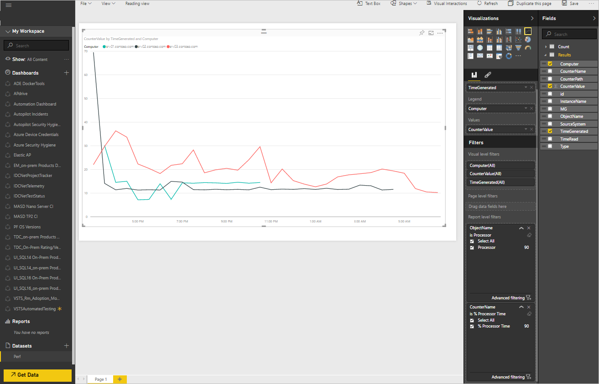

<properties
   pageTitle="Esportare dati Analitica Log in Power BI | Microsoft Azure"
   description="Power BI è un servizio di analitica aziendale basato sul cloud di Microsoft che fornisce i report e visualizzazioni avanzate per l'analisi del set di dati diversi.  Registro Analitica possibile continuamente Esporta dati dal repository OMS in Power BI in modo che è possibile sfruttare le relative visualizzazioni e gli strumenti di analisi.  In questo articolo viene descritto come configurare la query in Analitica Log che l'esportazione in Power BI automaticamente a intervalli regolari."
   services="log-analytics"
   documentationCenter=""
   authors="bwren"
   manager="jwhit"
   editor="tysonn" />
<tags
   ms.service="log-analytics"
   ms.devlang="na"
   ms.topic="article"
   ms.tgt_pltfrm="na"
   ms.workload="infrastructure-services"
   ms.date="10/18/2016"
   ms.author="bwren" />

# Esportare dati Analitica Log in Power BI

[Power BI](https://powerbi.microsoft.com/documentation/powerbi-service-get-started/) è un servizio di analitica business basato sul cloud di Microsoft che fornisce i report e visualizzazioni avanzate per l'analisi del set di dati diversi.  Registro Analitica possibile automaticamente Esporta dati dal repository OMS in Power BI in modo che è possibile sfruttare le relative visualizzazioni e gli strumenti di analisi.

Quando si configura Power BI con registro Analitica, si crea registra query in cui esportare i relativi risultati corrispondente set di dati in Power BI.  La query e l'esportazione continua eseguire automaticamente in base alla pianificazione definite dall'utente per mantenere il set di dati con i dati più recenti raccolti dal Log Analitica.

## Pianificazioni di Power BI

Una *Pianificazione di Power BI* include una ricerca di log che consente di esportare un set di dati dal repository OMS a un set di dati corrispondente in Power BI e una pianificazione che definisce la frequenza di esecuzione di questa ricerca per mantenere il set di dati corrente.

I campi nel set di dati corrisponderanno le proprietà dei record restituiti dalla ricerca log.  Se la ricerca restituisce i record dei diversi tipi di set di dati saranno incluse tutte le proprietà da tutti i tipi di record inclusi.  

> [AZURE.NOTE] È consigliabile utilizzare una query di ricerca log che restituisce dati non elaborati anziché eseguire qualsiasi consolidamento usando i comandi, ad esempio [misura](log-analytics-search-reference.md#measure).  È possibile eseguire le aggregazioni e calcoli in Power BI i dati non elaborati.

## Connessione OMS dell'area di lavoro di Power BI

Prima di Power BI, è possibile esportare da Log Analitica, è necessario connettere l'area di lavoro OMS al proprio account di Power BI con la procedura seguente.  

1. Nella console di OMS fare clic sul riquadro **Impostazioni** .
2. Selezionare **gli account**.
3. Nella sezione **Informazioni di area di lavoro** fare clic su **Connetti a Power BI Account**.
4. Immettere le credenziali per l'account di Power BI.

## Creare una pianificazione di Power BI

Creare una pianificazione di Power BI per ogni set di dati con la procedura seguente.

1. Nella console di OMS fare clic sul riquadro di **Ricerca dei registri** .
2. Digitare una nuova query o selezionare una ricerca salvata che restituisce i dati che si desidera esportare in **Power BI**.  
3. Fare clic sul pulsante di **Power BI** nella parte superiore della pagina per aprire la finestra di dialogo di **Power BI** .
4. Le informazioni nella tabella seguente e fare clic su **Salva**.

| Proprietà | Descrizione |
|:--|:--|
| Nome | Nome per identificare la programmazione quando si visualizza l'elenco delle programmazioni di Power BI. |
| Ricerca salvata | Ricerca dei registri per l'esecuzione.  È possibile selezionare la query corrente oppure selezionare una ricerca salvata nella casella a discesa. |
| Programmazione | La frequenza con cui eseguire la ricerca salvata ed esportare per il set di dati di Power BI.  Il valore deve essere compreso tra 24 ore e 15 minuti. |
| Nome del set di dati | Il nome del set di dati in Power BI.  Verrà creato se non esiste e aggiornato se esiste. |

## Visualizzazione e la rimozione di Power BI pianificazioni

Visualizzare l'elenco delle programmazioni di Business Intelligence Power esistenti mediante la procedura seguente.

1. Nella console di OMS fare clic sul riquadro **Impostazioni** .
2. Selezionare **Power BI**.

Oltre ai dettagli della programmazione, il numero di volte che la programmazione è eseguita nell'ultima settimana e lo stato dell'ultima sincronizzazione vengono visualizzate.  Se si verificano errori di sincronizzazione, è possibile fare clic sul collegamento per eseguire una ricerca dei registri per i record con i dettagli dell'errore.

È possibile rimuovere una pianificazione facendo clic sulla **X** nell' **rimuovere la colonna**.  È possibile disabilitare una programmazione selezionando **disattivato**.  Per modificare una pianificazione è necessario rimuoverlo e ricrearlo con le nuove impostazioni.

## Esempio di procedura dettagliata
La sezione seguente illustra un esempio di creazione di una pianificazione di Power BI e utilizzando il set di dati per creare un report semplice.  In questo esempio, tutti i dati sulle prestazioni di un insieme di computer viene esportato in Power BI e viene creato un grafico a linee per visualizzare processore.

### Creazione di ricerca dei registri
Iniziamo creando una ricerca dei registri per i dati che si desidera inviare il set di dati.  In questo esempio verrà utilizzata una query che restituisce tutti i dati delle prestazioni per i computer con un nome che inizia con *srv*.  

### Creare una ricerca di Power BI
Si fa clic sul pulsante di **Power BI** per aprire la finestra di dialogo di Power BI e fornire le informazioni richieste.  Si desidera rendere la ricerca per eseguire una volta all'ora e creare un set di dati denominato *Delle prestazioni di Contoso*.  Poiché è già aperto di ricerca che vengono creati i dati vogliamo, è mantenere il valore predefinito di *Usa query di ricerca corrente* per la **Ricerca salvata**.

### Verificare di ricerca di Power BI
Per verificare che la programmazione è stato creato correttamente, si consente di visualizzare l'elenco delle ricerche di Power BI sotto il riquadro **Impostazioni** nel dashboard OMS.  Abbiamo attendere alcuni minuti e aggiornare la visualizzazione finché non vengono segnalati che sia stata eseguita la sincronizzazione.

### Verificare il set di dati in Power BI
Abbiamo accedere l'account [powerbi.microsoft.com](http://powerbi.microsoft.com/) e scorrere fino al **set di dati** nella parte inferiore del riquadro sinistro.  È possibile vedere che il set di dati *Delle prestazioni di Contoso* sia presente che indica che l'esportazione è stato eseguito correttamente.

### Creare report in base a set di dati
Abbiamo selezionare il set di dati **Delle prestazioni di Contoso** e quindi fare clic sui **risultati** nel riquadro **campi** sulla destra per visualizzare i campi che fanno parte di questo set di dati.  Per creare un grafico a linee con processore per ogni computer, è eseguire le operazioni seguenti.

1. Selezionare il video introduttivo.
2. Controllare **processore**trascinare **nome oggetto** filtro livello per **il rapporto** .
3. Controllare **% tempo processore**trascinare **CounterName** filtro livello per **il rapporto** .
4. Trascinare **CounterValue** ai **valori**.
5. Trascinare **Computer** **legenda**.
6. Trascinare **TimeGenerated** **asse**.

È possibile vedere che il grafico a linee risultante viene visualizzato con i dati dal set di dati.

### Salvare il report
Si salva il report facendo clic sul pulsante Salva nella parte superiore dello schermo e convalidare che è ora presente nella sezione report nel riquadro sinistro.

## Passaggi successivi

- Informazioni sulle [ricerche dei registri](log-analytics-log-searches.md) creare query che possono essere esportate in Power BI.
- Per ulteriori informazioni su [Power BI](http://powerbi.microsoft.com) per creare visualizzazioni in base ai Log Analitica esportazioni.
