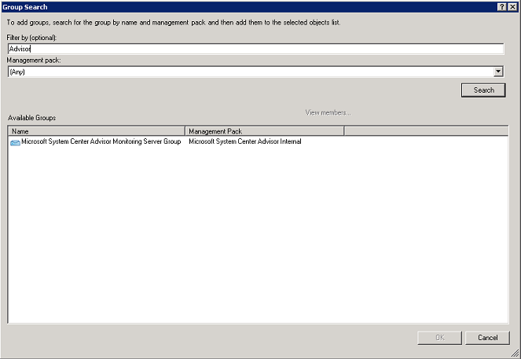
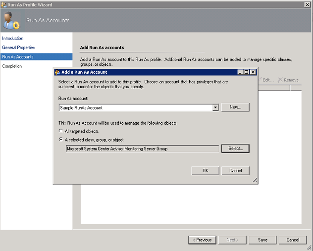

<properties
    pageTitle="Configurare le impostazioni proxy e firewall nel registro Analitica | Microsoft Azure"
    description="Configurare le impostazioni proxy e firewall quando l'agenti o servizi OMS necessario utilizzare porte specifiche."
    services="log-analytics"
    documentationCenter=""
    authors="bandersmsft"
    manager="jwhit"
    editor=""/>

<tags
    ms.service="log-analytics"
    ms.workload="na"
    ms.tgt_pltfrm="na"
    ms.devlang="na"
    ms.topic="get-started-article"
    ms.date="08/23/2016"
    ms.author="banders;magoedte"/>

# <a name="configure-proxy-and-firewall-settings-in-log-analytics"></a>Configurare le impostazioni proxy e firewall nel registro Analitica

Azioni necessarie per configurare proxy e impostazioni del firewall per Analitica Log in OMS diversi quando si utilizza Operations Manager e il relativo agenti rispetto a Microsoft monitoraggio agenti che si connettono direttamente al server. Esaminare le sezioni seguenti per il tipo di agente in uso.

## <a name="configure-proxy-and-firewall-settings-with-the-microsoft-monitoring-agent"></a>Configurare le impostazioni proxy e firewall con l'agente di monitoraggio di Microsoft

Per Agente monitoraggio di Microsoft per connettersi e registrare con il servizio Outlook Mobile, deve avere accesso al numero di porta dei domini e gli URL. Se si usa un server proxy per le comunicazioni tra l'agente e il servizio Outlook Mobile, è necessario assicurarsi che le risorse appropriate siano accessibili. Se si usa un firewall per limitare l'accesso a Internet, è necessario configurare il firewall per consentire l'accesso a OMS. Le tabelle seguenti elencano le porte che deve essere OMS.

|**Risorsa agente**|**Porte**|**Ignorare controllo HTTPS**|
|--------------|-----|--------------|
|\*. ods.opinsights.azure.com|443|Sì|
|\*. oms.opinsights.azure.com|443|Sì|
|\*. blob.core.windows.net|443|Sì|
|ODS.systemcenteradvisor.com|443| |

È possibile utilizzare la procedura seguente per configurare le impostazioni proxy per l'agente di monitoraggio di Microsoft mediante il pannello di controllo. È necessario utilizzare la procedura per ogni server. Se si dispone di più server che è necessario configurare, può risultare più semplice utilizzare uno script per automatizzare il processo. In caso affermativo, vedere la procedura seguente [per configurare le impostazioni proxy per l'agente di monitoraggio di Microsoft utilizzando uno script](#to-configure-proxy-settings-for-the-microsoft-monitoring-agent-using-a-script).

### <a name="to-configure-proxy-settings-for-the-microsoft-monitoring-agent-using-control-panel"></a>Per configurare le impostazioni proxy per l'agente di monitoraggio di Microsoft mediante il pannello di controllo

1. Aprire **il pannello di controllo**.

2. Aprire **Microsoft agente di monitoraggio**.

3. Fare clic sulla scheda **Impostazioni del Proxy** .<br>  
  

4. Selezionare **Usa un server proxy** e digitare l'URL e numero di porta, se necessario, come nell'esempio illustrato. Se il server proxy richiede l'autenticazione, digitare il nome utente e la password per accedere al server proxy.

Utilizzare la procedura seguente per creare uno script di PowerShell che è possibile eseguire per configurare le impostazioni proxy per ogni agente che si connette direttamente al server.

### <a name="to-configure-proxy-settings-for-the-microsoft-monitoring-agent-using-a-script"></a>Per configurare le impostazioni proxy per l'agente di monitoraggio di Microsoft utilizzando uno script

Copiare nell'esempio seguente viene, aggiornarla con informazioni specifiche per l'ambiente, salvarlo con estensione PS1 e quindi eseguire lo script in ogni computer che si connette direttamente al servizio Outlook Mobile.

        
    param($ProxyDomainName="http://proxy.contoso.com:80", $cred=(Get-Credential))

    # First we get the Health Service configuration object.  We need to determine if we
    #have the right update rollup with the API we need.  If not, no need to run the rest of the script.
    $healthServiceSettings = New-Object -ComObject 'AgentConfigManager.MgmtSvcCfg'

    $proxyMethod = $healthServiceSettings | Get-Member -Name 'SetProxyInfo'

    if (!$proxyMethod)
    {
         Write-Output 'Health Service proxy API not present, will not update settings.'
         return
    }

    Write-Output "Clearing proxy settings."
    $healthServiceSettings.SetProxyInfo('', '', '')

    $ProxyUserName = $cred.username

    Write-Output "Setting proxy to $ProxyDomainName with proxy username $ProxyUserName."
    $healthServiceSettings.SetProxyInfo($ProxyDomainName, $ProxyUserName, $cred.GetNetworkCredential().password)
        

## <a name="configure-proxy-and-firewall-settings-with-operations-manager"></a>Configurare le impostazioni proxy e firewall con Operations Manager

Per un gruppo di gestione Operations Manager per connettersi e registrare con il servizio Outlook Mobile, deve avere accesso ai numeri di porta del domini e URL. Se si usa un server proxy per la comunicazione tra server di gestione Operations Manager e il servizio Outlook Mobile, è necessario assicurarsi che le risorse appropriate siano accessibili. Se si usa un firewall per limitare l'accesso a Internet, è necessario configurare il firewall per consentire l'accesso a OMS. Anche se un server di gestione Operations Manager non è un server proxy, potrebbero essere suoi agenti. In questo caso, il server proxy deve essere configurato nello stesso modo agenti per attivare e Consenti la sicurezza e dati di soluzione di gestione dei registri ottenere inviare al OMS servizio web.

Affinché gli agenti Operations Manager comunicare con il servizio Outlook Mobile, l'infrastruttura di Operations Manager (inclusi gli agenti) deve avere il server proxy corretto e la versione. L'impostazione per agenti proxy viene specificato nella console di Operations Manager. La versione in uso deve essere una delle operazioni seguenti:

- Operations Manager 2012 SP1 aggiornamento cumulativo 7 o versioni successiva
- Operations Manager 2012 R2 aggiornamento cumulativo 3 o versione successiva


Le tabelle seguenti elencano le porte legate a queste attività.

>[AZURE.NOTE] Alcune di queste risorse menzionare Advisor e operative approfondimenti, entrambi sono le versioni precedenti di OMS. Nell'elenco risorse vengono modificate in futuro.

Di seguito è riportato un elenco delle porte e le risorse:<br>

|**Risorsa agente**|**Porte**|
|--------------|-----|
|\*. ods.opinsights.azure.com|443|
|\*. oms.opinsights.azure.com|443|
|\*.BLOB.Core.Windows.NET/\*|443|
|ODS.systemcenteradvisor.com|443|
<br>
Di seguito è riportato un elenco di risorse del server di gestione e porte:<br>

|**Risorsa server di gestione**|**Porte**|**Ignorare controllo HTTPS**|
|--------------|-----|--------------|
|Service.systemcenteradvisor.com|443| |
|\*. service.opinsights.azure.com|443| |
|\*. blob.core.windows.net|443|Sì| 
|Data.systemcenteradvisor.com|443| | 
|ODS.systemcenteradvisor.com|443| | 
|\*. ods.opinsights.azure.com|443|Sì| 
<br>
Di seguito è riportato un elenco di risorse console OMS e Operations Manager e porte.<br>

|**Risorse console OMS e Operations Manager**|**Porte**|
|----|----|
|Service.systemcenteradvisor.com|443|
|\*. service.opinsights.azure.com|443|
|\*. live.com|Porte 80 e 443|
|\*. microsoft.com|Porte 80 e 443|
|\*. microsoftonline.com|Porte 80 e 443|
|\*. mms.microsoft.com|Porte 80 e 443|
|Login.Windows.NET|Porte 80 e 443|
<br>

Utilizzare le procedure seguenti per registrare il gruppo di gestione Operations Manager con il servizio Outlook Mobile. Se si sono verificati problemi di comunicazione tra il gruppo di gestione e il servizio Outlook Mobile, utilizzare le procedure di convalida per risolvere i problemi di trasmissione dei dati per il servizio Outlook Mobile.

### <a name="to-request-exceptions-for-the-oms-service-endpoints"></a>Per richiedere eccezioni per gli endpoint del servizio OMS

1. Usare le informazioni della prima tabella presentata in precedenza per fare in modo che le risorse necessarie per il server di gestione Operations Manager siano accessibili a tutti i firewall potrebbe essere.
2. Usare le informazioni della seconda tabella presentata in precedenza per fare in modo che le risorse necessarie per la console di operazioni in Operations Manager e OMS siano accessibili a tutti i firewall potrebbe essere.
3. Se si usa un server proxy in Internet Explorer, assicurarsi che sia configurato e che funziona correttamente. Per verificare, è possibile aprire una connessione web protetta (HTTPS), ad esempio [https://bing.com](https://bing.com). Se la connessione web protetta non funziona in un browser, probabilmente non funziona nella console di Operations Manager con i servizi web nel cloud.

### <a name="to-configure-the-proxy-server-in-the-operations-manager-console"></a>Per configurare il server proxy nella console di Operations Manager

1. Aprire la console di Operations Manager e selezionare l'area di lavoro di **amministrazione** .

2. Espandere **Approfondimenti operative**e quindi selezionare **Operativi approfondimenti connessione**.<br>  
    
3. Nella visualizzazione OMS connessione, fare clic su **Configura Server Proxy**.<br>  
    
4. In operativi approfondimenti guidata delle impostazioni: Server Proxy, selezionare **Usa un server proxy per accedere al servizio Web approfondimenti operative**e quindi digitare l'URL che contiene la porta numerici, ad esempio **http://myproxy:80**.<br>  
    


### <a name="to-specify-credentials-if-the-proxy-server-requires-authentication"></a>Per specificare le credenziali se il server proxy richiede l'autenticazione
 Impostazioni e le credenziali del server proxy necessario propagarsi ai computer gestiti che segnalerà OMS. I server dovrebbero essere *Microsoft System Center Advisor Monitoring Server gruppo*. Credenziali vengono crittografate nel Registro di sistema di ogni server nel gruppo.

1. Aprire la console di Operations Manager e selezionare l'area di lavoro di **amministrazione** .
2. Selezionare **i profili** **RunAs configurazione**.
3. Aprire il profilo **System Center Advisor eseguire come profilo Proxy** .  
    
4. Eseguire come profilo guidata fare clic su **Aggiungi** per usare un account Esegui come. È possibile creare un nuovo account Esegui come o utilizzare un account esistente. Questo account deve disporre delle autorizzazioni sufficienti per passano attraverso il server proxy.  
    
5. Per impostare l'account per la gestione, scegliere **una classe selezionata, gruppo o un oggetto** per aprire la casella di ricerca di oggetto.  
    
6. Cercare, quindi selezionare **Microsoft System Center Advisor Monitoring Server gruppo**.  
    
7. Fare clic su **OK** per chiudere la finestra account Esegui come Aggiungi.  
    
8. Completare la procedura guidata e salvare le modifiche.  
    


### <a name="to-validate-that-oms-management-packs-are-downloaded"></a>Per convalidare la gestione di OMS vengono scaricati Pack

Se è stato aggiunto soluzioni a OMS, è possibile visualizzarli nella console di Operations Manager come management pack in **amministrazione**. Cercare *System Center Advisor* per trovarle rapidamente.  
     o, è anche possibile cercare OMS management pack utilizzando il comando di Windows PowerShell seguente nel server di gestione Operations Manager:

    ```
    Get-ScomManagementPack | where {$_.DisplayName -match 'Advisor'} | select Name,DisplayName,Version,KeyToken
    ```

### <a name="to-validate-that-operations-manager-is-sending-data-to-the-oms-service"></a>Per convalidare tale Operations Manager invia dati al servizio Outlook Mobile

1. In server di gestione Operations Manager aprire Performance Monitor (perfmon.exe) e selezionare **Prestazioni**.
2. Fare clic su **Aggiungi**e quindi selezionare **Integrità servizio di gestione dei gruppi**.
3. Aggiungere tutti i contatori che iniziano con **HTTP**.  
    
4. Se la configurazione di Operations Manager è utile, che si vedrà attività per contatori di gestione di integrità dei servizi per gli eventi e altri elementi di dati, in base a management pack che si aggiungono nella OMS e i criteri di raccolta registro configurato.  
    


## <a name="next-steps"></a>Passaggi successivi

- [Aggiungere Analitica Log soluzioni dalla raccolta soluzioni](log-analytics-add-solutions.md) per aggiungere la funzionalità e raccogliere dati.
- Acquisire familiarità con [le ricerche log](log-analytics-log-searches.md) visualizzare informazioni dettagliate raccolte da soluzioni.
