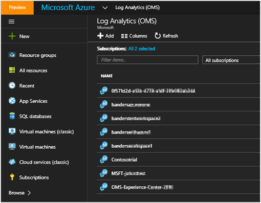
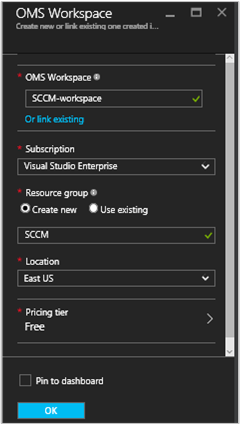
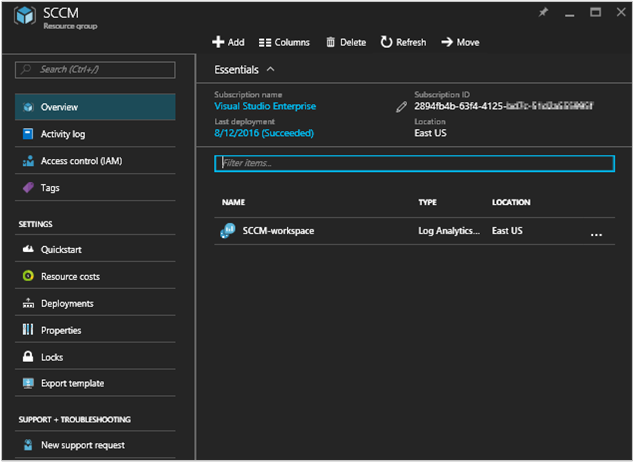
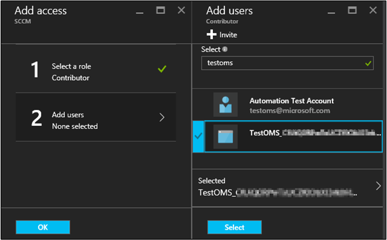
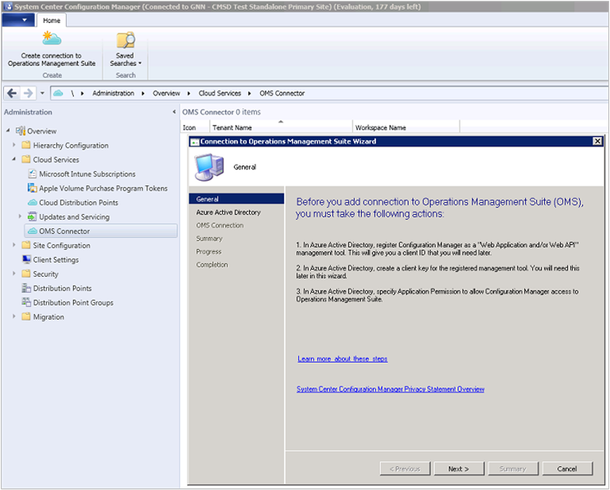

<properties
    pageTitle="Connettersi Gestione configurazione Log Analitica | Microsoft Azure"
    description="In questo articolo illustra la procedura per connettersi Configuration Manager Analitica Log e avvio dell'analisi dei dati."
    services="log-analytics"
    documentationCenter=""
    authors="bandersmsft"
    manager="jwhit"
    editor=""/>

<tags
    ms.service="log-analytics"
    ms.workload="na"
    ms.tgt_pltfrm="na"
    ms.devlang="na"
    ms.topic="article"
    ms.date="08/29/2016"
    ms.author="banders"/>

# Connettersi Gestione configurazione Log Analitica

È possibile connettersi Analitica Log in OMS System Center Configuration Manager sincronizzazione dispositivo raccolta dati. In questo modo disponibile in OMS dati della distribuzione di Configuration Manager.

Esistono diversi passaggi necessari per connettersi Configuration Manager OMS, di seguito è riportata una rapida panoramica del processo globale:

1. Nel portale di gestione di Azure, registrare Configuration Manager come un'applicazione Web e/o API Web app e verificare di disporre di ID client segreto client dalla registrazione da Azure Active Directory. Vedere [portale usare per creare l'applicazione di Active Directory e servizio principale che possono accedere alle risorse](../resource-group-create-service-principal-portal.md) per informazioni dettagliate su come eseguire questo passaggio.
2. Nel portale di gestione di Azure, [fornire Configuration Manager (app web registrato) con autorizzazioni di accesso OMS](#provide-configuration-manager-with-permissions-to-oms).
3. In Gestione configurazione, [aggiungere una connessione tramite la creazione guidata connessione OMS](#add-an-oms-connection-to-configuration-manager).
4. In Gestione configurazione, è possibile [aggiornare le proprietà di connessione](#update-oms-connection-properties) se la chiave privata password o client mai scade o viene persa.
5. Informazioni dal portale di OMS, [scaricare e installare Microsoft Monitoring Agent](#download-and-install-the-agent) nel computer che esegue la connessione al servizio Gestione configurazione posizionare il ruolo di sistema del sito. L'agente invia dati Configuration Manager OMS.
6. In OMS, [importare raccolte da Configuration Manager](#import-collections) come gruppi di computer.
7. In OMS, visualizzare i dati da Configuration Manager come [gruppi di computer](log-analytics-computer-groups.md).

È possibile leggere informazioni sulla connessione Configuration Manager a OMS dati [sincronizzazione da Gestione configurazione per la famiglia di prodotti Microsoft Gestione operazioni](https://technet.microsoft.com/library/mt757374.aspx).

## Fornire OMS Configuration Manager con le autorizzazioni

La procedura seguente consente il portale di gestione di Azure con autorizzazioni di accesso OMS. In particolare, è necessario concedere il *ruolo di collaboratore* per gli utenti del gruppo di risorse. A sua volta, che consente il portale di gestione di Azure a cui connettersi OMS Configuration Manager.

>[AZURE.NOTE] È necessario specificare le autorizzazioni per OMS per Configuration Manager. In caso contrario, verrà visualizzato un messaggio di errore quando si utilizza la configurazione guidata in Gestione configurazione.

1. Aprire il [portale di Azure](https://portal.azure.com/) e fare clic su **Sfoglia** > **Log Analitica (OMS)** per aprire e il Log Analitica (OMS).  
2. Scegliere **Aggiungi** per aprire e il **OMS dell'area di lavoro** e il **Log Analitica (OMS)** .  
  
3. Specificare le informazioni seguenti e il **OMS dell'area di lavoro** , quindi **OK**.
  - **Area di lavoro OMS**
  - **Abbonamento**
  - **Gruppo di risorse**
  - **Posizione**
  - **Prezzi livello**  
      

    >[AZURE.NOTE] L'esempio precedente consente di creare un nuovo gruppo di risorse. Il gruppo di risorse è utilizzato solo con le autorizzazioni per l'area di lavoro OMS in questo esempio per Configuration Manager.

4. Fare clic su **Sfoglia** > **gruppi di risorse** per aprire e il **gruppi di risorse** .
5. In e il **gruppi di risorse** , fare clic sul gruppo di risorse che è stato creato in precedenza per aprire la &lt;nome gruppo di risorse&gt; blade impostazioni.  
  
6. Nel &lt;nome gruppo di risorse&gt; blade impostazioni, fare clic su controllo di accesso (IAM) per aprire la &lt;nome gruppo di risorse&gt; blade utenti.  
    
7. Nel &lt;nome gruppo di risorse&gt; blade utenti, fare clic su **Aggiungi** per aprire e il **componente accesso** .
8. In e il **componente accesso** , fare clic su **Seleziona un ruolo**e quindi selezionare il ruolo di **Collaboratore** .  
    
9. Fare clic su **aggiungere utenti**, selezionare l'utente Configuration Manager, fare clic su **Seleziona**e quindi fare clic su **OK**.  
    

## Aggiungere una connessione OMS a Configuration Manager

Per aggiungere una connessione OMS, l'ambiente di Gestione configurazione deve avere una [connessione al servizio scegliere](https://technet.microsoft.com/library/mt627781.aspx) configurato per la modalità online.

1. Nell'area di **amministrazione** di Configuration Manager selezionare **OMS connettore**. Verrà aperta la **Connessione guidata OMS**. Selezionare **Avanti**.

2. Nella schermata **Generale** verificare eseguite le operazioni seguenti e dettagli per ogni elemento e quindi selezionare **Avanti**.
  1. Nel portale di gestione di Azure, è stato registrato Configuration Manager come un'applicazione Web e/o API Web app e disporre l' [ID client dalla registrazione](../active-directory/active-directory-integrating-applications.md).
  2. Nel portale di gestione di Azure, è stata creata una chiave segreta app per l'app registrato in Azure Active Directory.  
  3. Nel portale di gestione di Azure, rese disponibili app web registrato con autorizzazioni di accesso OMS.  
  

3. Nella schermata di **Azure Active Directory** , configurare le impostazioni di connessione per OMS fornendo il **Tenant** , **l'ID Client** e **Chiave segreto del Client** , quindi selezionare **Avanti**.  
  

4. Se sono state eseguite correttamente tutte le altre procedure, le informazioni nella schermata di **Configurazione della connessione OMS** verranno automaticamente inclusi in questa pagina. Dovrebbero essere visualizzate informazioni per le impostazioni di connessione per **l'abbonamento Azure** , **gruppo risorse Azure** e **Area di lavoro di operazioni di gestione famiglia di prodotti**.  
  

5. La procedura guidata si connette al servizio Outlook Mobile utilizzando le informazioni di che aver immesso. Selezionare le raccolte di dispositivo che si desidera sincronizzare con OMS e quindi fare clic su **Aggiungi**.  
  

6. Verificare le impostazioni di connessione nella schermata di **Riepilogo** , quindi selezionare **Avanti**. Schermata di **avanzamento** del Mostra lo stato di connessione e quindi deve **completare**.

>[AZURE.NOTE] È necessario connettersi OMS al sito di livello superiore nella gerarchia. Se si connette OMS a un sito principale autonomo e quindi aggiunta un sito di amministrazione centrale per il proprio ambiente, è necessario eliminare e ricreare la connessione OMS all'interno della nuova gerarchia.

Dopo aver collegato Configuration Manager a OMS, è possibile aggiungere o rimuovere le raccolte e visualizzare le proprietà della connessione OMS.

## Aggiornare le proprietà di connessione OMS

Se una chiave segreta password o client mai scade o viene persa, è necessario aggiornare manualmente le proprietà di connessione OMS.

1. In Gestione configurazione passare ai **Servizi Cloud** e quindi selezionare **Il connettore OMS** per aprire la pagina **Delle proprietà di connessione OMS** .
2. In questa pagina, fare clic sulla scheda **Azure Active Directory** per visualizzare il **Tenant**, **ID Client**, **scadenza chiave segreta Client**. **Verificare** la **chiave privata Client** se è scaduto.

## Scaricare e installare l'agente

1. Nel portale OMS, [scaricare il file di configurazione dell'agente da OMS](log-analytics-windows-agents.md#download-the-agent-setup-file-from-oms).
2. Utilizzare uno dei metodi seguenti per installare e configurare l'agente del computer che esegue il ruolo di sistema Gestione configurazione del servizio connessione punto del sito:
  - [Installare l'agente utilizzando il programma di installazione](log-analytics-windows-agents.md#install-the-agent-using-setup)
  - [Installare l'agente utilizzando la riga di comando](log-analytics-windows-agents.md#install-the-agent-using-the-command-line)
  - [Installare l'agente utilizzando DSC automazione Azure](log-analytics-windows-agents.md#install-the-agent-using-dsc-in-azure-automation)

## Raccolte di importazione

Dopo aver aggiunto una connessione OMS a Configuration Manager e installato l'agente del computer che esegue la connessione al servizio Gestione configurazione scegliere il ruolo di sistema del sito, il passaggio successivo consiste nell'importare raccolte da Configuration Manager in OMS come gruppi di computer.

Dopo l'attivazione di importazione, le informazioni sull'appartenenza insieme ricavate ogni tre ore per mantenere aggiornate le appartenenze insieme. È possibile scegliere di disattivare importazione in qualsiasi momento.

1. Nel portale di OMS fare clic su **Impostazioni**.
2. Fare clic sulla scheda **Gruppi di Computer** e quindi fare clic sulla scheda **SCCM** .
3. Selezionare **l'appartenenza ai insieme importazione Configuration Manager** e quindi fare clic su **Salva**.  
  

## Visualizzare i dati da Configuration Manager

Dopo aver aggiunto una connessione OMS a Configuration Manager e installato l'agente del computer che esegue il ruolo di sistema Gestione configurazione del servizio connessione punto del sito, i dati dell'agente di vengono inviati al OMS. In OMS, le raccolte di Configuration Manager vengono visualizzati come [gruppi di computer](log-analytics-computer-groups.md). È possibile visualizzare i gruppi dalla pagina **Configuration Manager** in **Gruppi di Computer** nella **sezione Impostazioni**.

Dopo avere importati gli insiemi di file, è possibile visualizzare il numero di computer con le appartenenze insieme è stato rilevato. È anche possibile visualizzare il numero di raccolte che sono state importate.

Quando si fa clic su uno, viene visualizzata ricerca contenente tutti i gruppi importati o tutti i computer che appartengono a ogni gruppo. Funzionalità di [Ricerca di Log](log-analytics-log-searches.md), è possibile avviare approfondito per i dati di Configuration Manager.

## Passaggi successivi

- Utilizzare [Ricerca dei registri](log-analytics-log-searches.md) per visualizzare informazioni dettagliate sui dati Configuration Manager.
