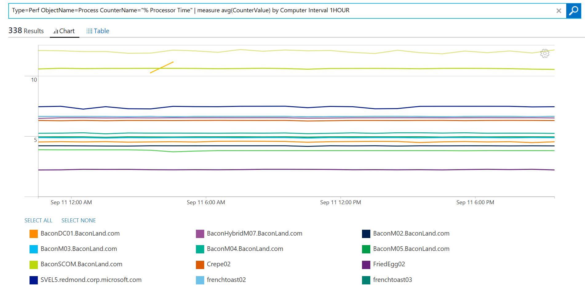
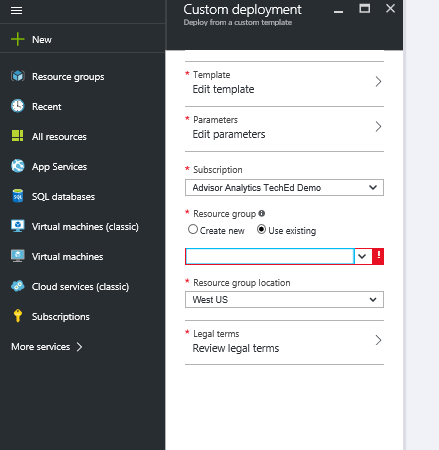

<properties
    pageTitle="Ottimizzare l'ambiente con la soluzione servizio tessuti nel Log Analitica | Microsoft Azure"
    description="È possibile utilizzare la soluzione tessuti servizio per valutare il rischio e l'integrità del servizio tessuti applicazioni, micro-servizi, nodi e cluster."
    services="log-analytics"
    documentationCenter=""
    authors="niniikhena"
    manager="jochan"
    editor=""/>

<tags
    ms.service="log-analytics"
    ms.workload="na"
    ms.tgt_pltfrm="na"
    ms.devlang="na"
    ms.topic="article"
    ms.date="09/21/2016"
    ms.author="nini"/>


# <a name="service-fabric-solution-in-log-analytics"></a>Soluzione tessuti Service nel Log Analitica

> [AZURE.SELECTOR]
- [Manager delle risorse](log-analytics-service-fabric-azure-resource-manager.md)
- [PowerShell](log-analytics-service-fabric.md)

In questo articolo viene descritto come utilizzare la soluzione servizio tessuti nel Log Analitica per identificare e risolvere i problemi attraverso il cluster servizio tessuti.

La soluzione servizio tessuti utilizza dati di Azure diagnostica da macchine virtuali tessuti il servizio, mediante la raccolta di dati delle tabelle di Azure tampone. Registro Analitica legge quindi tessuti servizio framework eventi, inclusi **Eventi Service affidabile**, **Attore eventi**, **Gli eventi operativi**e **gli eventi ETW personalizzata**. Con dashboard soluzione in grado di visualizzare problemi rilevanti e gli eventi importanti nel proprio ambiente servizio tessuti.

Per iniziare con la soluzione, sarà necessario connettere il cluster tessuti servizio a un'area di lavoro Log Analitica. Ecco tre scenari da considerare:

1. Se non è stato distribuito il cluster servizio tessuti, usare i passaggi descritti ***distribuire un Cluster di tessuti servizi connessi a un'area di lavoro Analitica Log*** per distribuire un nuovo cluster e stata configurata al report per Log Analitica.

2. Se è necessario raccogliere contatori con l'host usare altre soluzioni OMS, ad esempio sicurezza il cluster di tessuti servizio, seguire i passaggi descritti in ***distribuire un Cluster di tessuti servizi connessi a un'area di lavoro OMS con estensione macchine Virtuali installata.***

3. Se è già stato distribuito il cluster tessuti servizio e si desidera connetterlo al Log Analitica, seguire i passaggi descritti in ***aggiunta di un account di archiviazione esistente a Log Analitica.***


##<a name="deploy-a-service-fabric-cluster-connected-to-a-log-analytics-workspace"></a>Distribuire un Cluster di tessuti servizio connesso a un'area di lavoro Log Analitica.
Questo modello esegue le operazioni seguenti:


1. Consente di distribuire un cluster di Azure servizio tessuti già connesso a un'area di lavoro Log Analitica. È disponibile l'opzione per creare una nuova area di lavoro quando si distribuisce il modello o input il nome di un'area di lavoro Analitica Log già esistente.
2. Aggiunge l'account di archiviazione diagnostica nell'area di lavoro Log Analitica.
3. Attiva soluzione tessuti servizio nell'area di lavoro Log Analitica.

[](https://portal.azure.com/#create/Microsoft.Template/uri/https%3A%2F%2Fraw.githubusercontent.com%2Fazure%2Fazure-quickstart-templates%2Fmaster%2Fservice-fabric-oms%2F%2Fazuredeploy.json)


Dopo aver selezionato pulsante Distribuisci, verranno recapitati nel portale di Azure con parametri per la modifica. Assicurarsi di creare un nuovo gruppo di risorse se si immettono un nuovo nome di un'area di lavoro Analitica Log: 


Accettare le condizioni legali e premere "Creare" per avviare la distribuzione. Al termine della distribuzione, vedere la nuova area di lavoro e cluster creato e la WADServiceFabric * evento, WADWindowsEventLogs e WADETWEvent tabelle aggiunte:


##<a name="deploy-a-service-fabric-cluster-connected-to-an-oms-workspace-with-vm-extension-installed"></a>Distribuire un Cluster di tessuti servizio connesso a un'area di lavoro OMS con estensione macchine Virtuali installato.
Questo modello esegue le operazioni seguenti:

1. Consente di distribuire un cluster di Azure servizio tessuti già connesso a un'area di lavoro Log Analitica. È possibile creare una nuova area di lavoro o utilizzarne uno esistente.
2. Aggiunge gli account di archiviazione diagnostica nell'area di lavoro Log Analitica.
3. Attiva soluzione tessuti servizio nell'area di lavoro Log Analitica.
4. Installa l'estensione agente MMA in ogni scala macchine Virtuali imposta il cluster servizio tessuti. Con l'agente MMA installato, in grado di visualizzare misurazioni di prestazioni dei nodi.


[](https://portal.azure.com/#create/Microsoft.Template/uri/https%3A%2F%2Fraw.githubusercontent.com%2Fazure%2Fazure-quickstart-templates%2Fmaster%2Fservice-fabric-vmss-oms%2F%2Fazuredeploy.json)


Seguire la stessa procedura riportata sopra, i parametri necessari di input e avviare una distribuzione. Viene visualizzato nuovamente la nuova area di lavoro, cluster e tabelle tampone tutti create:


###<a name="viewing-performance-data"></a>Visualizzazione dati sulle prestazioni

Per visualizzare dati sulle prestazioni dai nodi:
</br>
- Avviare l'area di lavoro Analitica Log dal portale di Azure.


- Passare a impostazioni nel riquadro a sinistra e selezionare dati >> contatori Windows >> "Aggiungi contatori selezionati": 

- Nelle ricerche, utilizzare la query seguente per approfondire metriche chiave sui nodi:
</br>

    un. Confrontare l'utilizzo della CPU medio in tutti i nodi nell'ultima ora per visualizzare i nodi che si verificano problemi e all'intervallo di tempo un nodo ha un picco:

    ``` Type=Perf ObjectName=Processor CounterName="% Processor Time"|measure avg(CounterValue) by Computer Interval 1HOUR. ```

    


    b. Visualizzare i grafici a linee simili per la memoria disponibile su ciascun nodo con questa query:

    ```Type=Perf ObjectName=Memory CounterName="Available MBytes Memory" | measure avg(CounterValue) by Computer Interval 1HOUR.```

    Per visualizzare un elenco di tutti i nodi, che mostra il valore medio esatto per MB disponibili per ogni nodo, utilizzare questa query:

    ```Type=Perf (ObjectName=Memory) (CounterName="Available MBytes") | measure avg(CounterValue) by Computer ```

    


    c. Nel caso in cui si desidera eseguire il drill-in un nodo specifico esaminando l'oraria media, minimo, massimo e 75 percentile utilizzo della CPU, è in grado di eseguire questa operazione usando questa query (Sostituisci campo Computer):

    ```Type=Perf CounterName="% Processor Time" InstanceName=_Total Computer="BaconDC01.BaconLand.com"| measure min(CounterValue), avg(CounterValue), percentile75(CounterValue), max(CounterValue) by Computer Interval 1HOUR```

    

    Leggere altre informazioni sulle misure delle prestazioni nel registro Analitica [qui]. (https://blogs.technet.microsoft.com/msoms/tag/metrics/)


##<a name="adding-an-existing-storage-account-to-log-analytics"></a>Aggiunta di un account di archiviazione esistente a Analitica Log

Questo modello aggiunge semplicemente gli account esistenti di spazio di archiviazione a un'area di lavoro di Log Analitica nuovo o esistente.
</br>

[](https://portal.azure.com/#create/Microsoft.Template/uri/https%3A%2F%2Fraw.githubusercontent.com%2FAzure%2Fazure-quickstart-templates%2Fmaster%2Foms-existing-storage-account%2Fazuredeploy.json)

>[AZURE.NOTE] La selezione di un gruppo di risorse, se si sta lavorando con un'area di lavoro Analitica Log già esistente, selezionare "Usa esistente" e cercare il gruppo di risorse contenente l'area di lavoro OMS. Creare un nuovo un se in caso contrario.


Dopo il modello è stato distribuito, sarà possibile visualizzare l'account di archiviazione connesso nell'area di lavoro Log Analitica. In questo caso, dopo aver aggiunto uno o più account di archiviazione l'area di lavoro di Exchange che è stato creato in precedenza.


## <a name="view-service-fabric-events"></a>Visualizzare gli eventi dell'infrastruttura di servizio

Una volta completate le distribuzioni e la soluzione tessuti servizio è stata abilitata nell'area di lavoro, selezionare il riquadro di **Assistenza tessuti** nel portale di Analitica Log per avviare il dashboard di servizio tessuti. Il dashboard include le colonne nella tabella seguente. Ogni colonna elencati gli dieci eventi superiore al numero di criteri della colonna per l'intervallo di tempo specificato. È possibile eseguire una ricerca di log che fornisce l'intero elenco, fare clic su **tutti** nella parte inferiore destra di ciascuna colonna o facendo clic sull'intestazione della colonna.

| **Evento tessuti servizio** | **Descrizione** |
| --- | --- |
| Problemi rilevanti | Visualizzazione dei problemi, ad esempio RunAsyncFailures RunAsynCancellations e gli elenchi dei nodi. |
| Eventi operativi | Eventi operativi degni di nota, ad esempio aggiornamento dell'applicazione e distribuzioni. |
| Eventi Service affidabile | Eventi degni di nota service affidabile tali Runasyncinvocations. |
| Eventi attore | Eventi attore degni di nota generati da micro-servizi, ad esempio le eccezioni generate da un metodo attore, attivazioni attore e disattivazioni e così via. |
| Eventi dell'applicazione | Tutti personalizzato ETW gli eventi generati dalle applicazioni in uso. |


Nella tabella seguente mostra i metodi di raccolta dati e altri dettagli sulle modalità di raccolta dati per tessuti servizio.

| piattaforma | Agente diretta | Agente SCOM | Spazio di archiviazione Azure | SCOM necessari? | Dati di agente SCOM inviati tramite il gruppo di gestione | frequenza di raccolta |
|---|---|---|---|---|---|---|
|Windows||| |            ||10 minuti |


>[AZURE.NOTE] È possibile modificare l'ambito di questi eventi della soluzione di servizio tessuti facendo clic su **dati in base a ultimi 7 giorni** nella parte superiore del dashboard. È inoltre possibile visualizzare gli eventi generati negli ultimi 7 giorni, 1 giorno o 6 ore. In alternativa, è possibile selezionare **personalizzati** per specificare un intervallo di date personalizzato.


## <a name="next-steps"></a>Passaggi successivi

- Consente di visualizzare i dati di evento dettagliati servizio tessuti [Log le ricerche in Log Analitica](log-analytics-log-searches.md) .
