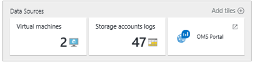

<properties
    pageTitle="Ottimizzare l'ambiente con la soluzione servizio tessuti nel Log Analitica | Microsoft Azure"
    description="È possibile utilizzare la soluzione tessuti servizio per valutare il rischio e l'integrità del servizio tessuti applicazioni, micro-servizi, nodi e cluster."
    services="log-analytics"
    documentationCenter=""
    authors="niniikhena"
    manager="jochan"
    editor=""/>

<tags
    ms.service="log-analytics"
    ms.workload="na"
    ms.tgt_pltfrm="na"
    ms.devlang="na"
    ms.topic="article"
    ms.date="09/21/2016"
    ms.author="nini"/>


# <a name="service-fabric-solution-in-log-analytics"></a>Soluzione tessuti Service nel Log Analitica

> [AZURE.SELECTOR]
- [Manager delle risorse](log-analytics-service-fabric-azure-resource-manager.md)
- [PowerShell](log-analytics-service-fabric.md)

In questo articolo viene descritto come utilizzare la soluzione servizio tessuti nel Log Analitica per identificare e risolvere i problemi attraverso il cluster servizio tessuti, ottenendo visibilità nello stesso modo eseguire nodi del servizio tessuti e la modalità di esecuzione di applicazioni e servizi micro.

La soluzione servizio tessuti utilizza dati di Azure diagnostica da macchine virtuali tessuti il servizio, mediante la raccolta di dati delle tabelle di Azure tampone. Registro Analitica legge quindi tessuti servizio framework eventi, inclusi **Eventi Service affidabile**, **Attore eventi**, **Gli eventi operativi**e **gli eventi ETW personalizzata**. Dashboard di soluzione servizio tessuti Mostra problemi rilevanti e gli eventi importanti nel proprio ambiente servizio tessuti.

## <a name="installing-and-configuring-the-solution"></a>Installare e configurare la soluzione

Eseguire tre semplici passaggi per installare e configurare la soluzione seguenti:

1. Verificare che l'area di lavoro OMS utilizzati associato con lo stesso abbonamento Azure utilizzati per creare tutte le risorse cluster, inclusi account di archiviazione. Per informazioni sulla creazione di un'area di lavoro OMS, vedere [Guida introduttiva a Log Analitica](log-analytics-get-started.md) .
2. Configurare OMS per raccogliere e visualizzare i registri di servizio tessuti.
3. Attivare la soluzione tessuti servizio nell'area di lavoro.

## <a name="configure-oms-to-collect-and-view-service-fabric-logs"></a>Configurare OMS per raccogliere e visualizzare i registri tessuti servizio
In questa sezione verranno come configurare OMS per recuperare i registri di servizio tessuti. I registri consentono di visualizzare, analizzare e risolvere i problemi del cluster o le applicazioni e servizi in esecuzione in tale cluster tramite il portale OMS.

>[AZURE.NOTE] L'estensione di diagnostica Azure deve essere configurato per caricare i registri alle tabelle di spazio di archiviazione che corrispondono risulterà OMS. Per ulteriori informazioni su come raccogliere i registri, vedere [come raccogliere i registri con Azure diagnostica](../service-fabric/service-fabric-diagnostics-how-to-setup-wad.md) . Gli esempi di impostazioni di configurazione in questo articolo mostrano che quali i nomi delle tabelle di spazio di archiviazione dovrebbe essere. Una volta è impostata nel cluster di diagnostica e caricamento dei registri per un account di archiviazione, il passaggio successivo consiste nel configurare OMS per raccogliere i registri.

Assicurarsi di aggiornare la sezione **EtwEventSourceProviderConfiguration** nel file **template.json** per aggiungere voci per il nuovo EventSources prima di applicare l'aggiornamento della configurazione eseguendo **deploy.ps1**. La tabella per il caricamento è diverso da quello di (ETWEventTable). Al momento, OMS leggere solo gli eventi ETW dell'applicazione di tale tabella. Tuttavia, il supporto per le tabelle ETW personalizzate è in fase di sviluppo.

Per eseguire alcune operazioni in questa sezione vengono utilizzati i seguenti strumenti:

-   PowerShell Azure
-   [Operazioni Management Suite](http://www.microsoft.com/oms)

### <a name="configure-an-oms-workspace-to-show-the-cluster-logs"></a>Configurare un'area di lavoro OMS per visualizzare i registri cluster

Dopo aver creato un'area di lavoro OMS come descritto in precedenza, il passaggio successivo consiste nel configurare l'area di lavoro per recuperare i registri delle tabelle di archiviazione Azure in cui vengano caricate dal cluster dall'estensione diagnostica. A tale scopo, eseguire il seguente script di PowerShell:

```
<#
    This script will configure an Operations Management Suite workspace (previously called an Operational Insights workspace) to read Diagnostics from an Azure Storage account.
    It will enable all supported data types (currently Service Fabric Events, ETW Events and IIS Logs).
    It supports Resource Manager storage accounts.
    If you have more than one Azure Subscription, you will be prompted for the subscription to configure.
    If you have more than one OMS workspace you will be prompted for the workspace to configure.
    It will then look through your Service Fabric clusters, and configure your OMS workspace to read Diagnostics from storage accounts that are connected to that cluster and have diagnostics enabled.
#>

try
{
    Get-AzureRMContext
}
catch [System.Management.Automation.PSInvalidOperationException]
{
    Add-AzureRmAccount
}

$validTables = "WADServiceFabric*EventTable", "WADETWEventTable"
function Select-Subscription {
      $subscription = ""
      $allSubscriptions = Get-AzureRmSubscription
      switch ($allSubscriptions.Count) {
             0 {Write-Error "No Operations Management Suite workspaces found"}
             1 {return $allSubscriptions}
        default {
            $uiPrompt = "Enter the number corresponding to the Azure subscription you would like to work with.`n"

            $count = 1
            foreach ($subscription in $allSubscriptions) {
                $uiPrompt += "$count. " + $subscription.SubscriptionName + " (" + $subscription.SubscriptionId + ")`n"
                $count++
            }
            $answer = (Read-Host -Prompt $uiPrompt) - 1
            $subscription = $allSubscriptions[$answer]
             Write-Host $subscription.SubscriptionId
        }  
    }
    return $subscription
}

function Select-Workspace {
    $workspace = ""
    $allWorkspaces = Get-AzureRmOperationalInsightsWorkspace  

    switch ($allWorkspaces.Count) {
        0 {Write-Error "No Operations Management Suite workspaces found. `n"}
        1 {return $allWorkspaces}
        default {
            $uiPrompt = "Enter the number corresponding to the workspace you want to configure.`n"
            $count = 1
            foreach ($workspace in $allWorkspaces) {
                $uiPrompt += "$count. " + $workspace.Name + " (" + $workspace.CustomerId + ")`n"
                $count++
            }
            $answer = (Read-Host -Prompt $uiPrompt) - 1
            $workspace = $allWorkspaces[$answer]
             Write-Host $workspace.WorkspaceName
        }  
    }
    return $workspace
}

function Check-ETWProviderLogging {
     param(
     [string]$id,
     [string]$provider,
     [string]$expectedTable,
     [string]$table
    )       
         Write-Debug ("ID: $id Provider: $provider ExpectedTable $expectedTable ActualTable $table")
         if ( ($table -eq $null) -or ($table -eq ""))  
         {
             Write-Warning ("$id No configuration found for $provider. Configure Azure diagnostics to write to $expectedTable.")
         }  
         elseif ( $table -ne $expectedTable )
         {
             Write-Warning ("$id $provider events are being written to $table instead of WAD$expectedTable. Events will not be collected by OMS")
         }  
         else
         {
             Write-Verbose "$id $provider events are being written to WAD$expectedTable (Correct configuration.)"
         }
 }

function Check-ServiceFabricScaleSetDiagnostics {
     param(
          [psobject]$scaleSetDiagnostics
   )
     $storageAccountsFound = @()
     Write-Verbose ("Checking " + $scaleSetDiagnostics)
     $sfReliableActorTable = $null
     $sfReliableServiceTable = $null
     $sfOperationalTable = $null

     Write-Debug $scaleSetDiagnostics
     $serviceFabricProviderList = ""
     $etwManifestProviderList = ""

     if ( $scaleSetDiagnostics.xmlCfg )  
      {
             Write-Debug ("Found XMLcfg")
             $xmlCfg = [System.Text.Encoding]::UTF8.GetString([System.Convert]::FromBase64String($scaleSetDiagnostics.xmlCfg))
             Write-Debug $xmlCfg
             $etwProviders = Select-Xml -Content $xmlCfg -XPath "//EtwProviders"                 
             $serviceFabricProviderList = $etwProviders.Node.EtwEventSourceProviderConfiguration
             $etwManifestProviderList = $etwProviders.Node.EtwManifestProviderConfiguration
      } elseif ($scaleSetDiagnostics.WadCfg )  
     {
         Write-Debug ("Found WADcfg")
         Write-Debug $scaleSetDiagnostics.WadCfg
         $serviceFabricProviderList = $scaleSetDiagnostics.WadCfg.DiagnosticMonitorConfiguration.EtwProviders.EtwEventSourceProviderConfiguration
         $etwManifestProviderList = $scaleSetDiagnostics.WadCfg.DiagnosticMonitorConfiguration.EtwProviders.EtwManifestProviderConfiguration
     } else
     {
         Write-Error "Unable to parse Azure Diagnostics setting for $id"
             Write-Warning ("$id does not have diagnostics enabled")
     }
     foreach ($provider in $serviceFabricProviderList)  
     {
         Write-Debug ("Event Source Provider: " + $provider.Provider + " Destination: " + $provider.DefaultEvents.eventDestination)
         if ($provider.Provider -eq "Microsoft-ServiceFabric-Actors")
         {
             $sfReliableActorTable = $provider.DefaultEvents.eventDestination  
         } elseif ($provider.Provider -eq "Microsoft-ServiceFabric-Services")  
         {  
             $sfReliableServiceTable = $provider.DefaultEvents.eventDestination  
         } else  
         {
             Check-ETWProviderLogging $id $provider.Provider "ETWEventTable" $provider.DefaultEvents.eventDestination
         }
     }
     foreach ($provider in $etwManifestProviderList)
     {
         Write-Debug ("Manifest Provider: " + $provider.Provider + " Destination: " + $provider.DefaultEvents.eventDestination)
         if ($provider.Provider -eq "cbd93bc2-71e5-4566-b3a7-595d8eeca6e8")
         {
             $sfOperationalTable = $provider.DefaultEvents.eventDestination  
         } else  
         {
             Check-ETWProviderLogging $id $provider.Provider "ETWEventTable" $provider.DefaultEvents.eventDestination
         }
     }

     Check-ETWProviderLogging $id "Microsoft-ServiceFabric-Actors" "ServiceFabricReliableActorEventTable" $sfReliableActorTable
     Check-ETWProviderLogging $id "Microsoft-ServiceFabric-Services" "ServiceFabricReliableServiceEventTable" $sfReliableServiceTable
     Check-ETWProviderLogging $id "cbd93bc2-71e5-4566-b3a7-595d8eeca6e8 (System events)" "ServiceFabricSystemEventTable" $sfOperationalTable

     Write-Verbose ("StorageAccount: " + $scaleSetDiagnostics.StorageAccount)
     $storageAccountsFound += ($scaleSetDiagnostics.StorageAccount)
     return ($storageAccountsFound)
 }

function Select-StorageAccount {
    $allResources = Get-AzureRmResource #pulls in all resources
    $serviceFabricClusters = $allResources.Where({$_.ResourceType -eq "Microsoft.ServiceFabric/clusters"}) #pulls in all service fabric clusters in the resource
    $storageAccountList = @()
    foreach($cluster in $serviceFabricClusters) {
        Write-Host("Checking cluster: " + $cluster.Name)
         $scaleSet = $allResources.Where({($_.ResourceType -eq "Microsoft.Compute/virtualMachineScaleSets") -and ($_.ResourceGroupName -eq $cluster.ResourceGroupName)})

         foreach($set in $scaleSet) {
             $resource = Get-AzureRmResource -ResourceId $set.ResourceId
             $extensions = $resource.Properties.VirtualMachineProfile.ExtensionProfile.Extensions

             foreach($ext in $extensions) {
                 if ($ext.Properties.Publisher -eq "Microsoft.Azure.Diagnostics" -and $ext.Properties.Type -eq "IaaSDiagnostics") {
                     $storageAccountList += (Check-ServiceFabricScaleSetDiagnostics $ext.Properties.Settings)
                 }
             }
          }

         $storageAccountsToCheck = $allResources.Where({($_.ResourceType -eq "Microsoft.Storage/storageAccounts") -and ($_.ResourceName -in $storageAccountList)})

         if ($storageAccountsToCheck.Count -eq "0") {
                Write-Error "No storage accounts found"
           }
           else {
                    foreach ($storageAccount in $storageAccountsToCheck) {
                        Write-Host("Checking Storage Account: " + $storageAccount.Name)
                        $insightsName = $storageAccount.Name + $workspace.Name
                        $existingConfig = ""
                        try
                            {
                                $existingConfig = Get-AzureRmOperationalInsightsStorageInsight -Workspace $workspace -Name $insightsName -ErrorAction Stop
                            }
                        catch [Hyak.Common.CloudException]
                            {
                                # HTTP Not Found is returned if the storage insight doesn't exist
                            }
                        if ($existingConfig) {                         
                                  [array]$Tables = $existingConfig.Tables
                                   foreach($table in $validTables) {
                                         if($Tables -notcontains $table) {
                                               $Tables += $table
                                               $dirty = $true;
                                               Write-Host "Adding Table: $table";
                                         }
                                         else {
                                               Write-Host "$table is already configured.`n";
                                             }
                                      }
                                      # If any of the tables from the table list are not already monitored, then we add them
                                   if($dirty -eq $true) {
                                           Set-AzureRmOperationalInsightsStorageInsight -Workspace $workspace -Name $insightsName -Tables $Tables
                                           Write-Host "Updating Storage Insight. `n"
                                    }
                                    else {
                                           Write-Host "Storage Insight already updated."
                                  }
                          }
                     else {
                            $key = (Get-AzureRmStorageAccountKey -ResourceGroupName $storageAccount.ResourceGroupName -Name $storageAccount.Name)[0].Value
                           New-AzureRmOperationalInsightsStorageInsight -Workspace $workspace -Name $insightsName -StorageAccountResourceId $storageAccount.ResourceId -StorageAccountKey $key -Tables $validTables
                            Write-Host "New Azure Storage Insight Configured. `n"
                           }
                    }
             }
      }
      return
     }

$subscription = Select-Subscription
$subscriptionId = $subscription.SubscriptionId
$subscription = Select-AzureRmSubscription -SubscriptionId $subscriptionId
$workspace = Select-Workspace
$storageAccount = Select-StorageAccount
```

Dopo aver configurato l'area di lavoro OMS leggere dalle tabelle Azure nel proprio account di archiviazione, log al portale di Azure, e selezionare l'area di lavoro OMS di **Tutte le risorse**. Una volta selezionata, verrà visualizzato il numero di spazio di archiviazione account connessi a tale area di lavoro OMS registri. Selezionare il riquadro **account esegue l'archiviazione** e verificare dall'elenco dei registri di account di archiviazione che l'account di archiviazione sia connesso a tale area di lavoro OMS:



## <a name="enable-the-service-fabric-solution"></a>Attivare la soluzione tessuti servizio
Usare il seguente script per aggiungere la soluzione nell'area di lavoro OMS. Eseguire lo script di PowerShell, con l'abbonamento Azure a cui è associato l'area di lavoro OMS che si desidera attivare la soluzione servizio tessuti in.

```
function Select-Subscription {
      $subscription = ""
      $allSubscriptions = Get-AzureRmSubscription
      switch ($allSubscriptions.Count) {
             0 {Write-Error "No Operations Management Suite workspaces found"}
             1 {return $allSubscriptions}
        default {
            $uiPrompt = "Enter the number corresponding to the Azure subscription you would like to work with.`n"
            $count = 1
            foreach ($subscription in $allSubscriptions) {
                $uiPrompt += "$count. " + $subscription.SubscriptionName + " (" + $subscription.SubscriptionId + ")`n"
                $count++
            }
            $answer = (Read-Host -Prompt $uiPrompt) - 1
            $subscription = $allSubscriptions[$answer]
             Write-Host $subscription.SubscriptionId
        }  
    }
    return $subscription
}

function Select-Workspace {
    $workspace = ""
    $allWorkspaces = Get-AzureRmOperationalInsightsWorkspace  
    switch ($allWorkspaces.Count) {
        0 {Write-Error "No Operations Management Suite workspaces found"}
        1 {return $allWorkspaces}
        default {
            $uiPrompt = "Enter the number corresponding to the workspace you want to configure.`n"
            $count = 1
            foreach ($workspace in $allWorkspaces) {
                $uiPrompt += "$count. " + $workspace.Name + " (" + $workspace.CustomerId + ")`n"
                $count++
            }
            $answer = (Read-Host -Prompt $uiPrompt) - 1
            $workspace = $allWorkspaces[$answer]
                           Write-Host $workspace.WorkspaceName
        }  
    }
    return $workspace
}
$subscription = Select-Subscription
$subscriptionId = $subscription.SubscriptionId
$subscription = Select-AzureRmSubscription -SubscriptionId $subscriptionId
$workspace = Select-Workspace
Set-AzureRmOperationalInsightsIntelligencePack -ResourceGroupName $workspace.ResourceGroupName -WorkspaceName $workspace.Name -IntelligencePackName "ServiceFabric" -Enabled $true
```

Dopo avere abilitata la soluzione, il riquadro di assistenza tessuti viene aggiunta alla pagina Panoramica OMS, con una visualizzazione dei problemi rilevanti, ad esempio runAsync errori e gli annullamenti di riunione che si sono verificati nelle ultime 24 ore.


### <a name="view-service-fabric-events"></a>Visualizzare gli eventi dell'infrastruttura di servizio

Fare clic sul riquadro di **Assistenza tessuti** per aprire il dashboard di servizio tessuti. Il dashboard include le colonne nella tabella seguente. Ogni colonna elencati gli dieci eventi superiore al numero di criteri della colonna per l'intervallo di tempo specificato. È possibile eseguire una ricerca di log che fornisce l'intero elenco, fare clic su **tutti** nella parte inferiore destra di ciascuna colonna o facendo clic sull'intestazione della colonna.

| **Evento tessuti servizio** | **Descrizione** |
| --- | --- |
| Problemi rilevanti | Visualizzazione dei problemi, ad esempio RunAsyncFailures RunAsynCancellations e gli elenchi dei nodi. |
| Eventi operativi | Eventi operativi degni di nota, ad esempio aggiornamento dell'applicazione e distribuzioni. |
| Eventi Service affidabile | Eventi degni di nota service affidabile tali Runasyncinvocations. |
| Eventi attore | Eventi attore degni di nota generati da micro-servizi, ad esempio le eccezioni generate da un metodo attore, attivazioni attore e disattivazioni e così via. |
| Eventi dell'applicazione | Tutti personalizzato ETW gli eventi generati dalle applicazioni in uso. |


Nella tabella seguente mostra i metodi di raccolta dati e altri dettagli sulle modalità di raccolta dati per tessuti servizio.

| piattaforma | Agente diretta | Agente SCOM | Spazio di archiviazione Azure | SCOM necessari? | Dati di agente SCOM inviati tramite il gruppo di gestione | frequenza di raccolta |
|---|---|---|---|---|---|---|
|Windows||| |            ||10 minuti |


>[AZURE.NOTE] È possibile modificare l'ambito di questi eventi della soluzione di servizio tessuti facendo clic su **dati in base a ultimi 7 giorni** nella parte superiore del dashboard. È inoltre possibile visualizzare gli eventi generati negli ultimi 7 giorni, 1 giorno o 6 ore. In alternativa, è possibile selezionare **personalizzati** per specificare un intervallo di date personalizzato.


## <a name="troubleshoot-your-service-fabric-and-oms-configuration"></a>Risolvere i problemi di configurazione del servizio tessuti e OMS

Se è necessario verificare la configurazione OMS perché non è possibile visualizzare i dati degli eventi in OMS, utilizzare lo script riportata di seguito. Legge la configurazione di diagnostica servizio tessuti, controlli per i dati in tabelle, e consente di verificare che OMS è configurato per la lettura delle tabelle.

```
<#
    Verify Service Fabric and OMS configuration
    1. Read Service Fabric diagnostics configuration
    2. Check for data being written into the tables
    3. Verify OMS is configured to read from the tables

    Supported tables:
    WADServiceFabricReliableActorEventTable
    WADServiceFabricReliableServiceEventTable
    WADServiceFabricSystemEventTable
    WADETWEventTable

    Script will write a warning for every misconfiguration detected
    To see items that are correctly configured set $VerbosePreference="Continue"
#>
Param
(
    [Parameter(Mandatory=$true,
    ValueFromPipeline=$true,
    Position=1)]
    [string]$workspaceName
)

$WADtables = @("WADServiceFabricReliableActorEventTable",
               "WADServiceFabricReliableServiceEventTable",
               "WADServiceFabricSystemEventTable",
               "WADETWEventTable"
               )

<#
    Check if OMS Log Analytics is configured to index service fabric events from the specified table
#>

function Check-OMSLogAnalyticsConfiguration {
    param(
    [psobject]$workspace,
    [psobject]$storageAccount,
    [string]$id
    )

    $existingInsights = Get-AzureRmOperationalInsightsStorageInsight -ResourceGroupName $workspace.ResourceGroupName -WorkspaceName $workspace.Name

    if ($existingInsights)
    {
        $currentStorageAccountInsight = $existingInsights.Where({$_.StorageAccountResourceId -eq $storageAccount.ResourceId})

        if ("WADServiceFabric*EventTable" -in $currentStorageAccountInsight.Tables)
        {
            Write-Verbose ("OMS Log Analytics workspace " + $workspace.Name + " is configured to index service fabric actor, service and operational events from " + $storageAccount.Name)
        } else
        {
            Write-Warning ("OMS Log Analytics workspace " + $workspace.Name + " is not configured to index service fabric actor, service and operational events from " + $storageAccount.Name)
        }
        if ("WADETWEventTable" -in $currentStorageAccountInsight.Tables)
        {
            Write-Verbose ("OMS Log Analytics workspace " + $workspace.Name + " is configured to index service fabric application events from " + $storageAccount.Name)
        } else
        {
            Write-Warning ("OMS Log Analytics workspace " + $workspace.Name + " is not configured to index service fabric application events from " + $storageAccount.Name)
        }
    } else
    {
        Write-Warning ("OMS Log Analytics workspace " + $workspace.Name + "is not configured to read service fabric events from " + $storageAccount.Name)
    }    
}

<#
    Check Azure table storage to confirm there is recent data written by Service Fabric
#>

function Check-TablesForData {
    param(
    [psobject]$storageAccount
    )

    $ctx = (Get-AzureRmStorageAccount -ResourceGroupName $storageAccount.ResourceGroupName -Name $storageAccount.ResourceName).Context

    $createdTables = Get-AzureStorageTable -Context $ctx

    $recently = Get-Date -Format s ((Get-Date).AddMinutes(-20).ToUniversalTime())
    $recently = $recently + "Z"

    foreach ($table in $WADtables)
    {
        if ($table -in $createdTables.Name)
        {
            $tbl = Get-AzureStorageTable -Name $table -Context $ctx
            $query = New-Object Microsoft.WindowsAzure.Storage.Table.TableQuery
            $list = New-Object System.Collections.Generic.List[string]
            $list.Add("RowKey")
            $list.Add("ProviderName")
            $list.Add("Timestamp")
            $query.FilterString = "Timestamp gt datetime'$recently'"
            $query.SelectColumns = $list
            $query.TakeCount = 20
            $entities = $tbl.CloudTable.ExecuteQuery($query)
            Write-Debug $entities
            if ($entities.Count -gt 0)
            {
                Write-Verbose ("Data was written to $table in " + $storageAccount.ResourceName + "after $recently")
            } else
            {
                Write-Warning ("No data after $recently is in  $table in " + $storageAccount.ResourceName)
            }
        } else
        {
            Write-Warning ("$table does not exist in storage account " + $storageAccount.ResourceName)
        }
    }
}

<#
    Check if ETW provider is configured to log events to the expected table storage
#>
function Check-ETWProviderLogging {
    param(
    [string]$id,
    [string]$provider,
    [string]$expectedTable,
    [string]$table
    )      
        Write-Debug ("ID: $id Provider: $provider ExpectedTable $expectedTable ActualTable $table")
        if ( ($table -eq $null) -or ($table -eq ""))
        {
            Write-Warning ("$id No configuration found for $provider. Configure Azure diagnostics to write to $expectedTable.")
        }
        elseif ( $table -ne $expectedTable )
        {
            Write-Warning ("$id $provider events are being written to $table instead of WAD$expectedTable. Events will not be collected by OMS")
        }
        else
        {
            Write-Verbose "$id $provider events are being written to WAD$expectedTable (Correct configuration.)"
        }
}

<#
    Check Azure Diagnostics Configuration for a Service Fabric cluster
#>
function Check-ServiceFabricScaleSetDiagnostics {
    param(
    [psobject]$scaleSetDiagnostics
    )

    $storageAccountsFound = @()
    Write-Verbose ("Checking " + $scaleSetDiagnostics)
    $sfReliableActorTable = $null
    $sfReliableServiceTable = $null
    $sfOperationalTable = $null
    Write-Debug $scaleSetDiagnostics
    $serviceFabricProviderList = ""
    $etwManifestProviderList = ""

    if ( $scaleSetDiagnostics.xmlCfg )
    {
        Write-Debug ("Found XMLcfg")
        $xmlCfg = [System.Text.Encoding]::UTF8.GetString([System.Convert]::FromBase64String($scaleSetDiagnostics.xmlCfg))
        Write-Debug $xmlCfg
        $etwProviders = Select-Xml -Content $xmlCfg -XPath "//EtwProviders"                
        $serviceFabricProviderList = $etwProviders.Node.EtwEventSourceProviderConfiguration
        $etwManifestProviderList = $etwProviders.Node.EtwManifestProviderConfiguration
    } elseif ($scaleSetDiagnostics.WadCfg )
    {
        Write-Debug ("Found WADcfg")
        Write-Debug $scaleSetDiagnostics.WadCfg
        $serviceFabricProviderList = $scaleSetDiagnostics.WadCfg.DiagnosticMonitorConfiguration.EtwProviders.EtwEventSourceProviderConfiguration
        $etwManifestProviderList = $scaleSetDiagnostics.WadCfg.DiagnosticMonitorConfiguration.EtwProviders.EtwManifestProviderConfiguration 
    } else
    {
        Write-Error "Unable to parse Azure Diagnostics setting for $id"
        Write-Warning ("$id does not have diagnostics enabled")
    }

    foreach ($provider in $serviceFabricProviderList)
    {
        Write-Debug ("Event Source Provider: " + $provider.Provider + " Destination: " + $provider.DefaultEvents.eventDestination)
        if ($provider.Provider -eq "Microsoft-ServiceFabric-Actors")
        {
            $sfReliableActorTable = $provider.DefaultEvents.eventDestination
        } elseif ($provider.Provider -eq "Microsoft-ServiceFabric-Services")
        {
            $sfReliableServiceTable = $provider.DefaultEvents.eventDestination
        } else
        {
            Check-ETWProviderLogging $id $provider.Provider "ETWEventTable" $provider.DefaultEvents.eventDestination
        }
    }
    foreach ($provider in $etwManifestProviderList)
    {
        Write-Debug ("Manifest Provider: " + $provider.Provider + " Destination: " + $provider.DefaultEvents.eventDestination)
        if ($provider.Provider -eq "cbd93bc2-71e5-4566-b3a7-595d8eeca6e8")
        {
            $sfOperationalTable = $provider.DefaultEvents.eventDestination
        } else
        {
            Check-ETWProviderLogging $id $provider.Provider "ETWEventTable" $provider.DefaultEvents.eventDestination
        }
    }

    Check-ETWProviderLogging $id "Microsoft-ServiceFabric-Actors" "ServiceFabricReliableActorEventTable" $sfReliableActorTable
    Check-ETWProviderLogging $id "Microsoft-ServiceFabric-Services" "ServiceFabricReliableServiceEventTable" $sfReliableServiceTable
    Check-ETWProviderLogging $id "cbd93bc2-71e5-4566-b3a7-595d8eeca6e8 (System events)" "ServiceFabricSystemEventTable" $sfOperationalTable

    Write-Verbose ("StorageAccount: " + $scaleSetDiagnostics.StorageAccount)

    $storageAccountsFound += ($scaleSetDiagnostics.StorageAccount)
    return ($storageAccountsFound)
}

# This script uses Get-AzureRmVMDiagnosticsExtension and needs a version where -Name is not a required parameter
Import-Module AzureRM.Compute -MinimumVersion 1.2.2

try
{
    Get-AzureRmContext
}
catch [System.Management.Automation.PSInvalidOperationException]
{
    Login-AzureRmAccount
}

$allResources = Get-AzureRmResource

$OMSworkspace = $allResources.Where({($_.ResourceType -eq "Microsoft.OperationalInsights/workspaces") -and ($_.ResourceName -eq $workspaceName)})

if ($OMSworkspace.Name -ne $workspaceName)
{
    Write-Error ("Unable to find OMS Workspace " + $workspaceName)
}

$serviceFabricClusters = $allResources.Where({$_.ResourceType -eq "Microsoft.ServiceFabric/clusters"})
$storageAccountList = @()
foreach($cluster in $serviceFabricClusters) {
    Write-Verbose ("Checking cluster: " + $cluster.Name)
    $scaleSet = ($allResources.Where({($_.ResourceType -eq "Microsoft.Compute/virtualMachineScaleSets") -and ($_.ResourceGroupName -eq $cluster.ResourceGroupName)}))

    foreach($set in $scaleSet) {
        $resource = Get-AzureRmResource -ResourceId $set.ResourceId
        $extensions = $resource.Properties.VirtualMachineProfile.ExtensionProfile.Extensions
        foreach($ext in $extensions) {
            if ($ext.Properties.Publisher -eq "Microsoft.Azure.Diagnostics" -and $ext.Properties.Type -eq "IaaSDiagnostics") {
                $storageAccountList += (Check-ServiceFabricScaleSetDiagnostics $ext.Properties.Settings)
            }
        }
    }
}

$storageAccountList = $storageAccountList | Sort-Object | Get-Unique
$storageAccountsToCheck = ($allResources.Where({($_.ResourceType -eq "Microsoft.Storage/storageAccounts") -and ($_.ResourceName -in $storageAccountList)}))

foreach($storageAccount in $storageAccountsToCheck)
{
    Check-TablesForData $storageAccount
    Check-OMSLogAnalyticsConfiguration $OMSworkspace $storageAccount
}
 ```


## <a name="next-steps"></a>Passaggi successivi

- Consente di visualizzare i dati di evento dettagliati servizio tessuti [Log le ricerche in Log Analitica](log-analytics-log-searches.md) .
