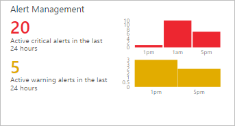

<properties
   pageTitle="Invia avviso soluzione di gestione di operazioni di gestione famiglia di prodotti (OMS) | Microsoft Azure"
   description="La soluzione di gestione degli avvisi nel registro Analitica consente di analizzare tutti gli avvisi nel proprio ambiente.  Oltre al consolidamento avvisi generati all'interno di OMS, Importa avvisi dai gruppi di gestione System Center Operations Manager (SCOM) connessi in Log Analitica."
   services="log-analytics"
   documentationCenter=""
   authors="bwren"
   manager="jwhit"
   editor="tysonn" />
<tags
   ms.service="operations-management-suite"
   ms.devlang="na"
   ms.topic="article"
   ms.tgt_pltfrm="na"
   ms.workload="infrastructure-services"
   ms.date="10/06/2016"
   ms.author="bwren" />

# Soluzione di gestione degli avvisi in operazioni di gestione famiglia di prodotti (OMS)

 La soluzione di gestione degli avvisi consente di analizzare tutti gli avvisi nel proprio ambiente.  Oltre a consolidamento avvisi generati all'interno di OMS, Importa gli avvisi da gruppi di gestione System Center Operations Manager (SCOM) connessi in Log Analitica.  Negli ambienti con più gruppi di gestione, la soluzione di gestione degli avvisi fornisce una panoramica di avvisi in tutti i gruppi di gestione.

## Prerequisiti

- Per importare gli avvisi da SCOM, questa soluzione richiede una connessione tra l'area di lavoro OMS e un gruppo di gestione SCOM utilizzando la procedura descritta in [Connettere Operations Manager per Log Analitica](log-analytics-om-agents.md).  

## Configurazione

Aggiungere la soluzione di gestione degli avvisi nell'area di lavoro OMS usando la procedura descritta nella sezione [Aggiungi soluzioni](log-analytics-add-solutions.md).  Non esiste alcun ulteriori operazioni di configurazione necessari.

## Management Pack

Se il gruppo di gestione SCOM è collegato all'area di lavoro OMS, quindi i seguenti management pack verrà installato in SCOM quando si aggiunge questa soluzione.  Non esiste alcun configurazione o manutenzione di questi management pack necessari.  

- Gestione degli avvisi di Microsoft System Center Advisor (Microsoft.IntelligencePacks.AlertManagement)

Per ulteriori informazioni sulla modalità di aggiornamento dei pacchetti di gestione di soluzione, vedere [Connettere Operations Manager per Log Analitica](log-analytics-om-agents.md).

## Raccolta di dati

### Agenti

Nella tabella seguente vengono descritte le origini connesse supportate da questa soluzione.

| Origine connesso | Supporto tecnico | Descrizione |
|:--|:--|:--|
| [Agenti di Windows](log-analytics-windows-agents.md) | No | Accesso diretti agenti di Windows non generano avvisi SCOM. |
| [Agenti Linux](log-analytics-linux-agents.md) | No | Accesso diretto Linux agenti non generano avvisi SCOM. |
| [Gruppo di gestione SCOM](log-analytics-om-agents.md) | Sì | Avvisi generati su agenti SCOM di recapito al gruppo di gestione e quindi inoltrati al Log Analitica.  Non è necessaria una connessione diretta dall'agente SCOM a Log Analitica. Dati di avviso viene inoltrati dal gruppo di gestione archivio di OMS. |
| [Account di archiviazione Azure](log-analytics-azure-storage.md) | No | Avvisi SCOM non vengono memorizzati in account di archiviazione Azure. |

### Frequenza di raccolta

Avvisi generati all'interno di OMS sono immediatamente disponibili per la soluzione.  Dati di avviso viene inviati dal gruppo di gestione di SCOM a Log Analitica ogni 3 minuti.  

## Utilizzo della soluzione

Quando si aggiunge la soluzione di gestione degli avvisi nell'area di lavoro OMS, il riquadro di **Gestione degli avvisi** verrà aggiunti al dashboard OMS.  Questa sezione vengono visualizzati un conteggio dei rappresentazione grafica del numero di avvisi attivi generati nelle ultime 24 ore.  Non è possibile modificare l'intervallo di tempo.

Fare clic sul riquadro **Gestione degli avvisi** per aprire il dashboard di **Gestione degli avvisi** .  Il dashboard include le colonne nella tabella seguente.  Ogni colonna sono elencati gli avvisi dei dieci superiore al numero di criteri della colonna per l'intervallo di tempo e l'ambito specificato.  È possibile eseguire una ricerca di log che fornisce l'intero elenco, fare clic su **tutti** nella parte inferiore della colonna o facendo clic sull'intestazione della colonna.

| Colonna| Descrizione |
|:--|:--|
| Avvisi critici | Tutti gli avvisi con gravità critica raggruppato in base al nome degli avvisi.  Fare clic sul nome di un avviso per eseguire una ricerca Registro restituzione di tutti i record per tale avviso. |
| Avvisi di avviso | Tutti gli avvisi con gravità avviso raggruppato in base al nome degli avvisi.  Fare clic sul nome di un avviso per eseguire una ricerca Registro restituzione di tutti i record per tale avviso. |
| Avvisi SCOM attivo | Tutti gli avvisi SCOM con uno stato diverso *chiuso* raggruppate per fonte che ha generato l'avviso. |
| Tutti gli avvisi attivi | Tutti gli avvisi con qualsiasi gravità raggruppati in base al nome degli avvisi. Include solo gli avvisi SCOM con qualsiasi stato diverso da quello *chiuso*.|

Se si passa a destra, il dashboard verrà elencati diverse query comuni che è possibile fare clic per eseguire una [ricerca dei registri](log-analytics-log-searches.md) per i dati degli avvisi.

## Intervallo di ambito e l'ora

Per impostazione predefinita, l'ambito degli avvisi di analisi della soluzione di gestione degli avvisi è stata inviata da tutti i gruppi di gestione connesso generati all'interno di negli ultimi sette giorni.  

- Per modificare i gruppi di gestione inclusi nell'analisi, fare clic su **ambito** nella parte superiore del dashboard.  È possibile selezionare **globale** per tutti i gruppi di gestione connesso o **Dal gruppo di gestione** per selezionare un gruppo di gestione singolo.

- Per modificare l'intervallo di tempo di avvisi, selezionare **i dati basati** nella parte superiore del dashboard.  È possibile selezionare gli avvisi generati negli ultimi 7 giorni, 1 giorno o 6 ore.  Oppure è possibile scegliere **personalizzato** e specificare un intervallo di date personalizzato.

## Registro Analitica record

La soluzione di gestione degli avvisi analizza qualsiasi record con un tipo di **avviso**.  Verrà inoltre importare gli avvisi da SCOM e creare un record corrispondente per ognuno con un tipo di **avviso** e SourceSystem di **OpsManager**.  Questi record hanno le proprietà nella tabella seguente.  

| Proprietà | Descrizione |
|:--|:--|
| Tipo | *Invia avviso* |
| SourceSystem | *OpsManager* |
| AlertContext | Dettagli dell'elemento di dati che ha causato l'avviso verso generato in formato XML. |
| AlertDescription | Descrizione dettagliata dell'avviso. |
| AlertId | GUID dell'avviso. |
| Nome avviso | Nome dell'avviso. |
| AlertPriority | Livello di priorità dell'avviso. |
| AlertSeverity | Livello di gravità dell'avviso. |
| AlertState | Stato di risoluzione più recente dell'avviso. |
| LastModifiedBy | Nome dell'utente che ha modificato l'avviso. |
| ManagementGroupName | Nome del gruppo di gestione nel punto in cui è stato generato l'avviso. |
| RepeatCount | Numero di generazione lo stesso avviso per lo stesso monitorate oggetto dal viene risolto. |
| Risolto da | Nome dell'utente che ha risolto l'avviso. Vuota se l'avviso non è ancora stato risolto. |
| SourceDisplayName | Nome dell'oggetto monitoraggio che ha generato l'avviso visualizzato. |
| SourceFullName | Nome completo dell'oggetto monitoraggio che ha generato l'avviso. |
| TicketId | ID di ticket per l'avviso se l'ambiente di SCOM è integrato con un processo per l'assegnazione di ticket per gli avvisi.  Privo di nessun ticket ID viene assegnato. |
| TimeGenerated | Data e ora di creazione dell'avviso. |
| OraUltimaModifica | Data e ora dell'ultima modifica dell'avviso. |
| TimeRaised | Data e ora in cui è stato generato l'avviso. |
| TimeResolved | Data e ora in cui è stato risolto l'avviso. Vuota se l'avviso non è ancora stato risolto. |

## Ricerche dei registri di esempio

La tabella seguente contiene ricerche dei registri di esempio per i record degli avvisi raccolte da questa soluzione.  

| Query | Descrizione |
|:--|:--|
| Tipo = SourceSystem avviso = OpsManager AlertSeverity = errore TimeRaised > adesso 24 ore | Avvisi critici elevati durante nelle ultime 24 ore |
| Tipo = AlertSeverity avviso = avviso TimeRaised > adesso 24 ore | Avvertenze elevati durante nelle ultime 24 ore  |
| Tipo = SourceSystem avviso = OpsManager AlertState! = TimeRaised sottotitoli > adesso 24 ore e #124; misurare Count () come conteggio SourceDisplayName | Origini con avvisi attivi elevati durante nelle ultime 24 ore |
| Tipo = SourceSystem avviso = OpsManager AlertSeverity = errore TimeRaised > AlertState adesso 24 ore! = chiuso | Avvisi critici elevati durante nelle ultime 24 ore ancora attive |
| Tipo = SourceSystem avviso = OpsManager TimeRaised > AlertState adesso 24 ore = chiuso | Avvisi generati durante nelle ultime 24 ore, che ora chiuso |
| Tipo = SourceSystem avviso = OpsManager TimeRaised > adesso - 1 giorno e #124; misurare Count () come conteggio AlertSeverity | Avvisi generati durante la giornata 1 passata raggruppata in base alla loro gravità |
| Tipo = SourceSystem avviso = OpsManager TimeRaised > adesso - 1 giorno e #124; ordinare desc RepeatCount | Avvisi generati durante la giornata 1 passata ordinata in base a valori numero di ripetizioni |

## Passaggi successivi

- Informazioni sugli [avvisi nel registro Analitica](log-analytics-alerts.md) per informazioni sulla creazione di avvisi da Analitica Log.
