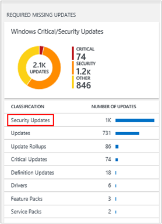
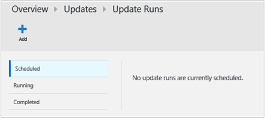

<properties
    pageTitle="Soluzione di valutazione di aggiornamento di sistema in Log Analitica | Microsoft Azure"
    description="È possibile utilizzare la soluzione gli aggiornamenti del sistema nel registro Analitica consentono di applicare gli aggiornamenti mancanti ai server dell'infrastruttura."
    services="log-analytics"
    documentationCenter=""
    authors="bandersmsft"
    manager="jwhit"
    editor=""/>

<tags
    ms.service="log-analytics"
    ms.workload="na"
    ms.tgt_pltfrm="na"
    ms.devlang="na"
    ms.topic="article"
    ms.date="08/11/2016"
    ms.author="banders"/>

# Soluzione di valutazione di aggiornamento di sistema in Analitica Log

È possibile utilizzare la soluzione gli aggiornamenti del sistema nel registro Analitica consentono di applicare gli aggiornamenti mancanti ai server dell'infrastruttura. Dopo avere installato la soluzione, è possibile visualizzare gli aggiornamenti che mancano server monitorate utilizzando il riquadro di **Valutazione di aggiornamento di sistema** nella pagina **Panoramica** OMS.

Se sono disponibili aggiornamenti mancanti, dettagli vengono visualizzati nel dashboard di **aggiornamenti** . È possibile utilizzare il dashboard di **aggiornamenti** per lavorare con gli aggiornamenti mancanti e sviluppare un piano per applicarle ai server che servono.

## Installare e configurare la soluzione
Utilizzare le informazioni seguenti per installare e configurare la soluzione.

- Aggiungere la soluzione di valutazione di aggiornamento del sistema nell'area di lavoro OMS usando la procedura descritta nella sezione [aggiungere Analitica Log soluzioni dalla raccolta soluzioni](log-analytics-add-solutions.md).  Non esiste alcun ulteriori operazioni di configurazione necessari.

## Informazioni sull'insieme di sistema aggiornamento dati

Valutazione di aggiornamento di sistema raccoglie metadati e stato dati usando gli agenti che è stata attivata.

Nella tabella seguente mostra i metodi di raccolta dati e altri dettagli sulle modalità di raccolta dati per la valutazione di aggiornamento di sistema.

| piattaforma | Agente diretta | Agente SCOM | Spazio di archiviazione Azure | SCOM necessari? | Dati di agente SCOM inviati tramite il gruppo di gestione | frequenza di raccolta |
|---|---|---|---|---|---|---|
|Windows||||            || Almeno 2 per ogni giorno e 15 minuti dopo l'installazione di un aggiornamento|

Nella tabella seguente è illustrati esempi di tipi di dati raccolti dal sistema di valutazione di aggiornamento:

|**Tipo di dati**|**Campi**|
|---|---|
|Metadati|BaseManagedEntityId, ObjectStatus, unità organizzativa, ActiveDirectoryObjectSid, PhysicalProcessors, risorse NetworkName, indirizzo IP, ForestDNSName, NetbiosComputerName, VirtualMachineName, LastInventoryDate, HostServerNameIsVirtualMachine, indirizzo IP, NetbiosDomainName, LogicalProcessors, DNSName, DisplayName, DomainDnsName, ActiveDirectorySite, PrincipalName, OffsetInMinuteFromGreenwichTime|
|Stato|StateChangeEventId, StateId, NewHealthState, OldHealthState, contesto, TimeGenerated, TimeAdded, StateId2, BaseManagedEntityId, MonitorId, HealthState, LastModified, LastGreenAlertGenerated, DatabaseTimeModified|

### Per lavorare con gli aggiornamenti

1. Nella pagina **Panoramica** fare clic sul riquadro di **Valutazione di aggiornamento di sistema** .  
    
2. Nel dashboard di **aggiornamenti** consente di visualizzare le categorie di aggiornamento.  
    
3. Scorrere a destra della pagina per visualizzare e **l'Aggiornamenti critici/protezione di Windows** e quindi in **classificazione**, fare clic su **Aggiornamenti della sicurezza**.  
    
4. Nella pagina Log ricerca viene visualizzata una varietà di informazioni sugli aggiornamenti della protezione che sono stati rilevati mancanti dal server dell'infrastruttura. Fare clic su **elenco** per visualizzare informazioni dettagliate sugli aggiornamenti.  
    
5. Nella pagina Log ricerca vengono visualizzate informazioni dettagliate su ogni aggiornamento. Accanto a numero KBID fare clic su **Visualizza** per visualizzare l'articolo corrispondente nel sito Web supporto tecnico Microsoft.  
    
6. Browser web verrà visualizzata la pagina Web di supporto Microsoft per l'aggiornamento in una nuova scheda. Visualizzare le informazioni sull'aggiornamento mancante.  
    
7. Tramite l'utilizzando le informazioni è stato trovato, è possibile creare un piano per applicare manualmente gli aggiornamenti mancanti oppure è possibile continuare a seguire i passaggi rimanenti per applicare automaticamente l'aggiornamento.
8. Se si desidera applicare automaticamente gli aggiornamenti mancanti, tornare al dashboard di **aggiornamenti** e quindi in **Aggiornamento verrà eseguito**, fare clic su **fare clic per pianificare un aggiornamento eseguito**.  
    
9. Nella pagina **Aggiornamento verrà eseguito** nella scheda **pianificazione** , fare clic su **Aggiungi** per creare una nuova esecuzione di aggiornamento.  
    
10. Nella pagina **Nuovo aggiornamento eseguire** , digitare un nome per l'aggiornamento Esegui, aggiungere singoli computer o gruppi di computer, definire una pianificazione e quindi fare clic su **Salva**.  
    
11. Scheda **pianificazione** nella pagina **Aggiornamento verrà eseguito** viene visualizzato il nuovo aggiornamento eseguire che è stata pianificata.  
    
12. Quando si avvia l'aggiornamento eseguita, verrà visualizzato informazioni per renderla nella scheda **in esecuzione** .  
    
13. Al termine dell'aggiornamento eseguita, nella scheda **completate** viene visualizzato lo stato.
14. Se sono stati installati gli aggiornamenti da update Esegui e **l'Aggiornamenti critici/protezione di Windows** , si noterà che il numero di aggiornamenti verrà ridotte.  
    

## Passaggi successivi

- [Registri ricerca](log-analytics-log-searches.md) per visualizzare i dati di aggiornamento di sistema dettagliate.
