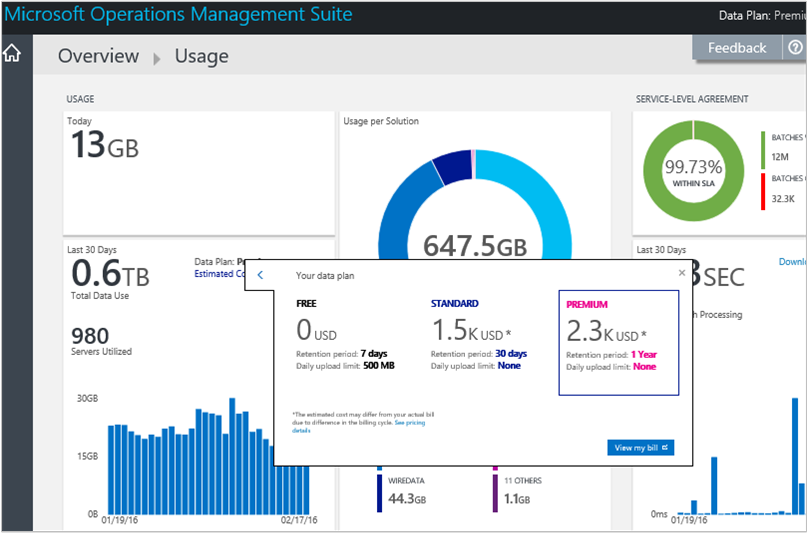
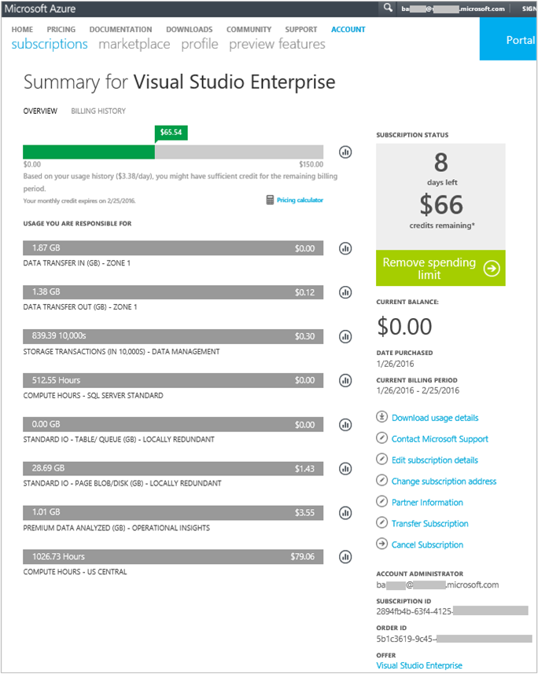

<properties
    pageTitle="Analizzare l'utilizzo di dati nel Log Analitica | Microsoft Azure"
    description="È possibile utilizzare la pagina di utilizzo in Analitica Log per visualizzare la quantità di dati inviate al servizio Outlook Mobile."
    services="log-analytics"
    documentationCenter=""
    authors="bandersmsft"
    manager="jwhit"
    editor=""/>

<tags
    ms.service="log-analytics"
    ms.workload="na"
    ms.tgt_pltfrm="na"
    ms.devlang="na"
    ms.topic="get-started-article"
    ms.date="08/11/2016"
    ms.author="banders"/>

# Analizzare l'utilizzo di dati nel Log Analitica

Registro Analitica in operazioni di gestione famiglia di prodotti (OMS) raccoglie dati e la invia periodicamente al servizio Outlook Mobile.  È possibile utilizzare la pagina di **utilizzo** per visualizzare la quantità di dati inviate al servizio Outlook Mobile. Pagina **utilizzo** viene inoltre la quantità di dati viene inviato ogni giorno per le soluzioni e con quale frequenza i server inviano dati.

>[AZURE.NOTE] Se si dispone di un account gratuito creato con il [sito Web OMS](http://www.microsoft.com/oms), si è limitato all'invio di 500 MB di dati al servizio Outlook Mobile ogni giorno. Se si raggiunge il limite giornaliero, analisi dei dati verrà interrompere e riprendere all'inizio del giorno successivo. È anche necessario inviare nuovamente tutti i dati che non è stati accettati o elaborati dal OMS.

È possibile visualizzare l'utilizzo con il riquadro di **utilizzo** nel dashboard di **Panoramica** in OMS.

Se è stato superato il limite di utilizzo giornaliero o se si vicino il limite, è anche possibile rimuovere una soluzione per ridurre la quantità di dati inviati al servizio Outlook Mobile. Per ulteriori informazioni sulla rimozione soluzioni, vedere [aggiungere Analitica Log soluzioni dalla raccolta soluzioni](log-analytics-add-solutions.md).

Pagina **utilizzo** vengono visualizzate le informazioni seguenti:

- Utilizzo medio giornaliere
- Utilizzo dei dati per ogni soluzione negli ultimi 30 giorni
- Quantità di invio di dati server nell'ambiente per il servizio Outlook Mobile negli ultimi 30 giorni
- Il piano dati prezzi livello e costo previsto
- Informazioni sul contratto di servizio (contratto di servizio), inclusi il tempo necessario OMS per l'elaborazione dei dati

## Per gestire i dati di utilizzo

1. Nella pagina **Panoramica** fare clic sul riquadro **l'uso** .
2. Nella pagina **utilizzo** consente di visualizzare le categorie di utilizzo che mostrano le aree che si teme.
3. Se si dispone di una soluzione che utilizza troppe della quota della carica giornaliera, è possibile rimuovere tale soluzione.

## Per visualizzare il costo previsto e informazioni di fatturazione
1. Nella pagina **Panoramica** fare clic sul riquadro **l'uso** .
2. Nella pagina **utilizzo** in **uso**, fare clic sulla freccia di espansione (**>**) accanto al **costo stimato**.
3. Nella struttura dettagli **il piano dati** , è possibile visualizzare lo stimata costo mensile.  
    
4. Se si desidera visualizzare le informazioni di fatturazione, fare clic su **visualizzare la fattura** per visualizzare le informazioni sull'abbonamento.
    - Nella pagina sottoscrizioni fare clic su abbonamento per visualizzare i dettagli e un elenco di voci di utilizzo.  
        
    - Nella pagina di riepilogo per l'abbonamento, è possibile eseguire diverse attività per gestire e visualizzare ulteriori dettagli sull'abbonamento.  
        

## Per visualizzare il batch di dati per il contratto di servizio
1. Nella pagina **Panoramica** fare clic sul riquadro **l'uso** .
2. **Contratto di servizio**, fare clic su **Dettagli scaricare contratto di servizio**.
3. Viene scaricato un file XLSX di Excel per consentirne la verifica.  
    

## Passaggi successivi

- Vedere [le ricerche Log in Analitica Log](log-analytics-log-searches.md) per visualizzare informazioni dettagliate raccolte da soluzioni.
