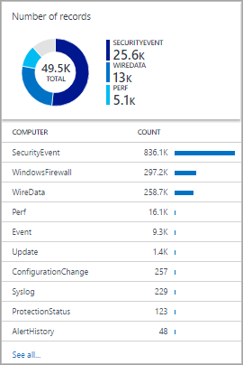

<properties
    pageTitle="Accedere progettazione visualizzazione Analitica | Microsoft Azure"
    description="Progettazione visualizzazione Analitica Log consente di creare visualizzazioni personalizzate nella console di OMS contenenti diverse visualizzazioni dei dati nel repository OMS. In questo articolo fornisce un riferimento delle impostazioni per ciascuna delle parti visualizzazione disponibile per l'uso nelle proprie visualizzazioni personalizzate."
    services="log-analytics"
    documentationCenter=""
    authors="bwren"
    manager="jwhit"
    editor=""/>

<tags
    ms.service="log-analytics"
    ms.workload="na"
    ms.tgt_pltfrm="na"
    ms.devlang="na"
    ms.topic="article"
    ms.date="10/20/2016"
    ms.author="bwren"/>

# Registro progettazione visualizzazione Analitica visualizzazione parte riferimento
Lo strumento di progettazione visualizzazione Analitica Log consente di creare visualizzazioni personalizzate nella console di OMS contenenti diverse visualizzazioni dei dati dal repository OMS. In questo articolo fornisce un riferimento delle impostazioni per ciascuna delle parti visualizzazione disponibile per l'uso nelle proprie visualizzazioni personalizzate.

Altri articoli disponibili per progettazione sono:

- [Progettazione](log-analytics-view-designer.md) : panoramica delle procedure per la creazione e modifica delle visualizzazioni personalizzate e progettazione.
- [Guida di riferimento riquadro](log-analytics-view-designer-tiles.md) - riferimento delle impostazioni per ognuna delle sezioni disponibile per l'uso nelle proprie visualizzazioni personalizzate. 

Nella tabella seguente vengono illustrati i diversi tipi di sezioni disponibile nella finestra di progettazione di visualizzazione.  Nelle sezioni seguenti descrivono ogni tipo di sezione in dettaglio e le relative proprietà.

| Tipo di visualizzazione | Descrizione |
|:--|:--|
| [Elenco di query](#list-of-queries-part) | Visualizza un elenco log delle query di ricerca.  L'utente può fare clic su ogni query per visualizzare i risultati.  |
| [Numero & elenco](#number-amp-list-part) | Intestazione dispone di un singolo conteggio con numero di record da una query di ricerca di log.  Elenco Visualizza i dieci risultati superiore di una query con un grafico che indica il relativo valore di una colonna numerica o la variazione nel tempo. |
| [Due numeri & elenco](#two-numbers-amp-list-part) | Intestazione dispone di due numeri che mostra il conteggio dei record dalla query di ricerca registro diversi.  Elenco Visualizza i dieci risultati superiore di una query con un grafico che indica il relativo valore di una colonna numerica o la variazione nel tempo. |
| [Elenco e ad anello](#donut-amp-list-part) | Intestazione consente di visualizzare un singolo numero riepilogato da una colonna di valori in una query di log.  L'anello graficamente i risultati delle prime tre record. |
| [Due sequenze temporali & elenco](#two-timelines-amp-list-part) | Intestazione Visualizza i risultati di due query log man mano gli istogrammi con un callout la visualizzazione di un numero riepilogato da una colonna di valori in una query di log.  Elenco Visualizza i dieci risultati superiore di una query con un grafico che indica il relativo valore di una colonna numerica o la variazione nel tempo. |   
| [Informazioni](#information-part) | Intestazione vengono visualizzati in testo statico e un collegamento facoltativo.  Elenco include uno o più elementi con testo statico e un titolo. |
| [Grafico a linee, callout & elenco](#line-chart-callout-amp-list-part) | Intestazione consente di visualizzare un grafico a linee con più serie di una query di log nel tempo e un callout con un valore di riepilogo.  Elenco Visualizza i dieci risultati superiore di una query con un grafico che indica il relativo valore di una colonna numerica o la variazione nel tempo. |
| [Elenco & grafico a linee](#line-chart-amp-list-part) | Intestazione consente di visualizzare un grafico a linee con più serie di una query di log nel tempo.  Elenco Visualizza i dieci risultati superiore di una query con un grafico che indica il relativo valore di una colonna numerica o la variazione nel tempo. |
| [Parte di grafici a linee in pila](#stack-of-line-charts-part) | Consente di visualizzare i grafici a linee distinto tre con più serie di una query di log nel tempo. |

## Elenco di parte di query

Visualizza un elenco log delle query di ricerca.  L'utente può fare clic su ogni query per visualizzare i risultati.  La visualizzazione includerà una singola query per impostazione predefinita ed è possibile fare clic su **+ Query** per aggiungere altre query.

| Impostazione | Descrizione |
|:--|:--|
| **Generale** |
| Titolo | Testo da visualizzare nella parte superiore della visualizzazione. |
| Nuovo gruppo | Selezionare questa opzione per creare un nuovo gruppo nella visualizzazione a partire dalla visualizzazione corrente. |
| Filtri preselezionati | Elenco di proprietà da includere nel riquadro filtri a sinistra quando l'utente seleziona una query delimitato da virgole. |
| Modalità di rendering | Visualizzazione iniziale disponibile quando è selezionata la query.  L'utente può selezionare le visualizzazioni disponibili dopo aver aperto la query. |
| **Query** |
| Query di ricerca | Query da eseguire. |
| Nome descrittivo | Nome descrittivo della query da visualizzare all'utente. |

## Elenco & numero parte

Intestazione dispone di un singolo conteggio con numero di record da una query di ricerca di log.  Elenco Visualizza i dieci risultati superiore di una query con un grafico che indica il relativo valore di una colonna numerica o la variazione nel tempo.

| Impostazione | Descrizione |
|:--|:--|
| **Generale** |
| Titolo del gruppo | Testo da visualizzare nella parte superiore della visualizzazione. |
| Nuovo gruppo | Selezionare questa opzione per creare un nuovo gruppo nella visualizzazione a partire dalla visualizzazione corrente. |
| Icona | File di immagine da visualizzare accanto al risultato nell'intestazione.
| Utilizzare l'icona | Selezionare questa opzione per la visualizzazione dell'icona. |
| **Titolo** |
| Legenda | Testo da visualizzare nella parte superiore dell'intestazione. |
| Query | Query da eseguire per l'intestazione.  Verrà visualizzato il conteggio del numero di record restituiti dalla query. |
| **Elenco** |
| Query | Query da eseguire per l'elenco.  Le prime due proprietà per i primi dieci record i risultati verranno visualizzate.  La prima proprietà deve essere un valore di testo e la seconda proprietà un valore numerico.  Barre vengono create automaticamente in base al relativo valore della colonna numerica.  Utilizzare il comando di ordinamento nella query per ordinare i record nell'elenco.  L'utente può scegliere di visualizzare l'intero per eseguire la query e restituire tutti i record. |
| Nascondere grafico | Selezionare questa opzione per disabilitare il grafico a destra della colonna numerica. |
| Abilitare i grafici sparkline | Selezionare questa opzione per visualizzare i grafici sparkline anziché barra orizzontale.  Per informazioni dettagliate, vedere [Impostazioni comuni](#sparklines) . |
| Colore | Colore delle barre dei grafici sparkline. |
| Nome e valore separatore | Solo delimitatore di caratteri se si desidera analizzare la proprietà text in più valori.  Per informazioni dettagliate, vedere [Impostazioni comuni](#name-value-separator) . |
| Query di spostamento | Query da eseguire quando l'utente seleziona un elemento nell'elenco.  Per informazioni dettagliate, vedere [Impostazioni comuni](#navigation-query) . |
| **Elenco** | **> I titoli di colonna** |
| Nome | Testo da visualizzare nella parte superiore della prima colonna dell'elenco. |
| Valore | Testo da visualizzare nella parte superiore della seconda colonna dell'elenco. |
| **Elenco** | **> Soglie** |
| Abilitare le soglie | Selezionare questa opzione per abilitare le soglie.  Per informazioni dettagliate, vedere [Impostazioni comuni](#thresholds) . |

## Due numeri e part elenco

Intestazione dispone di due numeri che mostra il conteggio dei record dalla query di ricerca registro diversi.  Elenco Visualizza i dieci risultati superiore di una query con un grafico che indica il relativo valore di una colonna numerica o la variazione nel tempo.

| Impostazione | Descrizione |
|:--|:--|
| **Generale** |
| Titolo del gruppo | Testo da visualizzare nella parte superiore della visualizzazione. |
| Nuovo gruppo | Selezionare questa opzione per creare un nuovo gruppo nella visualizzazione a partire dalla visualizzazione corrente. |
| Icona | File di immagine da visualizzare accanto al risultato nell'intestazione.
| Utilizzare l'icona | Selezionare questa opzione per la visualizzazione dell'icona. |
| **Titolo** |
| Legenda | Testo da visualizzare nella parte superiore dell'intestazione. |
| Query | Query da eseguire per l'intestazione.  Verrà visualizzato il conteggio del numero di record restituiti dalla query. |
| **Elenco** |
| Query | Query da eseguire per l'elenco.  Le prime due proprietà per i primi dieci record i risultati verranno visualizzate.  La prima proprietà deve essere un valore di testo e la seconda proprietà un valore numerico.  Barre vengono create automaticamente in base al relativo valore della colonna numerica.  Utilizzare il comando di ordinamento nella query per ordinare i record nell'elenco.  L'utente può scegliere di visualizzare l'intero per eseguire la query e restituire tutti i record. |
| Nascondere grafico | Selezionare questa opzione per disabilitare il grafico a destra della colonna numerica. |
| Abilitare i grafici sparkline | Selezionare questa opzione per visualizzare i grafici sparkline anziché barra orizzontale.  Per informazioni dettagliate, vedere [Impostazioni comuni](#sparklines) . |
| Colore | Colore delle barre dei grafici sparkline. |
| Operazione | Operazione da eseguire per il grafico sparkline.  Per informazioni dettagliate, vedere [Impostazioni comuni](#sparklines) . |
| Nome e valore separatore | Solo delimitatore di caratteri se si desidera analizzare la proprietà text in più valori.  Per informazioni dettagliate, vedere [Impostazioni comuni](#name-value-separator) . |
| Query di spostamento | Query da eseguire quando l'utente seleziona un elemento nell'elenco.  Per informazioni dettagliate, vedere [Impostazioni comuni](#navigation-query) . |
| **Elenco** | **> I titoli di colonna** |
| Nome | Testo da visualizzare nella parte superiore della prima colonna dell'elenco. |
| Valore | Testo da visualizzare nella parte superiore della seconda colonna dell'elenco. |
| **Elenco** | **> Soglie** |
| Abilitare le soglie | Selezionare questa opzione per abilitare le soglie.  Per informazioni dettagliate, vedere [Impostazioni comuni](#thresholds) . |

## Parte di elenco e ad anello

Intestazione consente di visualizzare un singolo numero riepilogato da una colonna di valori in una query di log.  L'anello graficamente i risultati delle prime tre record.

| Impostazione | Descrizione |
|:--|:--|
| **Generale** |
| Titolo del gruppo | Testo da visualizzare nella parte superiore del riquadro. |
| Nuovo gruppo | Selezionare questa opzione per creare un nuovo gruppo nella visualizzazione a partire dalla visualizzazione corrente. |
| Icona | File di immagine da visualizzare accanto al risultato nell'intestazione. |
| Utilizzare l'icona | Selezionare questa opzione per la visualizzazione dell'icona. |
| **Intestazione** |
| Titolo | Testo da visualizzare nella parte superiore dell'intestazione.
| Sottotitolo | Testo da visualizzare sotto il titolo nella parte superiore dell'intestazione.
| **Ad anello** |
| Query | Query da eseguire per l'anello.  La prima proprietà deve essere un valore di testo e la seconda proprietà un valore numerico. |
| **Ad anello** |  **> Centro** |
| Testo | Testo da visualizzare sotto il valore all'interno di anello. |
| Operazione | Operazione da eseguire sulla proprietà valore per riepilogare un singolo valore.  -Somma: Sommare i valori di tutti i record. -Percentuale: Percentuale i record restituiti in base ai valori **valori dei risultati usati in operazione centro** record totali nella query. |
| Valori dei risultati utilizzati in centro operazione | Facoltativamente, fare clic sul segno più per aggiungere uno o più valori.  I risultati della query saranno limitati ai record con i valori di proprietà specificati.  Se non vengono aggiunti valori, sono inclusi tutti i record nella query. |
| **Altre opzioni** | **> Colori** |
| Colore 1 Colore 2 Colore 3 | Selezionare il colore per ognuno dei valori visualizzati nella finestra di anello. |
| **Altre opzioni** | **> Mapping dei colori avanzate** |
| Valore del campo | Digitare il nome di un campo da visualizzare come un colore diverso se è inclusa nell'anello. |
| Colore | Selezionare il colore per il campo univoco. |
| **Elenco** |
| Query | Query da eseguire per l'elenco.  Verrà visualizzato il conteggio del numero di record restituiti dalla query. |
| Nascondere grafico | Selezionare questa opzione per disabilitare il grafico a destra della colonna numerica. |
| Abilitare i grafici sparkline | Selezionare questa opzione per visualizzare i grafici sparkline anziché barra orizzontale.  Per informazioni dettagliate, vedere [Impostazioni comuni](#sparklines) . |
| Colore | Colore delle barre dei grafici sparkline. |
| Operazione | Operazione da eseguire per il grafico sparkline.  Per informazioni dettagliate, vedere [Impostazioni comuni](#sparklines) . |
| Nome e valore separatore | Solo delimitatore di caratteri se si desidera analizzare la proprietà text in più valori.  Per informazioni dettagliate, vedere [Impostazioni comuni](#name-value-separator) . |
| Query di spostamento | Query da eseguire quando l'utente seleziona un elemento nell'elenco.  Per informazioni dettagliate, vedere [Impostazioni comuni](#navigation-query) . |
| **Elenco** | **> I titoli di colonna** |
| Nome | Testo da visualizzare nella parte superiore della prima colonna dell'elenco. |
| Valore | Testo da visualizzare nella parte superiore della seconda colonna dell'elenco. |
| **Elenco** | **> Soglie** |
| Abilitare le soglie | Selezionare questa opzione per abilitare le soglie.  Per informazioni dettagliate, vedere [Impostazioni comuni](#thresholds) . |

## Due parti di elenco e sequenze temporali

Intestazione Visualizza i risultati di due query log man mano gli istogrammi con un callout la visualizzazione di un numero riepilogato da una colonna di valori in una query di log.  Elenco Visualizza i dieci risultati superiore di una query con un grafico che indica il relativo valore di una colonna numerica o la variazione nel tempo.

| Impostazione | Descrizione |
|:--|:--|
| **Generale** |
| Titolo del gruppo | Testo da visualizzare nella parte superiore del riquadro. |
| Nuovo gruppo | Selezionare questa opzione per creare un nuovo gruppo nella visualizzazione a partire dalla visualizzazione corrente. |
| Icona | File di immagine da visualizzare accanto al risultato nell'intestazione. |
| Utilizzare l'icona | Selezionare questa opzione per la visualizzazione dell'icona. |
| **Prima di tutto grafico secondo grafico** |
| Legenda | Testo da visualizzare in didascalia per la prima serie. |
| Colore | Colore da usare per le colonne della serie. |
| Query | Query da eseguire per la prima serie.  Conteggio del numero di record in ogni intervallo di tempo rappresentato da colonne del grafico. |
| Operazione | Operazione da eseguire sulla proprietà valore per riepilogare un singolo valore per il callout.  -Somma: Somma del valore da tutti i record. -Media: Media dei valori da tutti i record. -Ultimo esempio: Valore dall'ultimo intervallo incluso nel grafico. -Primo esempio: Valore il primo intervallo incluso nel grafico. -Conteggio: Conteggio di tutti i record restituiti dalla query.|
| **Elenco** |
| Query | Query da eseguire per l'elenco.  Verrà visualizzato il conteggio del numero di record restituiti dalla query. |
| Nascondere grafico | Selezionare questa opzione per disabilitare il grafico a destra della colonna numerica. |
| Abilitare i grafici sparkline | Selezionare questa opzione per visualizzare i grafici sparkline anziché barra orizzontale.  Per informazioni dettagliate, vedere [Impostazioni comuni](#sparklines) . |
| Colore | Colore delle barre dei grafici sparkline. |
| Operazione | Operazione da eseguire per il grafico sparkline.  Per informazioni dettagliate, vedere [Impostazioni comuni](#sparklines) . |
| Query di spostamento | Query da eseguire quando l'utente seleziona un elemento nell'elenco.  Per informazioni dettagliate, vedere [Impostazioni comuni](#navigation-query) . |
| **Elenco** | **> I titoli di colonna** |
| Nome | Testo da visualizzare nella parte superiore della prima colonna dell'elenco. |
| Valore | Testo da visualizzare nella parte superiore della seconda colonna dell'elenco. |
| **Elenco** | **> Soglie** |
| Abilitare le soglie | Selezionare questa opzione per abilitare le soglie.  Per informazioni dettagliate, vedere [Impostazioni comuni](#thresholds) . |

## Parte di informazioni

Intestazione vengono visualizzati in testo statico e un collegamento facoltativo.  Elenco include uno o più elementi con testo statico e un titolo.

| Impostazione | Descrizione |
|:--|:--|
| **Generale** |
| Titolo del gruppo | Testo da visualizzare nella parte superiore del riquadro. |
| Nuovo gruppo | Selezionare questa opzione per creare un nuovo gruppo nella visualizzazione a partire dalla visualizzazione corrente. |
| Colore | Colore di sfondo per l'intestazione. |
| **Intestazione** |
| Immagine | File di immagine da visualizzare nell'intestazione. |
| Etichetta | Testo da visualizzare nell'intestazione. |
| **Intestazione** | **> Collegamento** |
| Etichetta | Testo del collegamento. |
| URL | URL di collegamento. |
| **Elementi di informazioni** |
| Titolo | Testo da visualizzare per il titolo di ogni elemento. |
| Contenuto | Testo da visualizzare per ogni elemento. |

## Grafico a linee, callout e part elenco

Intestazione consente di visualizzare un grafico a linee con più serie di una query di log nel tempo e un callout con un valore di riepilogo.  Elenco Visualizza i dieci risultati superiore di una query con un grafico che indica il relativo valore di una colonna numerica o la variazione nel tempo.

| Impostazione | Descrizione |
|:--|:--|
| **Generale** |
| Titolo del gruppo | Testo da visualizzare nella parte superiore del riquadro. |
| Nuovo gruppo | Selezionare questa opzione per creare un nuovo gruppo nella visualizzazione a partire dalla visualizzazione corrente. |
| Icona | File di immagine da visualizzare accanto al risultato nell'intestazione. |
| Utilizzare l'icona | Selezionare questa opzione per la visualizzazione dell'icona. |
| **Intestazione** |
| Titolo | Testo da visualizzare nella parte superiore dell'intestazione. |
| Sottotitolo | Testo da visualizzare sotto il titolo nella parte superiore dell'intestazione. |
| **Grafico a linee** |
| Query | Query da eseguire per il grafico a linee.  La prima proprietà deve essere un valore di testo e la seconda proprietà un valore numerico.  In genere si tratta di una query che utilizza la parola chiave **misura** per riepilogare i risultati.  Se la query utilizza la parola chiave **intervallo** asse x del grafico utilizzerà questo intervallo di tempo.  Se la query non include la parola chiave **intervallo** intervalli orari vengono utilizzati per l'asse x. |
| **Grafico a linee** | **> Callout** |
| Titolo del callout | Testo da visualizzare sopra il valore di callout. |
| Nome della serie | Valore proprietà per la serie da utilizzare per il valore di callout.  Se nessuna serie, vengono utilizzati tutti i record dalla query. |
| Operazione | Operazione da eseguire sulla proprietà valore per riepilogare un singolo valore per il callout.  -Media: Media dei valori da tutti i record. -Conteggio conteggio di tutti i record restituiti dalla query. -Ultimo esempio: Valore dall'ultimo intervallo incluso nel grafico. -Max: Valore massimo da intervalli inclusi nel grafico. -Min: Valore minimo intervalli inclusi nel grafico. -Somma: Somma del valore da tutti i record. |
| **Grafico a linee** | **> Asse Y** |
| Utilizzo di scala logaritmica | Selezionare questa opzione per utilizzare una scala logaritmica per l'asse y. |
| Unità di misura | Specificare le unità per i valori restituiti dalla query.  Queste informazioni vengono usate per visualizzare le etichette del grafico che indica i tipi di valore e facoltativamente per la conversione dei valori.  Il tipo di unità specificata la categoria dell'unità e definisce i valori di tipo di unità corrente che sono disponibili.  Se si seleziona un valore in convertire in valori numerici vengono convertiti da un tipo di unità corrente conversione a digitare. |
| Etichetta personalizzata | Testo da visualizzare per l'asse Y accanto all'etichetta per il tipo di unità.  Se non viene specificato alcun etichetta, viene visualizzato solo il tipo di unità. |
| **Elenco** |
| Query | Query da eseguire per l'elenco.  Verrà visualizzato il conteggio del numero di record restituiti dalla query. |
| Nascondere grafico | Selezionare questa opzione per disabilitare il grafico a destra della colonna numerica. |
| Abilitare i grafici sparkline | Selezionare questa opzione per visualizzare i grafici sparkline anziché barra orizzontale.  Per informazioni dettagliate, vedere [Impostazioni comuni](#sparklines) . |
| Colore | Colore delle barre dei grafici sparkline. |
| Operazione | Operazione da eseguire per il grafico sparkline.  Per informazioni dettagliate, vedere [Impostazioni comuni](#sparklines) . |
| Nome e valore separatore | Solo delimitatore di caratteri se si desidera analizzare la proprietà text in più valori.  Per informazioni dettagliate, vedere [Impostazioni comuni](#name-value-separator) . |
| Query di spostamento | Query da eseguire quando l'utente seleziona un elemento nell'elenco.  Per informazioni dettagliate, vedere [Impostazioni comuni](#navigation-query) . |
| **Elenco** | **> I titoli di colonna** |
| Nome | Testo da visualizzare nella parte superiore della prima colonna dell'elenco. |
| Valore | Testo da visualizzare nella parte superiore della seconda colonna dell'elenco. |
| **Elenco** | **> Soglie** |
| Abilitare le soglie | Selezionare questa opzione per abilitare le soglie.  Per informazioni dettagliate, vedere [Impostazioni comuni](#thresholds) . |

## Parte del grafico ed elenco linea

Intestazione consente di visualizzare un grafico a linee con più serie di una query di log nel tempo.  Elenco Visualizza i dieci risultati superiore di una query con un grafico che indica il relativo valore di una colonna numerica o la variazione nel tempo.

| Impostazione | Descrizione |
|:--|:--|
| **Generale** |
| Titolo del gruppo | Testo da visualizzare nella parte superiore del riquadro. |
| Nuovo gruppo | Selezionare questa opzione per creare un nuovo gruppo nella visualizzazione a partire dalla visualizzazione corrente. |
| Icona | File di immagine da visualizzare accanto al risultato nell'intestazione. |
| Utilizzare l'icona | Selezionare questa opzione per la visualizzazione dell'icona. |
| **Intestazione** |
| Titolo | Testo da visualizzare nella parte superiore dell'intestazione. |
| Sottotitolo | Testo da visualizzare sotto il titolo nella parte superiore dell'intestazione. |
| **Grafico a linee** |
| Query | Query da eseguire per il grafico a linee.  La prima proprietà deve essere un valore di testo e la seconda proprietà un valore numerico.  In genere si tratta di una query che utilizza la parola chiave **misura** per riepilogare i risultati.  Se la query utilizza la parola chiave **intervallo** asse x del grafico utilizzerà questo intervallo di tempo.  Se la query non include la parola chiave **intervallo** intervalli orari vengono utilizzati per l'asse x. |
| **Grafico a linee** | **> Asse Y** |
| Utilizzo di scala logaritmica | Selezionare questa opzione per utilizzare una scala logaritmica per l'asse y. |
| Unità di misura | Specificare le unità per i valori restituiti dalla query.  Queste informazioni vengono usate per visualizzare le etichette del grafico che indica i tipi di valore e facoltativamente per la conversione dei valori.  Il tipo di unità specificata la categoria dell'unità e definisce i valori di tipo di unità corrente che sono disponibili.  Se si seleziona un valore in convertire in valori numerici vengono convertiti da un tipo di unità corrente conversione a digitare. |
| Etichetta personalizzata | Testo da visualizzare per l'asse Y accanto all'etichetta per il tipo di unità.  Se non viene specificato alcun etichetta, viene visualizzato solo il tipo di unità. |
| **Elenco** |
| Query | Query da eseguire per l'elenco.  Verrà visualizzato il conteggio del numero di record restituiti dalla query. |
| Nascondere grafico | Selezionare questa opzione per disabilitare il grafico a destra della colonna numerica. |
| Abilitare i grafici sparkline | Selezionare questa opzione per visualizzare i grafici sparkline anziché barra orizzontale.  Per informazioni dettagliate, vedere [Impostazioni comuni](#sparklines) . |
| Colore | Colore delle barre dei grafici sparkline. |
| Operazione | Operazione da eseguire per il grafico sparkline.  Per informazioni dettagliate, vedere [Impostazioni comuni](#sparklines) . |
| Nome e valore separatore | Solo delimitatore di caratteri se si desidera analizzare la proprietà text in più valori.  Per informazioni dettagliate, vedere [Impostazioni comuni](#name-value-separator) . |
| Query di spostamento | Query da eseguire quando l'utente seleziona un elemento nell'elenco.  Per informazioni dettagliate, vedere [Impostazioni comuni](#navigation-query) . |
| **Elenco** | **> I titoli di colonna** |
| Nome | Testo da visualizzare nella parte superiore della prima colonna dell'elenco. |
| Valore | Testo da visualizzare nella parte superiore della seconda colonna dell'elenco. |
| **Elenco** | **> Soglie** |
| Abilitare le soglie | Selezionare questa opzione per abilitare le soglie.  Per informazioni dettagliate, vedere [Impostazioni comuni](#thresholds) . |

## Parte di grafici a linee in pila

Consente di visualizzare i grafici a linee distinto tre con più serie di una query di log nel tempo.

| Impostazione | Descrizione |
|:--|:--|
| **Generale** |
| Titolo del gruppo | Testo da visualizzare nella parte superiore del riquadro. |
| Nuovo gruppo | Selezionare questa opzione per creare un nuovo gruppo nella visualizzazione a partire dalla visualizzazione corrente. |
| Icona | File di immagine da visualizzare accanto al risultato nell'intestazione. |
| **Grafico 1 grafico 2 grafico 3** | **> Intestazione** |
| Titolo | Testo da visualizzare nella parte superiore del grafico. |
| Sottotitolo | Testo da visualizzare sotto il titolo nella parte superiore del grafico. |
| **Grafico 1 grafico 2 grafico 3** | **Grafico a linee** |
| Query | Query da eseguire per il grafico a linee.  La prima proprietà deve essere un valore di testo e la seconda proprietà un valore numerico.  In genere si tratta di una query che utilizza la parola chiave **misura** per riepilogare i risultati.  Se la query utilizza la parola chiave **intervallo** asse x del grafico utilizzerà questo intervallo di tempo.  Se la query non include la parola chiave **intervallo** intervalli orari vengono utilizzati per l'asse x. |
| **Grafico** | **> Asse Y** |
| Utilizzo di scala logaritmica | Selezionare questa opzione per utilizzare una scala logaritmica per l'asse y. |
| Unità di misura | Specificare le unità per i valori restituiti dalla query.  Queste informazioni vengono usate per visualizzare le etichette del grafico che indica i tipi di valore e facoltativamente per la conversione dei valori.  Il tipo di unità specificata la categoria dell'unità e definisce i valori di tipo di unità corrente che sono disponibili.  Se si seleziona un valore in convertire in valori numerici vengono convertiti da un tipo di unità corrente conversione a digitare. |
| Etichetta personalizzata | Testo da visualizzare per l'asse Y accanto all'etichetta per il tipo di unità.  Se non viene specificato alcun etichetta, viene visualizzato solo il tipo di unità. |

## Impostazioni comuni
Le sezioni seguenti descrivono impostazioni comuni a diverse parti di visualizzazione.

### <a name="name-value-separator">Nome e valore separatore</a>
Solo delimitatore di caratteri se si desidera analizzare la proprietà text da una query di elenco in più valori.  Se si specifica un delimitatore, è possibile fornire i nomi per ogni campo separati dallo stesso delimitatore nella casella nome.

Si consideri ad esempio una proprietà denominata *posizione* inclusi valori, ad esempio *Redmond edificio 41* e *Bellevue Building12*.  È possibile specificare – per il nome e valore separatore e *Città predefiniti* per il nome.  Questo da analizzare ogni valore in due proprietà chiamate *Città* e *predefiniti*. 

### <a name="navigation-query">Query di spostamento</a>
Query da eseguire quando l'utente seleziona un elemento nell'elenco.  Utilizzare *{elemento selezionato}* per includere la sintassi per l'elemento selezionato dall'utente.

Ad esempio, se la query contiene una colonna denominata *Computer* e la query di spostamento è *{elemento selezionato}*, una query come *Computer = "Risorse del computer"* da eseguire quando l'utente selezionato un computer.  Se la query di spostamento *tipo = evento {elemento selezionato}* quindi la query *tipo = evento Computer = "Risorse del computer"* da eseguire.

### <a name="sparklines">Grafici sparkline</a>
Un grafico sparkline è un grafico a linee piccoli che illustra il valore di una voce di elenco nel tempo.  Per le parti di visualizzazione con un elenco, è possibile selezionare se si desidera visualizzare una barra orizzontale che indica il relativo valore di una colonna numerica o un grafico sparkline che indica il relativo valore nel tempo.

Nella tabella seguente vengono descritte le impostazioni per i grafici sparkline.

| Impostazione | Descrizione |
|:--|:--|
| Abilitare i grafici sparkline | Selezionare questa opzione per visualizzare i grafici sparkline anziché barra orizzontale. |
| Operazione | Se i grafici sparkline sono attivati, questa è l'operazione da eseguire su ogni proprietà nell'elenco per calcolare i valori per il grafico sparkline.  -Esempio ultima: Ultimo valore per la serie periodo di tempo. -Max: Valore massimo per la serie periodo di tempo. -Min: Valore minimo per la serie periodo di tempo. -Somma: Somma dei valori per la serie periodo di tempo. -Riepilogo: Usa lo stesso comando misura come query nell'intestazione. |

### <a name="thresholds">Soglie</a>
Soglie consentono di visualizzare un'icona colorata accanto a ogni elemento in un elenco dato un indicatore visivo rapido degli elementi che superano un valore specifico o compresi in un intervallo specifico.  Ad esempio, è possibile visualizzare un'icona verde per gli elementi con un valore accettabile, giallo se il valore è in un intervallo che indica un messaggio di avviso e rosso se supera un valore di errore.

Quando si abilita soglie per una parte, è necessario specificare una o più soglie.  Se il valore di un elemento è maggiore del valore soglia e minore del valore soglia successivo, relativo colore viene utilizzato.  Se l'elemento è maggiore del valore soglia quindi più alto, tale colore è impostato.   

Ogni set di soglia ha un limite con un valore di **Default**.  Questo è il colore impostato se nessun altro valore sono superato.  È possibile aggiungere o rimuovere le soglie facendo clic sul **+** o **x** .

Nella tabella seguente descrive le impostazioni per soglie.

| Impostazione | Descrizione |
|:--|:--|
| Abilitare le soglie | Selezionare questa opzione per visualizzare un'icona a colori a sinistra di ogni valore che indica la propria integrità rispetto soglie specificate. |
| Nome | Nome per identificare il valore di soglia. |
| Soglia | Valore di soglia.  Il colore dell'integrità per ogni voce dell'elenco è impostato per il colore del valore soglia massimo superato il valore dell'elemento.  Esiste un limite predefinito che corrisponde al colore se valori soglia non sono superati. |
| Colore | Colore per il valore di soglia. |

## Passaggi successivi

- Informazioni sulle [ricerche dei registri](log-analytics-log-searches.md) supportare le query in parti di visualizzazione.