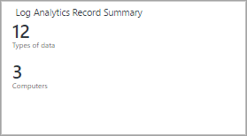
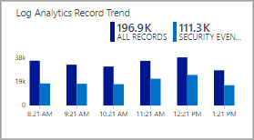

<properties
    pageTitle="Accedere Analitica visualizzazione affiancata della finestra di progettazione riferimento | Microsoft Azure"
    description="Progettazione visualizzazione Analitica Log consente di creare visualizzazioni personalizzate nella console di OMS contenenti diverse visualizzazioni dei dati nel repository OMS. In questo articolo fornisce un riferimento delle impostazioni per ognuna delle sezioni disponibile per l'uso nelle proprie visualizzazioni personalizzate."
    services="log-analytics"
    documentationCenter=""
    authors="bwren"
    manager="jwhit"
    editor=""/>

<tags
    ms.service="log-analytics"
    ms.workload="na"
    ms.tgt_pltfrm="na"
    ms.devlang="na"
    ms.topic="article"
    ms.date="09/27/2016"
    ms.author="bwren"/>

# Registro Analitica visualizzazione affiancata della finestra di progettazione riferimento
Lo strumento di progettazione visualizzazione Analitica Log consente di creare visualizzazioni personalizzate nella console di OMS contenenti diverse visualizzazioni dei dati nel repository OMS. In questo articolo fornisce un riferimento delle impostazioni per ognuna delle sezioni disponibile per l'uso nelle proprie visualizzazioni personalizzate.

Altri articoli disponibili per progettazione sono:

- [Progettazione](log-analytics-view-designer.md) : panoramica delle procedure per la creazione e modifica delle visualizzazioni personalizzate e progettazione.
- [Riferimento parte visualizzazione](log-analytics-view-designer-parts.md) - riferimento delle impostazioni per ognuna delle sezioni disponibile per l'uso nelle proprie visualizzazioni personalizzate. 

Nella tabella seguente sono elencati i diversi tipi di sezioni disponibile nella finestra di progettazione di visualizzazione.  Nelle sezioni seguenti descrivono ogni tipo di sezione in dettaglio e le relative proprietà.

| Riquadro | Descrizione |
|:--|:--|
| [Numero](#number-tile) | Singolo numero che indica il conteggio dei record da una query. |
| [Due numeri](#two-numbers-tile) | Due numeri singoli con conteggi di record da due query diversi. |
| [Ad anello](#donut-tile) | Grafico ad anello in base a una query con un valore di riepilogo al centro. |
| [Callout & grafico a linee](#line-chart-amp-callout-tile) | Grafico a linee in base a una query e un callout con un valore di riepilogo. |
| [Grafico a linee](#line-chart-tile) | Grafico a linee in base a una query. |
| [Due sequenze temporali](#two-timelines-tile) | Istogramma a colonne con due serie di che ognuna in base a una query separata. |

## Riquadro numero

Il riquadro **numero** consente di visualizzare un numero che mostra il conteggio dei record da una query di log e un'etichetta.

| Impostazione | Descrizione |
|:--|:--|
| Nome        | Testo da visualizzare nella parte superiore del riquadro. |
| Descrizione | Testo da visualizzare sotto il nome della sezione.    |
| **Riquadro** |
| Legenda | Testo da visualizzare nel valore. |
| Query | Query da eseguire.  Verrà visualizzato il conteggio del numero di record restituiti dalla query. |
| **Avanzate** |  **> Verifica del flusso di dati** |
| Attivato | Selezionare se è necessario abilitare la verifica del flusso di dati per il riquadro.  In questo modo un messaggio alternativo se non sono disponibili per il riquadro dati.  In genere viene utilizzato per fornire un messaggio durante il periodo temporaneo quando la vista è installata e dati disponibili. |
| Query | Eseguire una query per eseguire per verificare se sono disponibili per la visualizzazione dati.  Se la query non restituisce risultati, verrà visualizzato un messaggio anziché il valore dalla query principale. |
| Messaggio | Messaggio da visualizzare se la query di verifica del flusso di dati non restituisce dati.  Se non si fornisce alcun messaggio, *Esecuzione di valutazione* . |
| **Intervallo di tempo** |
| Durata | Durata dalla data corrente da utilizzare per l'intervallo di tempo della query.  Ad esempio, se si specifica **7 giorni** , la query è limitata ai record creati da 7 giorni alla data corrente. |
| Offset dati finale | Offset facoltativo dai dati correnti da utilizzare per l'intervallo di tempo della query principale.  Ad esempio, se **-1 giorno** viene usata per **l'offset data di fine** e **7 giorni** utilizzato per la **durata**, la query è limitata ai record creati da 8 giorni a ieri. |

## Il riquadro di due numeri

Il riquadro **Numero due** Visualizza che mostra il conteggio dei record da due query log diverso e un'etichetta per ogni due numeri.

| Impostazione | Descrizione |
|:--|:--|
| Nome        | Testo da visualizzare nella parte superiore del riquadro. |
| Descrizione | Testo da visualizzare sotto il nome della sezione.    |
| **Riquadro prima** |
| Legenda | Testo da visualizzare nel valore. |
| Query | Query da eseguire.  Verrà visualizzato il conteggio del numero di record restituiti dalla query. |
| **Riquadro secondo** |
| Legenda | Testo da visualizzare nel valore. |
| Query | Query da eseguire.  Verrà visualizzato il conteggio del numero di record restituiti dalla query. |
| **Avanzate** | **> Verifica del flusso di dati** |
| Attivato | Selezionare se è necessario abilitare la verifica del flusso di dati per il riquadro.  In questo modo un messaggio alternativo se non sono disponibili per il riquadro dati.  In genere viene utilizzato per fornire un messaggio durante il periodo temporaneo quando la vista è installata e dati disponibili. |
| Query | Eseguire una query per eseguire per verificare se sono disponibili per la visualizzazione dati.  Se la query non restituisce risultati, verrà visualizzato un messaggio anziché il valore dalla query principale. |
| Messaggio | Messaggio da visualizzare se la query di verifica del flusso di dati non restituisce dati.  Se non si fornisce alcun messaggio, *Esecuzione di valutazione* . |
| **Intervallo di tempo** |
| Durata | Durata dalla data corrente da utilizzare per l'intervallo di tempo della query.  Ad esempio, se si specifica **7 giorni** , la query è limitata ai record creati da 7 giorni alla data corrente. |
| Offset dati finale | Offset facoltativo dai dati correnti da utilizzare per l'intervallo di tempo della query principale.  Ad esempio, se **-1 giorno** viene usata per **l'offset data di fine** e **7 giorni** utilizzato per la **durata**, la query è limitata ai record creati da 8 giorni a ieri. |

## Riquadro ad anello

Il riquadro **anello** Visualizza un numero singolo riepilogato da una colonna di valori in una query di log.  L'anello graficamente i risultati delle prime tre record.

| Impostazione | Descrizione |
|:--|:--|
| Nome        | Testo da visualizzare nella parte superiore del riquadro. |
| Descrizione | Testo da visualizzare sotto il nome della sezione.    |
| **Ad anello** |
| Query | Query da eseguire per l'anello.  La prima proprietà deve essere un valore di testo e la seconda proprietà un valore numerico.  In genere si tratta di una query che utilizza la parola chiave **misura** per riepilogare i risultati. |
| **Ad anello** | **> Centro** |
| Testo | Testo da visualizzare sotto il valore all'interno di anello. |
| Operazione | Operazione da eseguire sulla proprietà valore per riepilogare un singolo valore.  -Somma: Sommare i valori di tutti i record con il valore della proprietà. -Percentuale: Percentuale dei valori di sommato dai record con il valore della proprietà rispetto ai valori sommati di tutti i record. |
| Valori dei risultati utilizzati in centro operazione | Facoltativamente, fare clic sul segno più per aggiungere uno o più valori.  I risultati della query saranno limitati ai record con i valori di proprietà specificati.  Se non sono stati aggiunti valori, che sono inclusi tutti i record nella query. |
| **Ad anello** | **> Altre opzioni** |
| Colori | Il colore da visualizzare per ognuna delle tre proprietà superiore.  Se si desidera specificare i colori alternativi per i valori di proprietà specifica, utilizzare avanzate colore Mapping. |
| Mapping dei colori avanzate | Visualizza un colore per specifici valori di proprietà.  Se il valore specificato per i tre principali, viene visualizzato un colore diverso anziché colori standard.  Se la proprietà non è disponibile per i tre superiore, il colore non è disponibile. |
| **Avanzate** | **> Verifica del flusso di dati** |
| Attivato | Selezionare se è necessario abilitare la verifica del flusso di dati per il riquadro.  In questo modo un messaggio alternativo se non sono disponibili per il riquadro dati.  In genere viene utilizzato per fornire un messaggio durante il periodo temporaneo quando la vista è installata e dati disponibili. |
| Query | Eseguire una query per eseguire per verificare se sono disponibili per la visualizzazione dati.  Se la query non restituisce risultati, verrà visualizzato un messaggio anziché il valore dalla query principale. |
| Messaggio | Messaggio da visualizzare se la query di verifica del flusso di dati non restituisce dati.  Se non si fornisce alcun messaggio, *Esecuzione di valutazione* . |
| **Intervallo di tempo** |
| Durata | Durata dalla data corrente da utilizzare per l'intervallo di tempo della query.  Ad esempio, se si specifica **7 giorni** , la query è limitata ai record creati da 7 giorni alla data corrente. |
| Offset dati finale | Offset facoltativo dai dati correnti da utilizzare per l'intervallo di tempo della query principale.  Ad esempio, se **-1 giorno** viene usata per **l'offset data di fine** e **7 giorni** utilizzato per la **durata**, la query è limitata ai record creati da 8 giorni a ieri. |

## Viene scaricato un file

Il riquadro di **grafico a linee** consente di visualizzare un grafico a linee con più serie di una query di log nel tempo.  

| Impostazione | Descrizione |
|:--|:--|
| Nome        | Testo da visualizzare nella parte superiore del riquadro. |
| Descrizione | Testo da visualizzare sotto il nome della sezione.    |
| **Grafico a linee** |  
| Query | Query da eseguire per il grafico a linee.  La prima proprietà deve essere un valore di testo e la seconda proprietà un valore numerico.  In genere si tratta di una query che utilizza la parola chiave **misura** per riepilogare i risultati.  Se la query utilizza la parola chiave **intervallo** asse x del grafico utilizzerà questo intervallo di tempo.  Se la query non include la parola chiave **intervallo** intervalli orari vengono utilizzati per l'asse x. |
| **Grafico a linee** | **> Asse Y** |
| Utilizzo di scala logaritmica | Selezionare questa opzione per utilizzare una scala logaritmica per l'asse y. |
| Unità di misura | Specificare le unità per i valori restituiti dalla query.  Queste informazioni vengono usate per visualizzare le etichette del grafico che indica i tipi di valore e facoltativamente per la conversione dei valori.  Il **Tipo di unità** specificata la categoria dell'unità e definisce i valori di **Tipo di unità corrente** che sono disponibili.  Se si seleziona un valore da **convertire in** valori numerici vengono convertiti da un tipo di **Unità corrente** al tipo di **convertire in** . |
| Etichetta personalizzata | Testo da visualizzare per l'asse Y accanto all'etichetta per il tipo di unità.  Se non viene specificato alcun etichetta, viene visualizzato solo il tipo di unità. |
| **Avanzate** | **> Verifica del flusso di dati** |
| Attivato | Selezionare se è necessario abilitare la verifica del flusso di dati per il riquadro.  In questo modo un messaggio alternativo se non sono disponibili per il riquadro dati.  In genere viene utilizzato per fornire un messaggio durante il periodo temporaneo quando la vista è installata e dati disponibili. |
| Query | Eseguire una query per eseguire per verificare se sono disponibili per la visualizzazione dati.  Se la query non restituisce risultati, verrà visualizzato un messaggio anziché il valore dalla query principale. |
| Messaggio | Messaggio da visualizzare se la query di verifica del flusso di dati non restituisce dati.  Se non si fornisce alcun messaggio, *Esecuzione di valutazione* . |
| **Intervallo di tempo** |
| Durata | Durata dalla data corrente da utilizzare per l'intervallo di tempo della query.  Ad esempio, se si specifica **7 giorni** , la query è limitata ai record creati da 7 giorni alla data corrente. |
| Offset dati finale | Offset facoltativo dai dati correnti da utilizzare per l'intervallo di tempo della query principale.  Ad esempio, se **-1 giorno** viene usata per **l'offset data di fine** e **7 giorni** utilizzato per la **durata**, la query è limitata ai record creati da 8 giorni a ieri. |

## Riquadro del callout & grafico riga

Il riquadro **callout & grafico a linee** consente di visualizzare un grafico a linee con più serie di una query di log nel tempo e un callout con un valore di riepilogo.  

| Impostazione | Descrizione |
|:--|:--|
| Nome        | Testo da visualizzare nella parte superiore del riquadro. |
| Descrizione | Testo da visualizzare sotto il nome della sezione.    |
| **Grafico a linee** |  
| Query | Query da eseguire per il grafico a linee.  La prima proprietà deve essere un valore di testo e la seconda proprietà un valore numerico.  In genere si tratta di una query che utilizza la parola chiave **misura** per riepilogare i risultati.  Se la query utilizza la parola chiave **intervallo** asse x del grafico utilizzerà questo intervallo di tempo.  Se la query non include la parola chiave **intervallo** intervalli orari vengono utilizzati per l'asse x. |
| **Grafico a linee** | **> Callout** |
| Callout | Testo del titolo da visualizzare sopra il valore di callout. |
| Nome della serie | Valore proprietà per la serie da utilizzare per il valore di callout.  Se nessuna serie, vengono utilizzati tutti i record dalla query. |
| Operazione | Operazione da eseguire sulla proprietà valore per riepilogare un singolo valore per il callout. -Media: Media dei valori da tutti i record.  -Conteggio: Conteggio di tutti i record restituiti dalla query. -Ultimo esempio: Valore dall'ultimo intervallo incluso nel grafico. -Max: Valore massimo da intervalli inclusi nel grafico. -Min: Valore minimo intervalli inclusi nel grafico. -Somma: Somma del valore da tutti i record. |
| **Grafico a linee** | **> Asse Y** |
| Utilizzo di scala logaritmica | Selezionare questa opzione per utilizzare una scala logaritmica per l'asse y. |
| Unità di misura | Specificare le unità per i valori restituiti dalla query.  Queste informazioni vengono usate per visualizzare le etichette del grafico che indica i tipi di valore e facoltativamente per la conversione dei valori.  Il **Tipo di unità** specificata la categoria dell'unità e definisce i valori di **Tipo di unità corrente** che sono disponibili.  Se si seleziona un valore da **convertire in** valori numerici vengono convertiti da un tipo di **Unità corrente** al tipo di **convertire in** . |
| Etichetta personalizzata | Testo da visualizzare per l'asse Y accanto all'etichetta per il tipo di unità.  Se non viene specificato alcun etichetta, viene visualizzato solo il tipo di unità. |
| **Avanzate** | **> Verifica del flusso di dati** |
| Attivato | Selezionare se è necessario abilitare la verifica del flusso di dati per il riquadro.  In questo modo un messaggio alternativo se non sono disponibili per il riquadro dati.  In genere viene utilizzato per fornire un messaggio durante il periodo temporaneo quando la vista è installata e dati disponibili. |
| Query | Eseguire una query per eseguire per verificare se sono disponibili per la visualizzazione dati.  Se la query non restituisce risultati, verrà visualizzato un messaggio anziché il valore dalla query principale. |
| Messaggio | Messaggio da visualizzare se la query di verifica del flusso di dati non restituisce dati.  Se non si fornisce alcun messaggio, *Esecuzione di valutazione* . |
| **Intervallo di tempo** |
| Durata | Durata dalla data corrente da utilizzare per l'intervallo di tempo della query.  Ad esempio, se si specifica **7 giorni** , la query è limitata ai record creati da 7 giorni alla data corrente. |
| Offset dati finale | Offset facoltativo dai dati correnti da utilizzare per l'intervallo di tempo della query principale.  Ad esempio, se **-1 giorno** viene usata per **l'offset data di fine** e **7 giorni** utilizzato per la **durata**, la query è limitata ai record creati da 8 giorni a ieri. |

## Riquadro due sequenze temporali

Il riquadro di **due sequenze temporali** Visualizza i risultati di due query log man mano gli istogrammi.  Per ogni serie viene visualizzato un callout.  

| Impostazione | Descrizione |
|:--|:--|
| Nome        | Testo da visualizzare nella parte superiore del riquadro. |
| Descrizione | Testo da visualizzare sotto il nome della sezione.    |
| Primo grafico   
| Legenda | Testo da visualizzare in didascalia per la prima serie.
| Colore | Colore da usare per le colonne della prima serie.
| Grafico Query | Query da eseguire per la prima serie.  Conteggio del numero di record in ogni intervallo di tempo rappresentato da colonne del grafico.
| Operazione | Operazione da eseguire sulla proprietà valore per riepilogare un singolo valore per il callout.  -Media: Media dei valori da tutti i record. -Conteggio: Conteggio di tutti i record restituiti dalla query. -Ultimo esempio: Valore dall'ultimo intervallo incluso nel grafico. -Max: Valore massimo da intervalli inclusi nel grafico.
| **Secondo grafico** |
| Legenda | Testo da visualizzare in didascalia per la seconda serie.
| Colore | Colore da usare per le colonne della seconda serie.
| Grafico Query | Query da eseguire per la seconda serie.  Conteggio del numero di record in ogni intervallo di tempo rappresentato da colonne del grafico.
| Operazione | Operazione da eseguire sulla proprietà valore per riepilogare un singolo valore per il callout.  -Media: Media dei valori da tutti i record. -Conteggio: Conteggio di tutti i record restituiti dalla query. -Ultimo esempio: Valore dall'ultimo intervallo incluso nel grafico. -Max: Valore massimo da intervalli inclusi nel grafico. |
| **Avanzate** | **> Verifica del flusso di dati** |
| Attivato | Selezionare se è necessario abilitare la verifica del flusso di dati per il riquadro.  In questo modo un messaggio alternativo se non sono disponibili per il riquadro dati.  In genere viene utilizzato per fornire un messaggio durante il periodo temporaneo quando la vista è installata e dati disponibili. |
| Query | Eseguire una query per eseguire per verificare se sono disponibili per la visualizzazione dati.  Se la query non restituisce risultati, verrà visualizzato un messaggio anziché il valore dalla query principale. |
| Messaggio | Messaggio da visualizzare se la query di verifica del flusso di dati non restituisce dati.  Se non si fornisce alcun messaggio, *Esecuzione di valutazione* . |
| **Intervallo di tempo** |
| Durata | Durata dalla data corrente da utilizzare per l'intervallo di tempo della query.  Ad esempio, se si specifica **7 giorni** , la query è limitata ai record creati da 7 giorni alla data corrente. |
| Offset dati finale | Offset facoltativo dai dati correnti da utilizzare per l'intervallo di tempo della query principale.  Ad esempio, se **-1 giorno** viene usata per **l'offset data di fine** e **7 giorni** utilizzato per la **durata**, la query è limitata ai record creati da 8 giorni a ieri. |

## Passaggi successivi

- Informazioni sulle [ricerche dei registri](log-analytics-log-searches.md) supportare le query in sezioni.
- Aggiungere [Parti di visualizzazione](log-analytics-view-designer-parts.md) per la visualizzazione personalizzata.