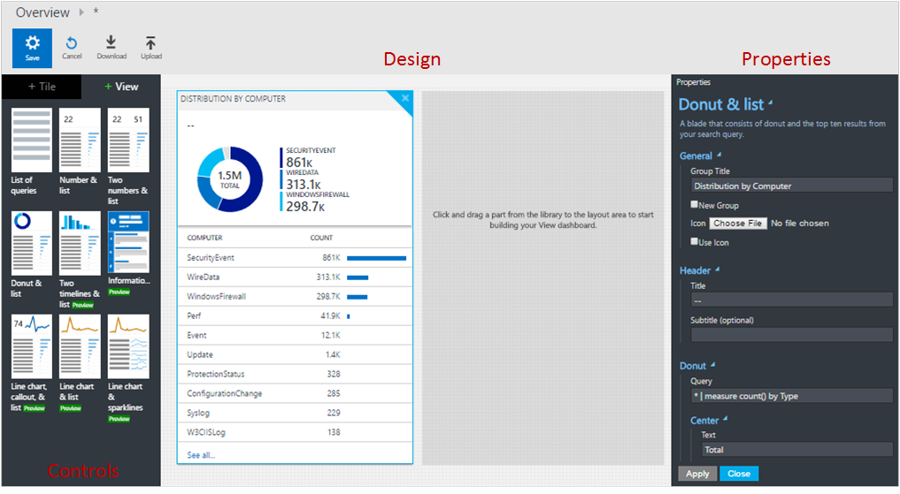

<properties
    pageTitle="Accedere progettazione visualizzazione Analitica | Microsoft Azure"
    description="Progettazione visualizzazione Analitica Log consente di creare visualizzazioni personalizzate nella console di OMS contenenti diverse visualizzazioni dei dati nel repository OMS. In questo articolo viene presentata una panoramica di progettazione e procedure per la creazione e modifica delle visualizzazioni personalizzate."
    services="log-analytics"
    documentationCenter=""
    authors="bwren"
    manager="jwhit"
    editor=""/>

<tags
    ms.service="log-analytics"
    ms.workload="na"
    ms.tgt_pltfrm="na"
    ms.devlang="na"
    ms.topic="article"
    ms.date="09/27/2016"
    ms.author="bwren"/>

# Progettazione visualizzazione Analitica log
Lo strumento di progettazione visualizzazione Analitica Log consente di creare visualizzazioni personalizzate nella console di OMS contenenti diverse visualizzazioni dei dati nel repository OMS. In questo articolo viene presentata una panoramica di progettazione e procedure per la creazione e modifica delle visualizzazioni personalizzate.

Altri articoli disponibili per progettazione sono:

- [Guida di riferimento riquadro](log-analytics-view-designer-tiles.md) - riferimento delle impostazioni per ognuna delle sezioni disponibile per l'uso nelle proprie visualizzazioni personalizzate. 
- [Riferimento parte visualizzazione](log-analytics-view-designer-parts.md) - riferimento delle impostazioni per ognuna delle sezioni disponibile per l'uso nelle proprie visualizzazioni personalizzate. 

## Concetti
Le visualizzazioni create con la finestra di progettazione visualizzazione contengono gli elementi nella tabella seguente.

| Parte | Descrizione |
|:--|:--|
| Riquadro | Visualizzato nel dashboard di panoramica Analitica Log principale.  Include un riepilogo visivo delle informazioni contenute nella visualizzazione personalizzata.  Diversi tipi di tessera offrono diverse visualizzazioni di record nell'archivio OMS.  Fare clic sul riquadro per aprire la visualizzazione personalizzata. |
| Visualizzazione personalizzata | Quando l'utente fa clic sul riquadro.  Contiene uno o più parti di visualizzazione. |
| Parti di visualizzazione | Visualizzazione dei dati nel repository OMS in base a una o più [ricerche dei registri](log-analytics-log-searches.md).  La maggior parte delle parti includerà un'intestazione che fornisce una visualizzazione di alto livello e un elenco dei risultati superiore.  Tipi di parte diversa forniscono diverse visualizzazioni di record nell'archivio OMS.  Fare clic su elementi nella parte per eseguire una ricerca Registro fornire record dettagliati. |

## Aggiunta di progettazione nell'area di lavoro
Durante la progettazione si trova in anteprima, è necessario aggiungere nell'area di lavoro selezionando **Le funzionalità di anteprima** nella sezione **Impostazioni** del portale di OMS.

## Creazione e modifica delle visualizzazioni

### Creare una nuova visualizzazione
Aprire una nuova visualizzazione in **Progettazione visualizzazione** facendo clic sul riquadro Progettazione viste nel dashboard OMS principale.

### Modificare una visualizzazione esistente
Per modificare una visualizzazione esistente nella finestra di progettazione di visualizzazione, aprire la visualizzazione facendo clic sulla relativa tessera di dashboard OMS principale.  Fare clic sul pulsante **Modifica** per aprire la visualizzazione nella finestra di progettazione di visualizzazione.

### Duplicare una visualizzazione esistente
Quando si clona una visualizzazione, crea una nuova visualizzazione e viene aperta nella finestra di progettazione di visualizzazione.  La nuova visualizzazione avrà lo stesso nome originale con "copiare" aggiunte alla fine di esso.  Per duplicare una visualizzazione, aprire la visualizzazione facendo clic sulla relativa tessera di dashboard OMS principale.  Fare clic sul pulsante **duplicato** per aprire la visualizzazione nella finestra di progettazione di visualizzazione.

### Eliminare una visualizzazione esistente
Per eliminare una visualizzazione esistente, aprire la visualizzazione facendo clic sulla relativa tessera di dashboard OMS principale.  Fare clic sul pulsante **Modifica** per aprire la visualizzazione nella finestra di progettazione di visualizzazione, quindi fare clic su **Elimina vista**.

### Esportare una visualizzazione esistente
È possibile esportare una visualizzazione in un file JSON che è possibile importare in un'altra area di lavoro o utilizzare in un [modello di gestione risorse di Azure](../resource-group-authoring-templates.md).  Per esportare una visualizzazione esistente, aprire la visualizzazione facendo clic sulla relativa tessera di dashboard OMS principale.  Fare clic sul pulsante **Esporta** per creare un file nella cartella download del browser.  Il nome del file sarà il nome della visualizzazione con l' estensione *omsview*.

### Importare una visualizzazione esistente
È possibile importare un file *omsview* esportato da un altro gruppo di gestione.  Per importare una visualizzazione esistente, prima di tutto creare una nuova visualizzazione.  Quindi fare clic sul pulsante **Importa** e selezionare il file *omsview* .  La configurazione del file verrà copiata nella visualizzazione esistente.

## Utilizzo di progettazione
Progettazione visualizzazione sono previsti tre riquadri.  Il riquadro di **Progettazione** rappresenta la visualizzazione personalizzata.  Quando si aggiungono le sezioni e parti dal Pannello di **controllo** nel riquadro di **Progettazione** vengono aggiunti alla visualizzazione.  Riquadro delle **proprietà** sarà visualizzate le proprietà per il riquadro o la parte selezionata.

### Configurare il riquadro di visualizzazione
Una visualizzazione personalizzata può avere una sola tessera.  Selezionare la scheda **riquadro** nel riquadro di **controllo** per visualizzare il riquadro corrente oppure selezionarne uno alternativo.  Riquadro attività **proprietà** visualizzerà le proprietà della sezione corrente.  Configurare le proprietà del riquadro in base alle informazioni dettagliate nel [Riquadro di riferimento](log-analytics-view-designer-tiles.md) e fare clic su **Applica** per salvare le modifiche.

### Configurare le parti di visualizzazione
Una visualizzazione è possibile includere qualsiasi numero di parti di visualizzazione.  Selezionare la scheda **Visualizza** e quindi una parte di visualizzazione da aggiungere alla visualizzazione.  Riquadro delle **proprietà** sarà visualizzate le proprietà per la parte selezionata.  Configurare le proprietà di visualizzazione in base alle informazioni dettagliate nel [riferimento di parte di visualizzazione](log-analytics-view-designer-parts.md) e fare clic su **Applica** per salvare le modifiche.

### Eliminare una parte di visualizzazione
È possibile rimuovere una parte di visualizzazione dalla visualizzazione facendo clic sul pulsante **X** nell'angolo superiore destro della parte.

### Ridisporre le parti di visualizzazione
Visualizzazioni solo dispone di una riga di parti di visualizzazione.  Ridisporre le parti esistenti in una visualizzazione facendo clic e trascinare fino a una nuova posizione.

## Passaggi successivi

- Aggiungere [riquadri](log-analytics-view-designer-tiles.md) personalizzati.
- Aggiungere [Parti di visualizzazione](log-analytics-view-designer-parts.md) per la visualizzazione personalizzata.
