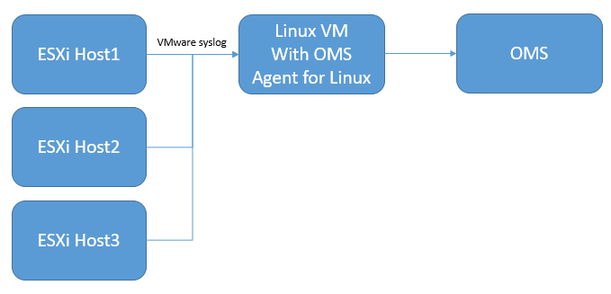
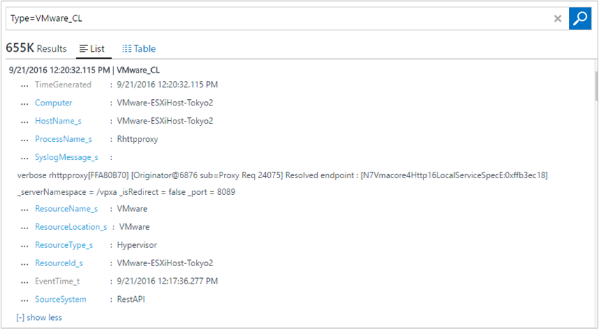
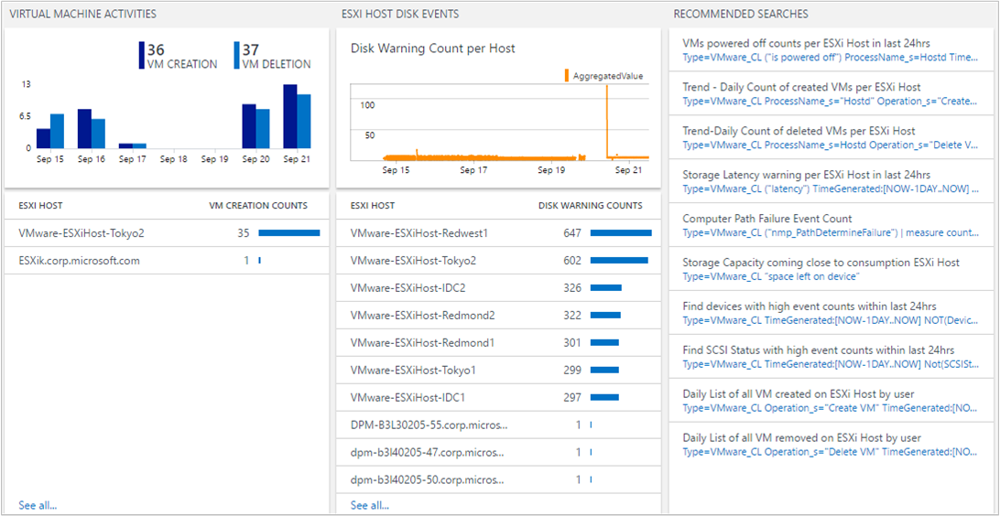
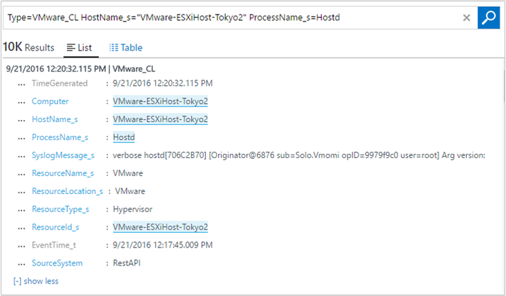
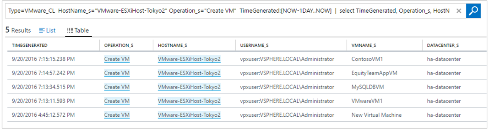

<properties
    pageTitle="Soluzione VMware monitoraggio in Log Analitica | Microsoft Azure"
    description="Le informazioni come la soluzione VMware monitoraggio è in grado di gestire i registri e monitorare ESXi host."
    services="log-analytics"
    documentationCenter=""
    authors="bandersmsft"
    manager="jwhit"
    editor=""/>

<tags
    ms.service="log-analytics"
    ms.workload="na"
    ms.tgt_pltfrm="na"
    ms.devlang="na"
    ms.topic="article"
    ms.date="10/28/2016"
    ms.author="banders"/>

# <a name="vmware-monitoring-preview-solution-in-log-analytics"></a>Soluzione VMware monitoraggio (Preview) in Analitica Log

La soluzione VMware monitoraggio in Analitica Log è una soluzione che consente di creare una registrazione centralizzata e monitoraggio approccio per registri di grandi dimensioni VMware. Questo articolo descrive come è possibile risolvere i problemi, acquisire e gestire gli host ESXi in un'unica posizione utilizzando la soluzione. Con la soluzione, è possibile visualizzare dati dettagliati per tutti gli host ESXi in un'unica posizione. È possibile visualizzare conteggi evento superiore, stato e le tendenze di host macchine Virtuali ed ESXi fornito tramite i log di host ESXi. È possibile risolvere visualizzando e centralizzata ESXi host registra la ricerca. E, è possibile creare avvisi in base a query di ricerca di log.

Funzionalità di registro di sistema nativo dell'host di ESXi a push dei dati a una destinazione macchine Virtuali, che sono un agente OMS l'utilizzo della soluzione. Tuttavia, la soluzione non scriverà i file nel Registro di sistema all'interno della destinazione macchine Virtuali. L'agente OMS apre porta 1514 e ascolta questo. Dopo avere ricevuto i dati, l'agente OMS consente di inserire i dati nell'OMS.

## <a name="installing-and-configuring-the-solution"></a>Installare e configurare la soluzione

Utilizzare le informazioni seguenti per installare e configurare la soluzione.

- Aggiungere la soluzione VMware monitoraggio nell'area di lavoro OMS usando la procedura descritta nella sezione [aggiungere Analitica Log soluzioni dalla raccolta soluzioni](log-analytics-add-solutions.md).

#### <a name="supported-vmware-esxi-hosts"></a>Host VMware ESXi supportati
vSphere ESXi Host 5.5 e 6.0

#### <a name="prepare-a-linux-server"></a>Preparare un server Linux
Creare un sistema operativo Linux macchine Virtuali di ricevere tutti i dati di registro di sistema da host ESXi. L' [Agente Linux OMS](log-analytics-linux-agents.md) è il punto di raccolta per tutti i dati di registro di sistema ESXi host. È possibile utilizzare più host ESXi per inoltrare i registri per un singolo server Linux, come illustrato nell'esempio seguente.  

   

### <a name="configure-syslog-collection"></a>Configurare l'insieme di registro di sistema

1. Impostare l'inoltro di registro di sistema per VSphere. Per informazioni dettagliate configurare l'inoltro di registro di sistema, vedere [la configurazione di registro di sistema in ESXi 5. x e 6.0 (2003322)](https://kb.vmware.com/selfservice/microsites/search.do?language=en_US&cmd=displayKC&externalId=2003322). Passare a **configurazione Host ESXi** > **Software** > **Impostazioni avanzate** > **Registro di sistema**.
    

2. Nel campo *Syslog.global.logHost* , aggiungere il server Linux e il numero di porta *1514*. Ad esempio `tcp://hostname:1514` o`tcp://123.456.789.101:1514`

3. Aprire il firewall host ESXi per registro di sistema. **Configurazione Host ESXi** > **Software** > **Profilo di sicurezza** > **Firewall** e Visualizza **proprietà**.  

      

      

4. Selezionare vSphere Console per verificare che il Registro di sistema sia configurato correttamente. Confermare nell'host ESXI tale porta **1514** è configurato.

5. Verificare la connessione tra il server Linux e host ESXi utilizzando il `nc` comando nell'ESXi Host. Per esempio:

    ```
    [root@ESXiHost:~] nc -z 123.456.789.101 1514
    Connection to 123.456.789.101 1514 port [tcp/*] succeeded!
    ```

6. Scaricare e installare l'agente OMS per Linux nel server Linux. Per ulteriori informazioni, vedere la [documentazione per agente OMS Linux](https://github.com/Microsoft/OMS-Agent-for-Linux).

7. Dopo aver installato l'agente OMS per Linux, passare alla directory /etc/opt/microsoft/omsagent/sysconf/omsagent.d e copiare il file vmware_esxi.conf alla directory /etc/opt/microsoft/omsagent/conf/omsagent.d e la modifica, il proprietario o del gruppo e le autorizzazioni del file. Per esempio:

    ```
    sudo cp /etc/opt/microsoft/omsagent/sysconf/omsagent.d/vmware_esxi.conf /etc/opt/microsoft/omsagent/conf/omsagent.d
sudo chown omsagent:omiusers /etc/opt/microsoft/omsagent/conf/omsagent.d/vmware_esxi.conf
    ```

8.  Riavviare l'agente OMS di Linux eseguendo `sudo /opt/microsoft/omsagent/bin/service_control restart`.

9. Nel portale OMS, eseguire una ricerca registro `Type=VMware_CL`. Quando OMS raccoglie i dati del Registro di sistema, mantiene il formato di registro di sistema. Nel portale, vengono acquisite alcuni campi specifici, ad esempio *Hostname* e *Opzioni*.  

      

    Se i risultati della ricerca di log di visualizzazione sono simili a immagine precedente, è impostato per usare il dashboard di soluzione OMS VMware monitoraggio.  

## <a name="vmware-data-collection-details"></a>Dettagli di raccolta dati VMware

La soluzione VMware monitoraggio raccoglie vari dati sulle prestazioni metriche e registro da host ESXi utilizzando agenti OMS per Linux che è stata attivata.

Nella tabella seguente mostra i metodi di raccolta dati e altri dettagli sulle modalità di raccolta dati.

| piattaforma | Agente OMS per Linux | Agente SCOM | Spazio di archiviazione Azure | SCOM necessari? | Dati di agente SCOM inviati tramite il gruppo di gestione | frequenza di raccolta |
|---|---|---|---|---|---|---|
|Linux||||            || ogni 3 minuti|


Nella tabella seguente sono riportati esempi di campi di dati raccolti dalla soluzione VMware monitoraggio:

| Nome campo | Descrizione |
| --- | --- |
| Device_s| Dispositivi di archiviazione VMware |
| ESXIFailure_s | tipi di errore |
| EventTime_t | ora in cui si è verificato l'evento |
| HostName_s | Nome host ESXi |
| Operation_s | creare macchine Virtuali o eliminare macchine Virtuali |
| ProcessName_s | nome dell'evento |
| ResourceId_s | nome dell'host VMware |
| ResourceLocation_s | VMware |
| ResourceName_s | VMware |
| ResourceType_s | Hyper-V |
| SCSIStatus_s | Stato SCSI VMware |
| SyslogMessage_s | Dati di registro di sistema |
| UserName_s | utente che ha creato o eliminato macchine Virtuali |
| VMName_s | Nome macchina virtuale |
| Computer | computer host |
| TimeGenerated | generazione di dati |
| DataCenter_s | Data Center VMware |
| StorageLatency_s | latenza di spazio di archiviazione (ms) |

## <a name="vmware-monitoring-solution-overview"></a>Panoramica della soluzione VMware monitoraggio

Il riquadro VMware viene visualizzato nel portale di OMS. Fornisce una panoramica delle eventuali errori. Quando si fa clic sul riquadro, viene visualizzata in una visualizzazione del dashboard.


#### <a name="navigate-the-dashboard-view"></a>Spostarsi nella visualizzazione di dashboard

Nella visualizzazione dashboard **VMware** pale sono organizzati per:

- Conteggio di stato di errore
- Viene contato superiore Host dall'evento
- Conteggi evento superiore
- Attività macchina virtuale
- Host ESXi disco eventi




Fare clic su qualsiasi blade per aprire riquadro ricerca Analitica Log contenente informazioni dettagliate specifico per e il.

Da qui è possibile modificare la query di ricerca per modificare per un elemento specifico. Per un'esercitazione sulle nozioni fondamentali della ricerca OMS, estrarre il [esercitazione ricerca Registro di sistema OMS.](log-analytics-log-searches.md)

#### <a name="find-esxi-host-events"></a>Trovare gli eventi host ESXi

Un singolo host ESXi genera più log, in base a processi. La soluzione VMware monitoraggio centralizzata loro e vengono riepilogati i conteggi evento. Questa visualizzazione centralizzata consente di comprendere host ESXi con una quantità elevata di eventi e gli eventi che si verificano più di frequente nel proprio ambiente.


È possibile eseguire il drill-ulteriormente facendo clic su un host ESXi o un tipo di evento.

Quando si fa clic su un nome host ESXi, visualizzare le informazioni provenienti da tale host ESXi. Se si desidera limitare i risultati con il tipo di evento, aggiungere `“ProcessName_s=EVENT TYPE”` nella query di ricerca. È possibile selezionare **Opzioni** nel filtro di ricerca. Che consente di limitare le informazioni dell'utente.



#### <a name="find-high-vm-activities"></a>Trovare attività macchine Virtuali elevata

Una macchina virtuale possono essere creata o eliminata di qualsiasi host ESXi. Può essere utile per gli amministratori identificare quante macchine virtuali viene creato un host ESXi. Che a sua volta, è utile conoscere pianificazione delle prestazioni e capacità. Tenere traccia di eventi di attività macchine Virtuali è fondamentale, quando la gestione dell'ambiente.


Se si desidera visualizzare ulteriori ESXi host macchine Virtuali la creazione dei dati, fare clic su un nome host ESXi.



#### <a name="common-search-queries"></a>Query di ricerca comuni

La soluzione include altre query utili che consentono di gestire l'host ESXi, ad esempio lo spazio di archiviazione ad alta latenza di spazio di archiviazione ed errore di percorso.


#### <a name="save-queries"></a>Salvare le query

Salvataggio delle query di ricerca è una funzionalità standard OMS e consentono di mantenere le query che è stato trovato utile. Dopo aver creato una query che utili, salvarlo facendo clic su **Preferiti**. Una query salvata consente di riutilizzare facilmente in un secondo momento dalla pagina [Dashboard personale](log-analytics-dashboards.md) in cui è possibile creare dashboard personalizzati.


#### <a name="create-alerts-from-queries"></a>Consente di creare avvisi di query

Dopo aver creato le query, è consigliabile usare le query a un avviso quando si verificano determinati eventi. Per informazioni su come creare avvisi, vedere [gli avvisi di Log Analitica](log-analytics-alerts.md) . Per esempi di avviso query e altri esempi di query, vedere il blog [VMware Monitor tramite OMS Log Analitica](https://blogs.technet.microsoft.com/msoms/2016/06/15/monitor-vmware-using-oms-log-analytics) .

## <a name="frequently-asked-questions"></a>Domande frequenti

### <a name="what-do-i-need-to-do-on-the-esxi-host-setting-what-impact-will-it-have-on-my-current-environment"></a>Che cos'è necessario nel ESXi ospitare impostazione? Qual è l'impatto avrà, dell'ambiente operativo corrente?
La soluzione utilizza il Registro di sistema Host ESXi nativo meccanismo di inoltro. Non è necessario altro software Microsoft nell'ESXi Host per acquisire i log. Dovrebbe avere un impatto minimo per l'ambiente esistente. Tuttavia, è necessario impostare l'inoltro di registro di sistema, ossia funzionalità ESXI.

### <a name="do-i-need-to-restart-my-esxi-host"></a>È necessario riavviare il host ESXi?
No. Questo processo non richiede il riavvio. In alcuni casi vSphere non aggiornare correttamente il Registro di sistema. In questo caso, accedere all'host ESXi e ricaricare il Registro di sistema. Nuovo, non è necessario riavviare l'host, in modo che questo processo non interrompa l'ambiente.

### <a name="can-i-increase-or-decrease-the-volume-of-log-data-sent-to-oms"></a>È possibile aumentare o ridurre il volume di dati di log inviati al OMS?
Sì è possibile. È possibile utilizzare le impostazioni del livello di registrazione Host ESXi in vSphere. Insieme di log è basato sul livello di *informazioni* . Pertanto, se si desidera controllare macchine Virtuali creazione o l'eliminazione, è necessario mantenere il livello di *informazioni* sul Hostd. Per ulteriori informazioni, vedere l' [articolo della Knowledge Base VMware](https://kb.vmware.com/selfservice/microsites/search.do?&cmd=displayKC&externalId=1017658).

### <a name="why-is-hostd-not-providing-data-to-oms-my-log-setting-is-set-to-info"></a>Perché è Hostd non forniscono dati alla OMS? I log è impostata su info.
Si è verificato un errore di host ESXi per il timestamp del Registro di sistema. Per ulteriori informazioni, vedere l' [articolo della Knowledge Base VMware](https://kb.vmware.com/selfservice/microsites/search.do?language=en_US&cmd=displayKC&externalId=2111202). Dopo aver applicato la soluzione, Hostd deve funzionare normalmente.

### <a name="can-i-have-multiple-esxi-hosts-forwarding-syslog-data-to-a-single-vm-with-omsagent"></a>Si possono aggiungere più host ESXi inoltro dei dati di registro di sistema per una singola macchina virtuale con omsagent?
Sì. È possibile avere più host ESXi inoltro a una singola macchina virtuale con omsagent.

### <a name="why-dont-i-see-data-flowing-into-oms"></a>Perché non è disponibile in OMS flusso di dati?

È possibile che diversi motivi:

- Host ESXi è non correttamente il push dei dati macchine Virtuali in esecuzione omsagent. Per testare, procedere come segue:
    1. Per confermare, accedere all'host ESXi mediante ssh ed eseguire il comando seguente:`nc -z ipaddressofVM 1514`

        Se il problema persiste, vSphere impostazioni di configurazione avanzate sono probabilmente non corretta. Per informazioni su come configurare l'host ESXi per l'inoltro di registro di sistema, vedere [configurare Registro di sistema insieme](#configure-syslog-collection) .

    2. Se la connettività porta Registro di sistema ha esito positivo, ma non è ancora visibile qualsiasi tipo di dati, ricaricare il Registro di sistema nell'host ESXi utilizzando ssh per eseguire il comando seguente:` esxcli system syslog reload`

- Macchine Virtuali con agente OMS non sia impostata correttamente. Per verificarlo, procedere come segue:
    1. OMS ascolta la porta 1514 e consente di inserire i dati nell'OMS. Per verificare che sia aperto, eseguire il comando seguente:`netstat -a | grep 1514`
    2. Verrà visualizzata la porta `1514/tcp` aprire. In caso contrario, verificare che il omsagent sia installato correttamente. Se non si visualizzare le informazioni sulle porte, porta Registro di sistema non è aperta nella macchina virtuale.
        1. Verificare che l'agente OMS è in esecuzione utilizzando `ps -ef | grep oms`. Se non è in esecuzione, avviare il processo di eseguendo il comando` sudo /opt/microsoft/omsagent/bin/service_control start`
        2. Aprire la `/etc/opt/microsoft/omsagent/conf/omsagent.d/vmware_esxi.conf` file.

            Verificare che l'utente corretto e impostazione di gruppo è valido, simile a:`-rw-r--r-- 1 omsagent omiusers 677 Sep 20 16:46 vmware_esxi.conf`

            Se il file non esiste o se l'utente e impostazione di gruppo è errato, adottare misure correttive la [Preparazione di un server Linux](#prepare-a-linux-server).

## <a name="next-steps"></a>Passaggi successivi

- In [Ricerche dei registri](log-analytics-log-searches.md) Analitica Log consente di visualizzare i dati di host VMware dettagliati.
- [Creare dashboard personalizzati](log-analytics-dashboards.md) che mostra i dati di host VMware.
- [Creare avvisi](log-analytics-alerts.md) quando si verificano determinati eventi host VMware.
