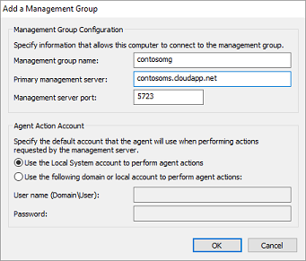

<properties
    pageTitle="Connettere computer Windows Log Analitica | Microsoft Azure"
    description="In questo articolo illustra la procedura per connettere i computer Windows dell'infrastruttura locale direttamente a OMS tramite una versione personalizzata di Microsoft monitoraggio agente (MMA)."
    services="log-analytics"
    documentationCenter=""
    authors="bandersmsft"
    manager="jwhit"
    editor=""/>

<tags
    ms.service="log-analytics"
    ms.workload="na"
    ms.tgt_pltfrm="na"
    ms.devlang="na"
    ms.topic="article"
    ms.date="08/11/2016"
    ms.author="banders"/>


# <a name="connect-windows-computers-to-log-analytics"></a>Connettere computer Windows Analitica Log

In questo articolo illustra la procedura per connettere i computer Windows dell'infrastruttura locale direttamente alle aree di lavoro OMS tramite una versione personalizzata di Microsoft monitoraggio agente (MMA). È necessario installare e connettersi incorporata a OMS affinché per inviare dati a OMS e per visualizzare e gestire i dati nel portale di OMS agenti per tutti i computer che si desidera. Ogni agente possibile segnalare a più aree di lavoro.

È possibile installare gli agenti tramite il programma di installazione, riga di comando o con bene accolta stato configurazione (DSC) in Azure automazione.  

>[AZURE.NOTE] Per macchine virtuali in esecuzione in Azure consente di semplificare l'installazione utilizzando l' [estensione macchina virtuale](log-analytics-azure-vm-extension.md).

Nei computer con la connessione a Internet, l'agente utilizzerà la connessione a Internet per inviare dati a OMS. Per i computer che non dispongono di connettività Internet, è possibile utilizzare un proxy o inoltro OMS Log Analitica.

Connessione dei computer Windows a OMS è un'operazione semplice con 3 semplici passaggi:

1. Scaricare il file di configurazione dell'agente
2. Installare l'agente utilizzando il metodo che scelto
3. Configurare l'agente o aggiungere altre aree di lavoro, se necessario

Il diagramma seguente illustra la relazione tra il computer Windows e OMS dopo aver installato e configurato agenti.


## <a name="system-requirements-and-required-configuration"></a>Requisiti di sistema e configurazione necessarie
Prima di installare o distribuire agenti, esaminare i dettagli seguenti per assicurarsi che è necessario soddisfare i requisiti necessari.

- È possibile installare solo MMA OMS in un computer che eseguono Windows Server 2008 SP 1 o versione successiva o Windows 7 SP1 o versione successiva.
- È necessario un abbonamento a OMS.  Per ulteriori informazioni, vedere [Guida introduttiva a Log Analitica](log-analytics-get-started.md).
- Ogni computer Windows deve essere in grado di connettersi a Internet tramite HTTPS. Questa connessione può essere diretta tramite un proxy o tramite il server d'inoltro di OMS Log Analitica.
- È possibile installare MMA OMS in computer autonomi, server e macchine virtuali. Se si desidera connettersi OMS ospitato Azure macchine virtuali, vedere [macchine virtuali di Azure connettersi al Log Analitica](log-analytics-azure-vm-extension.md).
- L'agente deve utilizzare la porta TCP 443 per diverse risorse. Per ulteriori informazioni, vedere [configurare le impostazioni proxy e firewall nel registro Analitica](log-analytics-proxy-firewall.md).

## <a name="download-the-agent-setup-file-from-oms"></a>Scaricare il file di configurazione dell'agente dal OMS
1. Nel portale OMS, nella pagina **Panoramica** fare clic sul riquadro **Impostazioni** .  Fare clic sulla scheda **Origini connesse** nella parte superiore.  
    
2. In **Allegare direttamente computer**, fare clic su **Scarica agente di Windows** applicabili al tipo di processore computer di scaricare il file di configurazione.
3. A destra **dell'ID dell'area di lavoro**, fare clic sull'icona di copiare e incollare l'ID nel blocco note.
4. A destra della **Chiave primaria**, fare clic sull'icona di copiare e incollare la chiave nel blocco note.     
    

## <a name="install-the-agent-using-setup"></a>Installare l'agente utilizzando il programma di installazione
1. Eseguire l'installazione per installare l'agente in un computer che si vuole gestire.
2. Nella pagina di benvenuto, fare clic su **Avanti**.
3. Nella pagina condizioni di licenza, leggere la licenza e quindi fare clic su **accetto**.
4. Nella pagina cartella di destinazione, modificare o utilizzare la cartella di installazione predefinita e quindi fare clic su **Avanti**.
5. Nella pagina delle opzioni di configurazione dell'agente, è possibile connettere l'agente di Azure Log Analitica (OMS), Operations Manager, oppure è possibile omettere le opzioni disponibili se si desidera configurare l'agente in un secondo momento. Fare clic su **Avanti**.   
    - Se si è scelto di connettersi a Azure Log Analitica (OMS), incollare **l'ID dell'area di lavoro** e l' **Area di lavoro la chiave primaria** copiato nel blocco note nella procedura precedente e quindi fare clic su **Avanti**.  
        
    - Se si è scelto di connettersi a Operations Manager, digitare il **Nome del gruppo Gestione**, nome del **Server di gestione** e **Porta Server di gestione**e quindi fare clic su **Avanti**. Nella pagina Account azione agente scegliere account di sistema locale o un account di dominio locale e quindi fare clic su **Avanti**.  
        

6. Nella schermata installazione rivedere le scelte e quindi fare clic su **Installa**.
7. Nella configurazione completata della pagina, fare clic su **Fine**.
8. Al termine, l' **Agente di monitoraggio di Microsoft** viene visualizzata nel **Pannello di controllo**. È possibile rivedere la configurazione sono e verificare che l'agente sia connesso a informazioni dettagliate sui operative (OMS). Quando si è connessi a OMS, l'agente viene visualizzato un messaggio che informa: **l'agente di monitoraggio Microsoft connesso al servizio Microsoft operazioni Management Suite.**

## <a name="install-the-agent-using-the-command-line"></a>Installare l'agente utilizzando la riga di comando
- Modificare e quindi utilizzare l'esempio seguente per installare l'agente utilizzando la riga di comando.

    >[AZURE.NOTE] Se si desidera aggiornare un agente, è necessario utilizzare Analitica Log API di scripting. Vedere la sezione successiva per aggiornare un agente.

    ```
    MMASetup-AMD64.exe /Q:A /R:N /C:"setup.exe /qn ADD_OPINSIGHTS_WORKSPACE=1 OPINSIGHTS_WORKSPACE_ID=<your workspace id> OPINSIGHTS_WORKSPACE_KEY=<your workspace key> AcceptEndUserLicenseAgreement=1"
    ```

## <a name="upgrade-the-agent-and-add-a-workspace-using-a-script"></a>Aggiornare l'agente e aggiungere un'area di lavoro utilizzando uno script
È possibile aggiornare un agente e aggiungere un'area di lavoro utilizzando Analitica Log API di scripting nel seguente esempio di PowerShell.

```
$mma = New-Object -ComObject 'AgentConfigManager.MgmtSvcCfg'
$mma.AddCloudWorkspace($workspaceId, $workspaceKey)
$mma.ReloadConfiguration()
```

>[AZURE.NOTE] Se sono state usate lo script o una riga di comando in precedenza per installare o configurare l'agente `EnableAzureOperationalInsights` è stato sostituito da `AddCloudWorkspace`.

## <a name="install-the-agent-using-dsc-in-azure-automation"></a>Installare l'agente utilizzando DSC automazione Azure

>[AZURE.NOTE] In questo esempio procedure e script non consente di aggiornare un agente esistente.

1. Importare xPSDesiredStateConfiguration DSC modulo da [http://www.powershellgallery.com/packages/xPSDesiredStateConfiguration](http://www.powershellgallery.com/packages/xPSDesiredStateConfiguration) automazione Azure.  
2.  Creare attività variabile di automazione di Azure per *OPSINSIGHTS_WS_ID* e *OPSINSIGHTS_WS_KEY*. Impostare *OPSINSIGHTS_WS_ID* per l'ID dell'area di lavoro OMS Log Analitica e *OPSINSIGHTS_WS_KEY* per la chiave primaria dell'area di lavoro.
3.  Usare il seguente script e salvarlo come MMAgent.ps1
4.  Modificare e quindi utilizzare l'esempio seguente per installare l'agente utilizzando DSC in Azure automazione. Importare MMAgent.ps1 automazione Azure mediante l'interfaccia di automazione di Azure o cmdlet.
5.  Assegnare un nodo la configurazione. All'interno di 15 minuti il nodo verificherà la configurazione e la MMA verrà inserita al livello di nodo.

```
Configuration MMAgent
{
    $OIPackageLocalPath = "C:\MMASetup-AMD64.exe"
    $OPSINSIGHTS_WS_ID = Get-AutomationVariable -Name "OPSINSIGHTS_WS_ID"
    $OPSINSIGHTS_WS_KEY = Get-AutomationVariable -Name "OPSINSIGHTS_WS_KEY"


    Import-DscResource -ModuleName xPSDesiredStateConfiguration

    Node OMSnode {
        Service OIService
        {
            Name = "HealthService"
            State = "Running"
            DependsOn = "[Package]OI"
        }

        xRemoteFile OIPackage {
            Uri = "http://download.microsoft.com/download/0/C/0/0C072D6E-F418-4AD4-BCB2-A362624F400A/MMASetup-AMD64.exe"
            DestinationPath = $OIPackageLocalPath
        }

        Package OI {
            Ensure = "Present"
            Path  = $OIPackageLocalPath
            Name = "Microsoft Monitoring Agent"
            ProductId = "8A7F2C51-4C7D-4BFD-9014-91D11F24AAE2"
            Arguments = '/C:"setup.exe /qn ADD_OPINSIGHTS_WORKSPACE=1 OPINSIGHTS_WORKSPACE_ID=' + $OPSINSIGHTS_WS_ID + ' OPINSIGHTS_WORKSPACE_KEY=' + $OPSINSIGHTS_WS_KEY + ' AcceptEndUserLicenseAgreement=1"'
            DependsOn = "[xRemoteFile]OIPackage"
        }
    }
}  


```


## <a name="configure-an-agent-manually-or-add-additional-workspaces"></a>Configurare manualmente un agente o aggiungere altre aree di lavoro
Se sono stati installati gli agenti ma non si è configurato o se si desidera che l'agente di segnalare a più aree di lavoro, è possibile usare le informazioni seguenti per abilitare un agente o configurarlo di nuovo. Dopo aver configurato l'agente, verrà registrato con il servizio agente e otterranno informazioni di configurazione necessarie e management pack che contengono informazioni sulla soluzione.

1. Dopo aver installato l'agente di monitoraggio di Microsoft, aprire **Il pannello di controllo**.
2. Aprire **Microsoft Agent di monitoraggio** e quindi fare clic sulla scheda **Azure Log Analitica (OMS)** .   
3. Fare clic su **Aggiungi** per aprire la casella **Aggiungi un'area di lavoro Analitica Log** .
4. Incollare **l'ID dell'area di lavoro** e l' **Area di lavoro la chiave primaria** che sono stati copiati nel blocco note in una procedura precedente per l'area di lavoro che si desidera aggiungere e quindi fare clic su **OK**.  
    

Dopo raccolti dal computer controllato dall'agente, il numero di computer monitorate da OMS verrà visualizzati nel portale di OMS nella scheda **Origini connesse** nelle **Impostazioni** come **Server connessi**.


## <a name="to-disable-an-agent"></a>Per disabilitare un agente
1. Dopo aver installato l'agente, aprire **Il pannello di controllo**.
2. Aprire Microsoft Agent di monitoraggio e quindi fare clic sulla scheda **Azure Log Analitica (OMS)** .
3. Selezionare un'area di lavoro e quindi fare clic su **Rimuovi**. Ripetere questo passaggio per tutte le altre aree di lavoro.


## <a name="optionally-configure-agents-to-report-to-an-operations-manager-management-group"></a>Facoltativamente, è possibile configurare gli agenti per segnalare a un gruppo di gestione Operations Manager

Se si utilizza Operations Manager dell'infrastruttura IT, è anche possibile utilizzare l'agente MMA come un agente di Operations Manager.

### <a name="to-configure-mma-agents-to-report-to-an-operations-manager-management-group"></a>Per configurare gli agenti MMA per segnalare a un gruppo di gestione Operations Manager
1.  Nel computer in cui è installato l'agente, aprire **Il pannello di controllo**.
2.  Aprire **Microsoft Agent di monitoraggio** e quindi fare clic sulla scheda **Operations Manager** .
    
3.  Se il server Operations Manager hanno integrazione con Active Directory, fare clic su **Aggiorna automaticamente le assegnazioni di gruppo gestione da Active Directory**.
4.  Fare clic su **Aggiungi** per aprire la finestra di dialogo **Aggiungi gruppo Gestione** .  
    
5.  Nella casella **nome gruppo Gestione** , digitare il nome del gruppo gestione.
6.  Nella casella **server di gestione primario** , digitare il nome del computer del server di gestione principale.
7.  Nella casella **porta server di gestione** , digitare il numero di porta TCP.
8.  In **Account azione agente**, scegliere l'account di sistema locale o un account di dominio locale.
9.  Fare clic su **OK** per chiudere la finestra di dialogo **Aggiungi un gruppo di gestione** e quindi fare clic su **OK** per chiudere la finestra di dialogo **Proprietà agente di monitoraggio di Microsoft** .

## <a name="optionally-configure-agents-to-use-the-oms-log-analytics-forwarder"></a>Facoltativamente, è possibile configurare gli agenti per utilizzare il server di inoltro OMS Analitica Log

Se si dispone di server o client che non dispone di una connessione a Internet, possono ancora sono state inviare dati a OMS tramite il server d'inoltro di OMS Log Analitica.  Quando si usa il server d'inoltro, tutti i dati da parte di agenti viene inviato tramite un unico server che ha accesso a Internet. Il server d'inoltro trasferisce dati dagli agenti OMS direttamente senza dover analizzare i dati vengono trasferiti.

Vedere [OMS Log Analitica inoltro](https://blogs.technet.microsoft.com/msoms/2016/03/17/oms-log-analytics-forwarder) per altre informazioni sull'inoltro, tra cui il programma di installazione e configurazione.

Per informazioni su come configurare gli agenti per l'utilizzo di un server proxy, ossia in questo caso il server d'inoltro OMS, vedere [configurare le impostazioni proxy e firewall nel registro Analitica](log-analytics-proxy-firewall.md).

## <a name="optionally-configure-proxy-and-firewall-settings"></a>Facoltativamente, è possibile configurare le impostazioni proxy e firewall
Se si dispone di server proxy o firewall nel proprio ambiente che limitare l'accesso a Internet, vedere [configurare le impostazioni proxy e firewall nel registro Analitica](log-analytics-proxy-firewall.md) per abilitare gli agenti di comunicare con il servizio Outlook Mobile.

## <a name="next-steps"></a>Passaggi successivi

- [Aggiungere Analitica Log soluzioni dalla raccolta soluzioni](log-analytics-add-solutions.md) per aggiungere la funzionalità e raccogliere dati.
- [Configurare le impostazioni proxy e firewall nel registro Analitica](log-analytics-proxy-firewall.md) se l'organizzazione Usa un server proxy o firewall, in modo che gli agenti possano comunicare con il servizio di Log Analitica.
