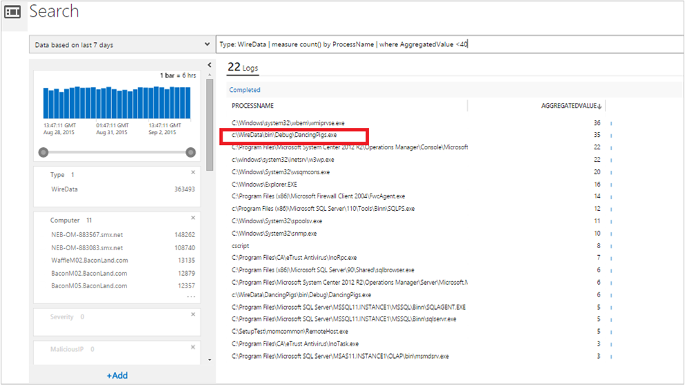

<properties
    pageTitle="Collegare soluzione di dati in Log Analitica | Microsoft Azure"
    description="Dati di rete sono dati consolidati di rete e di prestazioni da computer con agenti OMS, tra cui Operations Manager e gli agenti connessi Windows. Dati di rete vengono combinati con i dati di registro consentono di correlare i dati."
    services="log-analytics"
    documentationCenter=""
    authors="bandersmsft"
    manager="jwhit"
    editor=""/>

<tags
    ms.service="log-analytics"
    ms.workload="na"
    ms.tgt_pltfrm="na"
    ms.devlang="na"
    ms.topic="article"
    ms.date="08/11/2016"
    ms.author="banders"/>

# <a name="wire-data-solution-in-log-analytics"></a>Collegare soluzione di dati in Analitica Log

Dati di rete sono dati consolidati di rete e di prestazioni da computer con agenti OMS, tra cui Operations Manager e gli agenti connessi Windows. Dati di rete vengono combinati con i dati di registro consentono di correlare i dati. Agenti OMS installati nel computer i dati di rete del monitor infrastruttura IT inviati da e verso i computer per i livelli rete 2-3 nel [modello OSI](https://en.wikipedia.org/wiki/OSI_model) tra i vari porte e protocolli utilizzate.

>[AZURE.NOTE] La soluzione di dati di rete non è attualmente disponibile da aggiungere alle aree di lavoro. I clienti che hanno già soluzione dati filo abilitata è possono continuare a usare la soluzione di dati di rete.

Per impostazione predefinita, OMS raccoglie dati registrati per CPU, memoria, disco e dati sulle prestazioni di rete dai contatori di Windows. Rete e altri raccolta di dati viene eseguito in tempo reale per ogni agente, tra cui subnet e protocolli di livello di applicazione in uso dal computer. È possibile aggiungere altri contatori nella pagina Impostazioni nella scheda log.

Se sono state usate [sFlow](http://www.sflow.org/) o altro software con [protocollo NetFlow Cisco](http://www.cisco.com/c/en/us/products/collateral/ios-nx-os-software/ios-netflow/prod_white_paper0900aecd80406232.html), quindi le statistiche e dati che verrà visualizzato dai dati del filo sarà familiari.

Alcuni dei tipi di query di ricerca incorporata Log:

- Agenti che forniscono dati di rete
- Indirizzo IP di agenti fornire i dati di rete
- Comunicazioni in uscita per gli indirizzi IP
- Numero di byte inviati da protocolli di applicazioni
- Numero di byte inviati dal servizio di un'applicazione
- Byte ricevuti da protocolli diversi
- Numero totale di byte inviati e ricevuti da IP
- Indirizzi IP che dispongano di comunicare con gli agenti subnet 10.0.0.0/8
- Latenza media per le connessioni che sono state misurate in modo affidabile
- Processi del computer che ha avviato o ricevuto il traffico di rete
- Il traffico di rete per un processo

Quando si cerca di utilizzo dei dati di rete, è possibile filtrare e raggruppare i dati per visualizzare informazioni sui agenti superiore e i protocolli superiore. Oppure è possibile esaminare il quando alcuni computer (indirizzi MAC/indirizzi IP) comunicati con un'altra, come tempo e la quantità di dati è stato inviato, ossia in sostanza, si visualizza metadati relativi il traffico di rete, che è basate su ricerca.

Tuttavia, dal momento che si sta visualizzando metadati, non è necessariamente utile per la risoluzione dei problemi in modo completo. Dati di rete in OMS non sono un'intera acquisizione dei dati di rete. Pertanto non è destinato per la risoluzione dei problemi di sui toni del livello di pacchetto.
Il vantaggio derivante dall'uso dell'agente confrontate con quelle di altri metodi di raccolta, è non è necessario installare elettrodomestici, riconfigurare i parametri di rete o eseguire configurazioni complesse. Dati di rete sono semplicemente agente basato su - si installa l'agente in un computer e verrà utilizzato per monitorare il proprio il traffico di rete. Un altro vantaggio è quando si desidera eseguire il monitoraggio carichi di lavoro in esecuzione nel provider di servizi cloud o provider di hosting del servizio o in Microsoft Azure, in cui l'utente non si possiede il livello di struttura.

Non è invece necessario visibilità completa di quanto avviene in rete se non si installa agenti su tutti i computer dell'infrastruttura di rete.

## <a name="installing-and-configuring-the-solution"></a>Installare e configurare la soluzione
Utilizzare le informazioni seguenti per installare e configurare la soluzione.

- Soluzione filo dati consente di acquisire dati da computer che eseguono Windows Server 2012 R2, Windows 8.1 e versioni successive.
- È necessario Microsoft .NET Framework 4.0 o versione successiva in un computer in cui si desidera acquisire i dati di rete dal.
- Aggiungere la soluzione filo dati nell'area di lavoro OMS usando la procedura descritta nella sezione [aggiungere Analitica Log soluzioni dalla raccolta soluzioni](log-analytics-add-solutions.md).  Non esiste alcun ulteriori operazioni di configurazione necessari.
- Se si desidera visualizzare i dati di rete per una soluzione specifica, è necessario per la soluzione già stato aggiunto nell'area di lavoro OMS.

## <a name="wire-data-data-collection-details"></a>Collegare i dettagli di raccolta dati di dati

Cavo dati consente di raccogliere metadati relativi il traffico di rete con gli agenti che è stata attivata.

Nella tabella seguente mostra i metodi di raccolta dati e altri dettagli sulle modalità di raccolta dati per i dati di rete.


| piattaforma | Agente diretta | Agente SCOM | Spazio di archiviazione Azure | SCOM necessari? | Dati di agente SCOM inviati tramite il gruppo di gestione | frequenza di raccolta |
|---|---|---|---|---|---|---|
|Windows (2012 R2 / 8.1 o versione successiva)||||            || ogni minuto|


## <a name="combining-wire-data-with-other-solution-data"></a>Dati di filo in combinazione con altri dati di soluzioni

Dati restituiti dalla query incorporata sopra potrebbero essere interessanti autonomamente. Tuttavia, l'utilità di dati di rete è realizzato quando si combinano con le informazioni da altre soluzioni OMS. Ad esempio, è possibile utilizzare dati di evento sicurezza raccolti mediante la soluzione di sicurezza e di controllo e combinare i dati di filo cercare tentativi di accesso di rete insolito per i processi denominati.  In questo esempio, utilizzare gli operatori IN e DISTINCT possibile per unire le coordinate in query di ricerca.

Requisiti: Per utilizzare l'esempio seguente, è necessario per la soluzione di sicurezza e controllo installato. Tuttavia, è possibile utilizzare dati da altre soluzioni per combinare i dati di rete per ottenere risultati analoghi.

### <a name="to-combine-wire-data-with-security-events"></a>Per combinare i dati di rete con gli eventi di protezione

1. Nella pagina Panoramica fare clic sul riquadro **WireData** .
2. Nell'elenco delle **Query comuni che WireData**, fare clic su **Quantità di traffico di rete (in byte) dal processo** per visualizzare l'elenco dei processi restituiti.
    
3. Se l'elenco dei processi è troppo lungo visualizzare facilmente, è possibile modificare la query di ricerca simile a quella di:

    ```
    Type WireData | measure count() by ProcessName | where AggregatedValue <40
    ```
    Illustrato nell'esempio seguente è un processo denominato DancingPigs.exe, potrebbero essere visualizzati sospetto.
    

4. Uso dei dati restituiti nell'elenco, fare clic su un processo con nome. In questo esempio è stato scelto DancingPigs.exe. I risultati riportati di seguito descrivono il tipo di traffico di rete, ad esempio le comunicazioni in uscita su protocolli diversi.
    

5. Perché è installata la soluzione di sicurezza e di controllo, è possibile esame gli eventi di sicurezza che hanno lo stesso valore di campo opzioni modificando la query di ricerca utilizzando gli operatori di query di ricerca IN e DISTINCT. È possibile farlo quindi quando i dati di rete e gli altri log soluzione sono presenti valori nello stesso formato. Modificare la query di ricerca simile a quella di:

    ```
    Type=SecurityEvent ProcessName IN {Type:WireData "DancingPigs.exe" | distinct ProcessName}
    ```    

    
6. Nei risultati, si noterà che vengono visualizzate le informazioni di account. A questo punto è possibile perfezionare la ricerca per sapere con quale frequenza l'account contenente dati di sicurezza e di controllo, è stata utilizzata dal processo con una query che assomiglia:        

    ```
    Type=SecurityEvent ProcessName IN {Type:WireData "DancingPigs.exe" | distinct ProcessName} | measure count() by Account
    ```

    


## <a name="next-steps"></a>Passaggi successivi

- [Registri ricerca](log-analytics-log-searches.md) per visualizzare la ricerca di dati filo dettagliate record.
- Vedere [utilizzando dati filo nel blog di operazioni di gestione Suite Registro ricerca post di Dan](http://blogs.msdn.com/b/dmuscett/archive/2015/09/09/using-wire-data-in-operations-management-suite.aspx) contiene informazioni aggiuntive sulla frequenza raccolti e come è possibile modificare proprietà di una raccolta di agenti Operations Manager.
