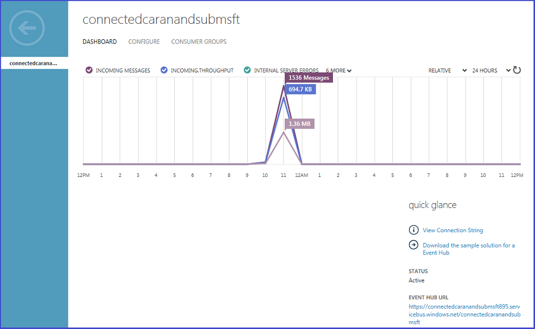
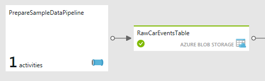
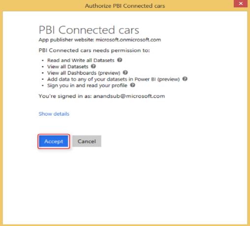
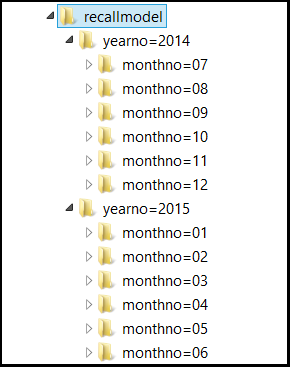

<properties 
    pageTitle="Playbook soluzione di veicolo telemetria analitica: approfondimenti la soluzione | Microsoft Azure" 
    description="Utilizzare le funzionalità di Business Intelligence Cortana per ottenere in tempo reale e stima approfondimenti sulla veicolo salute e favorire abitudini." 
    services="machine-learning" 
    documentationCenter="" 
    authors="bradsev" 
    manager="jhubbard" 
    editor="cgronlun" />

<tags 
    ms.service="machine-learning" 
    ms.workload="data-services" 
    ms.tgt_pltfrm="na" 
    ms.devlang="na" 
    ms.topic="article" 
    ms.date="09/12/2016" 
    ms.author="bradsev" />

# Playbook soluzione di veicolo telemetria analitica: approfondimenti la soluzione

Collegamenti in questo **menu** per le sezioni di questo playbook: 

[AZURE.INCLUDE [cap-vehicle-telemetry-playbook-selector](../../includes/cap-vehicle-telemetry-playbook-selector.md)]

Esercitazioni questa sezione verso il basso in ognuna delle fasi illustrate l'architettura di soluzione con le istruzioni e puntatori per la personalizzazione. 

## Origini dati

La soluzione utilizza due origini dati diverse:

- **segnali veicolo simulata e diagnostica set di dati** e 
- **catalogo veicolo**

Un simulatore telematiche veicolo è incluso come parte di questa soluzione. Genera informazioni di diagnostica ed segnala corrispondente per lo stato del veicolo e il modello di Guida in un determinato momento. Fare clic su [Veicolo telematiche simulatore](http://go.microsoft.com/fwlink/?LinkId=717075) per scaricare **Veicolo telematiche simulatore soluzione Visual Studio** per la personalizzazione in base alle esigenze. Il catalogo veicolo contiene un set di dati di riferimento con un numero VIN al mapping del modello.

*Figura 2: simulatore telematiche veicolo*

Si tratta di un set di dati in formato JSON che contiene lo schema di seguito.

Colonna | Descrizione | Valori 
 ------- | ----------- | --------- 
VIN | Numero di identificazione casuale | Questo ottenuto da un elenco di numeri di identificazione casuale veicolo 10.000.
Temperatura esterna | La temperatura diversa nel punto in cui è difficile veicolo | Numero casuale compreso tra 0-100
Temperatura del motore | La temperatura del motore del veicolo | Numero casuale compreso tra 0-500
Velocità | La velocità di modulo in cui è difficile veicolo | Numero casuale compreso tra 0-100
Carburante | Il livello del carburante del veicolo | Numero casuale compreso tra 0-100 (indica percentuale del carburante)
EngineOil | Il livello di oil motore del veicolo | Numero casuale compreso tra 0-100 (indica motore oil livello percentuale)
Pressione pneumatico | La pressione di pneumatico del veicolo | Numero generato in modo casuale compreso tra 0-50 (indica pneumatico pressione livello percentuale)
Chilometraggio | Lettura chilometraggio del veicolo | Numero casuale compreso tra 0 200000
Accelerator_pedal_position | La posizione di pedali tasti di scelta rapida del veicolo | Numero casuale compreso tra 0 e 100 (indica percentuale del tasto di scelta rapida)
Parking_brake_status | Indica se il veicolo parcheggiato o meno | True o False
Headlamp_status | Indica dove si trova il proiettore in o meno | True o False
Brake_pedal_status | Indica se quello del freno viene premuto o meno | True o False
Transmission_gear_position | La posizione dell'ingranaggio trasmissione del veicolo | Stati: primo, secondo, terzo, quarto, quinto, sesto, settimo, ottavo
Ignition_status | Indica se il veicolo è in esecuzione o meno | True o False
Windshield_wiper_status | Indica se è Tergicristallo parabrezza o meno | True o False
ASS | Indica se è impegnato Ass o meno | True o False
Timestamp | Il timestamp quando viene creato il punto dati | Data
Città | La posizione del veicolo | 4 città in questa soluzione: Bellevue, Redmond, Sammamish, Milano

Il set di dati di veicolo modello riferimento contiene VIN al mapping del modello. 

VIN | Modello |
--------------|------------------
FHL3O1SA4IEHB4WU1 | Fiat |
8J0U8XCPRGW4Z3NQE | Ibrido |
WORG68Z2PLTNZDBI7 | Berlina famiglia |
JTHMYHQTEPP4WBMRN | Fiat |
W9FTHG27LZN1YWO0Y | Ibrido |
MHTP9N792PHK08WJM | Berlina famiglia |
EI4QXI2AXVQQING4I | Fiat |
5KKR2VB4WHQH97PF8 | Ibrido |
W9NSZ423XZHAONYXB | Berlina famiglia |
26WJSGHX4MA5ROHNL | Convertibili |
GHLUB6ONKMOSI7E77 | Giardinetta |
9C2RHVRVLMEJDBXLP | Auto di piccole dimensioni |
BRNHVMZOUJ6EOCP32 | Piccolo SUV |
VCYVW0WUZNBTM594J | Auto sportiva |
HNVCE6YFZSA5M82NY | SUV medio |
4R30FOR7NUOBL05GJ | Giardinetta |
WYNIIY42VKV6OQS1J | SUV di grandi dimensioni |
8Y5QKG27QET1RBK7I | SUV di grandi dimensioni |
DF6OX2WSRA6511BVG | Tipo della |
Z2EOZWZBXAEW3E60T | Fiat |
M4TV6IEALD5QDS3IR | Ibrido |
VHRA1Y2TGTA84F00H | Berlina famiglia |
R0JAUHT1L1R3BIKI0 | Fiat |
9230C202Z60XX84AU | Ibrido |
T8DNDN5UDCWL7M72H | Berlina famiglia |
4WPYRUZII5YV7YA42 | Fiat |
D1ZVY26UV2BFGHZNO | Ibrido |
XUF99EW9OIQOMV7Q7 | Berlina famiglia
8OMCL3LGI7XNCC21U | Convertibili |
…….  |   |

### Per generare dati simulati
1.  Per scaricare il pacchetto di simulatore di dati, fare clic sulla freccia nella parte superiore destra del nodo veicolo telematiche simulatore. Salvare ed estrarre i file in locale nel computer in uso. *Figura 3-soluzione Analitica di telemetria di veicolo*

2.  Nel computer locale, passare alla cartella in cui è stato estratto il pacchetto di veicolo telematiche simulatore. *Figura 4: veicolo telematiche simulatore cartella*

3.  Eseguire l'applicazione **CarEventGenerator.exe**.

### Riferimenti

[Soluzione di Visual Studio simulatore telematiche veicolo](http://go.microsoft.com/fwlink/?LinkId=717075) 

[Hub evento Azure](https://azure.microsoft.com/services/event-hubs/)

[Dati di Azure Factory](https://azure.microsoft.com/documentation/learning-paths/data-factory/)

## Acquisizione
Combinazioni di Azure evento hub, flusso Analitica e Factory dati vengono utilizzate per acquisire i segnali veicolo, gli eventi di diagnostica e in tempo reale e batch analitica. Tutti questi componenti vengono creati e configurati come parte della distribuzione soluzione. 

### Analisi in tempo reale
Gli eventi generati dal simulatore telematiche veicolo sono pubblicati Hub evento mediante il SDK Hub evento. Il processo di flusso Analitica Flash la Compact Flash questi eventi dall'Hub evento ed elabora i dati in tempo reale per analizzare lo stato di veicolo. 

 

*Figura 5 - dashboard Hub di evento*

 

*Figura 6 - processo analitica flusso l'elaborazione dei dati*

Il processo di analitica flusso.

- Flash la Compact Flash dati dall'Hub evento 
- esegue un join con i dati di riferimento per eseguire il mapping di veicolo VIN al modello corrispondente 
- Consente di renderli persistente in archiviazione blob Azure per analitica batch RTF. 

La query analitica flusso seguente viene utilizzata per mantenere i dati in archiviazione blob Azure. 

 

*Figura 7 - query processo analitica di flusso per acquisizione di dati*

### Analisi batch
Anche la generazione un altro volume del veicolo simulata segnali e diagnostica del set per analitica batch più complesse. Questa operazione è necessaria per garantire una quantità di dati representative validi per l'elaborazione batch. A tale scopo, si utilizza una pipeline denominata "PrepareSampleDataPipeline" del flusso di lavoro di Azure Data Factory per generare patrimonio di un anno di veicolo simulata segnali e diagnostica set di dati. Fare clic su [Factory dati attività personalizzata](http://go.microsoft.com/fwlink/?LinkId=717077) per scaricare la Data Factory DotNet un'attività personalizzata soluzione di Visual Studio per la personalizzazione in base alle esigenze. 

 

*Figura 8: preparare i dati di esempio per flusso di lavoro elaborazione batch*

La pipeline è costituita da un .net alimentatore automatico personalizzato attività, Mostra qui:

 

*Figura 9 - PrepareSampleDataPipeline*

Dopo la pipeline viene eseguito correttamente e set di dati "RawCarEventsTable" è contrassegnata "Pronto" anno patrimonio di veicolo simulata segnali e diagnostica vengono prodotti i dati. Viene visualizzata la cartella e i file creato con l'account di archiviazione all'interno del contenitore "connectedcar" seguenti:

 

*Figura 10 - PrepareSampleDataPipeline Output*

### Riferimenti

[Azure SDK Hub di evento per l'acquisizione di flusso](../event-hubs/event-hubs-csharp-ephcs-getstarted.md)

[Funzioni di spostamento di dati Data Factory Azure](../data-factory/data-factory-data-movement-activities.md)
[Attività DotNet Factory dei dati di Azure](../data-factory/data-factory-use-custom-activities.md)

[Soluzione di visual studio attività dati Factory DotNet Azure per la preparazione di dati di esempio](http://go.microsoft.com/fwlink/?LinkId=717077) 

## Suddividere il set di dati

I segnali di veicolo semistrutturati non elaborati e diagnostica set di dati sono suddivisi nel passaggio preparazione dati in un formato anno/mese. Questa partizione alzare di livello più efficiente esecuzione di query e lo spazio di archiviazione a lungo termine scalable attivando guasto dall'account di un blob alla successiva, come il primo account che si riempie. 

>[AZURE.NOTE] Questo passaggio della soluzione si applica solo all'elaborazione batch.

Input e output gestione dei dati di dati:

- I **dati di output** (etichettata *PartitionedCarEventsTable*) è conservare per un periodo di tempo come maschera fondamentali / "rawest" di dati del cliente "dati Lake". 
- I **dati di input** per questa pipeline sarebbe in genere ignorati fedeltà completa per l'input sono previsti i dati di output: solo memorizzato (partizioni) migliore per l'uso successivo.

*Figura 11: flusso di lavoro partizione Auto eventi*

I dati non elaborati sono suddiviso mediante un'attività di Hive HDInsight in "PartitionCarEventsPipeline". I dati di esempio generati nel passaggio 1 per un anno sono suddiviso in base al mese/anno. Le partizioni vengono utilizzate per generare i segnali veicolo e dati di diagnostica per ogni mese (totale 12 partizioni) di un anno. 

*Figura 12 - PartitionCarEventsPipeline*

Il seguente script Hive, denominato "partitioncarevents.hql" viene usato per partizione e si trova nella cartella "\demo\src\connectedcar\scripts" di zip scaricato. 

    SET hive.exec.dynamic.partition=true;
    SET hive.exec.dynamic.partition.mode = nonstrict;
    set hive.cli.print.header=true;

    DROP TABLE IF EXISTS RawCarEvents; 
    CREATE EXTERNAL TABLE RawCarEvents 
    (
                vin                             string,
                model                           string,
                timestamp                       string,
                outsidetemperature              string,
                enginetemperature               string,
                speed                           string,
                fuel                            string,
                engineoil                       string,
                tirepressure                    string,
                odometer                        string,
                city                            string,
                accelerator_pedal_position      string,
                parking_brake_status            string,
                headlamp_status                 string,
                brake_pedal_status              string,
                transmission_gear_position      string,
                ignition_status                 string,
                windshield_wiper_status         string,
                abs                             string,
                gendate                         string
                
    ) ROW FORMAT DELIMITED FIELDS TERMINATED BY ',' LINES TERMINATED BY '10' STORED AS TEXTFILE LOCATION '${hiveconf:RAWINPUT}'; 

    DROP TABLE IF EXISTS PartitionedCarEvents; 
    CREATE EXTERNAL TABLE PartitionedCarEvents 
    (
                vin                             string,
                model                           string,
                timestamp                       string,
                outsidetemperature              string,
                enginetemperature               string,
                speed                           string,
                fuel                            string,
                engineoil                       string,
                tirepressure                    string,
                odometer                        string,
                city                            string,
                accelerator_pedal_position      string,
                parking_brake_status            string,
                headlamp_status                 string,
                brake_pedal_status              string,
                transmission_gear_position      string,
                ignition_status                 string,
                windshield_wiper_status         string,
                abs                             string,
                gendate                         string
    ) partitioned by (YearNo int, MonthNo int) ROW FORMAT DELIMITED FIELDS TERMINATED BY ',' LINES TERMINATED BY '10' STORED AS TEXTFILE LOCATION '${hiveconf:PARTITIONEDOUTPUT}';

    DROP TABLE IF EXISTS Stage_RawCarEvents; 
    CREATE TABLE IF NOT EXISTS Stage_RawCarEvents 
    (
                vin                             string,
                model                           string,
                timestamp                       string,
                outsidetemperature              string,
                enginetemperature               string,
                speed                           string,
                fuel                            string,
                engineoil                       string,
                tirepressure                    string,
                odometer                        string,
                city                            string,
                accelerator_pedal_position      string,
                parking_brake_status            string,
                headlamp_status                 string,
                brake_pedal_status              string,
                transmission_gear_position      string,
                ignition_status                 string,
                windshield_wiper_status         string,
                abs                             string,
                gendate                         string,
                YearNo                          int,
                MonthNo                         int) 
    ROW FORMAT delimited fields terminated by ',' LINES TERMINATED BY '10';

    INSERT OVERWRITE TABLE Stage_RawCarEvents
    SELECT
        vin,            
        model,
        timestamp,
        outsidetemperature,
        enginetemperature,
        speed,
        fuel,
        engineoil,
        tirepressure,
        odometer,
        city,
        accelerator_pedal_position,
        parking_brake_status,
        headlamp_status,
        brake_pedal_status,
        transmission_gear_position,
        ignition_status,
        windshield_wiper_status,
        abs,
        gendate,
        Year(gendate),
        Month(gendate)

    FROM RawCarEvents WHERE Year(gendate) = ${hiveconf:Year} AND Month(gendate) = ${hiveconf:Month}; 

    INSERT OVERWRITE TABLE PartitionedCarEvents PARTITION(YearNo, MonthNo) 
    SELECT
        vin,            
        model,
        timestamp,
        outsidetemperature,
        enginetemperature,
        speed,
        fuel,
        engineoil,
        tirepressure,
        odometer,
        city,
        accelerator_pedal_position,
        parking_brake_status,
        headlamp_status,
        brake_pedal_status,
        transmission_gear_position,
        ignition_status,
        windshield_wiper_status,
        abs,
        gendate,
        YearNo,
        MonthNo
    FROM Stage_RawCarEvents WHERE YearNo = ${hiveconf:Year} AND MonthNo = ${hiveconf:Month};

*Figura 13 - Hive PartitionConnectedCarEvents Script*

Dopo la pipeline viene eseguita correttamente, viene visualizzato seguenti partizioni generate nel proprio account di archiviazione all'interno del contenitore "connectedcar".

*Figura 14 - partizionata Output*

I dati ora ottimizzati, più gestibile e per ulteriori elaborazioni per ottenere informazioni dettagliate sui batch RTF. 

## Analisi dei dati

In questa sezione, viene visualizzato come combinare Azure flusso Analitica, apprendimento Azure, Factory di dati di Azure e Azure HDInsight per avanzate analitica integrità veicolo e favorire abitudini avanzata. Esistono tre sottosezioni qui:

1.  **Apprendimento**: in questa sezione vengono fornite informazioni sulla prova di rilevamento anomalie che sono stati utilizzati in questa soluzione prevedere veicoli che richiedono la manutenzione di manutenzione e veicoli che richiedono richiama a causa di problemi di sicurezza.
2.  **Analisi in tempo reale**: in questa sezione contiene informazioni relative a analitica in tempo reale mediante il linguaggio di Query flusso Analitica e Raymond prova apprendimento in tempo reale mediante un'applicazione personalizzata.
3.  **Analisi batch**: in questa sezione vengono fornite informazioni per quanto riguarda la trasformazione e l'elaborazione dei dati batch mediante Azure HDInsight e apprendimento Azure operationalized da Azure dati Factory.

### Apprendimento

In questo caso il nostro obiettivo è prevedere veicoli che richiedono manutenzione o richiamare in base a determinate statistiche di integrità. Rendere le ipotesi seguenti

- Se uno dei seguenti tre condizioni è vero, veicoli richiedono **la manutenzione di manutenzione dei servizi**:
    - Pressione pneumatico è basso
    - Motore oil livello è basso
    - Temperatura del motore sia sufficientemente alta

- Se una delle seguenti condizioni è vera, veicoli possono hanno un **problema di sicurezza** e richiedono **richiamo**:
    - Temperatura del motore sia sufficientemente alta ma temperatura esterna è bassa
    - Temperatura del motore è bassa ma temperatura esterna sia sufficientemente alta

In base alle esigenze precedente, sono stati creati due modelli separati per rilevare alterazioni, uno per il rilevamento di manutenzione veicolo e uno per il rilevamento richiamo veicolo. In entrambi questi modelli predefiniti algoritmo di analisi componente principale (PCA) viene usato per rilevamento di anomalie in. 

**Modello di rilevamento di manutenzione**

Se uno degli tre indicatori - pressione pneumatico, oil motore o temperatura del motore - soddisfa la condizione rispettivi, un'anomalia il modello di rilevamento di manutenzione. Di conseguenza, è sufficiente valutare la possibilità di questi tre variabili nella creazione del modello. Nel nostro test di apprendimento Azure, è prima di tutto utilizzare un modulo di **Selezione colonne nel set di dati** per estrarre questi tre variabili. Successivo è utilizzare il modulo di rilevamento basati su PCA anomalia per creare il modello di rilevamento anomalia. 

Analisi dei componenti di capitale (PCA) è una tecnica Fondazione in apprendimento che può essere applicato alla selezione delle caratteristiche di classificazione e rilevamento di anomalie in. PCA converte un insieme di maiuscole/minuscole contenente eventualmente correlate variabili, in un set di valori denominati principali componenti. Il concetto chiave di modellazione basata su PCA consiste nel dati del progetto in uno spazio inferiore dimensionali caratteristiche e alterazioni è più facile identificazione.
 
Per ogni nuovo input al modello di rilevamento, il rilevamento di anomalie calcola innanzitutto la proiezione nei vettori eigen e quindi calcola l'errore ricostruzione normalizzato. Questo errore normalizzato è il punteggio anomalia. L'istanza è maggiore dell'errore, più anomala. 

Nel problema di rilevamento di manutenzione, ogni record può essere considerato come un punto di uno spazio 3D definito pressione pneumatico, oil motore e temperatura del motore coordinate. Per acquisire queste alterazioni, è possibile project i dati originali nell'area 3D in uno spazio 2 dimensioni usando PCA. Pertanto, viene impostato il parametro del numero di componenti da utilizzare nelle PCA a 2. Questo parametro viene riprodotto un ruolo importante per l'applicazione di rilevamento di anomalie in basate su PCA. Dopo la proiezione dati utilizzando PCA, è possibile identificare più facilmente queste alterazioni.

**Richiamare il modello di rilevamento anomalia** In modello di rilevamento anomalia richiamo serve selezionare le colonne nel set di dati e basato su PCA anomalia moduli di rilevamento in modo analogo. In particolare, è innanzitutto estrarre tre variabili - temperatura del motore, temperatura esterna e velocità - uso del modulo **Selezionare colonne nel set di dati** . È anche possibile includere la variabile di velocità poiché la temperatura del motore in genere correlata alla velocità. Successivo rilevamento basate su PCA anomalia vengono utilizzati per proiettare i dati dallo spazio 3D su uno spazio 2 dimensioni. Vengono soddisfatti i criteri di richiamo e pertanto veicolo richiede richiamo quando temperatura del motore e temperatura esterna vengono altamente negativamente correlati. Usa algoritmo di rilevamento basati su PCA anomalia, possiamo ridurre l'alterazioni dopo l'esecuzione di PCA. 

Quando entrambi i modelli di formazione, è necessario utilizzare dati normali, che non richiedono manutenzione o il richiamo come i dati di input per formare il modello di rilevamento basati su PCA anomalia. In prova punteggio, viene utilizzato il modello di rilevamento anomalia esperti per rilevare veicolo richiede manutenzione o richiamare o meno. 

### Analisi in tempo reale

Query SQL di Analitica flusso seguente viene utilizzata per ottenere la media di tutti i parametri di veicolo importanti quali velocità veicolo livello carburante, temperatura del motore, lettura chilometraggio, pressione pneumatico, livello oil motore e gli altri utenti. Le medie vengono utilizzate per rilevare alterazioni, emettere avvisi e determinare le condizioni di salute complessivo veicoli gestito nell'area specifica e quindi correlare a fasce di utenti. 

Figura 15-query analitica flusso per l'elaborazione in tempo reale

Tutte le medie vengono calcolate su un TumblingWindow 3 secondi. Si sta utilizzando TubmlingWindow in questo caso, dal momento che è necessario intervalli di tempo non sovrapposti e contigue. 

Per ulteriori informazioni su tutte le funzionalità di "Finestre" Azure flusso Analitica, fare clic su [finestre (Azure flusso Analitica)](https://msdn.microsoft.com/library/azure/dn835019.aspx).

**Stima in tempo reale**

Un'applicazione è inclusa la soluzione ideale per rendono operativi il modello di apprendimento in tempo reale. Questa applicazione denominata "RealTimeDashboardApp" viene creato e configurato come parte della distribuzione soluzione. L'applicazione esegue le operazioni seguenti:

1.  Ascolta un'istanza di Hub di evento in cui flusso Analitica pubblica gli eventi in un motivo continuamente. *Figura 16 – query analitica flusso per pubblicare i dati in un output istanza Hub di evento* 

2.  Per tutti gli eventi che riceve l'applicazione: 

    - Elabora i dati utilizzando endpoint Machine Learning richiesta risposta punteggio (record). L'endpoint di record di risorse viene automaticamente pubblicato come parte della distribuzione.
    - L'output di record di risorse viene pubblicato in un set di dati di ottenere informazioni tramite push API.

Questo modello è applicabile alle scenari in cui si vuole integrare un'applicazione Line of Business (Line) con il flusso di analitica in tempo reale, per gli scenari, ad esempio gli avvisi, notifiche e la messaggistica.

Fare clic su [RealtimeDashboardApp download](http://go.microsoft.com/fwlink/?LinkId=717078) per scaricare la soluzione RealtimeDashboardApp Visual Studio per le personalizzazioni. 

**Per eseguire l'applicazione di Dashboard in tempo reale**

1.  Fare clic sul nodo di ottenere informazioni nella visualizzazione Diagramma e fare clic sul collegamento "Download dell'applicazione Dashboard in tempo reale" nel riquadro delle proprietà. *Figura 17 – istruzioni sulla configurazione di ottenere informazioni del dashboard*
2.  Estrarre e salvare localmente  *Figura 18 – RealtimeDashboardApp cartella*
3.  Eseguire l'applicazione RealtimeDashboardApp.exe
4.  Fornire credenziali valide di Power BI, accedere e fare clic su accetta  

*Figura 19-RealtimeDashboardApp: Accedi per ottenere informazioni*

>[AZURE.NOTE] Se si desidera scaricare il set di dati di ottenere informazioni, eseguire RealtimeDashboardApp con il parametro "flushdata": 

    RealtimeDashboardApp.exe -flushdata

### Analisi batch

L'obiettivo è da visualizzare come motori di Contoso utilizza la capacità di calcolo Azure per sfruttare i dati per ottenere informazioni approfondite RTF sulla Guida motivo, il comportamento di utilizzo e integrità veicolo. In questo modo è possibile:

- Migliorare l'esperienza dei clienti e renderlo più economico fornendo informazioni approfondite sul favorire abitudini e comportamenti stradale efficiente carburante
- Informazioni su tempestiva sui clienti e la Guida patters regolano decisioni aziendali e specificare i migliori in classe prodotti e servizi

In questa soluzione destinazione quelle riportate di seguito:

1.  **Comportamento stradale aggressivo**: identifica la tendenza della modelli, posizioni, le condizioni e dell'ora dell'anno per ottenere informazioni approfondite su aggressive modelli stradale. Motori di Contoso può usare queste informazioni dettagliate per campagne di marketing, favorire nuove caratteristiche personalizzate e in base l'uso di assicurazione.
2.  **Comportamento di Guida efficiente carburante**: identifica la tendenza della modelli, posizioni, le condizioni e l'ora dell'anno per ottenere informazioni approfondite sui modelli di Guida efficiente carburante. Motori di Contoso possono usare queste informazioni approfondite per campagna, favorire nuove caratteristiche e reporting preventivo per i driver di costo effettivo e ambiente abitudini Guida descrittivo. 
3.  **Richiamare modelli**: identifica modelli che richiedono richiama per Raymond l'anomalia rilevamento di apprendimento prova

Ecco i dettagli di ognuna di queste metriche

**Motivo stradale aggressiva**

I segnali di veicolo partizionata e dati di diagnostica vengono elaborati nella pipeline denominata "AggresiveDrivingPatternPipeline" utilizzando Hive per determinare i modelli, posizione, veicolo, le condizioni e altri parametri che presenta aggressiva motivo stradale.

 
*Figura 20-Aggressive favorire del flusso di lavoro motivo*

Lo script Hive denominato "aggresivedriving.hql" utilizzato per l'analisi aggressive motivo condizione Guida si trova nella cartella "\demo\src\connectedcar\scripts" di zip scaricato. 

    DROP TABLE IF EXISTS PartitionedCarEvents; 
    CREATE EXTERNAL TABLE PartitionedCarEvents
    (
                vin                             string,
                model                           string,
                timestamp                       string,
                outsidetemperature              string,
                enginetemperature               string,
                speed                           string,
                fuel                            string,
                engineoil                       string,
                tirepressure                    string,
                odometer                        string,
                city                            string,
                accelerator_pedal_position      string,
                parking_brake_status            string,
                headlamp_status                 string,
                brake_pedal_status              string,
                transmission_gear_position      string,
                ignition_status                 string,
                windshield_wiper_status         string,
                abs                             string,
                gendate                         string
                                
    ) ROW FORMAT DELIMITED FIELDS TERMINATED BY ',' LINES TERMINATED BY '10' STORED AS TEXTFILE LOCATION '${hiveconf:PARTITIONEDINPUT}';

    DROP TABLE IF EXISTS CarEventsAggresive; 
    CREATE EXTERNAL TABLE CarEventsAggresive
    (
                vin                         string, 
                model                       string,
                timestamp                   string,
                city                        string,
                speed                       string,
                transmission_gear_position  string,
                brake_pedal_status          string,
                Year                        string,
                Month                       string
                                
    ) ROW FORMAT DELIMITED FIELDS TERMINATED BY ',' LINES TERMINATED BY '10' STORED AS TEXTFILE LOCATION '${hiveconf:AGGRESIVEOUTPUT}';

    INSERT OVERWRITE TABLE CarEventsAggresive
    select
    vin,
    model,
    timestamp,
    city,
    speed,
    transmission_gear_position,
    brake_pedal_status,
    "${hiveconf:Year}" as Year,
    "${hiveconf:Month}" as Month
    from PartitionedCarEvents
    where transmission_gear_position IN ('fourth', 'fifth', 'sixth', 'seventh', 'eight') AND brake_pedal_status = '1' AND speed >= '50'

*Figura 21-Aggressive favorire query Hive motivo*

Utilizza la combinazione di trasmissione dell'ingranaggio posizione del veicolo, stato pedali freno e velocità per rilevare reckless/aggressive comportamento Guida in base a frenatura motivo ad alta velocità. 

Dopo la pipeline viene eseguita correttamente, viene visualizzato seguenti partizioni generate nel proprio account di archiviazione all'interno del contenitore "connectedcar".

 

*Figura 22-AggressiveDrivingPatternPipeline output*

**Motivo stradale efficiente carburante**

I segnali di veicolo partizionata e dati di diagnostica vengono elaborati nella pipeline denominata "FuelEfficientDrivingPatternPipeline". Hive viene utilizzata per determinare i modelli, posizione, veicolo, le condizioni e altre proprietà con carburante efficiente stradale.

 

*Figura 23-carburante efficiente stradale motivo del flusso di lavoro*

Lo script Hive denominato "fuelefficientdriving.hql" utilizzato per l'analisi aggressive motivo condizione Guida si trova nella cartella "\demo\src\connectedcar\scripts" di zip scaricato. 

    DROP TABLE IF EXISTS PartitionedCarEvents; 
    CREATE EXTERNAL TABLE PartitionedCarEvents
    (
                vin                             string,
                model                           string,
                timestamp                       string,
                outsidetemperature              string,
                enginetemperature               string,
                speed                           string,
                fuel                            string,
                engineoil                       string,
                tirepressure                    string,
                odometer                        string,
                city                            string,
                accelerator_pedal_position      string,
                parking_brake_status            string,
                headlamp_status                 string,
                brake_pedal_status              string,
                transmission_gear_position      string,
                ignition_status                 string,
                windshield_wiper_status         string,
                abs                             string,
                gendate                         string
                                
    ) ROW FORMAT DELIMITED FIELDS TERMINATED BY ',' LINES TERMINATED BY '10' STORED AS TEXTFILE LOCATION '${hiveconf:PARTITIONEDINPUT}';

    DROP TABLE IF EXISTS FuelEfficientDriving; 
    CREATE EXTERNAL TABLE FuelEfficientDriving
    (
                vin                         string, 
                model                       string,
                city                        string,
                speed                       string,
                transmission_gear_position  string,                
                brake_pedal_status          string,            
                accelerator_pedal_position  string,                             
                Year                        string,
                Month                       string
                                
    ) ROW FORMAT DELIMITED FIELDS TERMINATED BY ',' LINES TERMINATED BY '10' STORED AS TEXTFILE LOCATION '${hiveconf:FUELEFFICIENTOUTPUT}';

    INSERT OVERWRITE TABLE FuelEfficientDriving
    select
    vin,
    model,
    city,
    speed,
    transmission_gear_position,
    brake_pedal_status,
    accelerator_pedal_position,
    "${hiveconf:Year}" as Year,
    "${hiveconf:Month}" as Month
    from PartitionedCarEvents
    where transmission_gear_position IN ('fourth', 'fifth', 'sixth', 'seventh', 'eight') AND parking_brake_status = '0' AND brake_pedal_status = '0' AND speed <= '60' AND accelerator_pedal_position >= '50'

*Figura 24-carburante stradale motivo Hive query efficiente*

Viene utilizzata la combinazione di posizione a forma di ingranaggio di trasmissione del veicolo, stato pedali freno, velocità e tasti di scelta rapida pedale posizione per rilevare carburante efficiente Guida il comportamento in base a accelerazione frenatura e conoscenza modelli. 

Dopo la pipeline viene eseguita correttamente, viene visualizzato seguenti partizioni generate nel proprio account di archiviazione all'interno del contenitore "connectedcar".

 

*Figura 25 – FuelEfficientDrivingPatternPipeline output*

**Richiamare le stime**

Apprendimento di prova viene effettuato il provisioning e pubblicato come un servizio web come parte della distribuzione soluzione. In questo flusso di lavoro, registrato come un servizio data factory collegato e operationalized utilizzando batch factory dati punteggio attività è ampiamente batch punteggio punto finale.

 

*Figura 26-apprendimento endpoint registrato come servizio collegato nella factory dati*

Viene usato il servizio di collegate registrato nel DetectAnomalyPipeline accumulare i dati utilizzando il modello di rilevamento anomalia. 

 

*Figura 27-Azure Machine Learning Batch punteggio attività nella factory dati* 

Esistono alcuni passaggi eseguiti in questa pipeline per la preparazione dei dati in modo che possono essere operationalized con il batch di punteggio servizio web. 

 

*Figura 28-DetectAnomalyPipeline per la previsione veicoli che richiedono richiama* 

Una volta completata la valutazione, un'attività HDInsight viene utilizzata per elaborare e aggregare i dati sono categorizzato come alterazioni dal modello con un punteggio di probabilità di 0.60 o versione successiva.

    DROP TABLE IF EXISTS CarEventsAnomaly; 
    CREATE EXTERNAL TABLE CarEventsAnomaly 
    (
                vin                         string,
                model                       string,
                gendate                     string,
                outsidetemperature          string,
                enginetemperature           string,
                speed                       string,
                fuel                        string,
                engineoil                   string,
                tirepressure                string,
                odometer                    string,
                city                        string,
                accelerator_pedal_position  string,
                parking_brake_status        string,
                headlamp_status             string,
                brake_pedal_status          string,
                transmission_gear_position  string,
                ignition_status             string,
                windshield_wiper_status     string,
                abs                         string,
                maintenanceLabel            string,
                maintenanceProbability      string,
                RecallLabel                 string,
                RecallProbability           string
                                
    ) ROW FORMAT DELIMITED FIELDS TERMINATED BY ',' LINES TERMINATED BY '10' STORED AS TEXTFILE LOCATION '${hiveconf:ANOMALYOUTPUT}';

    DROP TABLE IF EXISTS RecallModel; 
    CREATE EXTERNAL TABLE RecallModel 
    (

                vin                         string,
                model                       string,
                city                        string,
                outsidetemperature          string,
                enginetemperature           string,
                speed                       string,
                Year                        string,
                Month                       string              
                                
    ) ROW FORMAT DELIMITED FIELDS TERMINATED BY ',' LINES TERMINATED BY '10' STORED AS TEXTFILE LOCATION '${hiveconf:RECALLMODELOUTPUT}';

    INSERT OVERWRITE TABLE RecallModel
    select
    vin,
    model,
    city,
    outsidetemperature,
    enginetemperature,
    speed,
    "${hiveconf:Year}" as Year,
    "${hiveconf:Month}" as Month
    from CarEventsAnomaly
    where RecallLabel = '1' AND RecallProbability >= '0.60'

Dopo la pipeline viene eseguita correttamente, viene visualizzato seguenti partizioni generate nel proprio account di archiviazione all'interno del contenitore "connectedcar".

 

*Figura 30-figura 30-DetectAnomalyPipeline output*

## Pubblicare

### Analisi in tempo reale

Una delle query nel processo analitica flusso pubblica gli eventi a un output istanza Hub evento. 

*Figura 31 – flusso del processo analitica pubblica un output istanza Hub di evento*

*Nella figura 32 – flusso per pubblicare l'output della query analitica istanza Hub di evento*

Questo flusso di eventi è utilizzato da RealTimeDashboardApp inclusi nella soluzione. Questa applicazione utilizza il servizio web Machine Learning richiesta-risposta per il punteggio in tempo reale e pubblica i dati risultanti in un set di dati di ottenere informazioni per il consumo. 

### Analisi batch

I risultati del batch di elaborazione in tempo reale sono pubblicati le tabelle di Database SQL Azure consumo. Il Server di SQL Azure, Database e le tabelle vengono create automaticamente come parte dello script di installazione. 

*Figura 33 – copia risultati del flusso di lavoro di dati mart di elaborazione Batch*

*Figura 34 – flusso del processo analitica pubblica mart dati*

*Figura 35-Data mart impostazione nel processo analitica flusso*

## Utilizzare

Power BI offre questa soluzione un dashboard RTF per i dati in tempo reale e visualizzazioni analitica previsione. 

Fare clic qui per istruzioni dettagliate su come impostare i report di ottenere informazioni e il dashboard. Dashboard di finale è simile alla seguente:

*Figura 36 - ottenere informazioni Dashboard*

## Riepilogo

Il documento contiene un drill-down dettagliato della soluzione veicolo telemetria Analitica. Seguente illustra un modello di architettura lambda per in tempo reale e batch analitica con le stime e azioni. Questo modello viene applicato a una vasta gamma di casi di utilizzo che richiedono il percorso critico (in tempo reale) e analitica percorso fredda (batch). 
