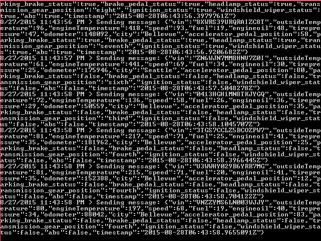
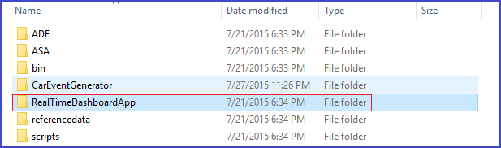
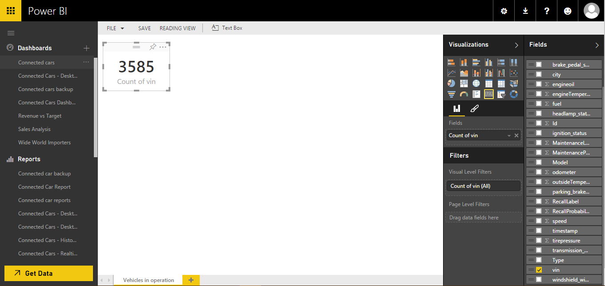
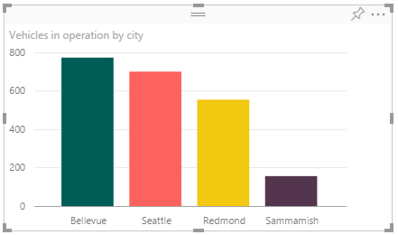
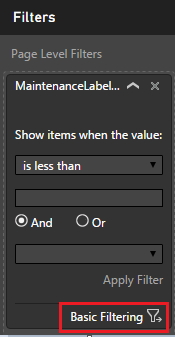
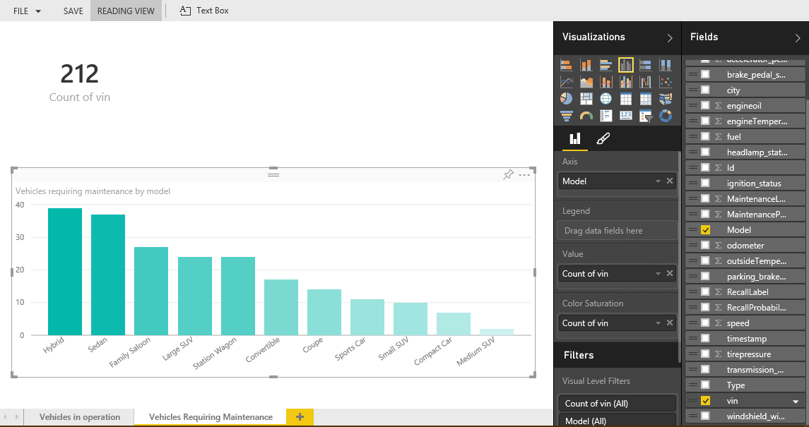
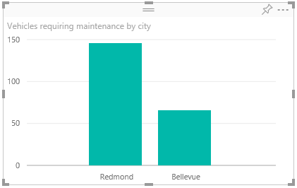
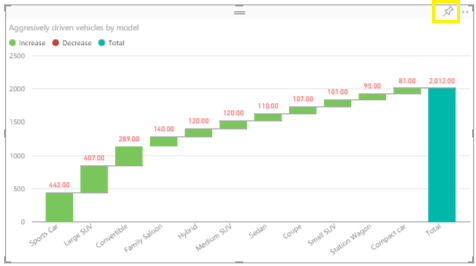
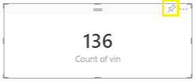

<properties 
    pageTitle="Modello di soluzione Dashboard di ottenere informazioni di veicolo telemetria analitica istruzioni di configurazione | Microsoft Azure" 
    description="Utilizzare le funzionalità di Business Intelligence Cortana per ottenere in tempo reale e stima approfondimenti sulla veicolo salute e favorire abitudini." 
    services="machine-learning" 
    documentationCenter="" 
    authors="bradsev" 
    manager="jhubbard" 
    editor="cgronlun" />

<tags 
    ms.service="machine-learning" 
    ms.workload="data-services" 
    ms.tgt_pltfrm="na" 
    ms.devlang="na" 
    ms.topic="article" 
    ms.date="09/12/2016" 
    ms.author="bradsev" />

# Istruzioni di configurazione di veicolo telemetria analitica soluzione modello Dashboard di ottenere informazioni

Questo **menu** fornisce collegamenti ai capitoli di questo playbook. 

[AZURE.INCLUDE [cap-vehicle-telemetry-playbook-selector](../../includes/cap-vehicle-telemetry-playbook-selector.md)]

Soluzione veicolo telemetria Analitica illustra come Concessionarie auto, veicoli produttori e società assicurazione possibile sfruttare le funzionalità di Business Intelligence Cortana per ottenere in tempo reale e stima approfondimenti integrità veicolo e verifica abitudini stradale ad apportare miglioramenti nell'area del cliente, R & s e campagne di marketing. Il documento contiene istruzioni dettagliate su come è possibile configurare i report di ottenere informazioni e dashboard dopo la soluzione distribuita nell'abbonamento. 

## Prerequisiti
1.  Distribuire la soluzione veicolo telemetria Analitica posizionandosi [https://gallery.cortanaanalytics.com/SolutionTemplate/Vehicle-Telemetry-Analytics-3](https://gallery.cortanaanalytics.com/SolutionTemplate/Vehicle-Telemetry-Analytics-3)  
2.  [Installare Microsoft Power BI Desktop](http://www.microsoft.com/download/details.aspx?id=45331)
3.  Un [abbonamento Azure](https://azure.microsoft.com/pricing/free-trial/). Se non si dispone di un abbonamento a Azure, Guida introduttiva a sottoscrizione gratuita Azure
4.  Account Microsoft PowerBI
    

## Componenti di famiglia di prodotti Business Intelligence Cortana
Come parte del modello di soluzione veicolo telemetria Analitica, i servizi di Business Intelligence Cortana seguenti vengono distribuiti nell'abbonamento.

- **Evento hub** per il caricamento di milioni di eventi di telemetria veicolo in Azure.
- **Flusso analitico**s per ottenere in tempo reale informazioni dettagliate sui integrità veicolo e rende i dati nel spazio di archiviazione a lungo termine per analitica batch più complesse.
- **Apprendimento** per il rilevamento di anomalie in tempo reale ed elaborazione batch per ottenere informazioni approfondite previsione.
- **HDInsight** viene utilizzata per trasformare i dati in scala
- **Data Factory** gestisce orchestrazione, pianificazione, la gestione delle risorse e il monitoraggio della pipeline di elaborazione batch.

**Power BI** offre questa soluzione un dashboard RTF per i dati in tempo reale e visualizzazioni analitica previsione. 

La soluzione utilizza due origini dati diverse: **segnali veicolo simulata e diagnostica set di dati** e **veicolo catalogo**.

Un simulatore telematiche veicolo è incluso come parte di questa soluzione. Genera informazioni di diagnostica ed segnali corrispondente allo stato del veicolo e favorire motivo in un determinato momento. 

Il catalogo veicolo è un set di dati di riferimento contengono VIN al mapping del modello

## Preparazione del Dashboard di ottenere informazioni

### Distribuzione

Al termine della distribuzione, verrà visualizzato nel diagramma seguente con tutti questi componenti contrassegnati in verde. 

- Per passare a servizi corrispondenti per controllare se tutti questi elementi sono distribuite correttamente, fare clic sulla freccia nella parte superiore destra dei nodi verdi.
- Per scaricare il pacchetto di simulatore di dati, fare clic sulla freccia nell'angolo superiore destro sul nodo **Veicolo telematiche simulatore** . Salvare ed estrarre i file in locale nel computer in uso. 

A questo punto, si è pronti configurare il dashboard di ottenere informazioni con le visualizzazioni avanzate per ottenere in tempo reale e le abitudini di previsione informazioni approfondite sul veicolo salute e la Guida. Bastano circa 45 minuti a un'ora di creare tutti i report e configurare il dashboard. 

### Configurazione Dashboard di Power BI in tempo reale

**Generare dati simulati**

1. Sul computer locale, passare alla cartella in cui è stato estratto il pacchetto di veicolo telematiche simulatore
2.  Eseguire l'applicazione ***CarEventGenerator.exe***.
3.  Genera informazioni di diagnostica ed segnali corrispondente allo stato del veicolo e favorire motivo in un determinato momento. Questo viene pubblicato in un'istanza di Azure evento Hub configurato come parte della distribuzione.

     
**Avviare l'applicazione di dashboard in tempo reale**

La soluzione include un'applicazione che genera un dashboard in tempo reale in ottenere informazioni. Questa applicazione in ascolto per un'istanza di evento Hub, da cui flusso Analitica pubblica continuamente gli eventi. Per tutti gli eventi che riceve l'applicazione, elabora i dati utilizzando un endpoint punteggio Machine Learning richiesta-risposta. Il set di dati risultante viene pubblicato il push di ottenere informazioni API per la visualizzazione. 

Per scaricare l'applicazione:

1.  Fare clic sul nodo di ottenere informazioni nella visualizzazione Diagramma e fare clic su **Scarica applicazione Dashboard in tempo reale**' collegamento nel riquadro delle proprietà.
2.  Estrarre e salvare l'applicazione localmente

3.  Eseguire l'applicazione **RealtimeDashboardApp.exe**
4.  Fornire credenziali valide di Power BI, accedere e fare clic su **accetta**
    
    
    
    

### Configurare i report di ottenere informazioni
Report in tempo reale e il dashboard richiedere circa 30-45 minuti. Passare alla [http://powerbi.com](http://powerbi.com) ed eseguire l'accesso.

Viene generato un nuovo set di dati in Power BI. Fare clic su set di dati **ConnectedCarsRealtime** .

Salvare il report vuoto mediante **Ctrl + s**.

Specificare il nome di report *in tempo reale Analitica telemetria veicolo - report*.

## Report in tempo reale
Esistono tre report in tempo reale in questa guida:

1.  Veicoli in operazione
2.  Veicoli che richiedono manutenzione
3.  Statistiche sanitarie veicoli

È possibile scegliere di configurare tutti i tre report in tempo reale o interrompere dopo qualsiasi fase e passare alla sezione successiva di configurare i report del batch. È consigliabile, è possibile creare i tre report di per visualizzare informazioni dettagliate sui completo del percorso in tempo reale della soluzione.  

### 1. veicoli in operazione
  
Fare doppio clic su **pagina 1** e rinominarlo "Veicoli in operazione"  
      

Selezionare campo **vin** dai **campi** e scegliere il tipo di visualizzazione come **"Biglietto"**.  

Visualizzazione scheda viene creata come illustrato nella figura.  
    

Fare clic sull'area vuota per aggiungere una nuova visualizzazione.  

Selezionare i campi **Città** e **vin** . Modificare la visualizzazione di **"**mappare". Trascinare **vin** nell'area valori. Trascinare **Città** dai campi all'area **della legenda** .   
    
  
Selezionare **formato** sezione **visualizzazioni**, fare clic **sul titolo** e modificare il **testo** in **"Veicoli in operazione in base alla città"**.  
       

Visualizzazione finale si presenta come illustrato nella figura.    
    

Fare clic sull'area vuota per aggiungere una nuova visualizzazione.  

Selezionare **Città** e **vin**, modificare il tipo di visualizzazione a **Istogramma a colonne raggruppate**. Assicurarsi che il campo **Città** **nell'area asse** e **vin** **nell'area valore**  

Quale ordinare grafico **"Conteggio del numero vin"**  
      

Modifica grafico **titolo** in **"Veicoli in operazione in base alla città"**  

Fare clic sulla sezione **formato** , quindi selezionare **I colori di dati**, fare clic su **"In"** su **Mostra tutto**  
      

Modificare il colore delle singole città facendo clic sull'icona di colore.  
      

Fare clic sull'area vuota per aggiungere una nuova visualizzazione.  

Selezionare la visualizzazione di **Istogramma a colonne raggruppate** visualizzazioni, trascinare il campo **città** nell'area **asse** , **modello** nell'area della **legenda** e **vin** nell'area **valore** .  
      
    
  
Ridisporre visualizzazione tutti in questa pagina, come illustrato nella figura.  
    

È stata configurata correttamente il report in tempo reale "Veicoli in operazione". È possibile procedere alla creazione di report in tempo reale successivo o interrompere la procedura e configurare il dashboard. 

### 2. veicoli che richiedono manutenzione
  
Fare clic su  per aggiungere un nuovo report, rinominarlo in **"veicoli che richiedono manutenzione"**

  

Selezionare il campo **vin** e modificare il tipo di visualizzazione alla **scheda**.  
      

Si dispone di un campo denominato "MaintenanceLabel" nel set di dati. In questo campo può avere un valore di "0" o "1"." È impostato dal modello di apprendimento Azure viene completato il provisioning come parte della soluzione e integrato con il percorso in tempo reale. Il valore "1" indica che un veicolo richiede manutenzione. 

Per aggiungere un filtro **A livello di pagina** per la visualizzazione di dati, veicoli che stanno manutenzione dei servizi: 

1. Trascinare il campo **"MaintenanceLabel"** in **Filtri a livello di pagina**.  
  

2. Fare clic sul menu **Filtri di base** presente nella parte inferiore della MaintenanceLabel pagina livello di filtro.  
  

3.  Impostare il valore di filtro su **"1"**    
  

Fare clic sull'area vuota per aggiungere una nuova visualizzazione.  

Selezionare visualizzazioni **Grafico a colonne raggruppate**  
  

Trascinare campi **modello** nell'area **asse** , **Vin** all'area di **valore** . Ordinare la visualizzazione per **numero di vin**.  Modifica grafico **titolo** in **"Veicoli che richiedono manutenzione dal modello"**  

Trascinare campi **vin** in **Saturazione colore** presenta **campi**  sezione della scheda **visualizzazione**  
  

Modificare **I colori di dati** nelle visualizzazioni nella sezione **formato**  
Modificare il colore minimo a: **F2C812**  
Modificare il colore di massimo a: **FF6300**  
  
  

Fare clic sull'area vuota per aggiungere una nuova visualizzazione.  

Selezionare **grafico a colonne raggruppate** visualizzazioni, trascinare il campo **vin** nell'area **valore** , trascinare il campo **Città** nell'area **asse** . Ordinamento del grafico per **"Conteggio di vin"**. Modifica grafico **titolo** in **"Veicoli che richiedono manutenzione in base alla città"**   
  

Fare clic sull'area vuota per aggiungere una nuova visualizzazione.  

Selezionare visualizzazione **Scheda riga più** visualizzazioni, trascinare **modello** e **vin** nell'area **dei campi** .  
    

Ridisposizione tutta la visualizzazione, il rapporto finale simile al seguente:  
  

È stata configurata correttamente il report in tempo reale "Veicoli che richiedono manutenzione". È possibile procedere alla creazione di report in tempo reale successivo o interrompere la procedura e configurare il dashboard. 

### 3. statistiche sanitarie veicoli
  
Fare clic su  per aggiungere nuovo report, rinominarlo in **"veicoli integrità statistiche"**  

Selezionare visualizzazione **indicatore** di visualizzazioni, quindi trascinare il campo **velocità** aree **valore, valore minimo e massimo** .  
  

Impostare l'aggregazione predefinita di **velocità** **nell'area valore** **medio** 

Modificare l'aggregazione predefinita di **velocità** **nell'area minimo** al **minimo**

Modificare l'aggregazione predefinita di **velocità** **nell'area massimo** al **massimo**

  

Rinominare il **Titolo indicatore** a **"Velocità media"** 
 
  

Fare clic sull'area vuota per aggiungere una nuova visualizzazione.  

Analogamente aggiungere un **indicatore** per **oil motore Media**, **medio di carburante**e **medio modulo temperata**.  

Verificare le metriche modifica **"Velocità media"** procedura per l'aggregazione predefinita di campi in ogni indicatore come descritto sopra.

Fare clic sull'area vuota per aggiungere una nuova visualizzazione.

Selezionare **linee e a barre raggruppate istogramma** visualizzazioni, quindi trascinare il campo **città** in **Asse condiviso**, trascinare la **velocità**, **tirepressure ed engineoil campi** nell'area **Valori della colonna** , cambiare il tipo di aggregazione in **Media**. 

Trascinare il campo **engineTemperature** nell'area **Dei valori di riga** , cambiare il tipo di aggregazione in **Media**. 

Diventano il **titolo** del grafico **"velocità media, pressione pneumatico, oil motore e temperatura del motore"**.  

Fare clic sull'area vuota per aggiungere una nuova visualizzazione.

Selezionare visualizzazione **mappa ad albero** di visualizzazioni, trascinare il campo **modello** nell'area di **raggruppamento** e trascinare il campo **MaintenanceProbability** nell'area dei **valori** .

Modificare il **titolo** del grafico a **"Che richiedono la manutenzione dei modelli di veicolo"**.

Fare clic sull'area vuota per aggiungere una nuova visualizzazione.

Selezionare il **grafico a barre in pila 100%** dalla visualizzazione, trascinare il campo **città** nell'area **asse** e trascinare **MaintenanceProbability**, **RecallProbability** campi nell'area di **valore** .

Fare clic su **formato**, selezionare **I colori di dati**e impostare il colore **MaintenanceProbability** al valore di **"F2C80F"**.

Modificare il **titolo** del grafico a **"probabilità di veicolo manutenzione & richiama per città"**.

Fare clic sull'area vuota per aggiungere una nuova visualizzazione.

Selezionare **Grafico ad Area** di visualizzazione di visualizzazioni, trascinare il campo **modello** nell'area **asse** e trascinare i campi **engineOil, tirepressure, velocità e MaintenanceProbability** nell'area **valori** . Cambiare il tipo di aggregazione in **"Media"**. 

Modificare il titolo del grafico a **"Calcolare la media oil motore, gomme pressione, velocità e la manutenzione probabilità dal modello"**.

Fare clic sull'area vuota per aggiungere una nuova visualizzazione:

1. Selezionare la visualizzazione **Del grafico a dispersione** visualizzazioni.
2. Trascinare il campo **modello** nell'area **Dettagli** e **legenda** .
3. Trascinare il campo **carburante** nell'area **asse x** , cambiare l'aggregazione in **Media**.
4. Trascinare **engineTemparature** **nell'area asse y**, cambiare l'aggregazione in **Media**
5. Trascinare il campo **vin** nell'area **dimensioni** .

Modificare il **titolo** del grafico per **"Medie di carburante, temperatura del motore dal modello"**.

Il rapporto finale sarà simile come illustrato di seguito.

### Visualizzazioni PIN dai report del dashboard in tempo reale
  
Creare un dashboard vuoto facendo clic sull'icona di segno più accanto a Dashboard. È possibile assegnare un nome "Veicolo telemetria Analitica Dashboard"

Aggiungere la visualizzazione dei rapporti sopra al dashboard. 
 

Dashboard di avrà un aspetto come indicato di seguito quando vengono creati i tre report e le visualizzazioni corrispondenti vengono aggiunte al dashboard. Se non sono stati creati tutti i report, il dashboard potrebbe apparire diverso. 

Congratulazioni! La creazione di dashboard in tempo reale è stata completata. Mentre si continua a eseguire CarEventGenerator.exe e RealtimeDashboardApp.exe, risulta aggiornamenti live nel dashboard. Richiede circa 10-15 minuti per completare la procedura seguente.

 
##  Configurazione del dashboard di elaborazione batch di Power BI

>[AZURE.NOTE] Bastano circa due ore (dal completamento della distribuzione) per la pipeline di elaborazione batch to end completare l'esecuzione ed elaborare un anno patrimonio di dati generati. Attendere così l'elaborazione completare prima di procedere con la procedura successiva. 

**Scaricare il file della finestra di progettazione di ottenere informazioni**

-   Un file di progettazione di ottenere informazioni preconfigurato viene incluso come parte della distribuzione
-   Fare clic sul nodo di ottenere informazioni nella visualizzazione Diagramma e fare clic sul collegamento di **scaricare il file della finestra di progettazione di ottenere informazioni** sul riquadro delle proprietà

-   Salvare localmente

**Configurare i report di ottenere informazioni**

-   Aprire il file della finestra di progettazione 'VehicleTelemetryAnalytics - Report.pbix Desktop' utilizzo di ottenere informazioni Desktop. Se si ha già uno, installare il Desktop di ottenere informazioni dal [Desktop di ottenere informazioni di installazione](http://www.microsoft.com/download/details.aspx?id=45331). 

-   Fare clic su **Modifica query**.

- Fare doppio clic su **origine**.

- Aggiornare la stringa di connessione Server con il server di SQL Azure che se si ha effettuato il provisioning come parte della distribuzione. Fare clic sul nodo di SQL Azure nel diagramma e visualizzare il nome del server del riquadro delle proprietà.

- Lascia **Database** come *connectedcar*.

- Fare clic su **OK**.
- Verrà visualizzata **credenziali Windows** scheda selezionata per impostazione predefinita, impostare **le credenziali del Database** facendo clic sulla scheda **Database** destra.
- Specificare il **nome utente** e la **Password** del Database di SQL Azure specificata durante l'installazione.

- Fare clic su **Connetti**
- Ripetere i passaggi precedenti per ognuna delle tre query rimanente presente nel riquadro destro e quindi aggiornare i dettagli della connessione origine dati.
- Scegliere **Chiudi e carica**. Set di dati di Power BI Desktop file sono collegati alle tabelle di Database SQL Azure.
- **Chiudi** File di Power BI Desktop.

- Fare clic su pulsante **Salva** per salvare le modifiche. 
 
È stato configurato tutti i report corrispondente al percorso di elaborazione batch della soluzione. 

## Caricare *powerbi.com*
 
1.  Passare al portale web di ottenere informazioni all'http://powerbi.com ed eseguire l'accesso.
2.  Fare clic su **Recupera dati**  
3.  Caricare il File di Power BI Desktop.  
4.  Per caricare, fare clic su **-> Recupera dati file Get -> file locale**  
5.  Passare a **"VehicleTelemetryAnalytics-Report.pbix Desktop"**  
6.  Dopo aver caricato il file, si accederà allo spazio di lavoro di Power BI.  

Un set di dati, report e dashboard vuoto verrà creati automaticamente.  
 

PIN grafici al dashboard esistente **Veicolo telemetria Analitica Dashboard** in **Power BI**. Fare clic su dashboard vuoto creato in precedenza e quindi passare a fare clic su sezione **report** report appena caricati.  

 

**Nota che il report include sei pagine:**  
1 pagina: Densità veicolo  
Pagina 2: Integrità veicolo in tempo reale  
Pagina 3: Elimina la basati su veicoli   
Pagina 4: Veicoli richiamati  
Pagina 5: Carburante in modo efficiente basata sulle risorse veicoli  
Pagina 6: Logo di Contoso  

 

**Dalla pagina 3**, pin le operazioni seguenti:  

1.  Conteggio del numero VIN  
     

2.  Imporre basata sulle risorse veicoli dal modello-grafico a cascata  
    

**Dalla pagina 5**, pin le operazioni seguenti: 
 
1.  Conteggio del numero vin    
      
2.  Carburante veicoli efficienti dal modello: istogramma raggruppato  
    

**Dalla pagina 4**, aggiungere le operazioni seguenti:  

1.  Conteggio del numero vin  
     

2.  Modello di veicoli richiamati in base alla città,: mappa ad albero  
      

**Dalla pagina 6**, pin le operazioni seguenti:  

1.  Logo di motori di Contoso  
    

**Organizzare il dashboard**  

1.  Passare a dashboard
2.  Passare il mouse su ogni grafico e Rinomina basato su denominazione fornite nell'immagine dashboard completo riportata di seguito. Spostarsi anche i tipi di grafici all'aspetto dashboard riportata di seguito.  
      
    
3.  Se è stata creata tutti i report come descritto in questo documento, il dashboard completo finale avrà un aspetto come nella figura seguente. 

Congratulazioni! È stato creato il report e dashboard per ottenere in tempo reale, previsione e batch informazioni approfondite sul veicolo salute e favorire abitudini.  
