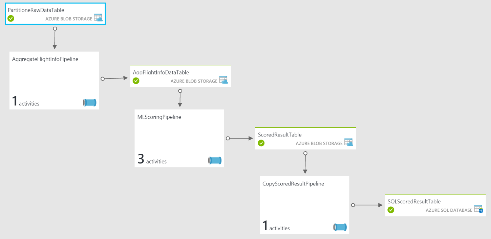

<properties
    pageTitle="Guide tecniche per il modello di soluzione di Business Intelligence Cortana per la stima manutenzione aerospace e altre aziende | Microsoft Azure"
    description="Una Guida tecnica per il modello di soluzione con Microsoft Cortana Intelligence per la stima manutenzione aerospace, utilità e relative a trasporti."
    services="cortana-analytics"
    documentationCenter=""
    authors="fboylu"
    manager="jhubbard"
    editor="cgronlun"/>

<tags
    ms.service="cortana-analytics"
    ms.workload="data-services"
    ms.tgt_pltfrm="na"
    ms.devlang="na"
    ms.topic="article"
    ms.date="09/13/2016"
    ms.author="fboylu" />

# Guide tecniche per il modello di soluzione di Business Intelligence Cortana per la stima manutenzione aerospace e altre aziende

## **Riconoscimenti**
In questo articolo è stato creato da scienziati dati Yan Zhang, Gauher Shaheen, Fidan Boylu Uz e tecnico Dan Grecoe Microsoft.

## **Panoramica**

Modelli di soluzioni sono progettati per accelerare il processo di creazione di una demo E2E nella parte superiore di famiglia di prodotti Business Intelligence Cortana. Un modello distribuito verrà provisioning l'abbonamento con i componenti di Business Intelligence Cortana necessari e creare relazioni tra di esse. Inoltre semi pipeline di dati con dati di esempio generati da un'applicazione di generatore di dati che consente di scaricare e installare nel computer locale dopo si distribuisce il modello di soluzione. I dati generati dal generatore verranno idrato la pipeline di dati e avviare la creazione delle stime risorse computer che possono quindi essere visualizzate nel dashboard di Power BI. Il processo di distribuzione consentirà diversi passaggi per configurare le credenziali di soluzione. Assicurarsi che la registrazione di queste credenziali, ad esempio Nome soluzione, nome utente e password forniti durante la distribuzione.  

L'obiettivo di questo documento è illustrare l'architettura di riferimento e diversi componenti effettuato il provisioning in abbonamento come parte di questo modello di soluzione. Il documento parla anche come sostituire i dati di esempio con dati reali nel forum relativo a essere in grado di visualizzare informazioni dettagliate sui e le stime dai propri dati. Inoltre, il documento vengono illustrate le parti del modello di soluzione che devono essere modificate se si desidera personalizzare la soluzione sui propri dati. Vengono fornite istruzioni su come creare dashboard di Power BI per il modello di soluzione alla fine.

>[AZURE.TIP] È possibile scaricare e stampare una [versione PDF del documento](http://download.microsoft.com/download/F/4/D/F4D7D208-D080-42ED-8813-6030D23329E9/cortana-analytics-technical-guide-predictive-maintenance.pdf).

## **Quadro generale**

Quando viene distribuita la soluzione, diversi servizi di Azure all'interno di Cortana Analitica Suite sono attivati (*ad esempio* Hub di evento, flusso Analitica, HDInsight, Data Factory, apprendimento e *così via*). Architettura Mostra il diagramma precedente, ad alto livello, come sia impostata manutenzione previsione per il modello di soluzione aerospaziale da-to-end. Sarà possibile provare a utilizzare questi servizi nel portale di azure facendo clic su di essi nel diagramma modello soluzione creato con la distribuzione della soluzione ad eccezione delle HDInsight come questo servizio viene eseguito il provisioning su richiesta quando le attività correlate pipeline sono necessari per eseguire ed eliminati in un secondo momento.
È possibile scaricare una [versione originale del diagramma](http://download.microsoft.com/download/1/9/B/19B815F0-D1B0-4F67-AED3-A40544225FD1/ca-topologies-maintenance-prediction.png).

Le sezioni seguenti descrivono ogni parte.

## **Acquisizione e l'origine dati**

### Origine dati sintetici

Per il modello viene generato l'origine dati utilizzata da un'applicazione desktop che verranno scaricati ed eseguire localmente al termine della distribuzione. Sono disponibili le istruzioni per scaricare e installare l'applicazione nella barra della proprietà quando si seleziona il primo nodo denominato stima generatore di dati di manutenzione nel diagramma modello soluzione. Questa applicazione feed il servizio di [Azure evento Hub](#azure-event-hub) con punti dati o gli eventi, che verranno utilizzati il resto del flusso di soluzione. L'origine dati è costituita da o derivata dai dati accessibili dal [repository dei dati NASA](http://ti.arc.nasa.gov/tech/dash/pcoe/prognostic-data-repository/) utilizzando il [Set di dati simulazione riduzione del motore di Turbofan](http://ti.arc.nasa.gov/tech/dash/pcoe/prognostic-data-repository/#turbofan).

Evento generazione verrà inserito Hub evento Azure solo durante l'esecuzione nel computer in uso.

### Hub evento Azure

Il servizio di [Azure evento Hub](https://azure.microsoft.com/services/event-hubs/) è il destinatario dell'input forniti dall'origine dati sintetici descritte in precedenza.

## **Analisi e preparazione dei dati**

### Flusso Azure Analitica

Per fornire vicino analitica in tempo reale sul flusso di input dal servizio di [Azure evento Hub](#azure-event-hub) e pubblicare i risultati in un dashboard di [Power BI](https://powerbi.microsoft.com) e l'archiviazione di tutti gli eventi in arrivo elaborati al servizio di [Archiviazione Azure](https://azure.microsoft.com/services/storage/) per l'elaborazione successiva mediante il servizio di [Azure Data Factory](https://azure.microsoft.com/documentation/services/data-factory/) viene usato il servizio di [Azure flusso Analitica](https://azure.microsoft.com/services/stream-analytics/) .

### Aggregazione personalizzata HD approfondimenti

Per eseguire gli script [Hive](http://blogs.msdn.com/b/bigdatasupport/archive/2013/11/11/get-started-with-hive-on-hdinsight.aspx) (gestiti da Azure Data Factory) per fornire le aggregazioni negli eventi che sono stati archiviati mediante il servizio di Azure flusso Analitica viene usato il servizio di Azure HD comprensione.

### Apprendimento Azure

Viene usato il servizio di [Apprendimento Azure](https://azure.microsoft.com/services/machine-learning/) (gestito da Azure Data Factory) per rendere le stime sulla vita utile rimanente (RUL) di un motore di aereo particolare assegnato input ricevuti.

## **Pubblicazione dei dati**

### Servizio di Database SQL Azure

Il servizio di [Database SQL Azure](https://azure.microsoft.com/services/sql-database/) viene utilizzato per archiviare (gestita da Azure Data Factory) le stime ricevute dal servizio apprendimento Azure utilizzati nel dashboard di [Power BI](https://powerbi.microsoft.com) .

## **Consumo di dati**

### Power BI

Per visualizzare un dashboard che contiene le aggregazioni e avvisi forniti dal servizio di [Azure flusso Analitica](https://azure.microsoft.com/services/stream-analytics/) , nonché le stime RUL archiviate nel [Database di SQL Azure](https://azure.microsoft.com/services/sql-database/) generate mediante il servizio di [Apprendimento Azure](https://azure.microsoft.com/services/machine-learning/) viene usato il servizio di [Power BI](https://powerbi.microsoft.com) . Per istruzioni su come creare dashboard di Power BI per il modello di soluzione, vedere la sezione seguente.

## **Come importare i propri dati**

In questa sezione viene descritto come importare i propri dati in Azure e quali aree richiedono modifiche per i dati che importare questa architettura.

Non viene in genere che qualsiasi set di dati che è importare corrisponderebbe il set di dati utilizzato per il [Set di dati simulazione riduzione del motore Turbofan](http://ti.arc.nasa.gov/tech/dash/pcoe/prognostic-data-repository/#turbofan) utilizzato per il modello di soluzione. Informazioni sui dati e i requisiti sarà fondamentale come si modifica il modello per gestire i propri dati. Se si tratta del primo esposizione al servizio di apprendimento Azure, è possibile ottenere un'introduzione a essa mediante l'esempio su [come creare il primo prova](machine-learning-create-experiment.md).

Nelle sezioni seguenti verranno illustrati le sezioni del modello che richiedono modifiche quando è stato introdotto un nuovo set di dati.

### Hub evento Azure

Il servizio di Azure evento Hub è molto generico, in modo che all'hub in formato CSV o JSON, è possibile registrare i dati. Si verifica alcuna elaborazione speciale nell'Hub evento Azure, ma è importante conoscere i dati che vengono caricati.

In questo documento non descrive come acquisire i dati, ma è possibile inviare dati o eventi a un Hub di evento Azure tramite l'API Hub evento.

### Flusso Azure Analitica

Per fornire vicino analitica in tempo reale importando da flussi di dati e output dei dati a un numero qualsiasi di origini viene usato il servizio di Azure flusso Analitica.

Per la manutenzione previsione per il modello di soluzione aerospaziale, la query di Azure flusso Analitica è costituito da quattro sottoquery, ogni consumer eventi il servizio di Azure evento Hub e la necessità di output di quattro percorsi distinti. Questi output è costituito da tre set di dati di Power BI e un percorso di archiviazione di Azure.

La query di Azure flusso Analitica può essere trovata tramite:

-   Accesso al portale di Azure

-   Individuare i processi di analitica flusso  che sono state generate quando la soluzione è stata distribuita (*ad esempio*, **maintenancesa02asapbi** e **maintenancesa02asablob** per la soluzione di manutenzione previsione)

-   La selezione

    -   ***Ingressi*** per visualizzare l'input di query

    -   ***QUERY*** per visualizzare la query stessa

    -   ***Invia*** per visualizzare diversi output

Informazioni sulla creazione della query di Azure flusso Analitica disponibili nel [Riferimento Query Analitica flusso](https://msdn.microsoft.com/library/azure/dn834998.aspx) su MSDN.

In questa soluzione, le query di output tre set di dati con accanto il flusso di dati in arrivo a un dashboard di Power BI forniti come parte di questo modello di soluzione di informazioni in tempo reale analitica. Poiché non esiste una conoscenza implicita informazioni sul formato di dati in arrivo, tali query necessario intervenire in base al formato dati.

La query nel secondo flusso analitica processo **maintenancesa02asablob** semplicemente restituisce tutti gli eventi di [Evento Hub](https://azure.microsoft.com/services/event-hubs/) allo [Spazio di archiviazione di Azure](https://azure.microsoft.com/services/storage/) e pertanto non richiede alcuna modifica indipendentemente il formato dati come le informazioni sugli eventi completo trasmessi in streaming allo spazio di archiviazione.

### Dati di Azure Factory

Il servizio di [Azure Data Factory](https://azure.microsoft.com/documentation/services/data-factory/) coordina lo spostamento e l'elaborazione dei dati. Per la manutenzione di previsione per il modello di soluzione aerospaziale factory dati è costituito da tre [tubazioni](../data-factory/data-factory-create-pipelines.md) che spostare ed elaborare dati utilizzando diverse tecnologie.  È possibile accedere il produttore dati aprendo il nodo Data Factory nella parte inferiore del diagramma modello soluzione creata con la distribuzione della soluzione. Verrà visualizzata la factory di dati nel portale Azure. Se vengono visualizzati errori nel set di dati, è possibile ignorare quelli presenti a causa di factory dati distribuito prima il generatore di dati è stato avviato. Gli errori non factory i dati di funzionare.

In questa sezione vengono illustrate le necessarie [tubazioni](../data-factory/data-factory-create-pipelines.md) e [le attività](../data-factory/data-factory-create-pipelines.md) contenute in [Azure Data Factory](https://azure.microsoft.com/documentation/services/data-factory/). Di seguito è la visualizzazione Diagramma della soluzione.

Due pipeline di questa factory contengono script [Hive](http://blogs.msdn.com/b/bigdatasupport/archive/2013/11/11/get-started-with-hive-on-hdinsight.aspx) utilizzati per suddividere e aggregare i dati. Quando indicato, gli script sono disponibili nell'account di [Archiviazione Azure](https://azure.microsoft.com/services/storage/) creato durante l'installazione. Il percorso sarà: maintenancesascript\\\\script\\\\hive\\ \\ (o https://[Your soluzione name].blob.core.windows.net/maintenancesascript).

Analogamente alle query [Azure flusso Analitica](#azure-stream-analytics-1) , gli script [Hive](http://blogs.msdn.com/b/bigdatasupport/archive/2013/11/11/get-started-with-hive-on-hdinsight.aspx) hanno una conoscenza implicita informazioni sul formato di dati in arrivo, tali query dovrà essere modificato in base alle proprie esigenze di [Progettazione di funzionalità](machine-learning-feature-selection-and-engineering.md) e formato dati.

#### *AggregateFlightInfoPipeline*

Questa [pipeline](../data-factory/data-factory-create-pipelines.md) contiene una singola attività - un'attività [HDInsightHive](../data-factory/data-factory-hive-activity.md) utilizzando [HDInsightLinkedService](https://msdn.microsoft.com/library/azure/dn893526.aspx) che esegue uno script [Hive](http://blogs.msdn.com/b/bigdatasupport/archive/2013/11/11/get-started-with-hive-on-hdinsight.aspx) per dividere i dati inseriti in [Archiviazione Azure](https://azure.microsoft.com/services/storage/) durante il processo di [Azure flusso Analitica](https://azure.microsoft.com/services/stream-analytics/) .

Lo script [Hive](http://blogs.msdn.com/b/bigdatasupport/archive/2013/11/11/get-started-with-hive-on-hdinsight.aspx) per questa attività partizione è ***AggregateFlightInfo.hql***

#### *MLScoringPipeline*

Questa [pipeline](../data-factory/data-factory-create-pipelines.md) contiene più attività e il cui risultato finale è che sperimentare le stime punteggio di [Apprendimento Azure](https://azure.microsoft.com/services/machine-learning/) associato a questo modello di soluzione.

Le attività contenute in questo sono:

-   Attività [HDInsightHive](../data-factory/data-factory-hive-activity.md) utilizzando un [HDInsightLinkedService](https://msdn.microsoft.com/library/azure/dn893526.aspx) che esegue uno script [Hive](http://blogs.msdn.com/b/bigdatasupport/archive/2013/11/11/get-started-with-hive-on-hdinsight.aspx) per eseguire aggregazioni e Progettazione funzionalità necessarie per la prova di [Apprendimento Azure](https://azure.microsoft.com/services/machine-learning/) .
    Script [Hive](http://blogs.msdn.com/b/bigdatasupport/archive/2013/11/11/get-started-with-hive-on-hdinsight.aspx) per questa attività partizione è ***PrepareMLInput.hql***.

-   Attività di [Copia](https://msdn.microsoft.com/library/azure/dn835035.aspx) che consente di spostare i risultati dall'attività [HDInsightHive](../data-factory/data-factory-hive-activity.md) a un singolo blob [Azure lo spazio di archiviazione](https://azure.microsoft.com/services/storage/) che si può accedere dall'attività [AzureMLBatchScoring](https://msdn.microsoft.com/library/azure/dn894009.aspx) .

-   Attività di [AzureMLBatchScoring](https://msdn.microsoft.com/library/azure/dn894009.aspx) che chiama [Apprendimento Azure](https://azure.microsoft.com/services/machine-learning/) sperimentare che restituisce i risultati vengono inseriti in un singolo blob [Azure lo spazio di archiviazione](https://azure.microsoft.com/services/storage/) .

#### *CopyScoredResultPipeline*

Questa [pipeline](../data-factory/data-factory-create-pipelines.md) contiene una singola attività - un'attività di [Copia](https://msdn.microsoft.com/library/azure/dn835035.aspx) riguardante che i risultati di [Apprendimento Azure](#azure-machine-learning) provare dal ***MLScoringPipeline*** al [Database SQL Azure](https://azure.microsoft.com/services/sql-database/) è stato eseguito il provisioning come parte dell'installazione di modello soluzione.

### Apprendimento Azure

Prova [Apprendimento Azure](https://azure.microsoft.com/services/machine-learning/) utilizzata per questo modello di soluzione fornisce le rimanenti utile vita_utile (RUL) di un motore aerei. La prova specifica per il set di dati utilizzato e pertanto sarà necessaria la modifica o sostituzione specifiche dei dati che viene caricati in.

Per informazioni sulla creazione di prova di apprendimento Azure, vedere [manutenzione stima: passaggio 1 of 3 Preparazione dei dati e progettazione caratteristica](http://gallery.cortanaanalytics.com/Experiment/Predictive-Maintenance-Step-1-of-3-data-preparation-and-feature-engineering-2).

## **Monitorare l'avanzamento**
 Una volta che viene avviato il generatore di dati, la pipeline inizia a ottenere Alluminosilicato e i diversi componenti della soluzione iniziare qui in seguito azione i comandi rilasciati da Factory dati. Esistono due modi per monitorare la pipeline.

1. Uno dei processi flusso Analitica scrive i dati non elaborati in arrivo a archiviazione blob. Se si fa clic sul componente di archiviazione Blob della soluzione dalla schermata è correttamente installato la soluzione e quindi fare clic su Apri nel Pannello di destra, si passerà al [portale di gestione](https://portal.azure.com/). Una volta, fare clic su BLOB. Nella schermata successiva, si vedrà un elenco di contenitori. Fare clic su **maintenancesadata**. Nella schermata successiva, verrà visualizzata la cartella **rawdata** . All'interno della cartella rawdata, verranno visualizzate cartelle con nomi, ad esempio ora = 17, ora = 18 e così via. Se viene visualizzato queste cartelle, significa che i dati non elaborati correttamente generata nel computer in uso e archiviati in archiviazione blob. Verrà visualizzato il file csv che devono avere dimensioni limitate in MB in tali cartelle.

2. L'ultimo passaggio della pipeline è scrivere i dati (ad esempio le stime di apprendimento) nel Database di SQL. Potrebbe essere necessario attendere fino a tre ore per visualizzare i dati nel Database di SQL. È possibile controllare la quantità di dati è disponibile nel Database di SQL è tramite [il portale di azure](https://manage.windowsazure.com/). Nel riquadro sinistro individuare database SQL  e fare clic su esso. Quindi individuare il database **pmaintenancedb** e fare clic su di esso. Nella parte inferiore della pagina successiva fare clic su GESTISCI

    .

    In questo caso, è possibile fare clic su Nuova Query e query per il numero di righe (ad esempio, selezionare Count da PMResult). Man mano che aumenta il database, necessario aumentare il numero di righe nella tabella.

## **Dashboard di Power BI**

### Panoramica

In questa sezione viene descritto come configurare dashboard di Power BI per visualizzare i dati in tempo reale da analitica flusso Azure (percorso critico), oltre al tipo di risultati stima batch da Azure apprendimento automatico (percorso fredda).

### Dashboard fredda percorso di installazione

Nella pipeline di dati percorso fredda, l'obiettivo principale è ottenere RUL previsione (rimanente vita utile) di ogni motore aereo dopo il completamento di un volo (circolare). Il risultato di stima viene aggiornato ogni tre ore per la previsione di motori che hanno completato un volo durante le ore 3 passate.

Power BI si connette a un database SQL Azure come origine dati, in cui sono memorizzati i risultati di previsione. Nota: 1) su distribuire la soluzione, una stima reale verrà visualizzato nel database all'interno di 3 ore.
Il file pbix fornita in dotazione con il download di generatore contiene alcuni dati iniziali in modo che è possibile creare dashboard di Power BI immediatamente. 2) in questo passaggio il prerequisito è di scaricare e installare il software gratuito [Power BI desktop](https://powerbi.microsoft.com/documentation/powerbi-desktop-get-the-desktop/).

La procedura seguente consentirà su come connettere il file pbix al Database SQL di cui è stata caricare un al momento dell'installazione di soluzione contenente i dati (*ad esempio*. risultati stima) per la visualizzazione.

1.  È possibile ottenere le credenziali del database.

    **Nome del server di database, nome del database, nome utente e password** occorre prima di passare alla procedura successiva. Ecco i passaggi da Guida come trovarli più facilmente.

    -   Una volta **' Database di SQL Azure'** nel diagramma modello soluzione diventa verde, fare clic su esso e quindi fare clic su **'Apri'**.

    -   Verrà visualizzata una nuova finestra del browser scheda/che consente di visualizzare la pagina del portale di Azure. Fare clic su **'Gruppi di risorse'** nel riquadro sinistro.

    -   Selezionare l'abbonamento si usa per distribuire la soluzione e quindi selezionare **' YourSolutionName\_ResourceGroup'**.

    -   Nel pannello, nuovo popout, fare clic sul  l'icona per l'accesso al database. Il nome del database è accanto a questa icona (*ad esempio*, **'pmaintenancedb'**) e il **nome del server di database** elencati sotto la proprietà di nome Server e dovrebbe essere simile a **YourSoutionName.database.windows.net**.

    -   Il database, **nome utente** e la **password** è lo stesso nome utente e password registrata in precedenza durante la distribuzione della soluzione.

2.  Aggiornare l'origine dati del file di report percorso fredda con Power BI Desktop.

    -   Nella cartella del computer in cui è stata scaricata e decompressi il file del generatore, fare doppio clic sul **ottenere informazioni\\PredictiveMaintenanceAerospace.pbix** file. Se i messaggi di avviso viene visualizzato quando si apre il file, ignorarli. Nella parte superiore del file, scegliere **' Modifica query '**.

        

    -   Verranno visualizzate le tabelle **RemainingUsefulLife** e **PMResult**. Selezionare la prima tabella e fare clic su  accanto a **'Source'** in **Passaggi applicati** nel Pannello di destra **' impostazioni Query'.** Ignorare i messaggi di avviso che vengono visualizzati.

    -   Nella finestra popout sostituire **"Server"** e **"Database"** con il proprio server e nomi di database e quindi fare clic su **"OK"**. Nome del server, assicurarsi di specificare la porta 1433 (**YourSoutionName.database.windows.net, 1433**). Lasciare il campo del Database come **pmaintenancedb**. Ignorare i messaggi di avviso che vengono visualizzati sullo schermo.

    -   Nella finestra, successiva popout, verranno visualizzate due opzioni nel riquadro a sinistra (**Windows** e **Database**). Fare clic su **'Database'**, immettere le **'Username'** e **'Password'** (è il nome utente e la password che è stata immessa quando si prima distribuita la soluzione e creata un database SQL Azure). In ***Selezionare il livello per applicare queste impostazioni***, selezionare l'opzione livello di database. Fare clic su **"Connetti"**.

    -   Fare clic su nella seconda tabella **PMResult**  accanto a **'Source'** in **Passaggi applicati** nel Pannello di destra **' impostazioni Query'** e aggiornare i nomi di server e database come la procedura precedente e fare clic su OK.

    -   Una volta che sta interattiva la pagina precedente, chiudere la finestra. Verrà visualizzato un messaggio out, fare clic su **Applica**. Infine, fare clic sul pulsante **Salva** per salvare le modifiche. Il file di Power BI è ora stabilita connessione al server. Se le visualizzazioni sono vuote, assicurarsi di che deselezionare le opzioni desiderate nelle visualizzazioni per visualizzare tutti i dati facendo clic sull'icona per la gomma nell'angolo superiore destro delle legende. Utilizzare il pulsante Aggiorna in modo da rispecchiare i nuovi dati in visualizzazioni. Inizialmente, solo vedrete dati iniziali sulle visualizzazioni come factory dati è programmato per aggiornare ogni tre ore. Dopo 3 ore, si vedrà stime di nuovi applicate visualizzazioni quando si aggiornano i dati.

3.  (Facoltativo) Pubblicare il dashboard percorso fredda in [Power BI online](http://www.powerbi.com/). Si noti che questo passaggio è necessario un account di Power BI (o account Office 365).

    -   Fare clic su **'Pubblica'** e alcuni secondi dopo una verrà visualizzata la finestra "Pubblicazione in Power BI successo!" con un segno di spunta verde. Fare clic sul collegamento sotto "Apri PredictiveMaintenanceAerospace.pbix in Power BI". Per informazioni dettagliate, vedere [pubblicazione da Power BI Desktop](https://support.powerbi.com/knowledgebase/articles/461278-publish-from-power-bi-desktop).

    -   Per creare un nuovo dashboard: fare clic sul **+** segno più accanto alla sezione **Dashboard** nel riquadro sinistro. Immettere il nome "Stima manutenzione Demo" per il nuovo dashboard.

    -   Dopo aver aperto il report, fare clic su  consente di aggiungere tutte le visualizzazioni al dashboard. Per trovare istruzioni dettagliate, vedere [aggiungere un riquadro a un dashboard di Power BI da un report](https://support.powerbi.com/knowledgebase/articles/430323-pin-a-tile-to-a-power-bi-dashboard-from-a-report).
    Passare alla pagina del dashboard e regolare le dimensioni e posizione delle visualizzazioni e modificare i titoli. Per trovare istruzioni dettagliate su come modificare i riquadri, vedere [Modifica un riquadro - Ridimensiona, sposta, Rinomina, pin, eliminare, aggiungere collegamento ipertestuale](https://powerbi.microsoft.com/documentation/powerbi-service-edit-a-tile-in-a-dashboard/#rename). Ecco un dashboard di esempio con alcune visualizzazioni di percorso fredda aggiunte a tale.  A seconda di quanto tempo si esegue il generatore di dati, i numeri nelle visualizzazioni potrebbero essere diversi.
     
    
 
    -   Per pianificare l'aggiornamento dei dati, passare il mouse sopra il set di dati **PredictiveMaintenanceAerospace** , fare clic su  e quindi scegliere **Pianifica aggiornamento**.
 
        **Nota:** Se vengono visualizzati messaggi di avviso, fare clic su **Modifica credenziali** e assicurarsi che le credenziali di database sono equivalenti a quelli descritti nel passaggio 1.
 
    
 
    -   Espandere la sezione **Pianifica aggiornamento** . Attivare "mantenere aggiornati i dati".
     
    -   Pianificare l'aggiornamento in base alle proprie esigenze. Per ulteriori informazioni, vedere [aggiornamento dei dati in Power BI](https://support.powerbi.com/knowledgebase/articles/474669-data-refresh-in-power-bi).

### Configurazione del dashboard percorso critico

La procedura seguente mostrerà come visualizzare l'output dei dati in tempo reale processi flusso Analitica generati in fase di distribuzione di soluzioni. Per eseguire la procedura seguente è necessario un account di [Power BI online](http://www.powerbi.com/) . Se non si dispone di un account, è possibile [crearne uno](https://powerbi.microsoft.com/pricing).

1.  Aggiungere l'output di Power BI in Azure flusso Analitica (ASA).

    -  È necessario seguire le istruzioni in [Azure flusso Analitica e Power BI: un dashboard in tempo reale analitica visibilità in tempo reale del flusso di dati](stream-analytics-power-bi-dashboard.md) per impostare l'output del processo di Azure flusso Analitica come il dashboard di Power BI.
    - La query ASA sono previsti tre output che sono **aircraftmonitor**, **aircraftalert**e **flightsbyhour**. È possibile visualizzare la query facendo clic sulla scheda query. Corrispondente a ciascuno di tali tabelle, sarà necessario aggiungere un output ASA. Quando si aggiunge il primo output (*ad esempio* **aircraftmonitor**) assicurarsi che il **Alias di Output**, **Nome del set di dati** e il **Nome di tabella** sono la stessa (**aircraftmonitor**). Ripetere i passaggi per aggiungere output per **aircraftalert**e **flightsbyhour**. Dopo aver aggiunto tutti e tre tabelle di output e avviare il processo ASA, viene visualizzato un messaggio di conferma (*ad esempio*, "Avvio flusso analitica processo maintenancesa02asapbi ha avuto esito positivo").

2. Accedere a [Power BI in linea](http://www.powerbi.com)

    -   Nel riquadro sinistro di sezione set di dati nell'area di lavoro personale, verranno visualizzati i nomi **aircraftmonitor** ***set di dati*** , **aircraftalert**e **flightsbyhour** . Si tratta dei dati flussi inserito da Azure flusso Analitica nel passaggio precedente. Il set di dati **flightsbyhour** non vengano visualizzate allo stesso tempo le altre due set di dati a causa della natura della query SQL sottostante. Tuttavia, deve apparire dopo un'ora.
    -   Verificare che il riquadro ***visualizzazioni*** sia aperto e viene visualizzato sul lato destro dello schermo.

3. Dopo avere creato i dati che scorre in Power BI, è possibile iniziare la visualizzazione dati flussi. Sotto è un dashboard di esempio con alcune visualizzazioni percorso critico bloccato a essa. È possibile creare altri riquadri del dashboard in base a set di dati appropriato. A seconda di quanto tempo si esegue il generatore di dati, i numeri nelle visualizzazioni potrebbero essere diversi.

    

4. Ecco alcuni passaggi per creare uno dei riquadri indicati – il riquadro di "parco visualizzazione di sensore 11 e soglia 48,26":

    -   Fare clic su set di dati, **aircraftmonitor** nel riquadro sinistro sezione set di dati.

    -   Fare clic sull'icona di **Grafico a linee** .

    -   Fare clic su **elaborate** nel riquadro **campi** in modo da visualizzarlo in "Assi" nel riquadro di **visualizzazioni** .

    -   Fare clic su "s11" e "s11\_avviso" in modo che entrambi sono visualizzati in "I valori". Fare clic sulla freccia accanto a **s11** e **s11\_avviso**, cambiare "Somma" a "Media".

    -   Fare clic su **Salva** nella parte superiore e assegnare un nome del report "aircraftmonitor". Verrà visualizzato il report denominato "aircraftmonitor" nella sezione **report** nel riquadro di **spostamento** a sinistra.

    -   Fare clic sull'icona **Aggiungi visivo** nell'angolo superiore destro di questo grafico a linee. Una finestra "Pin per Dashboard" potrebbero essere visualizzate per è possibile scegliere un dashboard. Selezionare "Stima manutenzione Demo", quindi fare clic su "Aggiungi".

    -   Posizionare il mouse riquadro nel dashboard, fare clic sull'icona "Modifica" nell'angolo superiore destro per modificare il titolo di "Parco visualizzazione di sensore 11 e soglia 48,26" e sottotitolo a "Media tra parco nel tempo".

## **Come eliminare la soluzione**
Assicurarsi che il generatore di dati si arresta quando si usa non attivamente la soluzione come eseguire il generatore di dati comporta costi più elevati. Eliminare la soluzione se non si sta utilizzando. Eliminare la soluzione si elimineranno tutti i componenti effettuato il provisioning in abbonamento quando la distribuzione della soluzione. Per eliminare la soluzione fare clic sul nome della soluzione nel riquadro sinistro del modello di soluzione e fare clic su Elimina.

## **La stima dei costi strumenti**

I due strumenti seguenti sono disponibili per comprendere meglio i costi totali correlati all'esecuzione di manutenzione previsione per il modello di soluzione aerospaziale nell'abbonamento:

-   [Strumento stima di Microsoft Azure costo (online)](https://azure.microsoft.com/pricing/calculator/)

-   [Microsoft Azure costo stima strumento (desktop)](http://www.microsoft.com/download/details.aspx?id=43376)
