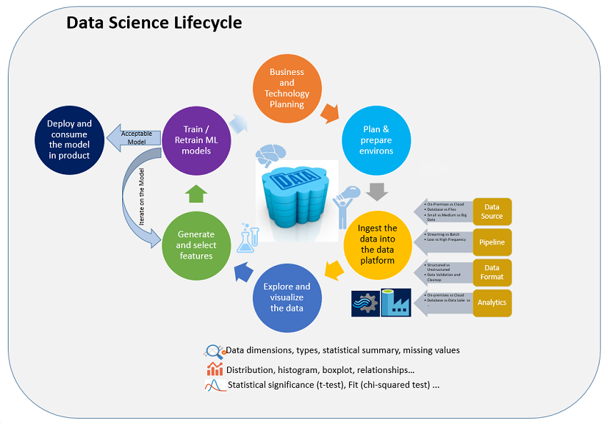

<properties
    pageTitle="Che cos'è processo scienza dei dati del Team?  | Microsoft Azure"
    description="Il processo di scienze di dati del Team è un approccio sistematico metodo per la creazione di applicazioni intelligente che utilizzano analitica avanzate."
    keywords="processo di scienze dei dati, ai team di scienze di dati"
    services="machine-learning"
    documentationCenter=""
    authors="bradsev"
    manager="jhubbard"
    editor="cgronlun" />

<tags
    ms.service="machine-learning"
    ms.workload="data-services"
    ms.tgt_pltfrm="na"
    ms.devlang="na"
    ms.topic="article"
    ms.date="09/19/2016"
    ms.author="bradsev" />

# Che cos'è il processo di scienze dati Team (TDSP)?

Team dati scienza processo (TDSP) fornisce un approccio sistematico alla creazione di applicazioni intelligente che consente ai team di scienziati dati per la collaborazione in modo efficace tramite l'intero ciclo di vita delle attività necessarie per attivare queste applicazioni nei prodotti.

In particolare, il TDSP fornisce attualmente ai team di scienze dati:

- **Metodologia**: vengono illustrate una sequenza di passaggi che definiscono il ciclo di vita di sviluppo che fornisce indicazioni su come definire il problema, analizzare i dati rilevanti, creare e valutare i modelli di Office e quindi distribuire i modelli di applicazioni aziendali.
- **Risorse**: strumenti e le tecnologie, ad esempio macchine Virtuali di scienze dati per semplificare la configurazione di ambienti per le attività di ricerca di scienze di dati e linee guida pratiche per iniziale del nuove tecnologie.

Ecco il ciclo di vita di sviluppo del processo di scienze dati Team:

Il processo è **iterativo**: le informazioni di nuovi ed esistenti o miglioramenti nel modello di evoluzione e richiede modificare passaggi precedentemente completati nella sequenza. Sviluppo dell'organizzazione esistente e project processi di pianificazione sono **facilmente adattati** per l'uso con la sequenza di passaggi definiti TDSP.

I passaggi del processo vengono diagramma e collegati nel [percorso di apprendimento TDSP](https://azure.microsoft.com/documentation/learning-paths/data-science-process/) e descritto di seguito.  

## Passaggi di pianificazione e preparazione

## P1. Business e pianificazione

Avviare un progetto analitica mediante la definizione di obiettivi problemi. Vengono specificati in termini di **esigenze aziendali**. Un obiettivo centrale di questo passaggio è identificare le variabili aziendali cruciali (previsione di vendita o la probabilità che un ordine sia fraudolenta, ad esempio) che l'analisi deve prevedere per tali requisiti. Ulteriori informazioni sulla pianificazione è quindi in genere fondamentale per comprendere le **origini dati** necessarie per risolvere gli obiettivi del progetto dal punto di vista analitica. Non è comune, ad esempio, per trovare che i sistemi esistenti serve raccogliere e registrare altri tipi di dati per risolvere il problema e raggiungere gli obiettivi del progetto. Per ulteriori informazioni, vedere [pianificare l'ambiente per il processo di scienze di dati di Team](machine-learning-data-science-plan-your-environment.md) e [gli scenari per analitica avanzate in Azure apprendimento](machine-learning-data-science-plan-sample-scenarios.md).  

## P2. Pianificazione e preparazione dell'infrastruttura

Un ambiente analitica per il processo di scienze dati Team prevede diversi componenti:

- **le aree di lavoro di dati** in cui i dati viene gestiti per l'analisi e modellazione,
- un' **infrastruttura di elaborazione** per pre-elaborazione, esplorare e modellazione dei dati
- **infrastruttura di runtime** rendono operativi modelli analitici ed eseguire il client intelligente applicazioni che utilizzano i modelli.  

L'infrastruttura di analitica che deve essere configurato spesso fa parte di un ambiente in cui è distinto dai sistemi operativi core. Ma in genere dati da più sistemi all'interno dell'azienda, oltre che da origini esterne alla società. L'infrastruttura di analitica può essere semplicemente basate su cloud, o un'installazione locale o una combinazione di due. Per le opzioni, vedere [configurare ambienti di scienze di dati per l'utilizzo del processo di scienze dei dati del Team](machine-learning-data-science-environment-setup.md).

## Procedura Analitica:  

## 1. acquisire i dati all'interno della piattaforma di dati

Il primo passaggio consiste nel visualizzare i relativi dati da origini diverse, dall'esterno all'interno o dall'organizzazione, in un ambiente analitica nel punto in cui è possono elaborare i dati. Il **formato** dei dati di origine possono essere diversi dal formato richiesto dalla destinazione. Pertanto alcune trasformazione dei dati anche necessario completare gli utensili di acquisizione. Per le opzioni, vedere [Carica dati in ambienti di spazio di archiviazione per analitica](machine-learning-data-science-ingest-data.md)

Oltre a acquisizione iniziale dei dati, molte applicazioni intelligenti sono necessari per aggiornare periodicamente i dati come parte di un processo di apprendimento in corso. Ciò è possibile installando e configurando una **pipeline di dati** o del flusso di lavoro. Questo costituisce parte della parte del processo che include la ricostruzione e ricalcolare i modelli analitici utilizzati dall'applicazione intelligente distribuire la soluzione iterativa. Ad esempio, vedere [spostare dati da un server SQL locale di SQL Azure con Azure Data Factory](machine-learning-data-science-move-sql-azure-adf.md).

## 2. consente di esplorare e visualizzare i dati

Il passaggio successivo consiste per ottenere una più approfondita dei dati esaminando le **statistiche di riepilogo**, relazioni e l'utilizzo di tecniche di tale **visualizzazione**. È inoltre in cui vengono gestiti i problemi di integrità, ad esempio valori mancanti, tipi di dati non corrispondenti e le relazioni di dati incoerenti e **la qualità dei dati** . Le trasformazioni pre-elaborazione vengono utilizzate per pulire i dati non elaborati prima ulteriormente analitica e modellazione può essere eseguito. Per una descrizione, vedere [attività per preparare i dati per computer avanzata formativo](machine-learning-data-science-prepare-data.md).

## 3. generare e selezionare caratteristiche

Scienziati dati, in collaborazione con esperti di dominio, è necessario identificare le caratteristiche che acquisire le proprietà salienti del set di dati e che può essere utilizzato meglio prevedere le variabili aziendali cruciali identificate durante la pianificazione. Nuove caratteristiche possono essere derivate dai dati esistenti o possono richiedere dati aggiuntivi da raccogliere. Questo processo noto come **Progettazione funzionalità** e corrisponde a uno dei passaggi chiave per la creazione di un sistema efficace analitica previsione. Questo passaggio richiede una combinazione di competenza dominio creativa e approfondimenti ottenuti nel passaggio di esplorazione dei dati. Per ulteriori informazioni, vedere [funzionalità di progettazione del processo di scienze dei dati del Team](machine-learning-data-science-create-features.md).

## 4. creare e organizzare la formazione dei modelli di apprendimento

Scienziati dati creare modelli analitici per prevedere le variabili chiave identificate dalle esigenze aziendali definite nella pianificazione passaggio utilizzando i dati che sono stati puliti e featurized. Sistemi di apprendimento computer supportano più **modellazione algoritmi** applicabili a un'ampia gamma di casi. Per ulteriori informazioni, vedere [come scegliere algoritmi per l'apprendimento Azure](machine-learning-algorithm-choice.md).

Scienziati dati devono scegliere il modello più appropriato per le attività di stima e non è insolito che è necessario combinare per ottenere risultati migliori risultati da più modelli. I dati di input per una modellazione in genere è diviso in modo casuale in tre parti:

- un set di dati di formazione
- un set di dati di convalida
- un set di dati di test

I modelli sono progettati utilizzando il **set di dati di formazione**. Viene selezionata la combinazione ottimale dei modelli (con i parametri ottimizzati) eseguendo i modelli e gli errori di previsione per il **set di convalida dei dati**di misurazione. Infine il **set di dati di test** viene utilizzato per valutare le prestazioni del modello scelto indipendente dati che non è stato utilizzato per formare o convalidare il modello.  Per procedure, vedere [come valutare le prestazioni di modello in Azure apprendimento](machine-learning-evaluate-model-performance.md).

## 5. distribuire e utilizzare i modelli del prodotto

Una volta ottenuto un insieme di modelli che funzionino correttamente, possono essere **operationalized** per le altre applicazioni di utilizzare. A seconda delle esigenze, le stime vengono eseguite in **tempo reale** o in base al **batch** . Per operationalized, è necessario essere esposti con un **aprire l'interfaccia API** che facilmente utilizzati da diverse applicazioni i modelli di tale sito Web online, fogli di calcolo, dashboard o azienda e back-end applicazioni line-of. Vedere [distribuire un servizio web apprendimento Azure](machine-learning-publish-a-machine-learning-web-service.md).

## Riepilogo e passaggi successivi

Il [Processo di scienze dei dati del Team](https://azure.microsoft.com/documentation/learning-paths/data-science-process/) si basa come una sequenza di passaggi di scorrimento che **fornisce indicazioni** per le attività necessarie per l'utilizzo analitica avanzate per creare un'applicazione intelligente. Ogni passaggio vengono forniti anche i dettagli su come utilizzare diverse tecnologie Microsoft per completare le attività descritte.

TDSP non fissano tipi specifici di elementi **documentazione** , ma è consigliabile per i risultati dell'esplorazione dei dati, modellazione e la valutazione del documento e salvare il codice pertinente in modo che l'analisi è possibile scorrere quando richiesto. In questo modo anche riutilizzo del lavoro analitica quando si lavora su altre applicazioni che includono dati simili e attività di stima.

Vengono inoltre fornite procedure dettagliate full-to-end che descrivono tutti i passaggi del processo per **scenari specifici** . Sono elencati descrizioni di anteprima nell'argomento con [procedure dettagliate processo scienza dei dati del Team](data-science-process-walkthroughs.md) .
