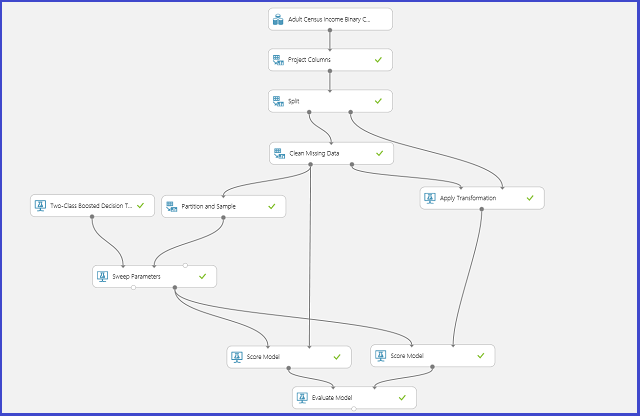

<properties
    pageTitle="Scegliere i parametri per ottimizzare gli algoritmi di apprendimento Azure | Microsoft Azure"
    description="Questo articolo viene illustrato come scegliere il parametro ottimale impostato per un algoritmo di apprendimento Azure."
    services="machine-learning"
    documentationCenter=""
    authors="bradsev"
    manager="jhubbard"
    editor="cgronlun"/>

<tags
    ms.service="machine-learning"
    ms.workload="data-services"
    ms.tgt_pltfrm="na"
    ms.devlang="na"
    ms.topic="article"
    ms.date="09/12/2016"
    ms.author="bradsev" />

# Scegliere i parametri per ottimizzare gli algoritmi di apprendimento Azure

In questo argomento viene descritto come scegliere hyperparameter destra impostato per un algoritmo di apprendimento Azure. La maggior parte degli algoritmi di apprendimento automatica sono parametri da impostare. Quando si formazione un modello, è necessario fornire valori per i parametri. I parametri di modello che si sceglie dipende dall'efficacia del modello di formazione. Il processo di individuazione il set di parametri ottimale è noto come *selezione del modello*.

[AZURE.INCLUDE [machine-learning-free-trial](../../includes/machine-learning-free-trial.md)]

Sono disponibili diversi metodi per la selezione del modello. In apprendimento, la convalida è uno dei metodi più diffusi per la selezione del modello ed è il meccanismo di selezione modello predefinito per imparare automatica di Azure. Poiché l'apprendimento Azure supporta sia R Python, è possibile implementare i propri meccanismi di selezione modello sempre utilizzando R o Python.

Sono disponibili quattro passaggi per individuare l'impostazione del parametro indicata:

1.  **Definire lo spazio di parametro**: per l'algoritmo, stabilire innanzitutto i valori dei parametri esatta che si desidera considerare.
2.  **Le impostazioni di definire la convalida tra**: decidere come scegliere tra convalida biglietto per il set di dati.
3.  **Definire la metrica**: decidere quali metrica da utilizzare per determinare il set di parametri, ad esempio accuratezza migliore, Media radice quadrato errore, precisione, richiamo o punteggio f.
4.  **Treno, valutare e il confronto**: per ogni combinazione univoca di valori dei parametri, la convalida tra eseguita dal, basata sulla metrica errore definite. Dopo la valutazione e confronto, è possibile scegliere il modello di prestazioni migliori.

Di seguito sono illustrate viene illustrato come si può essere ottenuta in Azure l'apprendimento.

## Definire lo spazio parametro
È possibile definire il parametro impostato al passaggio del modello di inizializzazione. Il riquadro parametri di tutti gli algoritmi di apprendimento automatica prevede due modalità trainer: *L'unico parametro* e *Parametro intervallo*. Scegliere la modalità parametro intervallo. In modalità intervallo parametro, è possibile immettere più valori per ogni parametro. È possibile immettere valori separati da virgola nella casella di testo.

 In alternativa, è possibile definire i punti minimi e massimo della griglia e il numero totale di punti con **Usa il generatore di intervallo**da generare. Per impostazione predefinita, i valori dei parametri vengono generati in una scala lineare. Ma se viene controllato **Scala logaritmica** , i valori vengono generati in scala logaritmica (vale a dire il rapporto tra i punti adiacenti è costante anziché la relativa differenza). Per i parametri di numero intero, è possibile definire un intervallo con un trattino. Ad esempio "1-10" indica che tutti i numeri interi compresi tra 1 e 10 (inclusi) formano il set di parametri. È inoltre supportata la modalità mista. Ad esempio, imposta il parametro "1-10, 20, 50" potrebbe includere numeri interi 1 a 10, 20 e 50.

## Definire la convalida biglietto
L' [esempio e partizione] [ partition-and-sample] modulo può essere utilizzato per assegnare in modo casuale biglietto ai dati. Nel seguente esempio di configurazione per il modulo è definire cinque biglietto e assegnare in modo casuale un numero in formato libro alle istanze di esempio.

## Definire la metrica
[Ottimizzare Hyperparameters modello] [ tune-model-hyperparameters] modulo fornisce supporto per la scelta in modo empirico il migliore set di parametri di un algoritmo specifico e un set di dati. Oltre a altre informazioni relative alle training del modello, il riquadro delle **proprietà** del modulo include la metrica per determinare il set di parametri indicato. Dispone di due caselle di elenco a discesa diversi per gli algoritmi di classificazione e regressione, rispettivamente. Se l'algoritmo in esame è un algoritmo di classificazione, la metrica di regressione viene ignorata e viceversa. In questo esempio specifico, la metrica è **accuratezza**.   

## Formazione, valutare e confrontare  
La stessa [Ottimizzare Hyperparameters modello] [ tune-model-hyperparameters] modulo training tutti i modelli corrispondenti per il set di parametri, restituisce metriche varie e quindi viene creato il più adeguatamente formato modello basato sulla metrica si sceglie. In questo modulo ha due input obbligatori:

* Apprendimento training
* Il set di dati

Il modulo ha inoltre un set di dati facoltativi di input. Connettere il set di dati in formato libro informazioni utili per l'input di set di dati obbligatori. Se il set di dati non è assegnata alcuna informazione fold, una convalida tra 10-fold viene eseguita automaticamente per impostazione predefinita. Se non viene applicata alcuna assegnazione piega orizzontale e viene fornito un set di dati di convalida sulla porta facoltativo set di dati, una modalità di test treno sia selezionata e viene utilizzato il primo set di dati per formare il modello per ogni combinazione di parametro.

Il modello viene quindi valutato nel set di convalida dei dati. La porta di output sinistro del modulo risulta metriche diverse funzioni di valori di parametro. La porta di output destro offre il modello adeguatamente formato corrispondente al modello di prestazioni migliori in base alla metrica scelto (**accuratezza** in questo caso).  

È possibile visualizzare i parametri esatti scelti per visualizzare la porta di output destro. In questo modello può essere utilizzato in un set di test di punteggio o in un servizio web operationalized dopo il salvataggio come modello di formazione.

<!-- Module References -->
[partition-and-sample]: https://msdn.microsoft.com/library/azure/a8726e34-1b3e-4515-b59a-3e4a475654b8/
[tune-model-hyperparameters]: https://msdn.microsoft.com/library/azure/038d91b6-c2f2-42a1-9215-1f2c20ed1b40/
