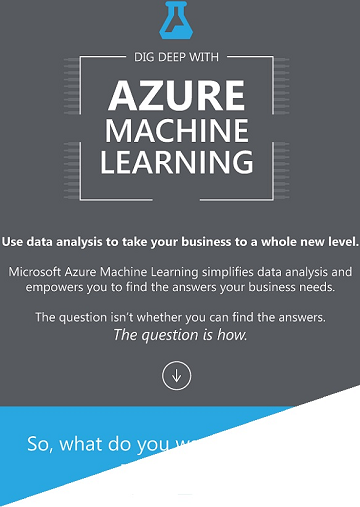

<properties
    pageTitle="Infographic: Lavorare risorse introduzione - esempi di algoritmi | Microsoft Azure"
    description="Una panoramica di facile comprensione delle nozioni fondamentali di apprendimento computer include esempi di algoritmi. Infographic scaricabile è descritta la maggior parte dei computer domande di apprendimento."
    keywords="Nozioni fondamentali sul computer risorse, esempi di algoritmi lavorare formazione per principianti, domande di apprendimento machine, algoritmi popolari, algoritmo infographic"
    services="machine-learning"
    documentationCenter=""
    authors="garyericson"
    manager="jhubbard"
    editor="cgronlun"/>

<tags
    ms.service="machine-learning"
    ms.workload="data-services"
    ms.tgt_pltfrm="na"
    ms.devlang="na"
    ms.topic="article"
    ms.date="08/19/2016"
    ms.author="garye" />

# Scaricabili Infographic: Apprendimento automatico nozioni di base con esempi di algoritmi

Scaricare questo Panoramica infographic facile comprensione delle nozioni fondamentali sul risorse computer. Informazioni sulle impostazioni generali algoritmi utilizzati per rispondere a domande di apprendimento comune. Esempi di algoritmi identifichi principianti di apprendimento computer quali algoritmi da utilizzare e vengono utilizzati per.

## Impostazioni generali algoritmi Machine Learning Studio

[Azure Machine Learning Studio](https://studio.azureml.net/) viene fornito con una raccolta di grandi dimensioni degli algoritmi per previsione analitica. Il infographic di seguito vengono illustrate popolari famiglie di algoritmi: **regressione**, **rilevamento di anomalie**, **cluster**e **classificazione**.

[Raccolta di Business Intelligence Cortana](https://gallery.cortanaintelligence.com/) Mostra come questi algoritmi possono essere applicati in molte soluzioni reali. Seguire i collegamenti nel infographic per visualizzare esempi di lavoro.

## Scaricare infographic con esempi di algoritmi

**[Download: Infographic di avanzate risorse computer con collegamenti a esempi di algoritmi (PDF)](http://download.microsoft.com/download/0/5/A/05AE6B94-E688-403E-90A5-6035DBE9EEC5/machine-learning-basics-infographic-with-algorithm-examples.pdf)**

## Altro aiuto con algoritmi per principianti e utenti avanzati

* Per informazioni più approfondite dei diversi tipi di algoritmi risorse computer, modalità di utilizzo e su come scegliere destra uno per la soluzione, vedere [come scegliere algoritmi per l'apprendimento di Microsoft Azure computer](machine-learning-algorithm-choice.md).
* Per un elenco in base alla categoria degli tutti machine learning algoritmi disponibili in computer formazione Studio, vedere [Modello inizializzare] [ initialize-model] in computer formazione Studio algoritmo e la Guida di modulo.
* Per un elenco completo degli algoritmi e moduli di Studio risorse computer, vedere [elenco di alla Z dei moduli Machine Learning Studio] [ a-z-list] in computer algoritmo di Studio e permettono di modulo.
* Per scaricare e stampare un diagramma che fornisce una panoramica delle funzionalità di Studio risorse computer, vedere [il diagramma di panoramica delle funzionalità di Azure Machine Learning Studio](machine-learning-studio-overview-diagram.md).

[AZURE.INCLUDE [machine-learning-free-trial](../../includes/machine-learning-free-trial.md)]

<!-- Module References -->
[a-z-list]: https://msdn.microsoft.com/library/azure/dn906033.aspx
[initialize-model]: https://msdn.microsoft.com/library/azure/0c67013c-bfbc-428b-87f3-f552d8dd41f6/
[k-means-clustering]: https://msdn.microsoft.com/library/azure/5049a09b-bd90-4c4e-9b46-7c87e3a36810/
[one-vs-all-multiclass]: https://msdn.microsoft.com/library/azure/7191efae-b4b1-4d03-a6f8-7205f87be664/
