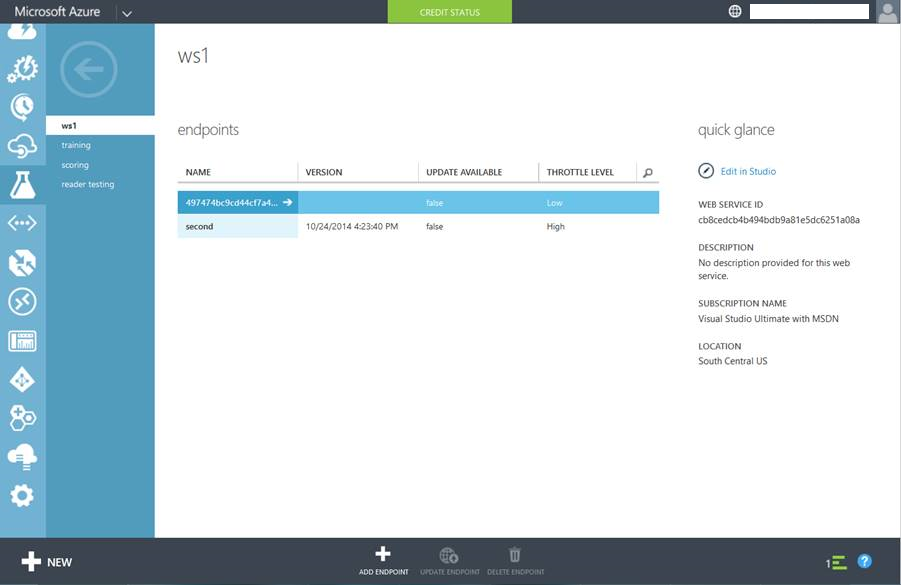

<properties
    pageTitle="Creazione di endpoint del servizio Web in apprendimento | Microsoft Azure"
    description="Creazione di endpoint del servizio Web in apprendimento Azure"
    services="machine-learning"
    documentationCenter=""
    authors="hiteshmadan"
    manager="padou"
    editor="cgronlun"/>

<tags
    ms.service="machine-learning"
    ms.devlang="multiple"
    ms.topic="article"
    ms.tgt_pltfrm="na"
    ms.workload="tbd"
    ms.date="10/04/2016"
    ms.author="himad"/>

# Creazione di endpoint

>[AZURE.NOTE] In questo argomento vengono descritte le tecniche applicabili a un servizio Web classico.

Quando si creano servizi Web venduti inoltra ai clienti, è necessario fornire i modelli di esperti a ogni cliente ancora collegati a prova da cui è stato creato il servizio Web. Inoltre, tutti gli aggiornamenti di prova devono essere applicati in modo selettivo a un endpoint senza sovrascrivere le personalizzazioni.

A tale scopo, apprendimento Azure consente di creare più endpoint per un servizio Web distribuito. Ogni endpoint del servizio Web in modo indipendente viene indirizzato, limitato e gestito. Ogni endpoint è un URL univoco e una chiave di autorizzazione che è possibile distribuire ai clienti.

[AZURE.INCLUDE [machine-learning-free-trial](../../includes/machine-learning-free-trial.md)]

## Aggiunta di endpoint a un servizio Web

Esistono tre modi per aggiungere un endpoint a un servizio Web.

* Livello di programmazione
* Tramite il portale di servizi Web di Windows Azure Machine Learning
* Se il portale classico Azure

Dopo aver creato il punto finale, è possibile utilizzare tramite l'icona del API, batch API e fogli di lavoro di excel. Oltre ad aggiungere endpoint tramite questa interfaccia, è possibile utilizzare anche API di gestione di Endpoint per aggiungere i punti finali.

 >[AZURE.NOTE] Se sono stati aggiunti altri endpoint del servizio Web, è possibile eliminare l'endpoint predefinito.

## Aggiunta di un estremo a livello di programmazione

È possibile aggiungere un endpoint del servizio Web a livello di programmazione tramite il codice di esempio [AddEndpoint](https://github.com/raymondlaghaeian/AML_EndpointMgmt/blob/master/Program.cs) .

## Aggiunta di un estremo tramite il portale di servizi Web di Windows Azure Machine Learning

1. Nel computer risorse Studio, una colonna di spostamento sinistra, fare clic su servizi Web.
2. Nella parte inferiore del dashboard di servizio Web, fare clic su **Gestisci i punti finali**. Portale di servizi Web di Windows Azure Machine Learning viene visualizzata la pagina endpoint del servizio Web.
3. Fare clic su **Nuovo**.
4. Digitare un nome e una descrizione per il nuovo punto. I nomi degli endpoint deve essere 24 carattere o meno la lunghezza e deve essere composto da caratteri alfabetici minuscoli o numeri. Selezionare il livello di registrazione e attivazione di dati di esempio. Per ulteriori informazioni sulla registrazione, vedere [attivare la registrazione per i servizi Web di Microsoft Learning computer](machine-learning-web-services-logging.md).

## Aggiunta di un estremo classica nel portale di Azure

1. Accedere al [portale classica Azure](http://manage.windowsazure.com)fare clic su **Apprendimento** nella colonna a sinistra. Fare clic su area di lavoro che contiene il servizio Web in cui è interessati.

    

2. Fare clic su **servizi Web**.

    

3. Fare clic su servizio Web che si è interessati a per visualizzare l'elenco dei parametri disponibili.

    

4. Nella parte inferiore della pagina, fare clic su **Aggiungi Endpoint**. Digitare un nome e una descrizione, assicurarsi che non sono presenti altri endpoint con lo stesso nome in questo servizio Web. Lasciare il livello di limitazione con il rispettivo valore predefinito a meno che non si hanno esigenze particolari. Per ulteriori informazioni sulla limitazione, vedere [I punti finali API proporzioni dei caratteri](machine-learning-scaling-webservice.md).

    

## Passaggi successivi

Informazioni su [come utilizzare un servizio Web di Microsoft Azure Machine Learning pubblicato](machine-learning-consume-web-services.md).
