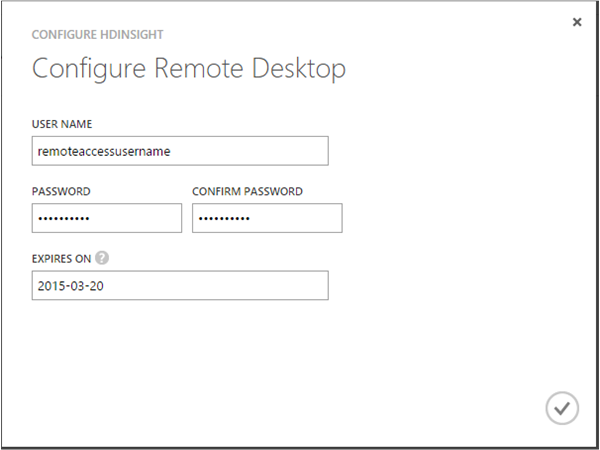

<properties 
    pageTitle="Personalizzare i cluster Hadoop per il processo di scienze dati Team | Microsoft Azure" 
    description="Moduli Python popolari resi disponibili nei cluster di Azure HDInsight Hadoop personalizzato."
    services="machine-learning" 
    documentationCenter="" 
    authors="bradsev" 
    manager="jhubbard" 
    editor="cgronlun"  />

<tags 
    ms.service="machine-learning" 
    ms.workload="data-services" 
    ms.tgt_pltfrm="na" 
    ms.devlang="na" 
    ms.topic="article" 
    ms.date="09/19/2016" 
    ms.author="hangzh;bradsev" />

# Personalizzare i cluster Azure HDInsight Hadoop per il processo di scienze di dati del Team 

In questo articolo viene descritto come personalizzare un cluster di HDInsight Hadoop installando Anaconda 64 bit (Python 2.7) in ogni nodo quando viene eseguito il provisioning cluster come servizio HDInsight. Viene illustrato come accedere a headnode per inviare i processi personalizzati al cluster. Questa personalizzazione rende molti moduli Python popolari inclusi in Anaconda comodamente disponibile per l'utilizzo di funzioni definite dall'utente (funzioni definite dall'utente) sono progettati per elaborare i record Hive del cluster. Per ulteriori informazioni sulle procedure utilizzate in questo scenario, vedere [come inviare query Hive](machine-learning-data-science-move-hive-tables.md#submit).

Menu collegamenti ad argomenti che descrivono come configurare i diversi ambienti di scienze di dati utilizzati dal [Team dati scienza processo (TDSP)](data-science-process-overview.md)seguenti.

[AZURE.INCLUDE [data-science-environment-setup](../../includes/cap-setup-environments.md)]

## Personalizzare Cluster Hadoop Azure HDInsight

Per creare un cluster di HDInsight Hadoop personalizzato, gli utenti devono accedere al [**Portale classica di Azure**](https://manage.windowsazure.com/), fare clic su **Nuovo** nell'angolo inferiore sinistro e quindi selezionare DATA SERVICES -> HDINSIGHT -> **Crea personalizzato** per visualizzare la finestra **Dettagli Cluster** . 

Immettere il nome del cluster da creare nella pagina configurazione 1 e accettare i valori predefiniti per gli altri campi. Fare clic sulla freccia per passare alla pagina di configurazione successiva. 

Nella pagina configurazione 2, il numero dei **Nodi di dati**di input, selezionare la **Rete regione/virtuale**e selezionare le dimensioni del **Nodo di intestazione** e il **Nodo dati**. Fare clic sulla freccia per passare alla pagina di configurazione successiva.

>[AZURE.NOTE] **Regione/virtuale rete** deve corrispondere all'area geografica dell'account di archiviazione che verrà utilizzato per il cluster HDInsight Hadoop. In caso contrario, in quarta pagina di configurazione, l'account di archiviazione che gli utenti desiderano utilizzare non verrà visualizzati nell'elenco a discesa **Nome**dell'ACCOUNT.

Nella pagina Configurazione 3, specificare un nome utente e password per il cluster HDInsight Hadoop. **Non** selezionare _INVIO Metastore Hive/Oozie_. Quindi fare clic sulla freccia per passare alla pagina di configurazione successiva. 

Nella pagina configurazione 4, specificare il nome dell'account di archiviazione, il contenitore predefinito del cluster HDInsight Hadoop. Se gli utenti selezionano _creare il contenitore predefinito_ nell'elenco a discesa **Contenitore predefinito** , verrà creato un contenitore con lo stesso nome del cluster. Fare clic sulla freccia per passare all'ultima pagina di configurazione.

Nella pagina di configurazione di **Azioni di Script** finale, fare clic sul pulsante **Aggiungi azione script** e compilare i campi di testo con i valori seguenti.
 
* **Nome** - qualsiasi stringa corrispondente al nome di questa azione di script. 
* **Tipo di nodo** - selezionare **tutti i nodi**. 
* **URI SCRIPT** - *http://getgoing.blob.core.windows.net/publicscripts/Azure_HDI_Setup_Windows.ps1* 
    * *publicscripts* è un contenitore pubblico nell'account di archiviazione 
    * *getgoing* che viene utilizzata per condividere i file di script di PowerShell per semplificare l'istruzione utenti in Azure. 
* **Parametri** - (lasciare vuoto)

Infine, fare clic sul segno di spunta per avviare la creazione del cluster HDInsight Hadoop personalizzate. 

## Accedere al nodo testa del Cluster Hadoop

Gli utenti devono selezionare accesso remoto al cluster Hadoop in Azure prima di poter accedere il nodo principale del cluster Hadoop tramite RDP. 

1. Accedere al [**Portale classica di Azure**](https://manage.windowsazure.com/), selezionare **HDInsight** sul lato sinistro, selezionare il cluster Hadoop dall'elenco di cluster, fare clic sulla scheda **configurazione** e quindi fare clic sull'icona **ABILITA remoto** nella parte inferiore della pagina.
    
    

2. Nella finestra di **Configurazione Desktop remoto** , immettere i campi nome utente e PASSWORD e selezionare la data di scadenza per l'accesso remoto. Selezionare il segno di spunta per abilitare l'accesso remoto per il nodo principale del cluster Hadoop.

    
    
>[AZURE.NOTE] Il nome utente e password per l'accesso remoto non sono il nome utente e la password che si utilizza quando è stato creato il cluster Hadoop. Si tratta di un altro insieme di credenziali. Inoltre, la data di scadenza di accesso remoto deve essere entro 7 giorni dalla data corrente.

Dopo aver abilitato l'accesso remoto, fare clic su **CONNETTI** nella parte inferiore della pagina per remote in nodo principale. Si accede a nodo principale del cluster Hadoop immettendo le credenziali per l'utente di accesso remoto che specificato in precedenza.

Passaggi successivi del processo analitica avanzate sono mappati in [Team dati scienza processo (TDSP)](https://azure.microsoft.com/documentation/learning-paths/cortana-analytics-process/) e possono includere procedure dettagliate che spostare i dati nel HDInsight, elaborano e in tale posizione di esempio in preparazione per l'apprendimento dai dati di apprendimento di Azure computer.

Per istruzioni su come accedere ai moduli Python inclusi in Anaconda dal nodo principale del cluster nelle funzioni definite dall'utente (funzioni definite dall'utente) utilizzato per elaborare record Hive memorizzati nel cluster, vedere [come inviare query Hive](machine-learning-data-science-move-hive-tables.md#submit) .

 
