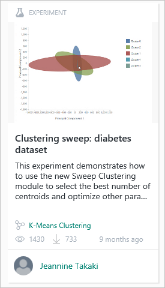
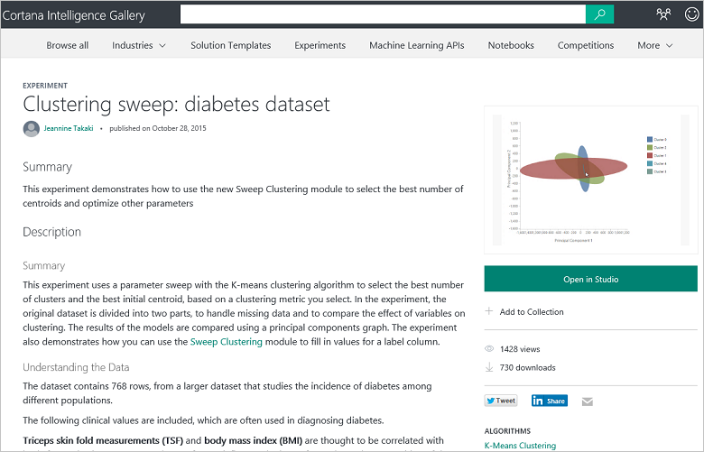
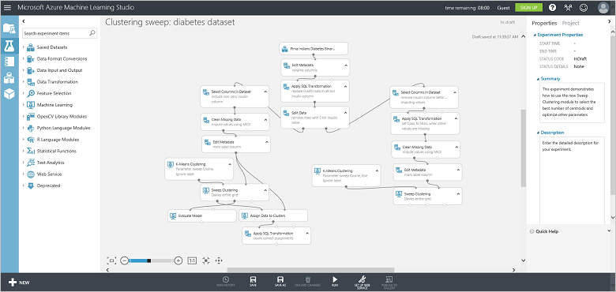

<properties
   pageTitle="Copiare altrui dati scienza lavoro - esempio learning computer | Microsoft Azure"
   description="Segreto commerciale di scienze dati: accedere ad altri utenti di svolgere il proprio lavoro dell'utente. Vedere gli esempi nella raccolta Analitica Cortana, ad esempio un esempio di algoritmo di cluster."
   keywords="esempi di scienze dati, machine learning esempio cluster algoritmo cluster esempio algoritmo"
   services="machine-learning"
   documentationCenter="na"
   authors="cjgronlund"
   manager="jhubbard"
   editor="cjgronlund"/>

<tags
   ms.service="machine-learning"
   ms.devlang="na"
   ms.topic="article"
   ms.tgt_pltfrm="na"
   ms.workload="na"
   ms.date="10/20/2016"
   ms.author="cgronlun;garye"/>

# Copia di lavoro per eseguire una ricerca di scienze di dati di altre persone

## Video 5: Ricerca di scienze dati per serie principianti

Uno dei segreto commerciale di scienze dati riceveranno altre persone per svolgere il proprio lavoro dell'utente. Trovare un esempio di algoritmo cluster da utilizzare per il proprio computer prova di apprendimento.

Per ottenere il massimo dalla serie, guardarli tutti. [Passare all'elenco di video](#other-videos-in-this-series)

> [AZURE.VIDEO data-science-for-beginners-series-copy-other-peoples-work-to-do-data-science]

## Altri video in questa serie

*Ricerca di scienze di dati per principianti* è una breve introduzione a scienza dati cinque brevi video.

  * Video 1: [Le risposte di scienze dati 5 domande](machine-learning-data-science-for-beginners-the-5-questions-data-science-answers.md) *(5 minuti 14 secondi)*
  * Video 2: [è pronto per scienza dati i dati?](machine-learning-data-science-for-beginners-is-your-data-ready-for-data-science.md) *(4 min 56 sec)*
  * Video 3: [Porre una domanda è possibile rispondere con dati](machine-learning-data-science-for-beginners-ask-a-question-you-can-answer-with-data.md) *(4 min 17 sec)*
  * [Prevedere una risposta con un modello semplice](machine-learning-data-science-for-beginners-predict-an-answer-with-a-simple-model.md) video 4: *(7 min 42 sec)*
  * Video 5: Copia di lavoro di altre persone a scopo di scienze di dati

## Trascrizione: Copia di lavoro di altre persone a scopo di scienze di dati

Introduzione a video quinto della serie "Dati scienza per principianti".

In questa occorrenza, si scopriranno una posizione in cui esempi di ricerca che è possibile chiedere ai come punto di partenza per il proprio lavoro. È possibile ottenere il massimo vantaggio questo video se è prima di tutto guardare i video precedenti in questa serie.

Uno dei segreto commerciale di scienze dati riceveranno altre persone per svolgere il proprio lavoro dell'utente.

## Trovare gli esempi nella raccolta di Business Intelligence Cortana

Microsoft dispone di un servizio basato su cloud denominato [Apprendimento Azure]( https://azure.microsoft.com/services/machine-learning/) che si è di prova gratuitamente. Consente in un'area di lavoro in cui è possibile sperimentare le diverse apprendimento algoritmi e, quando hai soluzione stabilita, è possibile avviare come servizio web.

Parte del servizio è che un elemento denominato **[Cortana Intelligence raccolta](http://aka.ms/CortanaIntelligenceGallery)**. La presentazione contiene una serie di risorse, uno dei quali è una raccolta di apprendimento Azure esperimenti o modelli che persone creato e reso disponibile per gli altri utenti. Questi esperimenti sono un ottimo modo per sfruttare il pensiero e impegno degli altri utenti per la creazione di soluzioni personalizzate.

È possibile trovare nella raccolta in [aka.ms/CortanaIntelligenceGallery]( http://aka.ms/CortanaIntelligenceGallery). Tutti gli utenti sono invitati a sfogliare il.

Se si fa clic su **esperimenti** nella parte superiore, verrà visualizzato un numero di esperimenti più recenti e popolari nella raccolta. È possibile cercare attraverso il resto di esperimenti facendo clic su **Esplora tutto** nella parte superiore dello schermo e vi è possibile immettere termini di ricerca e scegliere filtri di ricerca.

## Trovare e usare un esempio di algoritmo cluster

Pertanto, ad esempio, si supponga che si desideri visualizzare un esempio del funzionamento del cluster, in modo che la ricerca di **"cluster"** esperimenti.

Ecco interessante che qualcuno ha contribuito alla raccolta.

Fare clic su tale prova e viene visualizzata una pagina web che descriva il lavoro che ha questo collaboratore, insieme ad alcuni dei risultati.

Prendere nota del collegamento che viene **aperto in Studio**.

È possibile fare clic su tale e me richiede da destra a **Azure Machine Learning Studio**. Crea una copia di prova e lo inserisce nella propria area di lavoro. Sono inclusi set di dati del collaboratore, tutte le operazioni che avevano, tutti gli algoritmi utilizzati e come vengono salvati i risultati.

E ora si dispone di un punto di partenza. È possibile sostituire i dati per il proprio ed eseguire il proprio ottimizzazione del modello. In questo modo me iniziali e consente di utilizzare il lavoro degli utenti che conoscono veramente che sta eseguendo.

## Trovare esperimenti in cui vengono illustrate le tecniche di risorse di computer

Sono disponibili altri esperimenti nella [Raccolta di Business Intelligence Cortana](http://aka.ms/CortanaIntelligenceGallery) fornite specificamente per fornire esempi procedure per le persone nuovo alla ricerca di scienze di dati. Ad esempio, non c'è una prova nella raccolta in cui viene illustrato come gestire i valori mancanti ([metodi per la gestione di valori mancanti](https://gallery.cortanaintelligence.com/Experiment/Methods-for-handling-missing-values-1)). Viene descritto come 15 diversi modi di sostituzione di valori vuoti e parla sui vantaggi offerti da ogni metodo e quando usarlo.

[Cortana Intelligence raccolta](http://aka.ms/CortanaIntelligenceGallery) è possibile trovare esperimenti di lavoro che è possibile usare come punto di partenza per soluzioni personalizzate.

Assicurarsi di guardare i video "Dati scienza per principianti" da Microsoft Azure apprendimento.

## Passaggi successivi

  * [Provare il primo dati scienza sperimentare apprendimento Azure](machine-learning-create-experiment.md)
  * [Per un'introduzione alle apprendimento in Microsoft Azure](machine-learning-what-is-machine-learning.md)
