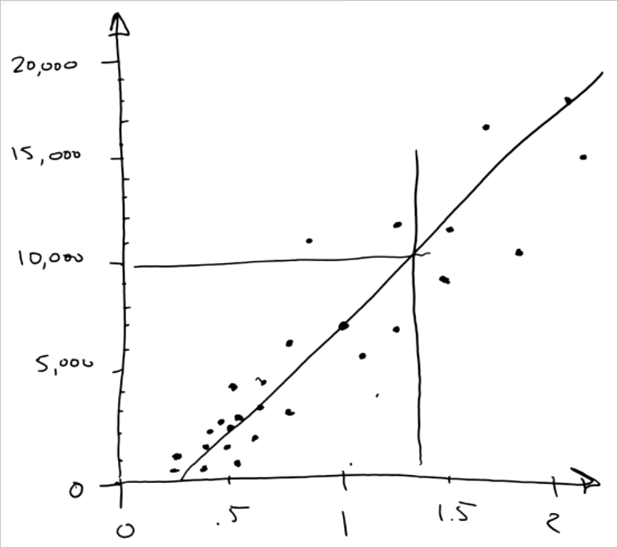

<properties
   pageTitle="Prevedere una risposta con un semplice modello - modello di regressione | Microsoft Azure"
   description="Come creare un modello di regressione semplice per prevedere un prezzo di scienze di dati per principianti 4 video. Include una regressione lineare con dati di destinazione."                                  
   keywords="creare un modello semplice modello, stima prezzo, modello di regressione semplice"
   services="machine-learning"
   documentationCenter="na"
   authors="cjgronlund"
   manager="jhubbard"
   editor="cjgronlund"/>

<tags
   ms.service="machine-learning"
   ms.devlang="na"
   ms.topic="article"
   ms.tgt_pltfrm="na"
   ms.workload="na"
   ms.date="10/20/2016"
   ms.author="cgronlun;garye"/>

# Prevedere una risposta con un modello semplice

## Video 4: Ricerca di scienze dati per serie principianti

Informazioni su come creare un modello di regressione semplice per prevedere il prezzo di un rombo nella scienza dati per principianti 4 video. È possibile disegnare un modello di regressione con dati di destinazione.

Per ottenere il massimo dalla serie, guardarli tutti. [Passare all'elenco di video](#other-videos-in-this-series)

> [AZURE.VIDEO data-science-for-beginners-series-predict-an-answer-with-a-simple-model]

## Altri video in questa serie

*Ricerca di scienze di dati per principianti* è una breve introduzione a scienza dati cinque brevi video.

  * Video 1: [Le risposte di scienze dati 5 domande](machine-learning-data-science-for-beginners-the-5-questions-data-science-answers.md) *(5 minuti 14 secondi)*
  * Video 2: [è pronto per scienza dati i dati?](machine-learning-data-science-for-beginners-is-your-data-ready-for-data-science.md) *(4 min 56 sec)*
  * Video 3: [Porre una domanda è possibile rispondere con dati](machine-learning-data-science-for-beginners-ask-a-question-you-can-answer-with-data.md) *(4 min 17 sec)*
  * Video 4: Prevedere una risposta con un modello semplice
  * Video 5: [Copia di lavoro di altre persone a scopo di scienze di dati](machine-learning-data-science-for-beginners-copy-other-peoples-work-to-do-data-science.md) *(3 min 18 sec)*

## Trascrizione: Prevedere una risposta con un modello semplice

Introduzione a video quarto tramite la "dati scienza per principianti" serie. In questa occorrenza abbiamo verrà creazione di un modello semplice e la stima.

Un *modello* è un brano semplificato sui dati. Verrà illustrato cosa intende.

## Raccogliere i contenuti pertinenti, preciso connesso, quantità di dati

Supponiamo di che voler reparto per un rombo. Ho un anello appartenenti alla nonna con un'impostazione per rombo accento circonflesso 1,35 e vuole avere un'idea di come costi. Tengano un blocco note e penna in archivio gioielli e annotare il prezzo di tutti i rombi le maiuscole/minuscole e quantità sono valutare in carato. A partire dal primo rombo - è 1.01 carato e $7,366.

Ora verranno illustrate e ripetere l'operazione per tutti i rombi l'archivio.

Si noti che il nostro elenco include due colonne. Ogni colonna ha un attributo diverso - peso carato e prezzo - e ogni riga è un unico punto dati che rappresenta un rombo singolo.

Abbiamo creato effettivamente un piccolo insieme di dati, una tabella. Si noti che soddisfi i criteri ai fini della qualità:

* I dati **rilevanti** - peso è sicuramente correlata al prezzo
* Sia **corretto** - abbiamo ricontrollato i prezzi scritto verso il basso
* È **connesso** - non sono presenti spazi vuoti in una di queste colonne
* Come si vedrà, è **sufficiente** dati a cui rispondere alla domanda

## Inserire una domanda nitida

A questo punto è necessario comportare alla domanda in modo nitida: "come sarà il costo per acquistare un rombo accento circonflesso 1,35?"

L'elenco non è disponibile un rombo accento circonflesso 1,35 al suo interno, in modo che è necessario utilizzare il resto dei dati per ottenere una risposta alla domanda.

## Tracciare i dati esistenti

La prima cosa verrà è disegnare una linea orizzontale numero, chiamata un asse, per tracciare il peso. L'intervallo degli spessori è 0 e 2, pertanto è necessario disegnare una linea che copra intervallo e inserire segni di graduazione per ogni marcatore metà.

Abbiamo successivo verrà disegnare un asse verticale per registrare il prezzo e connetterlo sull'asse orizzontale peso. Questo sarà in unità di euro. Ora è disponibile un set di assi delle coordinate.

Verranno eseguire questi dati ora e trasformarlo in una *traccia a dispersione*. Questa è un'ottima soluzione per visualizzare i set di dati numerico.

Per il primo punto dati, è individuare una linea verticale in carato 1.01. Quindi abbiamo individuare una linea orizzontale in $7,366. Se si incontrano è Disegna un punto. Rappresenta il primo rombo.

Ora è elaborata ogni rombo dell'elenco e la stessa operazione. Quando si sta utilizzando, si tratta si ottiene: una serie di punti, uno per ogni rombo.

## Creare il modello attraverso le coordinate

A questo punto se osserva punti e squint, la raccolta è simile a una linea fat sfocata. È possibile eseguire il marcatore e disegnare una linea retta attraversata.

Disegnando una linea, è stato creato un *modello*. Pensare come eseguendo reali e creazione di una versione di fumetto semplice. A questo punto il fumetto è il problema: la riga non attraversano tutti i punti dati. Ma, una semplificazione utile.

Il fatto che tutti i punti non attraversano esattamente la riga è OK. Scienziati dati spiegano, che indica che è il modello - che rappresenta la riga - e quindi ogni punto alcune *rumore* o *varianza* è associato. Esiste al mondo avanzato, reale che aggiunge rumore e incertezza è presente la relazione perfetta sottostante.

Poiché si sta tentando di rispondere alla domanda *quantità?* questo comando si chiama una *regressione*. E si utilizza una linea retta, pertanto è una *regressione lineare*.

## Utilizzare il modello per trovare le risposte

Ora si dispone di un modello e si chiedere alla domanda: quale sarà rombo accento circonflesso 1,35 costo?

Per rispondere alla domanda, abbiamo individuare carato 1,35 e disegnare una linea verticale. Intersezione di riga del modello è individuare una linea orizzontale per l'asse valuta. Arriva sempre a portata 10.000. Esplosione! La risposta: rombo accento circonflesso 1,35 costi circa $10.000.

## Creare un intervallo di confidenza

È naturale chiedersi come precisi questa funzionalità di completamento è. È utile sapere se il rombo accento circonflesso 1,35 sarà molto vicino $10.000, o molto superiori o inferiori. Per capire, disegnare una busta attorno alla linea di regressione che include la maggior parte dei punti. Questa busta è l' *intervallo di confidenza*: siamo abbastanza certi che i prezzi sono compresi in questa busta, in quanto al meglio passato presenti. È possibile disegnare la linea due righe più orizzontale da intersezione di riga accento circonflesso 1,35 nella parte superiore e inferiore di tale busta.

A questo punto possiamo dire qualcosa l'intervallo di confidenza: suggerisce possiamo che il prezzo di un rombo accento circonflesso 1,35 circa $10.000 - ma potrebbe essere arrivare fino a $8.000 e potrebbe essere più alto $12.000.

## Termine senza matematiche o computer

Abbiamo quali scienziati dati ottenere pagati per eseguire e abbiamo appena disegnando:

* Abbiamo chiesto una domanda che è possibile rispondere con i dati
* È stato creato un *modello* mediante *regressione lineare*
* Abbiamo fatto una *previsione*, completa di un *intervallo di confidenza*

E non abbiamo utilizzato matematica o computer per farlo.

A questo punto era stato ulteriori informazioni, ad esempio...

* tagliare il rombo
* varianti di colore (come Chiudi il rombo è il bianco)
* il numero di inclusioni nel rombo

… quindi abbiamo avrebbe altre colonne. In tal caso, matematiche diventa utile. Se si dispone di più di due colonne, è difficile disegnare punti su carta. I calcoli consentono di si adattano perfettamente di riga o che il piano per i dati.

Inoltre, se anziché solo un numero limitato di rombi, abbiamo due migliaia o milioni di due, quindi è possibile eseguire in modo più rapido compatibili con un computer.

Oggi, abbiamo parlato la procedura di regressione lineare e abbiamo fatto una previsione usando i dati.

Assicurarsi di guardare i video "Dati scienza per principianti" da Microsoft Azure apprendimento.

## Passaggi successivi

  * [Provare una prima dati scienza sperimentare Machine Learning Studio](machine-learning-create-experiment.md)
  * [Per un'introduzione alle apprendimento in Microsoft Azure](machine-learning-what-is-machine-learning.md)
