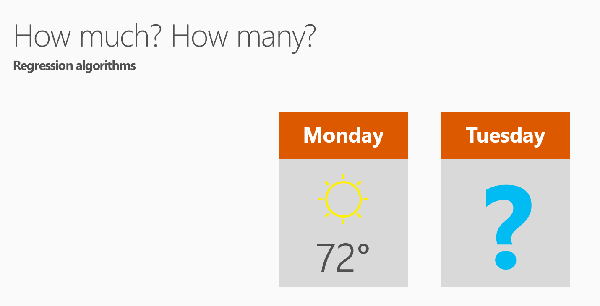

<properties
   pageTitle="Le domande di scienze 5 dati - scienze di dati per principianti | Microsoft Azure"
   description="È possibile ottenere una rapida introduzione alle scienze di dati da dati scienza per principianti, cinque brevi video che iniziano con il 5 domande dati scienza risposte."
   keywords="eseguire scienza dati, principianti di scienze di dati, scienza dati per principianti, tipi di domande, dati scienza domande e video di scienze di dati"
   services="machine-learning"
   documentationCenter="na"
   authors="cjgronlund"
   manager="jhubbard"
   editor="cjgronlund"/>

<tags
   ms.service="machine-learning"
   ms.devlang="na"
   ms.topic="article"
   ms.tgt_pltfrm="na"
   ms.workload="na"
   ms.date="10/20/2016"
   ms.author="cgronlun;garye"/>

# Ricerca di scienze di dati per principianti video 1: il 5 domande risposte scienza dati

Una rapida introduzione alle scienze di dati da *Dati scienza per principianti* in cinque brevi video da un scienziato dati superiore. Questi video vengono base ma utile, se si è interessati a eseguendo scienza dati o si lavora con scienziati dati.

Questo video prima fa sui tipi di domande a cui possa rispondere scienza dati. Per ottenere il massimo dalla serie, guardarli tutti. [Passare all'elenco di video](#other-videos-in-this-series)

> [AZURE.VIDEO data-science-for-beginners-series-the-5-questions-data-science-answers]

## Altri video in questa serie

*Ricerca di scienze di dati per principianti* è una breve introduzione a dati scienza impiegando totale circa 25 minuti. Guardare i video altri quattro:

  * Video 1: Le 5 domande risposte scienza dati
  * Video 2: [è pronto per scienza dati i dati?](machine-learning-data-science-for-beginners-is-your-data-ready-for-data-science.md) *(4 min 56 sec)*
  * Video 3: [Porre una domanda è possibile rispondere con dati](machine-learning-data-science-for-beginners-ask-a-question-you-can-answer-with-data.md) *(4 min 17 sec)*
  * [Prevedere una risposta con un modello semplice](machine-learning-data-science-for-beginners-predict-an-answer-with-a-simple-model.md) video 4: *(7 min 42 sec)*
  * Video 5: [Copia di lavoro di altre persone a scopo di scienze di dati](machine-learning-data-science-for-beginners-copy-other-peoples-work-to-do-data-science.md) *(3 min 18 sec)*

## Trascrizione: Le 5 domande risposte scienza dati

Buongiorno! Introduzione alla serie di video *Scienza dati per principianti*.

Ricerca di scienze di dati che può essere clima intimidatorio, verrà presentata di base senza equazioni o computer terminologia di programmazione.

In questo video prima vedremo "il 5 domande risposte scienza dati".

Ricerca di scienze dati utilizza numeri e nomi (noto anche come categorie o etichette) per prevedere le risposte alle domande.

È possibile vengano invece, ma *sono disponibili cinque solo le domande che le risposte scienza dati*:

  * È presente o B?
  * Si tratta strana?
  * Quantità – oppure – quanti?
  * Questa organizzazione?
  * Cosa fare successivo?

  Ognuna di queste domande risposta per la famiglia di metodi di apprendimento computer, chiamati algoritmi separata.

Può essere utile considerare un algoritmo come un ricette e i dati come i componenti. Un algoritmo viene descritto come combinare e combinare i dati per ottenere una risposta. Computer sono simili a un miscelatore. Quello la maggior parte del lavoro dell'algoritmo di necessità e che si abbastanza veloce.

## Domanda 1: È questo o B? utilizza algoritmi di classificazione

Iniziamo con la domanda: È questo o B?

In questo gruppo di algoritmi rappresenta la cosiddetta due classe classificazione.

È utile per qualsiasi domanda con solo due possibili risposte.

Per esempio:

  * Questo pneumatico non riuscirà in miglia di 1.000 successivo: Sì o no?
  * Porta più clienti: tagliando $5 o una riduzione del 25%?

Questa domanda possa anche essere rephrased per includere più di due opzioni: È presente un o B o C e D, ecc.?  Questo comando si chiama classificazione multiclass ed è utile quando si dispone di più, o diverse migliaia, ovvero possibili risposte. Classificazione multiclass sceglie probabilmente una.

## Domanda 2: Si tratta strana? utilizza algoritmi di rilevamento anomalia

La domanda successiva può rispondere a scienza dati: È questa separazione? Rispondere a questa domanda per la famiglia di algoritmi denominata rilevamento di anomalie in.

Se si dispone di una carta di credito, già stata apprezzato rilevamento di anomalie in. Della carta di credito analizza i modelli di acquisto, in modo che essi segnalazione di frodi possibili. Le spese "strana" potrebbero essere acquisto in un punto vendita nel punto in cui non in genere acquista o sull'acquisto di un elemento particolarmente costosi.

Questa domanda può essere utile in tanti modi. Ad esempio:

  * Se si dispone di un'auto con indicatori di pressione, è consigliabile fonti di informazioni: È questo indicatore pressione lettura normale?
  * Se si sta controllando internet, si vuole conoscere: in genere il messaggio da internet?

Rilevamento delle anomalie in contrassegna eventi imprevisti o insoliti o comportamenti. Fornisce indicazioni dove cercare i problemi.

## Domanda 3: Quantità? o come molti? utilizza algoritmi di regressione

Apprendimento possa anche prevedere le risposte a come molto? o come molti? Famiglia di algoritmi che vengono fornite le risposte a questa domanda è chiamata regressione.

Algoritmi di regressione apportare le stime numeriche, ad esempio:

  * Quali la temperatura sarà martedì successivo?  
  * Cosa sarà i quarto trimestre?

Consentono di rispondere alle eventuali domande in cui viene richiesto per un numero.

## Domanda 4: Questa organizzazione? Usa il servizio cluster algoritmi

Le ultime due domande sono ora un po' più avanzato.

Talvolta può essere utile comprendere la struttura di un set di dati - questa organizzazione? Per questa domanda, non è necessario esempi in cui si conosce già risultati per.

Sono disponibili molti modi per prendere in giro della struttura di dati. Un approccio è cluster. Separa i dati in naturale "Raggruppa i," per più facile interpretazione. Con cluster, non c'è alcun una risposta corretta.

Esempi di domande cluster sono:

  * Quali visualizzatori come gli stessi tipi di filmati?
  * I modelli di stampante non nello stesso modo?

Per informazioni sulle modalità di organizzazione dei dati, per poter comprendere - e prevedere - comportamenti ed eventi.  

## Domanda 5: Cosa fare ora? utilizza armatura algoritmi di formazione

L'ultima domanda: cosa fare ora? – utilizza una famiglia di algoritmi denominati risorse armatura.

Apprendimento armatura è stata ispirazione, come il cervello del RAT e uomo risposta a qualsiasi e premi. Questi algoritmi imparare dai risultati e scegliere l'azione successiva.

Apprendimento armatura è in genere, una soluzione ideale per sistemi automatici che è necessario apportare numerose piccole decisioni senza indicazioni umano.

Vengono fornite risposte alle domande sono sempre sull'azione da eseguire, in genere da un computer o un robot. Esempi sono:

  * Se si sta usando un sistema di controllo di temperatura per una casa: regolare la temperatura o lasciare in cui è?  
  * Se si è un'auto self-Guida: giallo, frenare o accelerare?  
  * Per un pneumatiche robot: mantenere tale o tornare alla espansione ricarica?

Algoritmi risorse armatura raggruppare i dati come passare, formazione dalla versione di valutazione ed errori.

In modo che è stata - 5 la ricerca di scienze dati domande può rispondere.

## Passaggi successivi

  * [Provare una prima dati scienza sperimentare Machine Learning Studio](machine-learning-create-experiment.md)
  * [Per un'introduzione alle apprendimento in Microsoft Azure](machine-learning-what-is-machine-learning.md)
